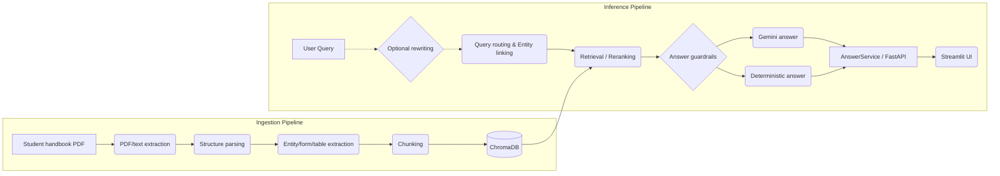

# HCMUE Student Handbook RAG Assistant

<p align="center">
  
</p>

<p align="center">
  
  
  
  
  
  
  
</p>

> **English Summary:** This is a production-oriented Retrieval-Augmented Generation (RAG) system built to answer questions about the Ho Chi Minh City University of Education (HCMUE) student handbook. It features a robust document ingestion pipeline, domain-specific semantic chunking, and multi-strategy query routing. Instead of relying solely on LLMs, it implements deterministic lookup paths for exact score matching and formulas. It includes query guardrails, ambiguity detection for Vietnamese entities, and a comprehensive offline evaluation pipeline (190+ test cases) to measure retrieval and routing accuracy. 

An AI chatbot for answering questions from the HCMUE student handbook using a local Retrieval-Augmented Generation (RAG) pipeline, ChromaDB vector search, deterministic lookup tools, and Gemini answer generation.

This project is built as an AI Engineer Intern portfolio project: the focus is on practical document processing, retrieval quality, guardrails, citations, and a usable Streamlit interface.

The current pipeline is intentionally tailored to the HCMUE student handbook used
in this repository. It is not a generic "upload any PDF" chatbot without further
parser, chunking, entity, and routing adaptation.

## 🚀 Live Demo

- Streamlit Cloud UI: https://student-handbook-rag-hcmue.streamlit.app/
- Hugging Face Spaces backend: https://huggingface.co/spaces/AnhFeee/hcmue-handbook-rag-api

The public demo uses a two-repository deployment model: Streamlit Cloud hosts
the UI, and a Hugging Face Docker Space hosts the FastAPI backend with its own
copy of the prebuilt ChromaDB vectorstore.

## ✨ Key Features

- PDF ingestion and structured parsing for a Vietnamese student handbook.
- Semantic chunking by regulations, procedures, forms, scoring tables, and directories.
- Sentence-transformer embeddings stored in ChromaDB.
- Optional Gemini Flash-Lite query rewriting for accent restoration, light typo
  correction, and clarification before retrieval.
- Query routing for regulations, forms, offices, faculties, scoring lookup, and calculator-style questions.
- Entity linking and query expansion for handbook-specific terms.
- Answer guardrails: low-confidence fallback, deterministic lookup answers, citations, and clarification for ambiguous queries.
- Streamlit chat UI with source display and optional debug information.

## 🏗️ Architecture Overview



The Streamlit app can run in two execution modes. In Local mode it calls
`AnswerService` directly, which lazy-loads `AnswerPipeline`. In API mode it
calls the FastAPI `POST /chat` endpoint through a small `ChatApiClient`, so the
UI can use the same response schema without duplicating guardrail, retrieval,
citation, cache, or Gemini logic.

## 🎯 Supported Query Scope

The current chatbot is optimized for Vietnamese questions with proper accents
about the bundled HCMUE student handbook. It is strongest for questions about:

- Regulations and student policies.
- Forms and administrative procedures.
- Office, faculty, and contact-directory information.
- Deterministic score lookups and scholarship-score calculations.
- Ambiguous or out-of-domain questions that should trigger guardrails.

Accentless Vietnamese queries are partially supported through routing rules,
accent-folded entity aliases, conservative fuzzy entity matching, semantic
retrieval, and an optional LLM query-rewriting layer. They are not yet guaranteed
at the same quality level as properly accented Vietnamese. The current
evaluation tables below report the accented Vietnamese benchmark.

## ⚙️ Pipeline Overview

- PDF ingestion: Load the handbook PDF and extract page-level text.
- Structure parsing: Build normalized sections and line metadata.
- Structured extraction: Extract tables, formulas, thresholds, forms, office directories, faculty directories, and procedures.
- Chunk generation: Build semantic, structured lookup, and tool-rule chunks.
- Embedding and indexing: Embed semantic chunks and persist them to ChromaDB.
- Optional query rewriting: Normalize accentless/typo-heavy questions or ask a
  clarification question before retrieval when enabled.
- Entity linking: Match office/faculty names, generated faculty-program aliases,
  accentless aliases, and light typos before retrieval.
- Retrieval orchestration: Route queries, expand queries, retrieve, and rerank.
- Answer pipeline: Generate answers with guardrails, citations, deterministic lookup, cache, and ambiguity handling.
- Service layer: Expose a thin `AnswerService` wrapper for shared UI/API use.
- User interface: Serve the chatbot through a Streamlit UI that can call either
  `AnswerService` directly or the FastAPI `/chat` backend.

## 📁 Project Structure

Current production-oriented layout:

```text
.
|-- app.py                  # Main Streamlit UI entrypoint
|-- configs/                # YAML configuration files (routing, guardrails)
|-- data/                   # Raw PDFs, generated vectorstore, and eval sets
|-- docs/                   # Additional documentation (e.g., deployment guides)
|-- scripts/                # CI/CD and offline evaluation scripts
|-- src/                    # Core application source code
|   |-- api/                # FastAPI backend endpoints
|   |-- services/           # Shared AnswerService logic
|   |-- ui/streamlit/       # Streamlit UI components and logic
|   |-- generation/         # LLM interaction, guardrails, and answer formatting
|   |-- retrieval/          
|   |   |-- core/           # Query routing, retrieval pipeline, and tools
|   |   `-- vectorstore/    # ChromaDB client and embedding models
|   |-- extraction/         # Layout-based extraction (forms, tables, faculties)
|   |-- chunking/           # Domain-specific semantic chunking rules
|   |-- ingestion/          # PDF loading utilities
|   |-- preprocessing/      # Structural parsing of raw handbook text
|   `-- common/             # Shared project utilities
|-- tests/                  # Offline unit tests
|-- requirements.txt        # Production dependencies
`-- .env.example            # Environment variables template
```

## 🛠️ Setup

Recommended Python version: **Python 3.11**. The CI workflow also uses Python 3.11.

```bash
python -m venv .venv
.venv\Scripts\activate
pip install -r requirements.txt
```

On macOS/Linux, activate the environment with:

```bash
source .venv/bin/activate
```

For local development and offline checks, install the dev requirements:

```bash
pip install -r requirements-dev.txt
```

For exact local reproduction of the verified environment, use the generated
lockfile:

```bash
pip install -r requirements.lock
```

The lockfile records one tested local environment. The looser
`requirements.txt` remains the portable install target for development and CI.

## 🔐 Environment Variables

Create a local `.env` file from the example:

```bash
copy .env.example .env
```

Then set your Gemini key inside `.env`:

```bash
GEMINI_API_KEY=your_api_key_here
```

Optional query rewriting uses a separate API key variable so it can be enabled,
disabled, or rotated independently from answer generation:

```bash
QUERY_REWRITER_ENABLED=true
QUERY_REWRITER_API_KEY=your_query_rewriter_api_key_here
```

If `QUERY_REWRITER_ENABLED` is false or `QUERY_REWRITER_API_KEY` is missing, the
pipeline skips rewriting and runs the existing rule-based routing path.

Optional runtime safeguards:

```bash
STUDENT_RAG_EXECUTION_MODE=Local
STUDENT_RAG_API_BASE_URL=http://127.0.0.1:8000
STUDENT_RAG_CORS_ORIGINS=http://localhost:8501,http://127.0.0.1:8501
STUDENT_RAG_SHOW_DEBUG=false
STUDENT_RAG_MAX_QUERY_CHARS=500
STUDENT_RAG_RATE_LIMIT_PER_MINUTE=0
```

`STUDENT_RAG_EXECUTION_MODE=API` makes the Streamlit UI call the configured
FastAPI backend. `STUDENT_RAG_API_BASE_URL` should be the backend runtime URL,
not the Hugging Face Space repository page. `STUDENT_RAG_SHOW_DEBUG=true`
enables the Streamlit debug toggle. Keep it false for the public UI.
`STUDENT_RAG_RATE_LIMIT_PER_MINUTE=0` disables the lightweight in-memory API
rate limit; set a positive value for public backend deployments.

The Streamlit app, FastAPI backend, and answer-generation scripts load this project-level
`.env` automatically, so you do not need to run `$env:GEMINI_API_KEY=...` in each
terminal session.

Do not commit `.env` or `.streamlit/secrets.toml`.

## 💬 Run the Streamlit App

```bash
python -m streamlit run app.py --server.fileWatcherType none
```

The Streamlit app defaults to `Local` mode so a first-time portfolio reviewer can
try the chatbot without starting the FastAPI server. In the Streamlit Settings popover,
choose:

- `Local` to run Streamlit -> `AnswerService` in the same process.
- `API` to run Streamlit -> FastAPI `POST /chat`.

API mode shows an `API base URL` field. The default is:

```text
http://127.0.0.1:8000
```

The app expects the configured processed data and ChromaDB vectorstore to exist locally. If the vectorstore is missing, rebuild the local data artifacts before running the chatbot. In API mode, start the FastAPI backend before sending chat messages.

## ⚡ Run the FastAPI Backend

Start the API server:

```bash
python -m uvicorn src.api.main:app --reload
```

Open Swagger UI:

```text
http://127.0.0.1:8000/docs
```

Health check:

```bash
curl http://127.0.0.1:8000/health
```

Example chat request:

```bash
curl -X POST http://127.0.0.1:8000/chat ^
  -H "Content-Type: application/json" ^
  -d "{\"query\":\"Email Phòng Đào tạo là gì?\",\"include_debug\":true}"
```

The API reuses `AnswerService`, which lazy-loads the answer pipeline. `GET /health`
does not load the retrieval pipeline or call Gemini.

## ☁️ Deployment Workflow

Recommended public demo architecture:

```text
Streamlit Cloud UI -> FastAPI backend -> ChromaDB vectorstore + Gemini
```

The public portfolio demo currently uses Streamlit Cloud for `app.py` and a
Hugging Face Docker Space for the FastAPI backend:

```text
UI:      https://student-handbook-rag-hcmue.streamlit.app/
Backend Space repo: https://huggingface.co/spaces/AnhFeee/hcmue-handbook-rag-api
Backend runtime:    https://anhfeee-hcmue-handbook-rag-api.hf.space
```

Set the Streamlit Cloud app to API mode:

```text
STUDENT_RAG_EXECUTION_MODE=API
STUDENT_RAG_API_BASE_URL=https://anhfeee-hcmue-handbook-rag-api.hf.space
STUDENT_RAG_SHOW_DEBUG=false
```

Set backend secrets/config:

```text
GEMINI_API_KEY=...
QUERY_REWRITER_ENABLED=false
QUERY_REWRITER_API_KEY=...
STUDENT_RAG_CORS_ORIGINS=https://student-handbook-rag-hcmue.streamlit.app
STUDENT_RAG_MAX_QUERY_CHARS=500
STUDENT_RAG_RATE_LIMIT_PER_MINUTE=30
```

Set `QUERY_REWRITER_ENABLED=true` only if the backend should call the optional
query-rewriting LLM before retrieval. If it is false, the backend still uses
rule-based routing, generated entity aliases, fuzzy entity matching, and vector
retrieval.

See `docs/huggingface_backend_deploy.md` for the backend deployment workflow
used by the live demo.

For the current two-repository deployment model:

- This main repository includes the demo source PDF and a small prebuilt
  ChromaDB vectorstore for portfolio reproducibility.
- The Hugging Face backend repository keeps its own copy of
  `data/vectorstore/chroma` as a deployment artifact so the API can serve
  retrieval without rebuilding the index at startup.
- The root `Dockerfile` is kept as the FastAPI backend image template used when
  preparing the Hugging Face Docker Space repository. Docker Compose and Render
  deployment files are intentionally not part of the main repo.
- If the PDF, parser, chunking logic, embedding model, or retrieval config
  changes, rebuild the processed artifacts and vectorstore with
  `python -m scripts.run_all_preprocessing`.

## 🧪 Local/API Manual Test

Terminal 1:

```bash
python -m uvicorn src.api.main:app --reload
```

Terminal 2:

```bash
python -m streamlit run app.py --server.fileWatcherType none
```

In Streamlit:

- Select `Local`, then ask: `Email Phòng Đào tạo là gì?`
- Select `API`, keep `http://127.0.0.1:8000`, then ask the same question.
- Stop the backend while in API mode and ask again. The UI should show a friendly backend connection message, keep debug fields available, and avoid dumping a traceback.

## ✅ Run Tests

Fast offline ambiguity tests:

```bash
python -m unittest discover -s tests
```

Compile check for the production app modules:

```bash
python -m compileall src app.py scripts
```

These checks are also configured in GitHub Actions (`.github/workflows/ci.yml`) so
the public portfolio repo can show whether the offline code path still works.

## 🔄 Rebuild Local Data Artifacts

To rebuild the generated extraction/chunking/vectorstore artifacts in order:

```bash
python -m scripts.run_all_preprocessing
```

This runs PDF extraction, structure parsing, structured extraction, chunking,
ChromaDB embedding, and the retrieval batch report. It can take several minutes
because the embedding model and ChromaDB vectorstore are rebuilt locally.

## 📊 Retrieval Evaluation

The repository includes a compact golden retrieval set in:

```text
data/eval/golden_queries.json
```

Run the evaluator after the vectorstore exists:

```bash
python -m scripts.evaluate_retrieval
```

The report is written to:

```text
data/processed/metadata/golden_retrieval_eval_report.json
```

Current golden evaluation summary:

| Metric | Result |
|---|---:|
| Golden queries | 50 |
| Retrieval cases | 43 |
| Hit@1 | 83.72% |
| Hit@3 | 93.02% |
| Hit@5 | 95.35% |
| MRR | 88.95% |
| Intent accuracy | 94% |
| Strategy accuracy | 96% |

This is a compact portfolio golden set for regression checks and retrieval-quality
sanity testing across regulations, forms, offices, faculties, procedures,
structured lookups, and calculator-tool routing. It is not a production-grade
benchmark, and the scores should not be read as a claim that the assistant is
production-ready. The benchmark currently focuses on properly accented
Vietnamese questions; accentless Vietnamese should be evaluated as a separate
robustness track before claiming full support.

Router behavior coverage is larger and faster because it does not require the
embedding model or vectorstore:

```bash
python -m scripts.evaluate_router_behavior --fail-under-intent 0.95 --fail-under-strategy 0.95
```

Current router behavior set:

| Metric | Result |
|---|---:|
| Behavior queries | 110 |
| Intent accuracy | 100% |
| Strategy accuracy | 100% |
| Target chunk-type accuracy | 100% |

Offline answer evaluation checks deterministic exactness, guardrail status, and
citation selection without calling Gemini:

```bash
python -m scripts.evaluate_answers --fail-under-pass-rate 1.0
```

Current offline answer evaluation summary:

| Metric | Result |
|---|---:|
| Answer eval cases | 30 |
| Pass rate | 100% |
| Status accuracy | 100% |
| Deterministic exactness | 100% |
| Citation type/page checks | 100% |

Optional answer-generation batch test, using the configured local retrieval pipeline:

```bash
python -m scripts.evaluate_answer_batch --all
```

Direct module entrypoints after the package refactor:

```bash
python -m src.ingestion.pdf_loader
python -m src.preprocessing.structure_parser
python -m src.extraction.runner
python -m src.chunking.runner
python -m src.retrieval.vectorstore.runner
python -m src.retrieval.core.runner
python -m src.retrieval.core.retrieval_batch_eval
python -m src.generation.runner
python -m src.generation.answer_batch_eval
```

Write a local reproducibility report:

```bash
python -m scripts.write_reproducibility_report
```

## ❓ Example Questions

- CNTT ở đâu?
- Phòng CNTT ở đâu?
- Khoa CNTT ở đâu?
- Có thể học vượt để ra trường sớm không?
- Có giới hạn số lần học lại một môn không?
- Muốn tạm nghỉ học cần mẫu đơn nào?
- Điểm rèn luyện 85 là loại gì?
- Email phòng CTCT-HSSV là gì?

## 🎬 Demo Flow

Recommended manual demo flow:

1. Ask `CNTT ở đâu?` to show ambiguity detection and clarification.
2. Ask `Điểm rèn luyện 85 là loại gì?` to show deterministic lookup.
3. Ask `Email phòng Đào tạo là gì?` to show cited directory retrieval.
4. Switch Streamlit from Local mode to API mode and ask the same question.

## ⚠️ Data Policy

> [!IMPORTANT]
> This repository intentionally includes the demo source PDF at:

```text
data/raw/so-tay-sinh-vien-khoa-48.pdf
```

It is used as the source document for portfolio demonstration, parsing, and
local reproducibility. The project does not relicense the source document;
ownership remains with the original publisher/source. If you reuse this project
with another document, review the source document's license/copyright status
before publishing the PDF or derived artifacts.

This repository also includes a small prebuilt ChromaDB vectorstore at:

```text
data/vectorstore/chroma
```

The vectorstore is generated from the demo PDF so reviewers can run retrieval
and the chatbot without rebuilding the full preprocessing and embedding
pipeline. It can be regenerated with:

```bash
python -m scripts.run_all_preprocessing
```

Adapting the system to another handbook or policy document will likely require
updating the parsing configuration, extraction rules, chunking assumptions,
entity registry, and query routing rules before rebuilding the local index.

To regenerate the entity registry after changing faculty or office directory
data:

```bash
python src/retrieval/core/build_entity_registry.py
python -m unittest tests.test_entity_registry_builder tests.test_entity_linker
```

## 📄 License

Project source code and authored documentation are released under the MIT
License. The source handbook PDF and generated artifacts derived from it are not
relicensed by this repository and remain subject to their original rights.

## 💻 Tech Stack

- Python
- Streamlit
- Google Gemini API (`google-genai`)
- Sentence Transformers
- ChromaDB
- PyTorch
- PyYAML
- PyMuPDF
- FastAPI / Uvicorn
- Requests
- python-dotenv

## 🏭 Production Notes

> [!NOTE]
> - The system is intentionally domain-specific to the HCMUE student handbook, not
  a general-purpose "upload any PDF" chatbot.
- Public UI debug output is hidden unless `STUDENT_RAG_SHOW_DEBUG=true`.
- The FastAPI backend rejects empty and overlong queries and can enable a simple
  per-client in-memory rate limit with `STUDENT_RAG_RATE_LIMIT_PER_MINUTE`.
- API logs include request ID, latency, status, intent, strategy, effective
  query, retrieval query, cache usage, and LLM usage without logging the full
  retrieved context.
- CI runs offline compile, unit tests, and router behavior evaluation without
  calling Gemini.

## 🚧 Limitations

> [!WARNING]
> - The answer quality depends on the parsed handbook data and the local ChromaDB index.
- Public deployment requires a backend that can access `data/vectorstore/chroma`.
- Gemini answer-generation calls require a valid `GEMINI_API_KEY` in `.env` or
  the process environment.
- Optional query rewriting requires `QUERY_REWRITER_ENABLED=true` and
  `QUERY_REWRITER_API_KEY`; without them, the pipeline falls back to rule-based
  routing.
- Some source PDF layouts may require manual validation after parsing.
- Accentless Vietnamese questions are supported through generated aliases,
  accent folding, conservative fuzzy entity matching, and optional LLM rewriting,
  but heavily misspelled queries may still need clarification or a better
  rewrite.
- The bundled vectorstore is a generated demo artifact; rebuild it after
  changing the PDF, configs, chunking logic, or embedding model.
- The source PDF and generated vectorstore may contain or derive from handbook
  content, so redistribution rights should be reviewed before public reuse.
- Source files are UTF-8. If Vietnamese text appears garbled in Windows PowerShell,
  read files with `Get-Content -Encoding UTF8 ...` or use a UTF-8 terminal.

## 🔮 Future Improvements

- Broaden the evaluation set with more paraphrases, edge cases, and adversarial questions.
- Add a dedicated accentless Vietnamese evaluation set and tune the optional
  query rewriter against it.
- Add screenshot assets and a short demo GIF for the portfolio README.
- Continue moving domain heuristics from Python code into YAML configs.
- Add persistent production observability if the backend receives real traffic.
