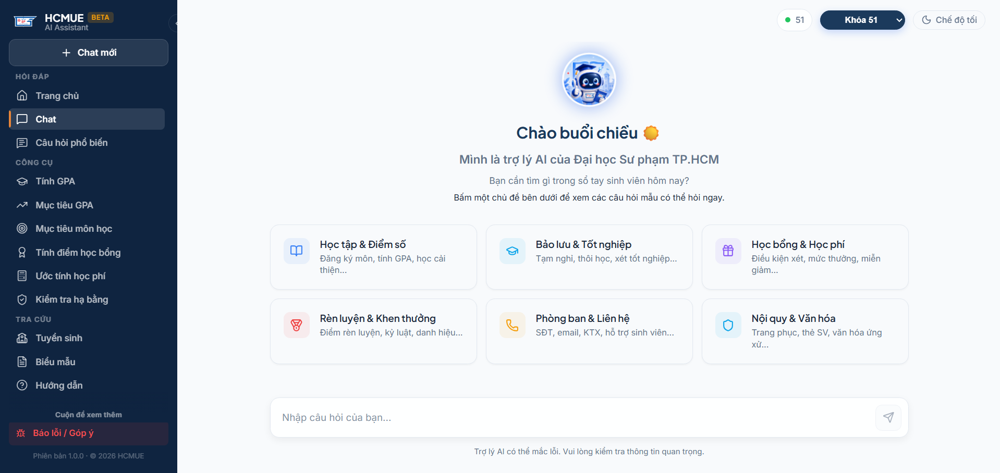
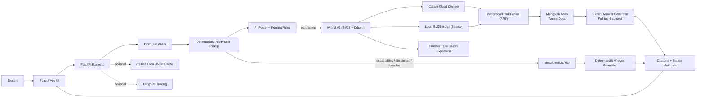
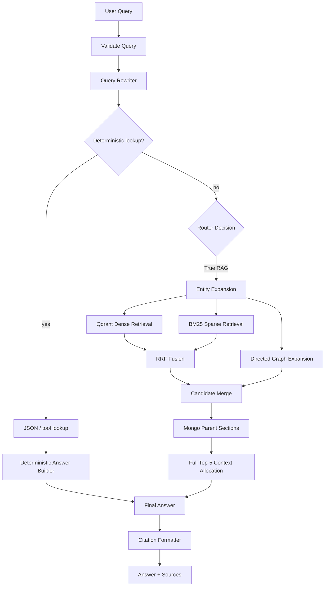
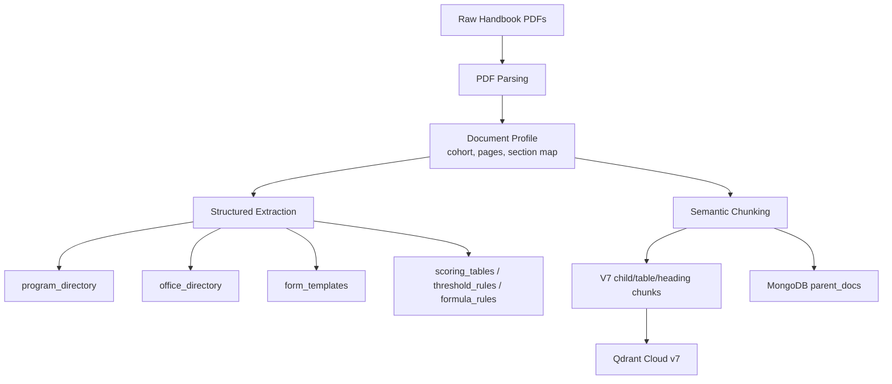

# HCMUE AI - Student Handbook RAG Assistant

> **Version:** 1.0.0-beta (Updated: July 2026) | **License:** MIT
> Independent, non-commercial student project for the HCMUE student community.
> This is not an official application of Ho Chi Minh City University of Education.
> The assistant is built to help students look up handbook information faster, while important decisions should still be verified from citations or official offices.

<p align="center">
  
  
  
  
  
  
  
  <br>
  <a href="https://huggingface.co/spaces/AnhFeee/hcmue-handbook-rag-api">
    
  </a>
</p>

## Overview



**HCMUE AI Student Handbook Assistant** is a cohort-aware Retrieval-Augmented Generation system for answering questions from HCMUE student handbooks.

## Live Demo

- **Frontend Chat UI (Custom Domain):** [hcmuebot.id.vn](https://hcmuebot.id.vn)
- **Backend API & Interactive Swagger UI:** [HCMUE Handbook RAG (Hugging Face Space)](https://huggingface.co/spaces/AnhFeee/hcmue-handbook-rag-api)

Unlike a simple "PDF chatbot", this project separates the system into two complementary layers:

- **Structured lookup** for information that must be exact, such as program lists, grade thresholds, scoring tables, formulas, offices, and forms.
- **True RAG retrieval** for longer regulations and policy sections that need explanation, context, and citations.

### Why this is not just a PDF chatbot

The system is designed around the actual failure modes of handbook QA: different cohorts can have different rules, structured facts should not be guessed by an LLM, and long regulations need parent-section context with reliable citations. HCMUE AI therefore uses a deterministic-first pipeline for exact facts, then falls back to cohort-aware child-parent RAG with reranking, full top-5 context packing, and citation binding instead of sending raw PDF chunks directly to a chat model.

The result is a production-oriented public beta assistant that can answer practical student questions such as:

- "Khoa Cong nghe Thong tin co nhung nganh nao?"
- "K50 diem D+ co qua mon khong?"
- "K51 diem D+ co qua mon khong?"
- "Muon phuc khao diem thi thi lam sao?"
- "Van de hoc phi lien he phong nao?"
- "Tam nghi hoc can bieu mau nao?"

## Key Features

### 1. Cohort-Aware Handbook Reasoning

The system supports handbook differences between **K48-K49**, **K50**, and **K51** instead of treating all documents as one flat knowledge base.

- Every indexed chunk carries `cohort`, `document_id`, `chunk_type`, `content_type`, and `source_pages`.
- Frontend tools and chat answers respect the selected cohort.
- Grade thresholds and program lists are handled differently when handbook rules differ by cohort.

### 2. Pure Dense Vector Retrieval

For true RAG questions, the system utilizes a streamlined, highly optimized pure vector pipeline:

- Dense vector search with `BAAI/bge-m3`.
- Entity expansion for aliases such as faculty names, office names, and common abbreviations.
- Metadata filtering and boosting by cohort and content type.

### 3. Deterministic Lookup for Exact Facts

Information that should not be "generated from vibes" is extracted into structured stores:

- `program_directory`: majors, faculties, career descriptions, cohort applicability.
- `student_service_directory`: student services, offices, responsibilities, emails, phones, and locations.
- `scoring_tables`: grade conversion, academic classification, conduct classification, and scholarship classification tables.
- `structured_tables_registry`: standardized handbook tables such as study duration.
- `foreign_language_equivalency_table`: certificate equivalency for foreign-language output standards.
- `threshold_rules`: pass/fail thresholds and policy cutoffs.
- `formula_rules`: GPA, scholarship, and tuition-related formulas where available.
- `form_templates`: form name, purpose, source page, and routing to the Forms page.

This architecture significantly reduces LLM hallucination on high-frequency student questions. To avoid LLM math limitations and hallucinated calculations, complex logic such as GPA and tuition estimation is offloaded to dedicated **Deterministic UI Tools** instead of relying on the LLM to compute results through generation.

### 4. Parent-Child Retrieval Architecture

The project uses a parent-child retrieval design:

- **Qdrant Cloud** stores V7 child/table/heading chunks for fast retrieval.
- **MongoDB Atlas** stores parent regulation sections for richer context expansion and source display.
- The app currently uses Qdrant collection `student_handbook_semantic_v7`.

### 5. Production-Oriented LLM Pipeline

The generation layer includes:

- Deterministic pre-router lookup for exact table/directory/formula questions.
- AI router for intent and retrieval strategy.
- Query rewriting for accentless Vietnamese, typo-prone queries, and short queries.
- Gemini Flash-Lite answer generation with multi-key quota-aware load balancing.
- Full top-5 parent-section context packing for true-RAG answers.
- Citation selection that prefers matching cohort, content type, section, and page metadata.
- Guardrails for out-of-domain, unsafe, ambiguous, or low-context questions.

## Engineering Highlights

- **Cohort-aware RAG architecture:** metadata filtering and cohort-specific routing for `K48-K49`, `K50`, and `K51`.
- **Deterministic-first router:** answers exact table, directory, form, formula, study-duration, scholarship, and foreign-language queries without an LLM call.
- **V7 child-parent retrieval:** Qdrant indexes small `section_heading`, `child`, and `table_like` chunks while MongoDB stores full parent sections for citations.
- **Hybrid V8 Retrieval Stack:** Dense retrieval with `BAAI/bge-m3` combined with BM25 Sparse Index (Regex + Underthesea Tokenizer) for literal token protection and robust semantic matching.
- **Full top-5 context packing:** sends richer parent-section context to Gemini while preserving source/citation metadata.
- **Layered evaluation:** router/lookup metrics, retrieval metrics, generation quality, and RAGAS-style Gemini Judge are reported separately.
- **Production guardrails:** cohort filtering, citation binding, Gemini key-pool load balancing, cache support, rate limits, and queue/backpressure settings.

## System Snapshot

| Component | Current State |
|---|---:|
| Supported cohorts | K48-K49, K50, K51 |
| Retrieval design | V7 child-parent regulation retrieval |
| Parent docstore | MongoDB Atlas |
| Deterministic lookup groups | programs, services/offices, forms, scoring, formulas, study duration, scholarship, foreign language |
| Qdrant collection | `student_handbook_semantic_v7` |
| Answer model | Gemini Flash-Lite with local multi-key load balancing |
| Evaluation status | Legacy baseline shown below; rerun evaluation after this cleanup for final CV numbers |

## Architecture



## RAG Processing Pipeline



### Pipeline Breakdown

- **Input validation & rewriting:** Filters invalid queries, resolves cohort context, and rewrites typo-prone or short Vietnamese queries.
- **Deterministic lookup:** Handles exact facts from JSON/tool stores before vector retrieval or answer-generation LLM calls.
- **Intent routing:** Sends remaining long-form questions to the Hybrid RAG pipeline.
- **Hybrid retrieval & generation:** Combines Qdrant Dense Search + BM25 Sparse Search via RRF (Reciprocal Rank Fusion), expands context via MongoDB, and uses Gemini with strict cohort/citation guardrails.

## Data and Ingestion Design

The pipeline processes each handbook through a document profile instead of relying on one-off hardcoded sections.




## Source Code Architecture

```text
student_handbook_rag/
|-- configs/                  # Runtime, retrieval, embedding, extraction configs
|-- data/
|   |-- raw/                  # Original source PDFs
|   |-- processed/            # Structured data, chunks, metadata artifacts
|   `-- eval/                 # Golden evaluation datasets
|-- docs/                     # Technical specifications, testing, and script guides
|-- frontend/                 # React + Vite frontend
|-- scripts/                  # Ingestion, deployment, evaluation, debug scripts
|-- src/
|   |-- api/                  # FastAPI app, routes, schemas
|   |-- chunking/             # Semantic, table, form, directory chunkers
|   |-- common/               # Shared env/config helpers
|   |-- extraction/           # Structured extraction logic
|   |-- generation/           # LLM clients, prompts, answer pipeline, citations
|   |-- ingestion/            # PDF loading and input handling
|   |-- preprocessing/        # Section parsing and cleanup
|   |-- retrieval/            # Router, lookup, BM25, vector retrieval, reranking
|   `-- services/             # Answer orchestration service
`-- tests/                    # Unit and integration tests
```

## Evaluation

The evaluation design separates deterministic behavior from generated RAG behavior.

### 1. Structured / Tool Evaluation

Structured questions are checked with exactness, item count, cohort correctness, and citation metadata. This avoids incorrectly using LLM-as-a-Judge for answers that should be deterministic.

| Metric | Score |
|---|---:|
| Cases | 120 |
| Pass rate | 94.16% |
| Deterministic exactness | 94.16% |
| Citation metadata accuracy | 90.00% |
| Intent accuracy | 94.44% |
| Strategy accuracy | 94.44% |
| Structured item count accuracy | 93.33% |

### 2. True-RAG Retrieval Evaluation

Retrieval is evaluated only on generated true-RAG regulation cases. Structured lookups such as programs, scoring, forms, and office contacts are excluded from this headline retrieval metric.

| Metric | Score |
|---|---:|
| Cases | 180 |
| Hit@1 | 69.44% |
| Hit@3 | 85.00% |
| Hit@5 | 90.00% |
| MRR | 77.86% |
| nDCG@5 | 79.11% |

### 3. RAGAS-Style Automated Judge (V8.5 Generation)

Generated true-RAG answers (100 cases) were automatically evaluated using a RAGAS-style Judge (`gpt-oss-120b`).

| Metric | Score |
|---|---:|
| Faithfulness | 70.12% |
| Answer Relevancy | 85.53% |
| Context Precision | 63.42% |
| Context Recall | 82.07% |
| Answer Correctness | 77.11% |
| Citation Correctness | 83.71% |

*Note: The automated judge reported a strict Faithfulness score (70.12%). A deep dive revealed the AI Judge exhibited a 71.4% false-positive penalty rate when evaluating complex legal reasoning. To establish ground truth, a manual Human Audit was conducted.*

### 4. Human Audit (PDF-Verified) & Production Robustness

Generated true-RAG answers were further evaluated using a strict PDF-verified manual audit on a 25-case stratified sample to calibrate the automated metrics. The system was also tested for production robustness (60 requests) against a local Uvicorn/FastAPI server.

**Manual Audit (PDF-Verified):**
| Metric | Score |
|---|---:|
| Audit Sample | 25 cases |
| Human Correctness | 88.80% |
| Claim-level Faithfulness | 98.20% |
| Citation Correctness | 94.60% |
| Critical False Passes | 0 |
| Material Hallucination Rate | 0.00% |

**Production Robustness (60 requests):**
| Metric | Latency (p95) | Success Rate | Note |
|---|---:|---:|---|
| Cold RAG | 8.75s | 75.00% | Initial uncached retrieval + generation |
| Warm Cache | 7.49s | 80.00% | (Cache hits bypassed, latency includes routing) |
| Streaming | 7.06s | 70.00% | Time-to-first-token (TTFT) |
| Deterministic | 4.97s | 70.00% | Structured lookup fallback |
| Burst (Concurrency) | 6.51s | 30.00% | Graceful degradation via 429 Rate Limits |

*Note: Success rates during local evaluation are bounded by external LLM provider Free-Tier rate limits (Gemini/Groq).*

### How to read these numbers


- **Cohort Segregation (K50 vs K51):** The system enforces strict isolation between K50 and K51 regulations. In the production UI, students select a cohort before asking, so cohort-specific retrieval and citation are more representative than no-cohort general stress tests.
- **V7 Retrieval Tradeoff:** Hit@1 is intentionally not the only goal. The RAG pipeline uses top-k evidence, parent expansion, and reranking, so Hit@3/Hit@5 and citation correctness better reflect the user-facing answer quality.
- **RAGAS Scope:** RAGAS-style Judge is reported only for generated true-RAG answers. Deterministic lookup cases are measured separately with exactness and item-count checks.
- **Context Packing:** The generation prompt uses retrieved parent sections with table/list normalization and query-focused snippets. Citation binding remains attached to the retrieved parent section.
- Metrics are reported as layered quality gates instead of one blended score.

## CI/CD and Quality Gates

GitHub Actions runs offline checks on every push and pull request:

- Python dependency install from `requirements-dev.txt`.
- `ruff check .`
- `python -m compileall src scripts`
- `python -m unittest discover -s tests`
- `python -m scripts.evaluate_router_behavior --fail-under-intent 0.75 --fail-under-strategy 0.75`
- Frontend `npm ci`, `npm run lint`, and `npm run build`.

The deployment flow keeps GitHub source code and Hugging Face Space deployment separate:

- GitHub `main` stores the full project.
- Hugging Face Space receives a clean backend-only deployment bundle.
- Qdrant vectors and MongoDB parent docs are managed as external data services.

## Tech Stack

| Layer | Tools |
|---|---|
| Frontend | ⚛️ React, Vite, TypeScript, lucide-react |
| Backend | ⚡ FastAPI, Uvicorn, Pydantic |
| Embeddings | 🧠 BAAI/bge-m3 |
| Vector store | 🗄️ Qdrant Cloud, local Chroma for offline eval |
| Parent docstore | 🍃 MongoDB Atlas |
| LLM provider | 🤖 Groq model fallback chain |
| Cache | 🚀 Redis when available, local JSON fallback |
| Evaluation | 📊 deterministic eval, retrieval eval, RAGAS-style Gemini Judge |
| Deployment | ☁️ Vercel (Frontend), Hugging Face Spaces (Backend) |

## Setup

### Backend

```bash
# 1. Create virtual environment
python -m venv .venv

# 2. Activate it
source .venv/bin/activate  # macOS / Linux
# .venv\Scripts\activate   # Windows

# 3. Install and run
pip install -r requirements.txt
uvicorn src.api.main:app --host 0.0.0.0 --port 7860
```

### Frontend

```bash
cd frontend
npm install
npm run dev
```

## Environment Variables

Create a `.env` file in the repository root. Do not commit real secrets.

```env
# LLM
GROQ_API_KEYS=your_groq_key_1
GEMINI_API_KEY=your_gemini_key_for_eval

# Vector database
VECTORDB_PROVIDER=qdrant_cloud
QDRANT_URL=https://your-qdrant-cluster-url
QDRANT_API_KEY=your_qdrant_key

# Optional tracing / observability
LANGFUSE_SECRET_KEY=sk-lf-your-secret-key
LANGFUSE_PUBLIC_KEY=pk-lf-your-public-key
LANGFUSE_HOST=https://cloud.langfuse.com

# Parent document store
MONGODB_URL=mongodb+srv://...
MONGODB_PARENT_COLLECTION=parent_docs

# For all other configurations (Redis, MongoDB, CORS, etc.), see `.env.example`.
```

## Useful Commands

### Run offline evaluations

```bash
python scripts/evaluate_router_behavior.py --cases data/eval/final_router_holdout_v7.json
python scripts/evaluate_answers.py --cases data/eval/final_structured_tool_holdout_v7.json
python scripts/evaluate_retrieval.py --golden data/eval/final_true_rag_holdout_v7.json --scope regulation-v7
```

### Build V7 retrieval artifacts

```bash
python scripts/build_v7_child_parent_index.py
```

### Push V7 child-parent vectors to Qdrant

```bash
python scripts/push_to_qdrant_v7.py
```

### Deploy backend to Hugging Face Space

```bash
deploy_hf.bat
```

### Frontend checks

```bash
cd frontend
npm run lint
npm run build
```

## Testing

*(See `docs/TESTING.md` for the Smoke Test Checklist and Evaluation instructions)*

## Known Limitations & Roadmap

- **Limitation:** Procedure/form workflows are not yet fully OCR/crawled when source pages rely on images, QR codes, or external forms.
  **Roadmap:** Build a clean procedure directory from OCR and official linked sources.
- **Limitation:** K50 retrieval is harder than other cohorts because similar regulations can mention cao dang/GDMN and undergraduate rules in nearby sections.
  **Roadmap:** Continue improving scope-aware reranking without adding brittle question-specific heuristics.
- **Limitation:** Production scaling is bounded by the free/low-cost hosting tier and external LLM rate limits.
  **Roadmap:** Add queue/backpressure defaults and upgrade hosting only when real traffic requires it.
- **Limitation:** No internal quality dashboard.
  **Roadmap:** Build an admin dashboard with authentication and feedback clustering.

## License and Attribution

This project is licensed under the **MIT License**.

This project is built for learning, experimentation, and community support. Handbook content belongs to its respective source documents and should be verified through official HCMUE channels for important decisions.
