# HCMUE Student Handbook RAG Assistant

> **Disclaimer**: This is an independent, non-commercial personal project created for the HCMUE student community to easily access handbook information. It is **not** an official application provided or endorsed by Ho Chi Minh City University of Education.

<p align="center">
  
  
  
  
  
  
  
  
  
  
</p>

A Vietnamese Retrieval-Augmented Generation assistant for answering questions
about the Ho Chi Minh City University of Education (HCMUE) student handbook.

The system combines deterministic tools, rule-based routing, semantic retrieval,
LLM-based context resolution, safe query rewriting, answer guardrails, citations,
and offline evaluation. It is intentionally domain-specific to the bundled HCMUE handbook;
adapting it to another document requires updating the parser, chunking rules,
entity registry, routing rules, and evaluation set.

## 🚀 Live Demo

- Frontend: https://hcmuebot.id.vn/
- Backend Space: https://huggingface.co/spaces/AnhFeee/hcmue-handbook-rag-api
- Backend health: https://anhfeee-hcmue-handbook-rag-api.hf.space/health

## ✨ Highlights

- End-to-end RAG system design for a real Vietnamese policy handbook.
- PDF ingestion, structure parsing, domain extraction, chunking, embedding, and
  vector search.
- Multi-stage retrieval with rule-based routing, entity linking, query expansion,
  vector search, and heuristic reranking.
- LLM-based context resolution for multi-turn questions, with safe rewrite
  validation and dual retrieval verification before old chat context is trusted.
- Deterministic lookup for score tables and scholarship-score calculations.
- Guardrails for ambiguity, low confidence, out-of-domain queries, retrieval
  errors, and LLM/API errors.
- Production-style split deployment: React frontend on Vercel and FastAPI
  backend on Hugging Face Spaces.
- High Availability AI Pipeline: Stateless load balancing with randomized API key shuffling to bypass rate limits.
- Cross-ecosystem Fallback Matrix: Automatic failover between Meta (Llama 3.3), OpenAI (GPT-OSS), and Alibaba (Qwen) models.
- Semantic Caching Layer: ChromaDB + LLM verification to serve repeated queries with 10x lower latency.
- Serverless Bug Tracking: Automated user feedback system via Google Apps Script with full chat history context attached.
- Offline regression checks for router behavior, answer behavior, citations,
  structured lookup, and API routes.

## 🏗️ Architecture

At a high level, the project has two flows:

```text
Offline data flow
    Handbook PDF -> parsing/extraction -> chunks -> embeddings -> VectorDB

Runtime request flow
    React/Vite UI
        -> FastAPI backend
        -> AnswerPipeline
        -> LLM context resolver
        -> Clarification if context is ambiguous
        -> Query rewrite/normalization when safe
        -> Safe rewrite validation
        -> Retrieval pipeline, single or dual for history-based rewrites
        -> Deterministic tools or VectorDB retrieval
        -> Guardrails
        -> Gemini answer generation when needed
        -> Answer with citations
```



```mermaid
graph LR
    subgraph Offline["Offline data preparation"]
        A["Handbook PDF"] --> B["PDF ingestion"]
        B --> C["Structure parsing"]
        C --> D["Structured extraction"]
        D --> E["Chunking"]
        E --> F["Embeddings"]
        F --> V["VectorDB: Chroma local / Qdrant Cloud"]
    end

    subgraph Runtime["Runtime answering path"]
        UI["React/Vite UI"] --> API["FastAPI routes"]
        API --> SVC["AnswerService"]
        SVC --> PIPE["AnswerPipeline"]
        PIPE --> CR["LLM ContextResolver"]
        CR --> DEC{"Context decision"}
        DEC -->|"ambiguous / low confidence"| CLARIFY["Clarification response"]
        DEC -->|"standalone or follow-up"| RW["QueryRewriter"]
        RW --> SAFE["Safe rewrite validation"]
        SAFE --> SELECT["Select retrieval query"]
        SELECT --> RET["RetrievalPipeline"]
        SAFE -->|"history rewrite"| DUAL["Dual retrieval verification"]
        DUAL --> RET
        DUAL -->|"conflict"| CLARIFY
        RET --> ENT["Entity linking + query expansion"]
        ENT --> ROUTER["Rule router + optional Groq AI Router"]
        ROUTER --> DET["Deterministic tools/lookups"]
        ROUTER --> SEM["Vector search + heuristic reranking"]
        V --> SEM
        DET --> G["Answer guardrails"]
        SEM --> G
        G --> CACHE["Response cache"]
        CACHE --> OUT["Answer + citations"]
        G --> GEM["Gemini generation when needed"]
        GEM --> OUT
        CLARIFY --> OUT
    end
```

For the full technical request lifecycle and module responsibilities, see
[docs/architecture.md](docs/architecture.md).

## ✨ Core Features

- Vietnamese handbook question answering with citations.
- Accentless and typo-heavy query normalization through optional Groq-based
  query rewriting.
- Groq/Llama context resolver for multi-turn questions, preventing unrelated new
  questions from inheriting old chat context.
- Safe rewrite guard and dual retrieval verification to reduce semantic drift
  before a history-based rewrite is used for retrieval.
- Rule-based router for forms, regulations, offices, faculties, procedures,
  scoring lookup, formulas, and calculator tools.
- Entity linker with exact phrase matching, accent folding, generated aliases,
  and conservative fuzzy matching.
- Structured lookup for conduct classification, academic classification, and
  letter-grade to 4.0-scale conversion.
- Guardrails for ambiguous queries such as `CNTT ở đâu?`, `Học vụ liên hệ ai?`,
  and `Học bổng hỏi ai?`.
- Enterprise-grade reliability with multi-key load balancing and cross-provider fallback (Llama -> GPT -> Qwen).
- Semantic caching to instantly answer recurring questions, reducing API costs by 100%.
- Serverless feedback system capturing full 6-turn chat history for rapid bug reproduction.
- Streaming chat API and responsive React UI.
- Provider switch between local ChromaDB and Qdrant Cloud via
  `VECTORDB_PROVIDER`.

## 🛡️ Enterprise-Grade Reliability (HA)

To handle production-level traffic and API rate limits on free/developer tiers, this system implements a robust High Availability (HA) architecture:

- **Stateless Load Balancing**: API keys are dynamically shuffled per request. With 4 API keys, the system's burst capacity increases 4x (up to 48,000 Tokens/minute), preventing `RateLimitError` bottlenecks without requiring complex Redis state management.
- **Cross-Ecosystem Fallback Matrix**: The generation pipeline is backed by a triple-layer safety net spanning three different tech giants:
  - **Primary**: `llama-3.3-70b-versatile` (Meta) - High performance & reasoning.
  - **Fallback 1**: `openai/gpt-oss-120b` (OpenAI) - Massive 120B parameter safety net.
  - **Fallback 2**: `qwen/qwen3.6-27b` (Alibaba) - Outstanding multilingual stability.
- **Zero-Downtime Bug Tracking**: A serverless feedback endpoint powered by Google Apps Script automatically captures bug reports along with the last 6 turns of the chat history, completely decoupling telemetry from the core backend.

## 📁 Project Structure

```text
.
|-- frontend/                 # React + Vite + TypeScript UI
|-- src/
|   |-- api/                  # FastAPI routes and schemas
|   |-- services/             # AnswerService wrapper
|   |-- generation/           # Query rewrite, answer pipeline, guardrails
|   |-- retrieval/
|   |   |-- core/             # Router, retrieval pipeline, entity linker, tools
|   |   `-- vectorstore/      # Chroma/Qdrant collection factory
|   |-- extraction/           # Form/table/directory/rule extraction
|   |-- chunking/             # Domain-specific chunk builders
|   |-- ingestion/            # PDF loader
|   |-- preprocessing/        # Section and structure parser
|   `-- common/               # Shared utilities
|-- configs/                  # YAML configs
|-- data/
|   |-- raw/                  # Source handbook PDF
|   |-- processed/            # Extracted/chunked metadata artifacts
|   |-- eval/                 # Evaluation cases
|   `-- vectorstore/          # Local ChromaDB vectorstore for reproducibility
|-- docs/                     # Supporting documentation
|-- scripts/                  # Evaluation and preprocessing scripts
|-- tests/                    # Offline unit/API tests
|-- Dockerfile                # FastAPI backend image
|-- requirements.txt          # Runtime dependencies
|-- requirements-dev.txt      # Test/dev dependencies
`-- requirements.lock         # Tested local dependency lockfile
```

## 💻 Tech Stack

- **Backend**: Python 3.11, FastAPI, Uvicorn
- **Frontend**: React 19, Vite, TypeScript, TailwindCSS
- **AI/LLM Providers**: Groq API, Google Gemini API, OpenRouter
- **Model Matrix**: 
  - Generation: `llama-3.3-70b-versatile`, `openai/gpt-oss-120b`, `qwen/qwen3.6-27b`
  - NLP Rewriter: `qwen/qwen3.6-27b`, `llama-3.1-8b-instant`, `openai/gpt-oss-20b`
- **Vector Database**: ChromaDB (Local/Caching), Qdrant (Cloud Production)
- **Embeddings**: Sentence Transformers `BAAI/bge-m3`
- **DevOps & Telemetry**: Docker, Google Apps Script (Serverless Feedback), UptimeRobot

## 🔐 Environment Variables

Create a local `.env` from `.env.example`:

```bash
copy .env.example .env
```

Minimum local configuration:

```text
GEMINI_API_KEY=your_gemini_api_key
GROQ_API_KEY=your_groq_api_key
```

Vector database provider:

```text
# Local development default
VECTORDB_PROVIDER=chroma

# Production backend
VECTORDB_PROVIDER=qdrant_cloud
QDRANT_URL=https://your-cluster.qdrant.io
QDRANT_API_KEY=your_qdrant_api_key
```

Optional query rewriting:

```text
QUERY_REWRITER_ENABLED=true
QUERY_REWRITER_API_KEY=your_query_rewriter_key
```

`QUERY_REWRITER_API_KEY` is preferred for the context resolver and rewriter. If
it is missing, the rewriter can fall back to `GROQ_API_KEY`. If query rewriting
is disabled, the system still uses rule routing, entity aliases, fuzzy matching,
query expansion, and vector retrieval.

Public backend safeguards:

```text
STUDENT_RAG_CORS_ORIGINS=https://hcmuebot.id.vn
STUDENT_RAG_MAX_QUERY_CHARS=500
STUDENT_RAG_RATE_LIMIT_PER_MINUTE=20
STUDENT_RAG_SHOW_DEBUG=false
```

Do not commit `.env`, Hugging Face secrets, or API keys.

## 🛠️ Local Setup

```bash
python -m venv .venv
.venv\Scripts\activate
pip install -r requirements.txt
pip install -r requirements-dev.txt
```

On macOS/Linux:

```bash
python -m venv .venv
source .venv/bin/activate
pip install -r requirements.txt
pip install -r requirements-dev.txt
```

To reproduce the verified local environment:

```bash
pip install -r requirements.lock
```

## ⚡ Run Locally

Start the FastAPI backend:

```bash
python -m uvicorn src.api.main:app --reload
```

Open:

```text
http://127.0.0.1:8000/docs
http://127.0.0.1:8000/health
```

`/health/artifacts` is an admin-only diagnostic endpoint. Set
`STUDENT_RAG_ADMIN_API_KEY` and send `X-Admin-API-Key` when you need to verify
deployment artifacts.

Start the React frontend in another terminal:

```bash
cd frontend
npm install
npm run dev
```

Open:

```text
http://localhost:5173
```

Example API request:

```bash
curl -X POST http://127.0.0.1:8000/chat ^
  -H "Content-Type: application/json" ^
  -d "{\"query\":\"Điểm B+ quy đổi sang hệ 4 bao nhiêu?\",\"include_debug\":true}"
```

## ☁️ Deployment

Current public deployment:

```text
Vercel React frontend -> Hugging Face Docker Space FastAPI backend -> Qdrant Cloud
```

The Hugging Face backend repository is intentionally backend-only. It contains
runtime backend files such as:

```text
Dockerfile
README.md
requirements.txt
requirements.lock
configs/
src/
data/processed/
```

It does not need the React frontend, tests, docs, local cache, `.env`, or local
ChromaDB vectorstore when `VECTORDB_PROVIDER=qdrant_cloud` is configured.

For Hugging Face Space settings, configure:

```text
GEMINI_API_KEY=...
GROQ_API_KEY=...
QUERY_REWRITER_API_KEY=...
QUERY_REWRITER_ENABLED=true
VECTORDB_PROVIDER=qdrant_cloud
QDRANT_URL=...
QDRANT_API_KEY=...
STUDENT_RAG_CORS_ORIGINS=https://hcmuebot.id.vn
STUDENT_RAG_MAX_QUERY_CHARS=500
STUDENT_RAG_RATE_LIMIT_PER_MINUTE=20
```

`configs/answer_generation.yaml` currently sets `query_rewriter.enabled: true`,
so the public backend will call the Groq/Llama context resolver and rewriting
layer when a valid key is available. To deploy without this layer, set
`query_rewriter.enabled: false` in the Space config before pushing backend files.

See [docs/huggingface_backend_deploy.md](docs/huggingface_backend_deploy.md) for
the backend deployment workflow.

## 🧪 Evaluation (4-Tier Academic Assessment)

The system is rigorously evaluated using a 4-tier assessment methodology to ensure robustness, accuracy, and safety. The evaluation dataset spans nearly 200 hard-coded edge cases, deterministic checks, and LLM-as-Judge prompts.

Run the evaluation suite:
```bash
python -m scripts.evaluate_retrieval
python -m scripts.evaluate_answers
python -m scripts.evaluate_generation
```

### 1. Retrieval Quality (60 Golden Queries)
Evaluates the Router's intent classification, strategy selection, and the VectorDB's top-k recall.

| Metric | Score | Description |
|---|---|---|
| Intent Accuracy | **90.00%** | Accurately identifies user intent (e.g. calculation vs lookup). |
| Strategy Accuracy | **91.67%** | Selects the correct retrieval strategy (Semantic, Tool, or Exact). |
| Hit@5 | **72.00%** | The correct chunk is within the top 5 results. |
| Tool & Lookup Accuracy | **100%** | Perfect recall for deterministic queries (GPA, Scholarship). |

### 2. Generation Quality (LLM-as-Judge)
Evaluated using `gpt-oss-120b` as a strict judge on 65 real-world scenarios. The evaluation assesses the End-to-End generation capability of `llama-3.3-70b-versatile` under strict academic grading constraints.

| Metric | Score | Description |
|---|---|---|
| **Answer Relevancy** | **94.17%** | Evaluates how directly the answer addresses the specific query. |
| **Faithfulness** | **81.67%** | Measures if the response is purely derived from the context without hallucination. |
| **Correctness** | **77.50%** | Compares the semantic meaning of the generation against a Ground Truth. |

### 3. Deterministic Exactness & Guardrails (60 Edge Cases)
Ensures mathematically correct calculations, precise rule-lookups, and safe fallbacks for out-of-domain queries.

| Metric | Score | Description |
|---|---|---|
| Status Accuracy | **93.33%** | Accurately catches Out-of-Domain and Ambiguous queries. |
| Deterministic Exactness | **79.49%** | Mathematical accuracy for GPA/Scholarship calculations. |
| Citation Extraction | **100%** | Perfectly extracts rule chapters, articles, and page numbers. |
| Overall Pass Rate | **81.67%** | Total passed cases in offline evaluations. |

### 4. Code Health (Unit & API)
```bash
python -m unittest discover -s tests
```
- **Unit/API tests**: 55/55 passing (100%)


## 🔄 Rebuild Data Artifacts

To rebuild extraction, chunking, local ChromaDB, and evaluation reports:

```bash
python -m scripts.run_all_preprocessing
```

If the PDF, parser, chunking logic, embedding model, or retrieval config changes,
rebuild local artifacts and re-upload embeddings to Qdrant Cloud:

```bash
python scripts/migrate_to_qdrant.py
```

To regenerate the entity registry after changing office or faculty data:

```bash
python src/retrieval/core/build_entity_registry.py
python -m unittest tests.test_entity_registry_builder tests.test_entity_linker
```

## ❓ Example Questions

- `CNTT ở đâu?`
- `Phòng CNTT ở đâu?`
- `Khoa CNTT ở đâu?`
- `Điểm B+ quy đổi sang hệ 4 bao nhiêu?`
- `Điểm rèn luyện 85 là loại gì?`
- `GPA 2.95 được xếp loại học lực gì?`
- `Muốn tạm nghỉ học cần mẫu đơn nào?`
- `Email Phòng Đào tạo là gì?`
- `Có thể học vượt để ra trường sớm không?`
- `Học bổng hỏi ai?`

Recommended demo flow:

1. Ask `CNTT ở đâu?` to show ambiguity detection.
2. Ask `Điểm B+ quy đổi sang hệ 4 bao nhiêu?` to show deterministic lookup.
3. Ask `Email Phòng Đào tạo là gì?` to show cited directory retrieval.
4. Ask a follow-up such as `Còn loại giỏi thì sao?` after a scholarship query
   to show LLM-based context resolution and safe query rewriting.
5. Ask an unrelated new question after a previous answer to show that old chat
   context is not blindly reused.
6. Ask a vague follow-up such as `bên đó thì sao?` to show clarification instead
   of unsafe history reuse.

## ⚠️ Data Policy

This repository includes the demo source PDF:

```text
data/raw/so-tay-sinh-vien-khoa-48.pdf
```

The PDF is used for project demonstration, parsing, local reproducibility, and
evaluation. The project does not relicense the source document; ownership
remains with the original publisher/source. Review the source document's
copyright/license status before reusing or redistributing it.

The main GitHub repository also includes a small prebuilt local ChromaDB
vectorstore:

```text
data/vectorstore/chroma
```

This local vectorstore is for portfolio reproducibility. The production Hugging
Face backend uses Qdrant Cloud and does not need the local ChromaDB artifact.

## 🚧 Limitations

- The system is domain-specific to the HCMUE student handbook.
- It is not a generic PDF chatbot without additional parser, chunking, entity,
  routing, and evaluation work.
- Accentless Vietnamese is supported through aliases, fuzzy matching, routing
  rules, semantic retrieval, and optional rewriting, but accented Vietnamese is
  still the strongest path.
- Multi-turn context is resolved by an LLM and verified by rewrite/retrieval
  guardrails; ambiguous follow-ups may ask the user to clarify instead of
  guessing.
- The heuristic reranker is fast and explainable, but a trained cross-encoder may
  perform better on subtle semantic cases.
- The exact-match response cache does not merge semantically equivalent queries.
- Context resolution, query rewriting, and AI routing require valid Groq
  credentials when enabled.
- If the source PDF or chunking changes, both local ChromaDB and Qdrant Cloud
  indexes must be rebuilt.

## 🔮 Future Improvements

- Add semantic response caching.
- Add optional cross-encoder reranking.
- Add richer multi-turn session summaries beyond short context resolution.
- Expand robustness evaluation for accentless, typo-heavy, and slang-heavy
  Vietnamese.
- Add dashboard-style production observability for latency, cache hits, LLM
  usage, and guardrail outcomes.
- Generalize ingestion for multiple handbook/policy documents.

## 📄 License

Project source code and authored documentation are released under the MIT
License. The source handbook PDF and generated artifacts derived from it are not
relicensed by this repository and remain subject to their original rights.
