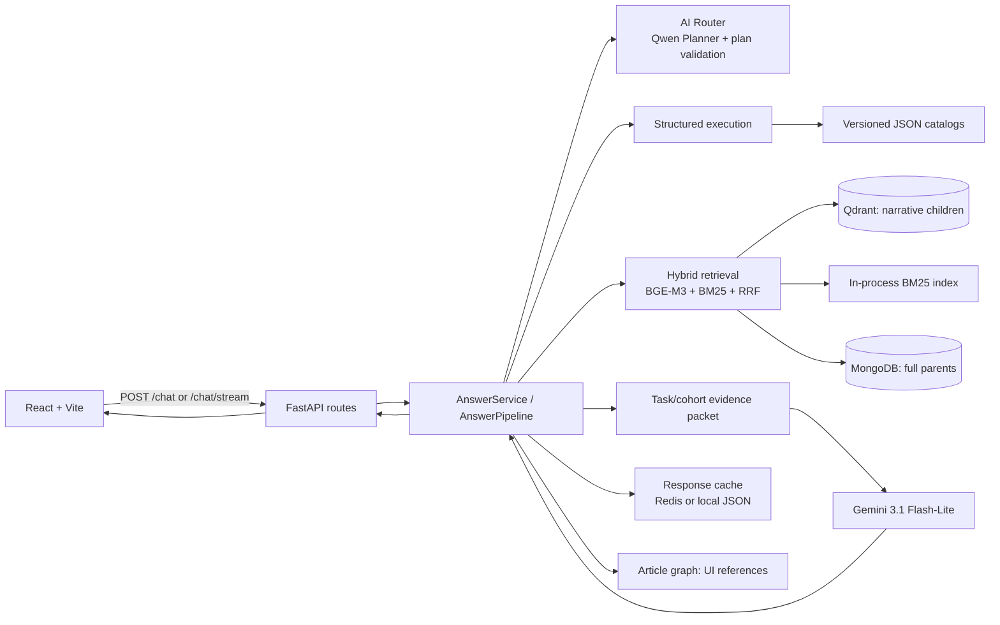
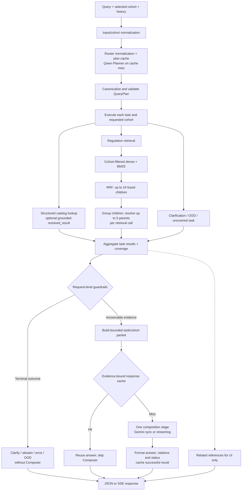
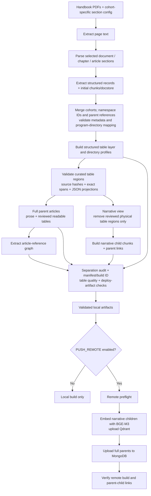

<div align="center">
  
  <h1>HCMUE AI</h1>
  <p><strong>Student Handbook RAG Assistant</strong></p>
  <p>
    A cohort-aware assistant for the HCMUE student handbooks: K48–K49, K50, and K51.<br>
    Multi-request planning, deterministic structured lookup, hybrid RAG, citations, and a React interface.
  </p>

  <p>
    <a href="https://www.hcmuebot.id.vn"></a>
    <a href="https://huggingface.co/spaces/AnhFeee/hcmue-handbook-rag-api"></a>
    <a href="#evaluation-results"></a>
  </p>

  <p>
    
    
    
    
    
    <a href="./LICENSE"></a>
  </p>

  <p>
    <a href="#project-overview">Overview</a> ·
    <a href="#system-architecture">Architecture</a> ·
    <a href="#data-and-repository-structure">Data &amp; Repository</a> ·
    <a href="#runtime-design">Runtime</a> ·
    <a href="#evaluation-results">Evaluation</a> ·
    <a href="#local-development">Run Locally</a> ·
    <a href="#deployment">Deployment</a>
  </p>
</div>

<p align="center">
  
</p>
<p align="center"><sub>Grounded answers, cohort-aware citations, structured lookup cards, and source navigation.</sub></p>

> [!IMPORTANT]
> HCMUE AI is an independent, non-commercial student project—not an official HCMUE application. Verify cited sources or contact the responsible university office before making important academic decisions.

> [!NOTE]
> The current local runtime is the **v33 candidate**, using Composer **Gemini 3.1 Flash-Lite**, prompt **v3.24**, pipeline **v73**, and build `build-934f1caf384f99ad96e9`. The three official-v1 quality suites have completed locally; see [results and limitations](data/eval/official_v1/RESULTS_AND_LIMITATIONS.md) and [provenance](data/eval/official_v1/RESULTS_PROVENANCE.json). Production60 was **not run** for this scope, so there is no current production metric or production certification. The public deployment has not been verified against this local version.

<a id="project-overview"></a>

## ✨ Project Overview

HCMUE AI answers questions from three student-handbook groups: **K48–K49, K50, and K51**. The backend separates deterministic table lookup from regulation retrieval because a grade conversion and a policy explanation require different evidence contracts.

The project demonstrates:

- **Multi-request planning:** Qwen 3.8 27B creates a typed `QueryPlan` with at most three independent tasks.
- **Deterministic structured lookup:** cohort-aware catalogs cover grade scales, scholarships, study duration, foreign-language equivalency, formulas, programs, faculties, offices, and student services.
- **Hybrid regulation RAG:** BGE-M3 dense search and BM25 are fused with Reciprocal Rank Fusion (RRF), then mapped from child chunks to complete parent articles.
- **Evidence-bound generation:** the Gemini composer receives only evidence authorized for the corresponding task and cohort. A unique, grounded table row may also be supplied as a fact lock through `resolved_result`.
- **Delivery surfaces:** FastAPI supports synchronous and SSE streaming responses; React renders citations and structured data in dedicated source drawers.
- **Reproducible evaluation:** planning, retrieval, and answer quality are reported separately with explicit denominators and provenance; source-grounded review is AI-assisted.

### 📌 At a glance

| Deterministic contract | Retrieval Hit@5 | Mean Judge correctness | Corpus |
|:---:|:---:|:---:|:---:|
| **124/135 · 91.85%** | **141/155 · 90.97%** | **0.9305 / 1 · 150 cases** | **462 parents · 3,121 children** |

These are separate official-v1 local measurements, not one overall accuracy score.
Retrieval's content-type gate did not pass; see [evaluation details](#evaluation-results).

### 🧰 Technology stack

| Layer | Technology | Responsibility |
|---|---|---|
| Web client | React, TypeScript, Vite | Chat UX, SSE rendering, citations, and structured source drawers |
| API | FastAPI, Pydantic | Request contracts, orchestration, readiness, and streaming |
| Planner | Qwen 3.8 27B on Groq | Typed multi-request `QueryPlan` with native JSON Schema |
| Composer | Gemini 3.1 Flash-Lite | Evidence-bound Vietnamese answer generation |
| Retrieval | BGE-M3, BM25, RRF, Qdrant | Cohort-filtered regulation search |
| Knowledge stores | MongoDB, versioned JSON, local graph | Parent articles, structured catalogs, and UI references |
| Operations | Redis, LangSmith, Hugging Face, Vercel | Cache, tracing, backend hosting, and frontend delivery |

<a id="system-architecture"></a>

## 🏗️ System Architecture

The API delegates to the answer service/pipeline; storage systems do not call one another. The retrieval component resolves child IDs to parent articles.


```mermaid
flowchart LR
    UI["React + Vite"] -->|"POST /chat or /chat/stream"| API["FastAPI routes"]
    API --> Service["AnswerService / AnswerPipeline"]
    Service --> Router["AI Router<br/>Qwen Planner + plan validation"]
    Service --> Lookup["Structured execution"]
    Lookup --> JSON["Versioned JSON catalogs"]
    Service --> Retrieval["Hybrid retrieval<br/>BGE-M3 + BM25 + RRF"]
    Retrieval --> Qdrant[("Qdrant: narrative children")]
    Retrieval --> BM25["In-process BM25 index"]
    Retrieval --> Mongo[("MongoDB: full parents")]
    Service --> Packet["Task/cohort evidence packet"]
    Packet --> Composer["Gemini 3.1 Flash-Lite"]
    Service --> Cache["Response cache<br/>Redis or local JSON"]
    Service --> Graph["Article graph: UI references"]
    Composer --> Service
    Service --> API
    API --> UI
```

Current local artifacts use build ID `build-934f1caf384f99ad96e9`, Qdrant `student_handbook_semantic_v33`, and MongoDB `parent_docs_v33`. Build/upload validation and readiness checks enforce declared artifact and collection identities; a matching collection name alone is not proof of remote content equality. Hosting targets are HF Spaces and Vercel; the diagram does not certify the currently deployed revision.

### 🔄 Runtime flow


```mermaid
flowchart TD
    Request["Query + selected cohort + history"] --> Input["Input/cohort normalization"]
    Input --> Router["Router normalization + plan cache<br/>Qwen Planner on cache miss"]
    Router --> Validate["Canonicalize and validate QueryPlan"]
    Validate --> Tasks["Execute each task and requested cohort"]
    Tasks --> S["Structured catalog lookup<br/>optional grounded resolved_result"]
    Tasks --> R["Regulation retrieval"]
    Tasks --> C["Clarification / OOD / uncovered task"]
    R --> Search["Cohort-filtered dense + BM25"]
    Search --> RRF["RRF: up to 24 fused children"]
    RRF --> Parents["Group children; resolve up to 5 parents<br/>per retrieval call"]
    Parents --> Merge["Aggregate task results + coverage"]
    S --> Merge
    C --> Merge
    Merge --> Gate{"Request-level guardrails"}
    Gate -->|"Terminal outcome"| Safe["Clarify / abstain / error / OOD<br/>without Composer"]
    Gate -->|"Answerable evidence"| Packet["Build bounded task/cohort packet"]
    Packet --> Cache{"Evidence-bound response cache"}
    Cache -->|"Hit"| Cached["Reuse answer; skip Composer"]
    Cache -->|"Miss"| Compose["One composition stage<br/>Gemini sync or streaming"]
    Compose --> Final["Format answer, citations and status<br/>cache successful result"]
    Merge -.-> Graph["Related references for UI only"]
    Final --> Response["JSON or SSE response"]
    Safe --> Response
    Cached --> Response
    Graph --> Response
```

- Sync and streaming share `prepare_answer`; their generation/delivery adapters remain separate.
- Response-cache lookup happens **after planning/retrieval and evidence construction**. Its key includes evidence and version identity; it is not a shortcut around all retrieval.
- Mixed questions can preserve answerable tasks alongside a clarification need. Task-level missing information does not necessarily terminate the entire request.
- “One composition stage” means one composed answer across tasks, not a guarantee of one provider HTTP attempt: retries/key rotation can occur.
- RRF and parent selection operate per retrieval call; aggregation can contain sources from multiple tasks/cohorts before context limits are applied.

### 🛡️ Core contracts

- Each planned task owns its question, mode, cohorts, and structured capability when applicable.
- Multiple cohorts are executed inside one logical task instead of multiplying task count.
- Structured lookup always exposes the applicable small catalog or matching records. `resolved_result` is added only when grounded input, applicability, table selection, and a unique row are all deterministic.
- Regulation evidence is filtered by cohort before top-k selection and remains bound to its task.
- Graph traversal supplies related-reference navigation to the UI; graph results are not Composer evidence.
- Planner failure safely falls back to one regulation-RAG task using the original query and is recorded in telemetry.

<a id="data-and-repository-structure"></a>

## 🗂️ Data and Repository Structure

### 📚 Current data snapshot

| Artifact | Count | Purpose |
|---|---:|---|
| Parent articles | 462 | Complete context for answers and citations |
| Child chunks | 3,121 | Fine-grained dense and BM25 retrieval |
| Structured table catalogs | 35 | Deterministic cohort-aware lookup |
| Article graph edges | 78 | Related-reference navigation in the UI |
| Embedding | BAAI/bge-m3, 1,024 dimensions | Semantic dense retrieval |

Supported regulation tables remain available in versioned JSON and full MongoDB parent articles. Reviewed physical table regions are removed from the narrative view used for child embedding; policy prose containing numbers is retained. Directory catalogs stay on their structured path. See the [parent/child build contract](docs/PARENT_CHILD_BUILD_CONTRACT.md).

### 🧭 Repository layout

```text
student_handbook_rag/
├── configs/                         # Planner, generation, retrieval, and structured contracts
├── data/
│   ├── raw/                         # Source handbooks (not deployed)
│   ├── processed/                   # Tables, parents, chunks, graph, and build manifest
│   └── eval/
│       └── official_v1/             # Current system evaluation, results, and provenance
├── docs/                            # Architecture and historical evaluation reports
├── frontend/                        # React + TypeScript + Vite application
├── scripts/                         # Build, audit, evaluation, publishing, and deployment tools
├── src/
│   ├── api/                         # FastAPI routes and health checks
│   ├── extraction/                  # Structured tables and directories
│   ├── generation/                  # Evidence packets, prompts, composer, and citations
│   ├── ingestion/                   # PDF, vector, parent-document, and graph ingestion
│   ├── preprocessing/               # Handbook structure and applicability processing
│   ├── retrieval/                   # Planner, structured lookup, and hybrid RAG
│   └── services/                    # Application-facing orchestration services
└── tests/                           # Unit, integration, and regression tests
```

The current runtime/build boundary and intentionally deferred cleanup work are
documented in [Technical Debt and Maintenance Boundary](./docs/TECHNICAL_DEBT.md).

### 🔨 Preprocessing and data build pipeline

The build is source-driven and cohort-specific, with curated section boundaries, catalog metadata, and reviewed table regions. It is not an unrestricted automatic OCR/table-understanding pipeline.


```mermaid
flowchart TD
    PDF["Handbook PDFs + cohort-specific section config"] --> Pages["Extract page text"]
    Pages --> Sections["Parse selected document / chapter / article sections"]
    Sections --> Extract["Extract structured records + initial chunks/docstore"]
    Extract --> Merge["Merge cohorts; namespace IDs and parent references<br/>validate metadata and program-directory mapping"]
    Merge --> Catalog["Build structured table layer and directory profiles"]
    Catalog --> Review["Validate curated table regions<br/>source hashes + exact spans + JSON projections"]
    Review --> Full["Full parent articles<br/>prose + reviewed readable tables"]
    Review --> Narrative["Narrative view<br/>remove reviewed physical table regions only"]
    Narrative --> Child["Build narrative child chunks + parent links"]
    Full --> Graph["Extract article-reference graph"]
    Full --> Audit["Separation audit + manifest/build ID<br/>table quality + deploy-artifact checks"]
    Child --> Audit
    Catalog --> Audit
    Graph --> Audit
    Audit --> Ready["Validated local artifacts"]
    Ready --> Publish{"PUSH_REMOTE enabled?"}
    Publish -->|"No"| Local["Local build only"]
    Publish -->|"Yes"| Preflight["Remote preflight"]
    Preflight --> Vector["Embed narrative children with BGE-M3<br/>upload Qdrant"]
    Vector --> ParentUpload["Upload full parents to MongoDB"]
    ParentUpload --> Verify["Verify remote build and parent-child links"]
```

| Stage | Entry point / contract | Output or responsibility |
|---|---|---|
| Per-PDF extraction | `scripts.extract_pdf_pages`, `scripts.parse_structure` | Page text and selected structured sections using each cohort's config |
| Initial extraction/chunking | `scripts.extract_structured_data`, `scripts.build_chunks` | Source records, initial chunks and parent docstore |
| Multi-cohort consolidation | `scripts.build_multi_cohort` | Cohort-qualified IDs, source-parent references, directory enrichment and validation |
| Structured artifacts | `scripts.build_structured_table_layer` | Lookup tables, registry and runtime directory profiles |
| Parent/child separation | `scripts.build_parent_child_artifacts --publish-artifacts` | Final local parents, narrative children and separation audit; this flag does **not** upload |
| Graph and identity | `src.ingestion.graph_extractor`, `scripts.build_artifact_manifest` | Related-reference edges, file hashes and shared build identity |
| Publication | `scripts.push_to_qdrant`, `scripts.push_to_mongo`, `scripts.verify_remote_build` | Validated versioned remote stores; no automatic runtime promotion |

**Three representations, three purposes:**

- `all_docstore_items.json` → MongoDB: complete supported articles, including reviewed tables.
- `child_parent_chunks.json` → Qdrant and local lexical retrieval: narrative children, not full tables or table-summary fallback chunks.
- Structured JSON tables/directories → deterministic lookup: authoritative rows, fields, source binding and applicability.

`narrative_docstore_items.json` is a build intermediate, **not** the MongoDB upload input. Numeric policy prose stays in narrative text; only explicitly reviewed physical table regions are removed. Image-based or malformed tables are not assumed to be recovered automatically: supported table projections depend on reviewed source/JSON metadata. Source or registry drift fails validation instead of guessing new boundaries.

The manifest is built **before uploads**. Publication is not a cross-database transaction: if either store fails, do not switch the application to the partial pair. Keep the previous version until both stores are verified. See the [full build contract](docs/PARENT_CHILD_BUILD_CONTRACT.md) and [publishing commands](#data-build-and-publishing).

<a id="runtime-design"></a>

## ⚙️ Runtime Design

### 🧠 Planning and structured lookup

The Planner distinguishes a table value from the policy governing that value. Native JSON Schema constrains the plan structure; the normalizer canonicalizes and validates the plan before execution. Schema-valid slots do not guarantee that the Planner interpreted the question correctly.

For structured tasks, runtime—not the Planner—selects the applicable catalog and resolves data:

1. validate the task inputs, cohort, and applicability;
2. select the declared structured capability;
3. expose the applicable table or records to the UI and Composer;
4. create `resolved_result` only for a uniquely resolved, evidence-grounded row;
5. otherwise retain the available catalog or request clarification instead of guessing.

### 🔎 Retrieval and grounding

The default retrieval path uses `vector_primary_graph_supplement`:

1. Qdrant and BM25 apply cohort filters before top-k selection.
2. Each branch returns at most 24 child candidates.
3. RRF retains up to 24 fused child candidates.
4. Children are grouped into at most five primary parent articles.
5. The evidence packet applies task/cohort/source guards, deduplication, and bounded context allocation.
6. The Composer cannot retrieve additional sources or promote UI-only graph references into answer evidence.

**No reranker is enabled in the default runtime or the official-v1 evaluation.** RRF is the release path; experimental reranker results are not official headline metrics.

<a id="api"></a>

## 🔌 API

| Method | Endpoint | Purpose |
|---|---|---|
| `GET` | `/health` | Liveness and container status |
| `GET` | `/health/readiness` | Artifact, dependency, and collection-identity checks |
| `GET` | `/health/artifacts` | Admin-only artifact details |
| `POST` | `/chat` | Synchronous response |
| `POST` | `/chat/stream` | SSE response through the shared preparation core |
| `POST` | `/chat/feedback` | Product feedback without intentionally collecting sensitive data |

QueryPlan, task results, and evidence diagnostics are returned only when `include_debug=true`.

<a id="evaluation-results"></a>

## 📊 Evaluation Results

### Official v1 local evaluation

The current official-v1 report covers three local quality suites. These are development measurements, not an independent holdout or production certification; the evaluated runtime identity and input/report hashes are recorded in the [provenance manifest](./data/eval/official_v1/RESULTS_PROVENANCE.json).

| Suite | Sample | Current result |
|---|---:|---:|
| Deterministic | 135 | **124/135 (91.85%)** contract pass; not final-answer accuracy |
| Retrieval | 155 | **141/155 (90.97%)** Hit@5; MRR **0.8333**; content-type **148/155 (95.48%)** vs 98% gate |
| Generate + Judge | 150 | Mean Judge correctness **0.9305**; a 0–1 rubric mean, not exact-answer accuracy or pass rate |
| Production60 | 60 authored cases | **Not run** in this scope; no current production metric |

See the full [official-v1 results and limitations](./data/eval/official_v1/RESULTS_AND_LIMITATIONS.md) for denominators, status counts, and local latency (mean 4.68 s; p50 3.97 s; p95 8.11 s).

### 🔎 Retrieval quality

| Metric | Result |
|---|---:|
| Hit@1 / Hit@3 / Hit@5 | 120/155 · 139/155 · 141/155 |
| MRR / nDCG@5 | 0.8333 / 0.8443 |
| Required-source recall@5 (case mean) | 0.9011 |
| Observed cohort leakage | 0/155 |
| Content-type match | 148/155 · 95.48% |

This is end-to-end retrieval, including routing effects—not an isolated dense-search benchmark. The evaluator's overall retrieval gate is **FAIL** because content-type match is below 98%. Zero observed leakage is not a guarantee for unseen questions.

### ✍️ Answer quality and operational outcomes

| Judge dimension | Mean, n = 150 |
|---|---:|
| Answer correctness | 0.9305 |
| Faithfulness | 0.9591 |
| Answer relevancy | 0.9543 |
| Citation correctness | 0.9355 |
| Context precision | 0.5815 |
| Context recall | 0.8845 |

The Judge is `openai/gpt-oss-120b`, using the project's fixed rubric. These are 0–1 rubric means, not percentages of fully correct answers.

- Generation statuses: **141 answered**, 2 low-confidence, 3 API errors, 2 clarification requests, and 2 out-of-domain responses.
- Local pipeline latency: mean **4.68 s**, p50 **3.97 s**, p95 **8.11 s**. These are not HF load measurements or streaming TTFT.
- All 22 automatically flagged cases and 40 stratified samples were reviewed, with four overlapping cases: **58 unique answers**, using AI-assisted review—not independent human adjudication.
- Judge flags included 13 unsupported-claim and 2 critical flags. Packet checks found false positives; flags are not confirmed error counts. Original scores were not replaced with audit scores.
- A separate retry answered the three API-error cases successfully; those retries were not substituted into the official 150-case metrics.

### 📝 Limitations and interpretation

- The benchmark was used during development and is **not an independent holdout**. Runtime identity, dataset hashes, and report hashes are recorded separately.
- Deterministic contract checks passed 124/135; applicable fact-lock assertions passed **44/50**. A failed routing assertion does not by itself prove a wrong final answer.
- Planner omissions, scope selection, multi-task dependencies, and multi-cohort requests remain limitations. A correct lookup on the selected table does not prove that table applies to the question.
- Retrieval can miss required sources or include excess context. Structured directory evidence and regulation-source assertions must not be conflated.
- The Composer can omit conditions or add unsupported interpretations even with full tables and fact locks.
- Provider throttling and tail latency remain operational risks. Production60 was not run; no current HF load, TTFT, SLA, or scaling metric is claimed.
- Research claims require additional baselines, ablations, independent review, and a prospective or external test set.

For complete breakdowns, case-level limitations and provenance, see the [official report](data/eval/official_v1/RESULTS_AND_LIMITATIONS.md). Earlier measurements remain in the [historical evaluation report](docs/FINAL_RELEASE_EVALUATION.md), not in the current metric tables.

<a id="local-development"></a>

## 💻 Local Development

### Requirements

- Python 3.11
- Node.js 20+
- Qdrant and MongoDB collections from the same build manifest
- Groq and Gemini API keys
- Redis is optional locally and recommended for deployed traffic

### Backend

```bash
python -m venv .venv
# Windows: .venv\Scripts\activate
pip install -c constraints-runtime.txt -r requirements.txt
copy .env.example .env
python -m uvicorn src.api.main:app --host 0.0.0.0 --port 8000
```

Required environment variables:

```dotenv
QDRANT_URL=https://your-cluster.qdrant.io
QDRANT_API_KEY=...
QDRANT_COLLECTION_NAME=student_handbook_semantic_v33
MONGODB_URL=mongodb+srv://...
MONGODB_DB_NAME=chatbotHCMUE
MONGODB_PARENT_COLLECTION=parent_docs_v33
STUDENT_RAG_RETRIEVAL_MODE=vector_primary_graph_supplement
GROQ_API_KEYS=...
GEMINI_API_KEYS=...
```

Current beta boundary:

- Run one replica with one Uvicorn worker. Each process owns one in-memory BM25 index and local admission queue.
- Set `REDIS_URL`; deployed multi-user environments should also set `STUDENT_RAG_REQUIRE_REDIS=true`. Redis mode never writes the local JSON response cache.
- Keep `configs/retrieval.yaml` as the retrieval runtime source of truth. `STUDENT_RAG_RETRIEVAL_CONFIG` may point to another explicit file for a deployment.
- Scale trigger: sustained p95 latency or memory growth, corpus above roughly 20k chunks, or need for multiple replicas. At that point move lexical retrieval and rate-limit state to shared services; do not add them before measured need.

### Frontend

```bash
cd frontend
npm ci
copy .env.example .env.local
npm run dev
```

### Quality checks

```bash
python -m pytest
python -m ruff check src tests scripts
cd frontend
npm run lint
npm run build
```

<a id="data-build-and-publishing"></a>

## 🧱 Data Build and Publishing

The build pipeline writes versioned artifacts and does not overwrite a live production collection in place.

```bash
python -m scripts.build_multi_cohort
python -m scripts.check_deploy_artifacts
python -m scripts.verify_remote_build
```

Safe publishing sequence:

1. Build and audit local artifacts.
2. Create versioned Qdrant and MongoDB collections.
3. Publish both with the same `build_id`.
4. Verify counts and child-to-parent links.
5. Switch both collection variables in one release.
6. Retain the previous build until canary checks pass.

<a id="observability"></a>

## 🔭 Observability

LangSmith tracing uses the current QueryPlan contract for both `/chat` and `/chat/stream`. Root traces record interface, status, latency, TTFT, cache behavior, task/coverage summaries, evidence identity, collection identity, and Planner/Composer usage when available.

Raw chat history, full source bodies, retrieval scores, API keys, and database URLs are excluded from trace metadata. The current query and final answer remain trace input/output for product debugging.

```dotenv
LANGSMITH_TRACING=true
LANGSMITH_API_KEY=lsv2_pt_...
LANGSMITH_PROJECT=hcmue-student-handbook-rag
```

Legacy `LANGCHAIN_API_KEY` and `LANGCHAIN_PROJECT` variables remain supported for existing deployments.

<a id="deployment"></a>

## 🚀 Deployment

### Backend — Hugging Face Spaces

The deployment script uses an explicit allow-list and excludes `.env`, secrets, caches, evaluation reports, and raw PDFs.

```powershell
powershell -NoProfile -ExecutionPolicy Bypass -File .\scripts\deploy_hf_backend.ps1 -DryRun -QdrantCollection student_handbook_semantic_v33 -MongoCollection parent_docs_v33
powershell -NoProfile -ExecutionPolicy Bypass -File .\scripts\deploy_hf_backend.ps1 -QdrantCollection student_handbook_semantic_v33 -MongoCollection parent_docs_v33
```

Before publishing this candidate, the packaged manifest and both HF runtime variables must target Qdrant `student_handbook_semantic_v33` and MongoDB `parent_docs_v33`. Pass both script parameters explicitly; the script's legacy defaults are v32 and will reject this manifest. Keep the v32 pair for rollback. After deployment, verify `/health`, `/health/readiness`, and representative structured, regulation, compound, clarification, sync, and streaming requests.

### Frontend — Vercel

The Vite frontend reads `VITE_API_BASE_URL`. This repository documents the frontend deployment configuration; the current public deployment is not verified by the local official-v1 evaluation.

<a id="evaluation-governance-and-release-policy"></a>

## 🧪 Evaluation Governance and Release Policy

- Dataset files, evaluator code, runtime identity, model configuration, storage collections, and output hashes are recorded separately.
- Non-applicable assertions are reported as `N/A`, never as automatic passes.
- A run may be repeated only when an infrastructure or evaluator defect is documented; low scores alone are not a reason to rerun a frozen holdout.
- Failures become regression evidence for a later version rather than question-specific runtime patches.
- The project favors general correctness invariants over benchmark keyword exceptions and does not optimize for 100% stress-case performance.

<a id="license"></a>

## 📄 License

The source code is released under the [MIT License](./LICENSE). Student-handbook content and university regulations remain the property of their respective publishers.
