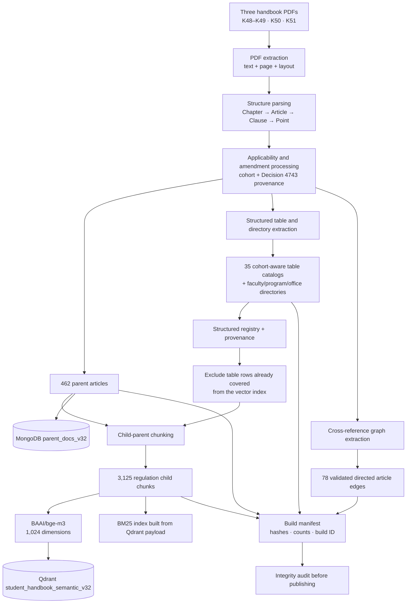
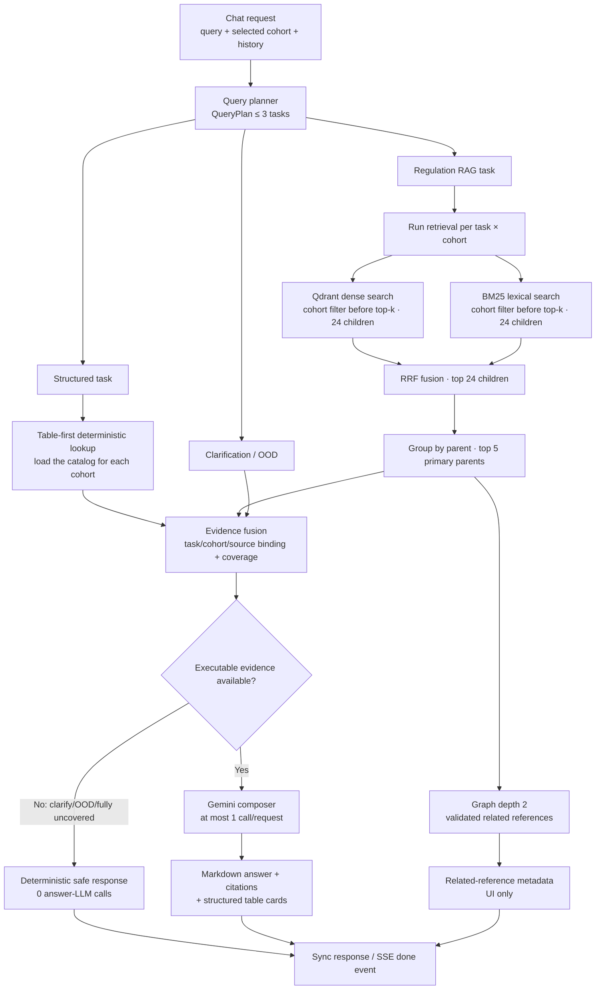
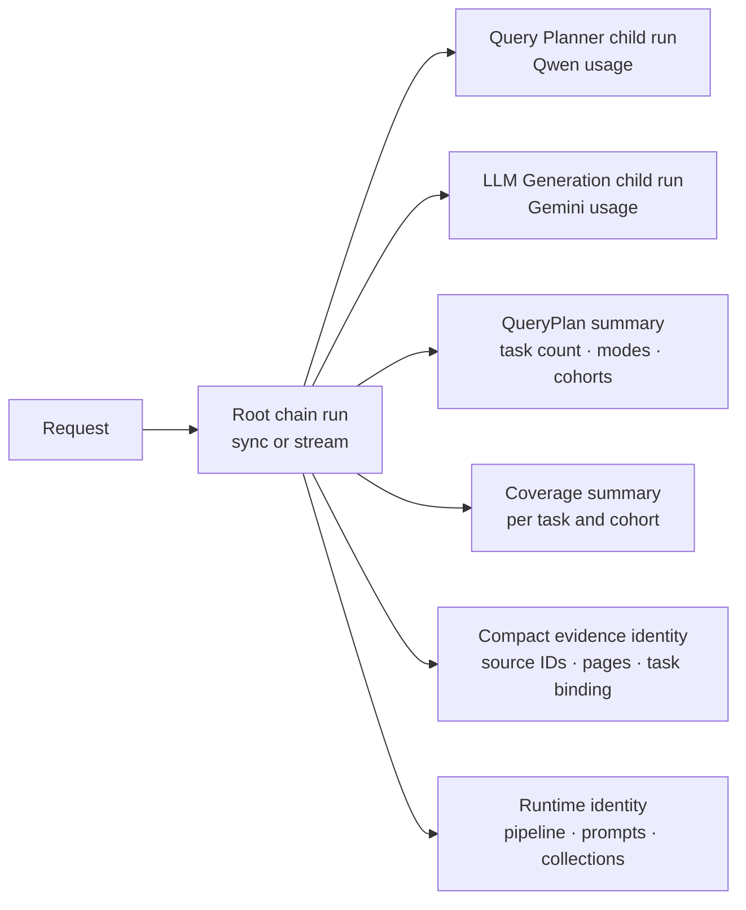

# HCMUE AI — Student Handbook RAG Assistant

<p align="center">
  <strong>A cohort-aware assistant for the HCMUE student handbooks: K48–K49, K50, and K51.</strong><br>
  Multi-request query planning, structured lookup, hybrid RAG, citations, and a React interface in one production-oriented project.
</p>

<p align="center">
  
  
  
  
  
</p>

<p align="center">
  <a href="https://www.hcmuebot.id.vn"><strong>Live demo</strong></a>
  ·
  <a href="https://huggingface.co/spaces/AnhFeee/hcmue-handbook-rag-api"><strong>Backend Space</strong></a>
  ·
  <a href="#evaluation-results"><strong>Evaluation</strong></a>
</p>


> HCMUE AI is an independent, non-commercial student project. It is not an official application of Ho Chi Minh City University of Education. Users should verify cited sources or contact the responsible university office before making important academic decisions.

## Overview

The system answers questions from three HCMUE student-handbook groups: **K48–K49, K50, and K51**. It separates structured data from regulation text because tables and policy articles require different retrieval strategies:

- **Structured lookup:** grade scales, scholarships, study duration, foreign-language equivalency, program–faculty mappings, offices, and formulas are stored as cohort-aware JSON. The backend selects the correct catalog and cohort, then provides the applicable table to the composer. Rows already covered by a catalog are not embedded again.
- **Regulation RAG:** policy conditions, procedures, exceptions, consequences, and cross-references use dense search plus BM25, fused with Reciprocal Rank Fusion (RRF), and linked to full parent articles in MongoDB.
- **Multi-request QueryPlan:** the planner creates at most three logical tasks in `structured`, `rag`, or `clarify` mode. Multiple cohorts are executed within the same logical task instead of multiplying tasks.
- **Grounded answers:** evidence is bound to task, cohort, and source. Each request uses at most one answer-LLM call. Missing evidence triggers a scoped abstention or clarification without discarding answerable parts.
- **Student-facing UI:** structured tables render as dedicated cards, regulation citations open their source, streaming is supported, and the interface is responsive on desktop and mobile.

## System Architecture


```mermaid
flowchart LR
    Student["Student"] --> UI["React + Vite UI<br/>Vercel"]
    UI -->|"HTTPS / SSE"| API["FastAPI API<br/>Hugging Face Spaces"]

    API --> Planner["Query Planner<br/>Qwen 3.8 27B · Groq"]
    API --> Composer["Answer Composer<br/>Gemini 3.1 Flash-Lite"]
    API --> Cache[("Redis<br/>response/cache controls")]

    API --> Structured["Structured JSON catalogs"]
    API --> Qdrant[("Qdrant Cloud<br/>student_handbook_semantic_v32")]
    API --> Mongo[("MongoDB Atlas<br/>parent_docs_v32")]
    API --> Graph["Local article graph"]

    Qdrant -. child parent ID .-> Mongo
    Structured -. source and cohort binding .-> API
    Graph -. related references .-> API
```

The production data stores share build ID `build-02a2eed8dae5b4307427`. Readiness checks compare environment collection names against the packaged build manifest, preventing Qdrant and MongoDB from silently using artifacts from different builds.

## Data Processing Pipeline


```mermaid
flowchart TD
    PDFs["Three handbook PDFs<br/>K48–K49 · K50 · K51"] --> Extract["PDF extraction<br/>text + page + layout"]
    Extract --> Parse["Structure parsing<br/>Chapter → Article → Clause → Point"]
    Parse --> Policy["Applicability and amendment processing<br/>cohort + Decision 4743 provenance"]

    Policy --> Parents["462 parent articles"]
    Policy --> TableExtract["Structured table and directory extraction"]
    Policy --> GraphExtract["Cross-reference graph extraction"]

    TableExtract --> Catalogs["35 cohort-aware table catalogs<br/>+ faculty/program/office directories"]
    Catalogs --> Registry["Structured registry + provenance"]

    Parents --> Chunking["Child-parent chunking"]
    Registry --> Exclude["Exclude table rows already covered<br/>from the vector index"]
    Exclude --> Chunking
    Chunking --> Children["3,125 regulation child chunks"]
    Children --> Embedding["BAAI/bge-m3<br/>1,024 dimensions"]

    Parents --> Mongo[("MongoDB parent_docs_v32")]
    Embedding --> Qdrant[("Qdrant student_handbook_semantic_v32")]
    Children --> BM25["BM25 index built from Qdrant payload"]
    GraphExtract --> Graph["78 validated directed article edges"]

    Parents --> Manifest["Build manifest<br/>hashes · counts · build ID"]
    Catalogs --> Manifest
    Children --> Manifest
    Graph --> Manifest
    Manifest --> Audit["Integrity audit before publishing"]
```

### Current Data Snapshot

| Artifact | Count | Purpose |
|---|---:|---|
| Parent articles | 462 | Full context for answers and citations |
| Child chunks | 3,125 | Fine-grained dense and BM25 retrieval |
| Structured table catalogs | 35 | Deterministic cohort-aware table lookup |
| Article graph edges | 78 | Related references for the UI; never Composer evidence or a substitute for primary evidence |
| Embedding | BAAI/bge-m3, 1,024 dimensions | Semantic dense retrieval |

Structured tables remain available in JSON and in MongoDB parent documents. Excluding registry-covered rows only removes duplicated, flattened table content from Qdrant; it does not remove tables from the system.

## Runtime Query Pipeline


```mermaid
flowchart TD
    Request["Chat request<br/>query + selected cohort + history"] --> Plan["Query planner<br/>QueryPlan ≤ 3 tasks"]
    Plan --> S["Structured task"]
    Plan --> R["Regulation RAG task"]
    Plan --> C["Clarification / OOD"]

    S --> Lookup["Table-first deterministic lookup<br/>load the catalog for each cohort"]

    R --> PerCohort["Run retrieval per task × cohort"]
    PerCohort --> Dense["Qdrant dense search<br/>cohort filter before top-k · 24 children"]
    PerCohort --> Sparse["BM25 lexical search<br/>cohort filter before top-k · 24 children"]
    Dense --> RRF["RRF fusion · top 24 children"]
    Sparse --> RRF
    RRF --> Group["Group by parent · top 5 primary parents"]
    Group --> Expand["Graph depth 2<br/>validated related references"]

    Lookup --> Packet["Evidence fusion<br/>task/cohort/source binding + coverage"]
    Group --> Packet
    Expand --> RelatedUI["Related-reference metadata<br/>UI only"]
    C --> Packet

    Packet --> Terminal{"Executable evidence available?"}
    Terminal -->|"No: clarify/OOD/fully uncovered"| Deterministic["Deterministic safe response<br/>0 answer-LLM calls"]
    Terminal -->|"Yes"| Answer["Gemini composer<br/>at most 1 call/request"]
    Answer --> Render["Markdown answer + citations<br/>+ structured table cards"]
    Deterministic --> Response["Sync response / SSE done event"]
    Render --> Response
    RelatedUI --> Response
```

### QueryPlan Contract

Each task contains its own question, mode, lookup type, cohorts, and clarification data when needed. The core constraints are:

- One to three tasks; no recursive planning and no agent tool loop.
- Multiple cohorts do not increase the logical task count.
- A structured task selects a catalog. The backend exposes the applicable table rather than applying brittle keyword-driven row filtering too early.
- Compound regulation questions are retrieved independently per task.
- Planner timeout or invalid JSON falls back to one regulation-RAG task using the original query; debug telemetry records the fallback.

## Retrieval and Grounding

Production retrieval is recall-oriented while keeping cohort and applicability constraints explicit:

1. Qdrant and BM25 filter by cohort **before** top-k selection.
2. Each branch returns at most 24 child candidates.
3. RRF fuses both branches and retains 24 child candidates.
4. Child chunks are grouped into at most five primary parents.
5. Graph traversal at depth two adds related references; graph results do not become primary citations by themselves.
6. The composer receives only task/cohort-bound evidence and cannot retrieve new evidence.

PhoRanker remains available for controlled evaluation modes but is **disabled in production**. Production ranking uses RRF.

## Main API Endpoints

| Method | Endpoint | Purpose |
|---|---|---|
| `GET` | `/health` | Liveness and container health check |
| `GET` | `/health/readiness` | Artifact, environment, and build/collection identity checks |
| `GET` | `/health/artifacts` | Admin-only artifact details |
| `POST` | `/chat` | Synchronous answer generation |
| `POST` | `/chat/stream` | SSE streaming through the shared preparation core |
| `POST` | `/chat/feedback` | Product feedback without intentionally collecting sensitive personal data |

Debug fields such as QueryPlan, task results, and evidence telemetry only appear when `include_debug=true`. The normal production response remains compact and stable.

## Observability with LangSmith

LangSmith tracing follows the current QueryPlan architecture. Both `/chat` and `/chat/stream` create the same compact trace contract (`hcmue-query-plan-v2`). Public SSE responses still hide debug fields unless `include_debug=true`; the server retains an internal copy for observability before applying that redaction.


```mermaid
flowchart LR
    Request["Request"] --> Root["Root chain run<br/>sync or stream"]
    Root --> Planner["Query Planner child run<br/>Qwen usage"]
    Root --> Composer["LLM Generation child run<br/>Gemini usage"]

    Root --> PlanMeta["QueryPlan summary<br/>task count · modes · cohorts"]
    Root --> Coverage["Coverage summary<br/>per task and cohort"]
    Root --> EvidenceMeta["Compact evidence identity<br/>source IDs · pages · task binding"]
    Root --> RuntimeMeta["Runtime identity<br/>pipeline · prompts · collections"]
```

Each root trace records:

- interface (`sync` or `stream`), status, total latency, streaming TTFT, cache hit, and whether the answer LLM was called;
- QueryPlan context mode, task count, task mode, lookup type, cohorts, per-task coverage, evidence count, citation count, and planner fallback;
- pipeline, planner-prompt, answer-prompt, QueryPlan schema/normalizer, Qdrant collection, and MongoDB parent-collection identity;
- compact citation and structured-result summaries, including task/cohort binding and source pages;
- token usage and timed Planner/Composer child runs when usage telemetry is available.

The trace deliberately excludes raw chat history, full source text, parent article bodies, retrieval scores, API keys, and database URLs. The student query and final answer remain the LangSmith root input/output because they are required for debugging product behavior.

Enable tracing with:

```dotenv
LANGSMITH_TRACING=true
LANGSMITH_API_KEY=lsv2_pt_...
LANGSMITH_PROJECT=hcmue-student-handbook-rag
```

Legacy `LANGCHAIN_API_KEY` and `LANGCHAIN_PROJECT` names remain supported for existing deployments.

## Evaluation Results

Planning correctness, regulation retrieval, answer quality, and API behavior are evaluated separately. Their denominators and contracts are not combined into one synthetic score.

The current release uses **Architecture V7 (`7.0.0`)** as its official internal release evaluation. V7 was executed once against runtime commit `1f11f6500bc56de861adaecc876ccd9505d93538`; the four case-file hashes in the manifest still match the first-run reports, and the runtime was not patched and rerun to improve the numbers. The bundle was promoted to release status after that run. It is suitable for project and CV reporting, but it is not described as a pre-registered external holdout.

Dataset: [`data/eval/architecture_v7`](./data/eval/architecture_v7)

Detailed release report: [`docs/V7_RELEASE_EVALUATION_VI.md`](./docs/V7_RELEASE_EVALUATION_VI.md)

### Evaluation Identity

| Item | Recorded value |
|---|---|
| Evaluated runtime commit | `1f11f6500bc56de861adaecc876ccd9505d93538` |
| Evaluator commit | `c053bfcf8a63cc85a3448b1c3691310798319c11` |
| Planner | `qwen/qwen3.8-27b`, reasoning `low`, native JSON Schema |
| Composer | `gemini-3.1-flash-lite` |
| Judge | `openai/gpt-oss-120b`, project-specific rubric; not RAGAS |
| Retrieval mode | `vector_primary_graph_supplement`; PhoRanker disabled |
| Storage | Qdrant `student_handbook_semantic_v32`; MongoDB `parent_docs_v32` |
| Runtime contract | pipeline `v58-registry-grounded-routing`; QueryPlan schema `v1`; normalizer `v17-registry-literal-grounding` |
| Prompt contracts | Planner `structured-regulation-v39-reference-table-selector`; Composer `student-handbook-answer-v3.22-answer-scope` |
| Evaluation volume | 140 deterministic + 160 retrieval + 150 generated/judged + 60 production requests |

### 1. Deterministic Architecture — 140 Cases

This suite evaluates QueryPlan outcomes and executable structured evidence without using the Composer as a judge. V7 accepts semantically equivalent safe plans rather than requiring identical task IDs or raw slot spellings.

#### Composition and result by case type

| Case type | Cases | Passed | Pass rate |
|---|---:|---:|---:|
| Single structured lookup | 60 | 58 | 96.67% |
| Capability boundary | 24 | 24 | 100.00% |
| Compound query | 28 | 24 | 85.71% |
| Missing or ambiguous information | 12 | 11 | 91.67% |
| Unsupported but in-domain | 8 | 5 | 62.50% |
| Out of domain | 8 | 8 | 100.00% |
| **Total** | **140** | **130** | **92.86%** |

The split contains 95 realistic cases (**92/95 = 96.84%**) and 45 stress cases (**38/45 = 84.44%**).

#### Architecture metrics

| Metric | Result |
|---|---:|
| Outcome-contract accuracy | **130/140 = 92.86%** |
| Structured-selection precision | **98.86%** |
| Structured-selection recall | **98.86%** |
| Structured false-positive rate | **1.92%** |
| Plan-structure accuracy | **96.43%** |
| Task-semantics accuracy | **95.71%** |
| Structured-execution accuracy | **97.86%** |
| Structured-evidence accuracy | **98.86%** |
| Planner fallback rate | **2.14%** |
| Observed cross-cohort leak | **0/140** |

The deterministic gate passed its applicable precision, recall, false-positive, and cohort-leak thresholds. Metrics that the outcome-equivalent contract does not assert for every case are reported as `N/A`, not silently converted into 100%.

### 2. End-to-End Regulation Retrieval — 160 Cases

All cases require regulation evidence and run through the Planner plus the production retrieval path: BGE-M3 dense search, BM25, RRF, parent grouping, and graph-related UI references. Structured-only lookups are excluded.

#### Dataset composition

| Dimension | Distribution |
|---|---|
| Evaluation split | 108 realistic, 52 stress |
| Cohort | 46 K48–K49, 55 K50, 47 K51, 12 general |
| Target patterns | 30 exact article, 20 graph-reference, 20 multi-source, 32 cohort-sensitive, 32 condition/procedure, 10 no-diacritic typo; tags may overlap |

#### Retrieval metrics

| Metric | Result |
|---|---:|
| Hit@1 | **126/160 = 78.75%** |
| Hit@3 | **145/160 = 90.63%** |
| Hit@5 | **148/160 = 92.50%** |
| Primary-source Hit@5 | **148/160 = 92.50%** |
| MRR | **0.8559** |
| nDCG@5 | **0.8248** |
| Required-source recall@5 | **0.8802** |
| Citation binding | **93.75%** |
| Content-type match | **94.38%** |
| Cohort match | **100.00%** |
| Observed cohort leak | **0/160** |
| Empty retrieval | **4/160 = 2.50%** |
| Retrieval latency p50 / p95 | **2.674 s / 5.163 s** |

#### Diagnostic breakdown

| Group | Cases | Hit@3 | MRR |
|---|---:|---:|---:|
| Realistic | 108 | 93.52% | 0.8834 |
| Stress | 52 | 84.62% | 0.7987 |
| Exact article | 30 | 100.00% | 0.9278 |
| Graph reference | 20 | 95.00% | 0.9250 |
| Multi-source | 20 | 80.00% | 0.7500 |
| Cohort-sensitive | 32 | 78.13% | 0.7252 |
| No-diacritic typo | 10 | 50.00% | 0.3833 |

Hit@3, Hit@5, MRR, nDCG@5, and cohort isolation passed their configured gates. The overall retrieval gate remained **failed** because content-type match was 94.38% against a 98% threshold; this failure is retained rather than hidden behind the stronger Hit@5 score.

### 3. Answer Generation — 150 Cases

#### Composition

| Case type | Cases |
|---|---:|
| Regulation RAG | 90 |
| Structured answer | 30 |
| Mixed structured + RAG | 10 |
| Clarification | 8 |
| Unanswerable | 6 |
| Out of domain | 6 |
| **Total** | **150** |

The answer split contains 102 realistic and 48 stress cases. All 150 outputs were produced with production retrieval mode and without PhoRanker.

| Generation metric | Result |
|---|---:|
| Literal `answered` status rate | **88.00%** |
| Generation latency mean | **6.250 s** |
| Generation latency p50 | **5.517 s** |
| Generation latency p95 | **10.685 s** |
| Maximum observed latency | **84.847 s** |

The 88% value counts only the literal `answered` status. It is not an answer-quality score because valid clarification, abstention, and OOD responses may use other statuses.

### 4. LLM Judge — 150 Cases

The judge uses `openai/gpt-oss-120b` with a project-specific source-grounded rubric. These are LLM-as-judge diagnostics, not RAGAS and not independent human annotation.

| Judge metric | Result |
|---|---:|
| Faithfulness | **92.65%** |
| Answer relevancy | **93.91%** |
| Answer correctness | **88.30%** |
| Citation correctness | **94.25%** |
| Context precision | **50.10%** |
| Context recall | **79.93%** |
| Packet required-fact coverage | **82.67%** |
| Exact required-fact hit | **51.33%** |
| Numeric accuracy | **81.33%** |
| Abstention correctness | **97.33%** |
| Question-handling correctness | **98.00%** |
| Judge unsupported-claim rate | **8.67%** |
| Judge critical-false-pass flags | **2/150** |

Faithfulness, correctness, citation, and abstention gates passed. Numeric accuracy, unsupported-claim rate, and critical-false-pass gates failed. Exact required-fact matching is intentionally reported separately because literal matching can disagree with a semantically correct paraphrase.

### 5. Source-Grounded Audit — 40 Cases plus All Judge Flags

The 40-case stratified audit was completed by AI-assisted source review under the owner-approved workflow. Every one of the 14 Judge-flagged cases was also inspected against the actual answer, authorized evidence, query scope, and gold target.

| Audit dimension | Result |
|---|---:|
| Overall audit score | **96.06%** |
| Correctness | **93.23%** |
| Faithfulness | **98.38%** |
| Completeness | **94.63%** |
| Citation quality | **97.38%** |
| Safe behavior | **99.50%** |
| Judge–audit MAE | **0.0333** |
| Agreement within ±0.15 | **95.00%** |

Audit labels were 32 pass, 4 acceptable minor limitations, 3 evaluation-case issues, and 1 confirmed system defect. The confirmed defect is `v7_ans_struct_020`: a stress-form scoring query caused the structured router to select the ungraded pass/fail table instead of the K51 “remaining courses” table. Natural follow-up probes showed normal threshold questions are handled conditionally and correctly, so this is retained as a narrow known limitation rather than patched after evaluation.

### 6. Production Contract and Performance — 60 Requests

This suite measures transport, payload, cache, streaming, and bounded concurrency behavior. It does not replace the answer-quality suite.

| Scenario | Requests | Success | p50 latency | p95 latency |
|---|---:|---:|---:|---:|
| Cold regulation RAG | 20 | 100% | 5.533 s | 21.015 s |
| Structured | 10 | 100% | 3.648 s | 5.715 s |
| Warm cache | 10 | 100% | 1.980 s | 6.751 s |
| Streaming | 10 | 100% | 5.511 s | 6.745 s |
| Burst | 10 | 100% | 9.382 s | 13.542 s |
| **Total** | **60** | **100%** | **5.445 s** | **12.478 s** |

| Production metric | Result |
|---|---:|
| HTTP transport success | **60/60** |
| Payload success | **60/60** |
| Expected response-status accuracy | **60/60** |
| HTTP 429 / timeout rate | **0% / 0%** |
| Warm-cache hit rate | **100%** |
| Cold-cache hit rate | **0%** |
| Streaming TTFT coverage | **100%** |
| Streaming TTFT p50 / p95 | **4.586 s / 5.811 s** |
| Mean sources returned | **4.12** |
| Source utilization | **76.67%** |

The production gate remained **failed** because public-endpoint telemetry coverage was 0% and warm-cache p95 exceeded the configured 2-second target. Availability, cache protocol, RAG p95, and streaming TTFT gates passed. This is a bounded smoke/load evaluation, not a capacity, security, or real-user traffic benchmark.

### Evaluation Governance

- [`data/eval/architecture_v7/manifest.json`](./data/eval/architecture_v7/manifest.json) records counts, hashes, runtime/evaluator identities, model settings, retrieval mode, collections, and limitations.
- The four evaluated case files retain the SHA-256 hashes recorded during the first run. No question, gold answer, source target, runtime behavior, or threshold was changed and rerun to raise V7 scores.
- V7 is the official internal release evaluation for this repository and can support accurately scoped project/CV claims. A paper should additionally use a prospectively frozen or external benchmark and independent human annotation.
- Raw Judge flags and source-grounded audit conclusions remain separate. Judge output is never relabeled as independent human sign-off.
- The older V3 architecture, 30-case development regression, and 50-case product-acceptance suites remain historical/opened development evidence; they are not substituted for V7 metrics.

### Known Limitations

- `v7_ans_struct_020` exposes a narrow table-subtype ambiguity: wording about whether a course “passes or fails” can be confused with the special ungraded pass/fail course type when the query contains competing table signals.
- Retrieval is weaker on no-diacritic typo, multi-source, and broad cohort-sensitive stress queries; content-type match missed its release threshold.
- The LLM Judge over-flags some supported expansions, while numeric fidelity and exact required-fact matching remain weaker than citation and faithfulness scores.
- Public production responses intentionally omit internal debug telemetry, so the Production 60 telemetry-coverage gate is not met.
- The source drawer can show up to five cohort-valid retrieval candidates even when fewer articles are referenced inline.
- Graph edges provide related-reference navigation in the UI only; they are not Composer evidence.
- Gemini 3.1 Flash-Lite is retained for deployment quota and latency. Important academic decisions should still be verified against the cited source.

## Local Development

### Requirements

- Python 3.11
- Node.js 20+
- Compatible Qdrant and MongoDB collections from the same build manifest
- API keys for the Groq planner and Gemini composer
- Redis is optional locally and recommended for deployed traffic

### Backend

```bash
python -m venv .venv
# Windows: .venv\Scripts\activate
pip install -r requirements.txt
copy .env.example .env
python -m uvicorn src.api.main:app --host 0.0.0.0 --port 8000
```

Important environment variables:

```dotenv
QDRANT_URL=https://your-cluster.qdrant.io
QDRANT_API_KEY=...
QDRANT_COLLECTION_NAME=student_handbook_semantic_v32
STUDENT_RAG_RETRIEVAL_MODE=vector_primary_graph_supplement
MONGODB_URL=mongodb+srv://...
MONGODB_PARENT_COLLECTION=parent_docs_v32
GROQ_API_KEYS=...
GEMINI_API_KEYS=...
```

### Frontend

```bash
cd frontend
npm ci
copy .env.example .env.local
npm run dev
```

### Quality Gates

```bash
python -m pytest
python -m ruff check src tests scripts
cd frontend
npm run lint
npm run build
```

## Data Build and Publishing

The build pipeline generates versioned artifacts and never overwrites a live production collection. The manifest stores the three PDF hashes, artifact counts, embedding configuration, storage targets, and build ID.

```bash
python -m scripts.build_multi_cohort
python -m scripts.check_deploy_artifacts
python -m scripts.verify_remote_build
```

Safe publishing sequence:

1. Build local artifacts and run integrity checks.
2. Create new versioned Qdrant and MongoDB collections.
3. Publish both with the same `build_id`.
4. Verify counts and parent linkage.
5. Switch both environment variables in the same release.
6. Keep the previous version for rollback until the canary passes.

## Deployment

### Backend — Hugging Face Spaces

The backend runs as a Docker Space. The deployment script packages source, configuration, and runtime artifacts through an explicit allow-list. It excludes `.env`, API keys, caches, evaluation reports, and raw PDFs.

```powershell
powershell -NoProfile -ExecutionPolicy Bypass -File .\scripts\deploy_hf_backend.ps1 -DryRun
powershell -NoProfile -ExecutionPolicy Bypass -File .\scripts\deploy_hf_backend.ps1
```

Before pushing, the script requires the packaged manifest to target:

- Qdrant: `student_handbook_semantic_v32`
- MongoDB: `parent_docs_v32`

After deployment, `/health`, `/health/readiness`, and short structured, regulation, compound, and clarification smoke tests must pass.

### Frontend — Vercel

The Vite frontend uses `VITE_API_BASE_URL` to reach the Hugging Face Space. Production is served at [https://www.hcmuebot.id.vn](https://www.hcmuebot.id.vn). GitHub integration can deploy automatically after `main` is pushed. A manual CLI deployment must first link the existing Vercel project to avoid creating an unintended duplicate project.

## Repository Layout

```text
student_handbook_rag/
├── configs/                    # Planner, answer, retrieval, and structured contracts
├── data/
│   ├── raw/                    # Three source handbooks
│   ├── processed/              # Versioned tables, parents, chunks, graph, and manifest
│   └── eval/architecture_v7/   # Current release evaluation bundle and manifest
├── frontend/                   # React + TypeScript + Vite
├── scripts/                    # Build, audit, publishing, evaluation, and deployment
├── src/
│   ├── api/                    # FastAPI routes and health checks
│   ├── extraction/             # Structured tables and directories
│   ├── generation/             # Evidence packets, prompts, composer, and citations
│   ├── ingestion/              # PDF and graph ingestion
│   ├── preprocessing/          # Handbook structure and amendments
│   └── retrieval/              # Query planner, structured lookup, and hybrid RAG
└── tests/                      # Unit, integration, and regression tests
```

## Release Policy

`v1.0.0-beta` is intended for controlled beta use. After the beta, the project prioritizes failures observed from real users and only applies general invariants. It does not optimize for 100% performance on stress cases or add question-specific keyword patches.

## License

The source code is released under the [MIT License](./LICENSE). Student-handbook content and university regulations remain the property of their respective publishers.
