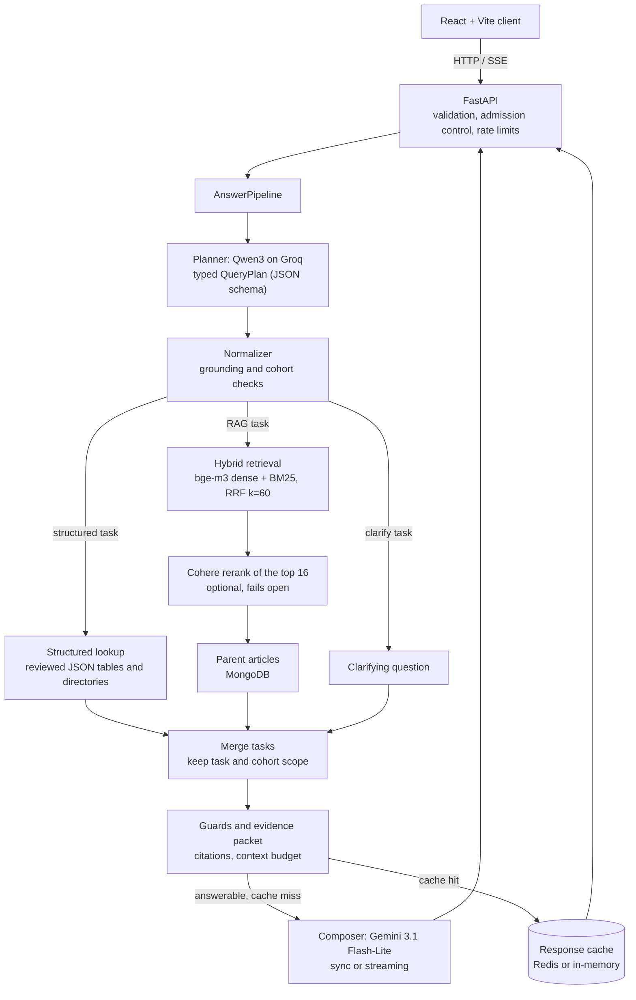
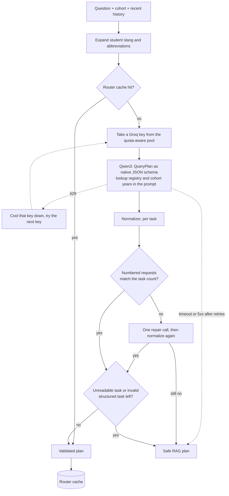
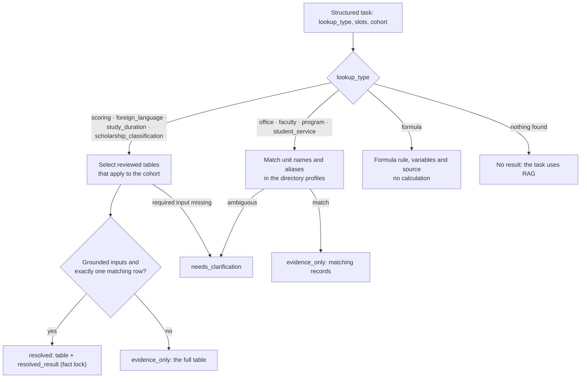
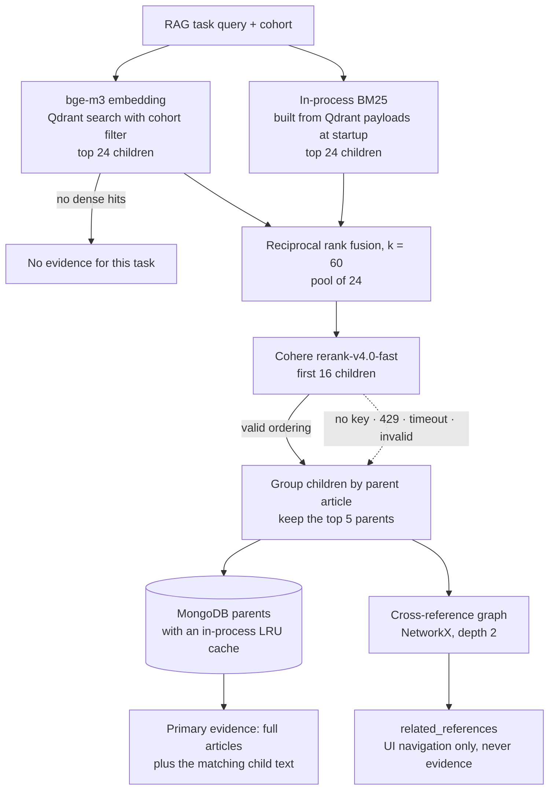
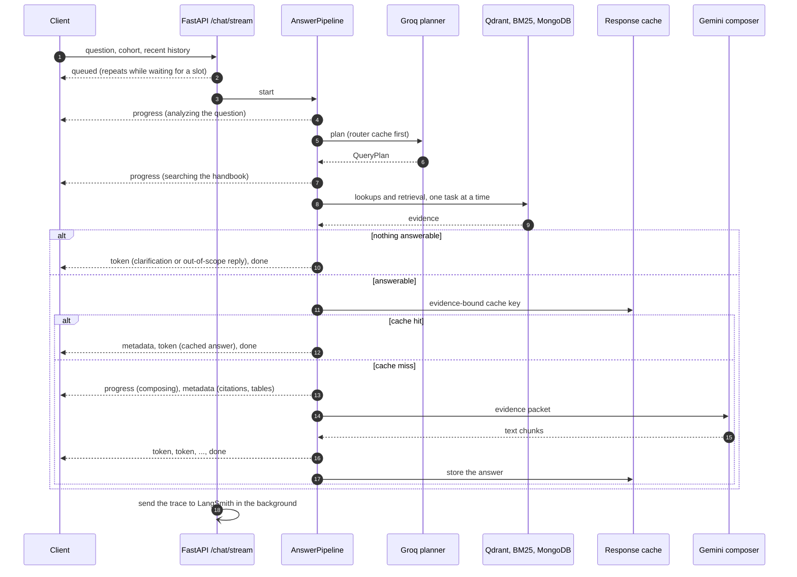
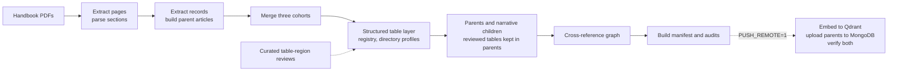

<div align="center">
  
  <h1>HCMUE AI — Student Handbook Assistant</h1>
  <p><strong>A cohort-aware RAG assistant for the student handbooks of Ho Chi Minh City University of Education (K48–K49, K50, K51).</strong></p>
  <p>LLM query planning · deterministic plan validation · structured table lookup · hybrid retrieval with citations · streaming React UI</p>
  <p>
    <a href="https://hcmuebot.id.vn"></a>
    <a href="https://anhfeee-hcmue-handbook-rag-api.hf.space/docs"></a>
  </p>
  <p>
    <a href="https://github.com/AnhPhiNe/student-handbook-rag-chatbot/actions/workflows/ci.yml"></a>
    
    
    
    
    
    <a href="./LICENSE"></a>
  </p>
</div>

<p align="center">
  
</p>

> [!IMPORTANT]
> HCMUE AI is an independent student project, not an official application of the university. Check the cited handbook article or the responsible office before making an important academic decision.

## Contents

1. [Overview](#overview)
2. [Highlights](#highlights)
3. [Architecture](#architecture): [request lifecycle](#request-lifecycle), [a query plan in practice](#a-query-plan-in-practice), [deep dives](#deep-dives)
4. [Design decisions](#design-decisions)
5. [Knowledge base](#knowledge-base)
6. [Evaluation](#evaluation)
7. [Getting started](#getting-started)
8. [API](#api)
9. [Frontend](#frontend)
10. [Operations and security](#operations-and-security)
11. [Project structure](#project-structure)
12. [Deployment](#deployment)
13. [Limitations and roadmap](#limitations-and-roadmap)
14. [Documentation](#documentation)
15. [License](#license)

## Overview

Each cohort at HCMUE receives its own student handbook: a long PDF of regulations, procedures, grading and scholarship tables, tuition rules and office directories. The rules differ between cohorts, the tables are hard to search, and students ask in informal Vietnamese, often without diacritics, and often several things at once.

HCMUE AI answers those questions from the three handbooks, K48–K49, K50 and K51, and cites the article it used. An LLM **plans** each question as typed tasks; deterministic code **checks** that plan and **executes** it. Exact values come from reviewed tables. Explanations come from retrieved handbook articles. A second LLM writes the final answer only from that evidence.

| Question type | Example (Vietnamese) | How it is answered |
|---|---|---|
| Table fact | *K51: IELTS 6.0 tương đương bậc mấy?* | Structured lookup in the foreign-language equivalency table; the exact value is passed to the writer as a fact lock |
| Directory | *Phòng Đào tạo ở đâu, email là gì?* | Office directory lookup by name or alias |
| Regulation or procedure | *Muốn bảo lưu kết quả học tập cần điều kiện gì?* | Hybrid retrieval over handbook articles, answered with citations |
| Several requests | *Học phí K51 thế nào và học bổng loại giỏi cần bao nhiêu điểm?* | One task per request, merged into a single answer |
| Missing information | *Điểm của em được xếp loại gì?* (no score given) | A clarifying question for the missing value |
| Out of scope | *Hôm nay trời mưa không?* | A statement that the handbook does not cover it |

The web app also includes a GPA calculator, credit and tuition tools, scholarship rules, downloadable forms and a student survival guide.

## Highlights

- **The LLM plans and the code verifies.** Qwen3 on Groq returns a JSON-schema `QueryPlan`: tasks, lookup type, slots, cohorts and clarification needs. A deterministic normalizer drops any slot value that does not appear in the question, checks lookup types and cohorts against the registry, and turns a task it cannot trust into a clarifying question or a RAG task. The plan is never trusted blindly.
- **Exact facts come from tables, not from generation.** Nine lookup capabilities run over reviewed JSON catalogs: grading scales, foreign-language equivalency, scholarship classification, study duration, formulas, and office, faculty, program and student-service directories. A unique match becomes a `resolved_result` that the writer is instructed to keep verbatim.
- **Hybrid retrieval.** `BAAI/bge-m3` dense search in Qdrant and in-process BM25 are fused with reciprocal rank fusion (k = 60). An optional Cohere `rerank-v4.0-fast` pass reorders the top 16 children. Children then expand to their full parent article from MongoDB. An offline cross-reference graph adds related-article links for the UI.
- **Cohort isolation end to end.** Every task runs per cohort, and retrieved sources and citations are filtered to the cohort that was asked for.
- **Graceful degradation.** Each provider has a quota-aware key pool with per-key RPM, TPM and daily limits that honors the provider's retry hints. Reranking fails open to the RRF order. A planner failure falls back to a safe RAG plan. Admission control allows 3 concurrent requests, a queue of 10 and a 15 s wait; each client is limited to 5 requests per minute.
- **Reproducible data.** One command rebuilds the corpus from the PDFs, and the rebuild is byte-for-byte deterministic. A build manifest of hashes, counts and target collections ties the Qdrant and MongoDB contents to one build ID.
- **Frozen evaluation harness.** Four suites run over a hand-authored, source-anchored dataset. Every run records the git commit, the dataset hash and the model and prompt versions it measured.

## Architecture


```mermaid
flowchart TD
    UI["React + Vite client"] -->|"HTTP / SSE"| API["FastAPI<br/>validation, admission control, rate limits"]
    API --> Pipeline["AnswerPipeline"]
    Pipeline --> Planner["Planner: Qwen3 on Groq<br/>typed QueryPlan (JSON schema)"]
    Planner --> Normalizer["Normalizer<br/>grounding and cohort checks"]
    Normalizer -->|structured task| Lookup["Structured lookup<br/>reviewed JSON tables and directories"]
    Normalizer -->|RAG task| Retrieve["Hybrid retrieval<br/>bge-m3 dense + BM25, RRF k=60"]
    Normalizer -->|clarify task| Clarify["Clarifying question"]
    Retrieve --> Rerank["Cohere rerank of the top 16<br/>optional, fails open"]
    Rerank --> Parents["Parent articles<br/>MongoDB"]
    Lookup --> Merge["Merge tasks<br/>keep task and cohort scope"]
    Parents --> Merge
    Clarify --> Merge
    Merge --> Packet["Guards and evidence packet<br/>citations, context budget"]
    Packet -->|answerable, cache miss| Composer["Composer: Gemini 3.1 Flash-Lite<br/>sync or streaming"]
    Packet -->|cache hit| Cache[("Response cache<br/>Redis or in-memory")]
    Composer --> API
    Cache --> API
```

### Request lifecycle

1. **Receive.** The API validates the question, the selected cohort and the recent conversation history, then admits the request.
2. **Plan.** Student slang and abbreviations are expanded, then the planner splits the question into typed tasks. The normalizer validates and canonicalizes that plan before anything runs.
3. **Execute.** Each task runs per cohort. Structured tasks read reviewed tables and directories. RAG tasks retrieve narrative chunks, rerank them and expand them to full articles. Clarify tasks carry the question to ask.
4. **Guard.** Task results are merged without mixing cohorts. If nothing can be answered, the request stops with an explicit status and no composer call.
5. **Compose.** The evidence packet goes through the response cache, then to Gemini. The model answers the covered tasks and asks for anything missing.
6. **Deliver.** The same prepared answer is returned as JSON (`/chat`) or streamed as server-sent events (`/chat/stream`), with citations, structured results and related-article links.

| Situation | Outcome |
|---|---|
| The whole request lacks a required value | `needs_clarification`, with no composer call |
| The question is outside the handbooks | `out_of_domain`, with no composer call |
| Only part of a compound question is answerable | The answered parts plus a question about the missing part |
| No key is available or the provider fails | An explicit error status; failures are never cached |
| The reranker is unavailable | The original RRF order is used and the request continues |

### A query plan in practice

For *"K51: IELTS 6.0 tương đương bậc mấy? Và muốn bảo lưu kết quả học tập cần điều kiện gì?"* (what CEFR level IELTS 6.0 maps to, and what is required to defer one's studies), the planner returns two tasks:

```json
{
  "context_mode": "standalone",
  "out_of_domain": false,
  "tasks": [
    {
      "id": "t1", "mode": "structured", "intent": "direct_value",
      "lookup_type": "foreign_language",
      "question": "IELTS 6.0 tương đương bậc mấy?",
      "slots":      {"certificate_or_language": "IELTS", "score_or_level": "6.0"},
      "slot_spans": {"certificate_or_language": "IELTS", "score_or_level": "6.0"},
      "cohorts": ["K51"], "clarification_question": null
    },
    {
      "id": "t2", "mode": "rag", "intent": "open_question", "lookup_type": null,
      "question": "Muốn bảo lưu kết quả học tập cần điều kiện gì?",
      "slots": {}, "slot_spans": {},
      "cohorts": ["K51"], "clarification_question": null
    }
  ]
}
```

`t1` reads the K51 foreign-language equivalency table and locks the result: IELTS 6.0 falls in the 5.5–6.5 band, which is level 4 (`matched_level: bac_4`). `t2` retrieves the K51 regulation on deferring studies. Both results go into one evidence packet and one answer. If the planner had written `"score_or_level": "7.0"`, a score the student never typed, the normalizer would drop it. The lookup would still return the IELTS row, but with no matched level, so the answer could not state a level for a score nobody asked about.

### Deep dives

<details>
<summary><strong>Query understanding: planner and normalizer</strong></summary>


```mermaid
flowchart TD
    Q["Question + cohort + recent history"] --> Slang["Expand student slang and abbreviations"]
    Slang --> Hit{"Router cache hit?"}
    Hit -->|yes| Done["Validated plan"]
    Hit -->|no| Key["Take a Groq key from the quota-aware pool"]
    Key --> LLM["Qwen3: QueryPlan as native JSON schema<br/>lookup registry and cohort years in the prompt"]
    LLM -.->|429| Next["Cool that key down, try the next key"]
    Next -.-> Key
    LLM -.->|timeout or 5xx after retries| Safe["Safe RAG plan"]
    LLM --> Norm["Normalizer, per task"]
    Norm --> Count{"Numbered requests<br/>match the task count?"}
    Count -->|no| Repair["One repair call, then normalize again"]
    Repair -->|still no| Safe
    Repair -->|yes| Fatal
    Count -->|yes| Fatal{"Unreadable task or invalid<br/>structured task left?"}
    Fatal -->|yes| Safe
    Fatal -->|no| Done
    Done --> Cache[("Router cache")]
```

What the normalizer does to each task:

| Check | Effect |
|---|---|
| A slot value does not appear in the question | The value is dropped |
| A required slot is still missing | The task becomes a clarifying question for that value |
| The lookup type is not in the registry | The task becomes a clarifying question |
| Any other structured-contract error | Only that task falls back to RAG; sibling tasks are kept |
| `out_of_domain` is set but the question uses handbook vocabulary | The flag is overridden and the question is answered from the handbook |

</details>

<details>
<summary><strong>Structured lookup</strong></summary>


```mermaid
flowchart TD
    T["Structured task: lookup_type, slots, cohort"] --> D{"lookup_type"}
    D -->|"scoring · foreign_language ·<br/>study_duration · scholarship_classification"| Tables["Select reviewed tables<br/>that apply to the cohort"]
    D -->|"office · faculty · program · student_service"| Dir["Match unit names and aliases<br/>in the directory profiles"]
    D -->|formula| F["Formula rule, variables and source<br/>no calculation"]
    Tables --> One{"Grounded inputs and<br/>exactly one matching row?"}
    One -->|yes| Resolved["resolved: table + resolved_result (fact lock)"]
    One -->|no| Evidence["evidence_only: the full table"]
    Tables -->|required input missing| Clarify["needs_clarification"]
    Dir -->|match| Records["evidence_only: matching records"]
    Dir -->|ambiguous| Clarify
    D -->|nothing found| Fallback["No result: the task uses RAG"]
```

`resolved_result` exists only when the inputs are grounded and exactly one row applies. The full table is always kept beside it, so the writer can explain the value in context.

</details>

<details>
<summary><strong>Retrieval</strong></summary>


```mermaid
flowchart TD
    Q["RAG task query + cohort"] --> Dense["bge-m3 embedding<br/>Qdrant search with cohort filter<br/>top 24 children"]
    Q --> Lex["In-process BM25<br/>built from Qdrant payloads at startup<br/>top 24 children"]
    Dense -->|no dense hits| None["No evidence for this task"]
    Dense --> RRF["Reciprocal rank fusion, k = 60<br/>pool of 24"]
    Lex --> RRF
    RRF --> Rerank["Cohere rerank-v4.0-fast<br/>first 16 children"]
    Rerank -->|valid ordering| Group["Group children by parent article<br/>keep the top 5 parents"]
    Rerank -.->|"no key · 429 · timeout · invalid"| Group
    Group --> Mongo[("MongoDB parents<br/>with an in-process LRU cache")]
    Mongo --> Evidence["Primary evidence: full articles<br/>plus the matching child text"]
    Group --> Graph["Cross-reference graph<br/>NetworkX, depth 2"]
    Graph --> Related["related_references<br/>UI navigation only, never evidence"]
```

Children are small, so matching stays precise; the writer always receives the full parent article, so the context stays complete. The `no_graph` and `vector_only` modes switch off the graph and BM25 for ablations.

</details>

<details>
<summary><strong>One streaming request, end to end</strong></summary>


```mermaid
sequenceDiagram
    autonumber
    participant C as Client
    participant A as FastAPI /chat/stream
    participant P as AnswerPipeline
    participant G as Groq planner
    participant S as Qdrant, BM25, MongoDB
    participant R as Response cache
    participant M as Gemini composer
    C->>A: question, cohort, recent history
    A-->>C: queued (repeats while waiting for a slot)
    A->>P: start
    P-->>C: progress (analyzing the question)
    P->>G: plan (router cache first)
    G-->>P: QueryPlan
    P-->>C: progress (searching the handbook)
    P->>S: lookups and retrieval, one task at a time
    S-->>P: evidence
    alt nothing answerable
        P-->>C: token (clarification or out-of-scope reply), done
    else answerable
        P->>R: evidence-bound cache key
        alt cache hit
            P-->>C: metadata, token (cached answer), done
        else cache miss
            P-->>C: progress (composing), metadata (citations, tables)
            P->>M: evidence packet
            M-->>P: text chunks
            P-->>C: token, token, ..., done
            P->>R: store the answer
        end
    end
    A-)A: send the trace to LangSmith in the background
```

`/chat` runs the same preparation and returns the finished answer as one JSON response.

</details>

## Design decisions

| Decision | Alternative | Why |
|---|---|---|
| The planner emits a typed plan; code validates and executes it | A free-form tool-calling agent | Every step can be inspected and unit-tested, and invented values never reach a lookup |
| Exact values come from reviewed tables and are locked into the prompt | Letting the writer read tables from retrieved text | PDF tables flatten badly, and grades or equivalencies must be exact |
| Small children are embedded; answers use full parent articles | Embedding whole articles | Precise matching plus complete context for the writer |
| Dense and BM25 are fused with RRF | Dense search only | Exact terms such as certificate names, cohort codes and article numbers need lexical matching |
| The reranker is optional and fails open | A mandatory reranker | A provider limit should cost ranking quality, not the answer |
| Separate models for planning and writing | One large model for both | Each role has a narrow contract; a small fast planner keeps latency and cost down |
| A frozen, source-anchored benchmark with run snapshots | Ad-hoc spot checks | Every change is compared on identical cases against a recorded runtime |

## Knowledge base

| Artifact | v33 snapshot | Used for |
|---|---:|---|
| Full parent articles | 462 | Composer context and citations (MongoDB) |
| Narrative child chunks | 3,121 | Dense and BM25 search (Qdrant) |
| Reviewed structured tables | 35 | Deterministic lookup (not embedded) |
| Cross-reference edges | 78 | Related-article navigation in the UI |
| Embedding | `BAAI/bge-m3`, 1,024 dimensions | Dense child retrieval |

Per cohort: K48–K49 has 123 parents and 877 children, K50 has 166 and 1,082, and K51 has 173 and 1,162. Counts, hashes and the target collections are recorded in [`build_manifest.json`](data/processed/metadata/build_manifest.json).

### Offline build


```mermaid
flowchart LR
    PDF["Handbook PDFs"] --> Parse["Extract pages<br/>parse sections"]
    Parse --> Records["Extract records<br/>build parent articles"]
    Records --> Merge["Merge three cohorts"]
    Merge --> Tables["Structured table layer<br/>registry, directory profiles"]
    Reviews["Curated table-region reviews"] -.-> Tables
    Tables --> Split["Parents and narrative children<br/>reviewed tables kept in parents"]
    Split --> Graph["Cross-reference graph"]
    Graph --> Manifest["Build manifest and audits"]
    Manifest -.->|PUSH_REMOTE=1| Upload["Embed to Qdrant<br/>upload parents to MongoDB<br/>verify both"]
```

Tables live in two places. Parent articles keep them as readable Markdown for the writer, and the structured registry keeps them as JSON for lookup. Narrative children exclude reviewed table regions so that table rows do not crowd out prose in search.

Rebuild locally without touching the remote stores:

```bash
PUSH_REMOTE=0 python -m scripts.build_multi_cohort \
  --qdrant-collection student_handbook_semantic_v33 --mongo-collection parent_docs_v33
```

The command overwrites `data/processed/`, so run it in a clean worktree. With `PUSH_REMOTE=1` it also preflights the target collections, embeds and uploads, then verifies the remote contents against the manifest. See the [parent/child build contract](docs/PARENT_CHILD_BUILD_CONTRACT.md).

## Evaluation

Two hand-authored datasets, both with every expected answer anchored to a handbook
source. `official_v1` is the development set the planner prompts were tuned on
([notes](data/eval/official_v1/README.md)). `official_v2` was frozen before its initial
held-out evaluation. Its observed scoring failure subsequently informed the
`matched_rows` fix, so later measurements are post-fix evaluations on a seen test set,
not a new independent holdout. It adds follow-up questions, several requests in one
message, several entities and cohort comparisons
([dataset notes](data/eval/official_v2/README.md),
[initial results](data/eval/official_v2/RESULTS.md)).

| Suite | v1 / v2 cases | What it measures |
|---|---:|---|
| Deterministic | 135 / 154 | Planning and structured execution against accepted outcomes: task split, lookup choice, cohort, grounded slots and the exact table value |
| Retrieval | 155 / 93 | Ranking of the retrieved evidence: Hit@k, MRR, nDCG@5 and required-source recall |
| Generate + judge | 150 / 154 | End-to-end answers scored by a pinned LLM judge (`openai/gpt-oss-120b`): correctness, faithfulness, citation correctness, context recall and precision, hallucination rate |
| Production | 60 / — | Requests against the deployed API: success rate, 429s, cache behavior, streaming time to first token and p95 latency, with pass/fail release gates |

### Results

The first three rows are `official_v2`'s single hold-out run on 2026-09-12 (commit
`d09e970`, pipeline `v76`, planner Qwen3 `v43` on Groq, normalizer `v28`, composer Gemini
3.1 Flash-Lite, judge `openai/gpt-oss-120b`); that run is the only hold-out measurement
this bundle will ever produce, since its failures then informed a fix. The production row
is `official_v1`'s 60 requests against the live Space on the same day at commit
`6eba6d4a`. Intervals are 95%: Wilson for pass rates, bootstrap for judge scores.

| Suite | Headline metric | Result |
|---|---|---|
| Deterministic | Cases passing every applicable assertion | **92.2%** (142/154), CI 86.9–95.5 |
| Retrieval | Hit@5 / MRR / nDCG@5 | **94.6%** / 84.8 / 85.3, Hit@5 CI 88.0–97.7 |
| Generate + judge | Answer correctness / faithfulness | **96.3** / 96.0, correctness CI 93.4–98.6 |
| Production | Release gates | **7 of 12 pass** on the live Space; transport 100%, payload 96.7% ([analysis](data/eval/official_v1/PRODUCTION_RESULTS.md)) |

Per capability, deterministic pass rate and judged answer correctness:

| Capability | Cases | Deterministic | Answer correctness |
|---|---:|---:|---:|
| Single lookup or single regulation question | 68 | 94.1 | 96.8 |
| Follow-up questions with history | 25 | 92.0 | 94.2 |
| Missing input, partial clarification, out of domain | 13 | 92.3 | 99.2 |
| Two or three requests in one message | 27 | 88.9 | 94.8 |
| Several entities in one question | 12 | 100.0 | 95.0 |
| Cohort comparison | 9 | 77.8 | 100.0 |

Reweighted to the expected real-question mix ([`slice_weights.yaml`](data/eval/official_v2/slice_weights.yaml)):
93.1 deterministic, 96.5 answer correctness. Cohorts are within 4 points of each other
(K48-K49 90.2, K50 94.1, K51 92.3), and the 32 stress cases score 90.6 deterministic and
100 on answer correctness.

Development set `official_v1`, same runtime: 129/135 deterministic, unchanged from the run
before the planner and pipeline refactors, with the same six failing cases.

Reading the failures afterwards exposed one real defect. Where several grade scales apply
at once — K51 grades foundation and remaining courses differently — the resolver returned
every table and the composer picked the interval itself, calling a failing 5,2 a pass.
Commit `536169fc` resolves the row inside each applicable table instead. `official_v1`
re-run on the fixed runtime scores 129/135 with the same six failures, so the change
causes no regression. `official_v2` re-run scores 141/154, but **that is no longer a
held-out number**, because the fix came from a v2 failure; the 92.2% above stands as the
holdout result. The one-case difference is planner nondeterminism rather than the fix:
case 024 now passes while 105 and 115 fail on task shape, and the new code path runs in
exactly one of the 154 cases. That case still fails the deterministic contract by design —
the gold names a single expected source, while the system now reports all three applicable
scales with a resolved row each rather than guessing which one the student meant.

The production suite ran once against the deployed Space on 2026-09-12 and its release
gates failed, 7 of 12 checks passing. That result is kept as it came out rather than
tuned into a pass, because four of the five failures say more about the gates and the
run than about the service. All three strict p95 latency gates were calibrated against a
**local** backend - the earlier smoke run recorded a 2,940 ms deterministic p95 on
localhost, just under its 3,000 ms limit - while the deployed target is a free-tier
Space whose deterministic p50 alone is 5,147 ms across two LLM round trips and a network
hop. `telemetry_coverage` asks for a field the API emits only under an evaluation flag
that production correctly leaves off. Of the two payload failures, one is a provider
rate limit reached because evaluation and production share a key pool by choice, and one
is an unexplained streaming `RuntimeError` that needs Space logs to diagnose. What the
suite does establish: 100% transport success, zero HTTP 429s from the service itself, a
valid cache protocol with a 90% warm-cache hit rate and no cold-cache leakage, and full
streaming time-to-first-token coverage. Details and the per-scenario latency table are
in [PRODUCTION_RESULTS.md](data/eval/official_v1/PRODUCTION_RESULTS.md).

Honest limits: one author wrote both datasets and no second reviewer checked them; the
judge is an LLM whose agreement with a human has not been measured; the twelve
deterministic failures are concentrated in cohort comparison (2 of 5 structured cases),
two-lookup questions (2 of 8) and a few single lookups; context precision is 60.8, so the
composer receives more context than it needs.

Two limits are worth stating with the measurement behind them rather than as a failure
count. The questions were written from handbook content in student phrasing, not collected
from real students, so the mix of topics is the author's estimate: several administrative
lookups in the set are questions a student may never ask. And directory lookup was probed
separately over all 239 service records: every one resolves to the right unit when the
question stays close to the catalog wording, and 220 of 239 survive a mechanical
shortening of the query. Of the 9 that do not, all land on one unit whose name matches the
common word `đào tạo`, and the only genuine pattern among them concerns postgraduate
services this undergraduate handbook does not cover. Running with two runs of the
deterministic suite also separates stable failures from planner nondeterminism: 11 of the
cases fail in both runs, while 3 differ between them.

### Running the suites

```bash
python -m scripts.run_official_deterministic --bundle official_v2 --current-worktree
python -m scripts.run_official_answers --bundle official_v2 --suite retrieval
python -m scripts.run_official_answers --bundle official_v2 --suite answers
python -m scripts.run_official_answers --bundle official_v1 --suite production --base-url https://<your-space>.hf.space
python -m scripts.report_official_slices <run>/deterministic.json --bundle official_v2
```

Each run writes its report and a `run_snapshot.json` under `data/eval/reports/`. `--limit N` runs a smoke subset, and `--output DIR` resumes an interrupted run. `--retrieval-mode no_graph` or `--retrieval-mode vector_only` runs a retrieval ablation. [`regrade_official_deterministic.py`](scripts/regrade_official_deterministic.py) rescores a saved run without any model calls. The suites disable the router and response caches, and they call paid providers.

## Getting started

### Prerequisites

- Python 3.11 and Node.js 20
- A Qdrant collection and a MongoDB database loaded from the v33 build (see [Offline build](#offline-build))
- API keys for Groq (planner) and Gemini (composer). Cohere (reranker), Redis (shared cache) and LangSmith (tracing) are optional.

### Backend

```bash
python3.11 -m venv .venv
source .venv/bin/activate          # Windows: .\.venv\Scripts\Activate.ps1
python -m pip install -r requirements-dev.txt
cp .env.example .env               # then fill in the values below
python -m uvicorn src.api.main:app --reload
```

Interactive API docs are then served at `http://127.0.0.1:8000/docs`.

| Variable | Required | Purpose |
|---|:---:|---|
| `QDRANT_URL`, `QDRANT_API_KEY`, `QDRANT_COLLECTION_NAME` | yes | Vector store for narrative children |
| `MONGODB_URL`, `MONGODB_DB_NAME`, `MONGODB_PARENT_COLLECTION` | yes | Parent articles |
| `GROQ_API_KEYS` | yes | Planner key pool (comma-separated); `GROQ_ROUTER_API_KEYS` can give the planner its own keys |
| `GEMINI_API_KEYS` | yes | Composer key pool (comma-separated) |
| `COHERE_API_KEYS` | no | Reranker key pool; without it retrieval uses the RRF order |
| `REDIS_URL` | no | Shared response cache; without it an in-memory cache is used |
| `LANGSMITH_TRACING`, `LANGSMITH_API_KEY`, `LANGSMITH_PROJECT` | no | Request tracing and user feedback |
| `STUDENT_RAG_CORS_ORIGINS` | no | Comma-separated browser origins allowed to call the API (needed when the frontend is on another domain) |
| `STUDENT_RAG_ADMIN_API_KEY` | no | Enables `/health/artifacts` through the `X-Admin-API-Key` header |
| `STUDENT_RAG_RATE_LIMIT_PER_MINUTE`, `STUDENT_RAG_MAX_CONCURRENT_CHAT`, ... | no | Admission and rate-limit overrides |

[`.env.example`](.env.example) lists every setting with its default. Keep `.env` out of version control.

### Frontend

```bash
cd frontend
npm ci
npm run dev        # set VITE_API_BASE_URL to your backend
```

### Docker

```bash
docker build -t hcmue-rag .
docker run -p 7860:7860 --env-file .env hcmue-rag
```

The image runs one Uvicorn worker on port 7860, the same setup as the Hugging Face Space.

### Tests and checks

```bash
python -m pytest tests                   # unit and contract tests (no network)
python -m ruff check src tests --select E,F --ignore E402,E501
python scripts/check_deploy_artifacts.py # required runtime files and build manifest
```

The test suite covers the API contracts, planner prompt and normalizer, every structured lookup, retrieval fusion and reranking, the key pools, the response cache, the build scripts and the evaluators. No test needs network access or API keys. CI runs these checks, plus the frontend lint and build, on every push and pull request to `main`.

Behavior-preserving refactors are also checked with an equivalence test: a byte-for-byte rebuild of `data/processed/` for build code, an offline regrade of saved evaluation runs for evaluators, or a fake-provider comparison for provider clients.

## API

| Method | Path | Description |
|---|---|---|
| `POST` | `/chat` | Answer a question and return JSON |
| `POST` | `/chat/stream` | The same answer as server-sent events: `queued`, `progress`, `metadata`, `token`, `done`, `error` |
| `POST` | `/chat/feedback` | Thumbs up or down on an answer (`run_id`, `score`, optional `comment`) |
| `GET` | `/health` | Liveness |
| `GET` | `/health/readiness` | Qdrant, MongoDB, BM25 and artifact readiness |
| `GET` | `/health/artifacts` | Required files and configuration (admin key required) |
| `GET` | `/api/metrics/visits` | Visitor counter backed by Redis |

```bash
curl -X POST http://127.0.0.1:8000/chat \
  -H "Content-Type: application/json" \
  -d '{"query": "IELTS 6.0 tương đương bậc mấy?", "cohort": "K51"}'
```

The response carries `answer`, `status` (`answered`, `needs_clarification`, `out_of_domain`, `low_confidence`, ...), `citations`, `structured_results` and `related_references`.

## Frontend

The React 19 + TypeScript client ([`frontend/`](frontend)) is a mobile-first single-page app:

- **Chat.** A cohort picker, answers streamed token by token over SSE, citations that open the source article, structured results rendered as tables, related-article links, and thumbs-up or thumbs-down feedback.
- **Status.** A badge reads `/health/readiness`, so users can see when the backend is degraded.
- **Tools.** A GPA calculator, a target-GPA planner, credit and tuition helpers, scholarship rules, downloadable forms and a student survival guide. These run in the browser and need no API calls.

Conversation history lives in the browser's `sessionStorage` and is sent with each request; the server does not store chats.

## Operations and security

| Concern | Implementation |
|---|---|
| Admission control | At most 3 chats at a time, a queue of 10 and a 15 s wait; beyond that, HTTP 503 for `/chat` or a `server_busy` event for `/chat/stream` |
| Rate limits | 5 requests per minute per client and 120 per minute per IP, answered with HTTP 429 and `Retry-After`; questions longer than 1,000 characters are rejected |
| Provider quotas | One `KeyPool` per provider rotates keys under per-key request, token and daily limits and cools a key down after a 429 |
| Caching | A router cache for plans, and an answer cache keyed by the question, cohort, selected evidence and prompt versions (Redis, 24 h TTL, or an in-memory fallback) |
| Observability | One LangSmith trace per request, with child runs and token usage for the planner and the composer; feedback is attached to the same run |
| Health | `/health` for liveness, `/health/readiness` for Qdrant, MongoDB, BM25 and artifacts, and an admin-only `/health/artifacts` |
| Secrets | Keys are read from environment variables only; key-pool state and logs store a SHA-256 fingerprint, never the key itself |
| Privacy | The server keeps no chat log. With LangSmith tracing on, questions and answers are sent to LangSmith |

## Project structure

```text
├── configs/                  # Planner, retrieval, composer and lookup-registry settings
├── data/
│   ├── raw/                  # Source handbook PDFs
│   ├── curated/              # Reviewed table regions and corrections
│   ├── processed/            # Versioned build output: parents, children, tables, graph, manifest
│   └── eval/official_v1/     # Frozen benchmark, results notes and provenance
├── src/
│   ├── api/                  # FastAPI routes, schemas, admission control, health checks, tracing
│   ├── services/             # Shared AnswerPipeline lifecycle
│   ├── generation/           # Pipeline orchestration, evidence packet, prompts, Gemini client
│   ├── retrieval/core/       # Planner, normalizer, structured lookups, hybrid retrieval, reranker
│   ├── retrieval/vectorstore/# MongoDB parent store
│   ├── common/               # Cohorts, text folding, key pool, I/O and config helpers
│   ├── ingestion/            # PDF loading and cross-reference graph
│   ├── preprocessing/        # Handbook structure parsing
│   ├── extraction/           # Structured-record extraction
│   ├── chunking/             # Parent article construction
│   └── evaluation/           # Suites: deterministic, retrieval, answers, production
├── scripts/                  # Build, publish, evaluation and deploy entry points
├── frontend/                 # React 19 + TypeScript + Vite client
├── tests/                    # Unit, contract and regression tests
└── docs/                     # Build and execution contracts, experiment write-ups
```

A suggested reading order for the backend: [`schemas.py`](src/api/schemas.py), then [`answer_pipeline.py`](src/generation/answer_pipeline.py), [`ai_router.py`](src/retrieval/core/ai_router.py), [`query_plan.py`](src/retrieval/core/query_plan.py), [`structured_dispatcher.py`](src/retrieval/core/structured_dispatcher.py) and [`hybrid_pipeline.py`](src/retrieval/core/hybrid_pipeline.py), and finally [`prompt_builder.py`](src/generation/prompt_builder.py). Read the matching tests alongside each file.

| Configuration | Controls |
|---|---|
| [`ai_router.yaml`](configs/ai_router.yaml) | Planner model, output budget and key-pool limits |
| [`answer_generation.yaml`](configs/answer_generation.yaml) | Composer model, response cache and key-pool limits |
| [`retrieval.yaml`](configs/retrieval.yaml) | Embedding model, top-k and reranker settings |
| [`structured_lookup_registry.yaml`](configs/structured_lookup_registry.yaml) | Lookup capabilities, slots and aliases shown to the planner |
| [`hcmue_slang_dictionary.yaml`](configs/hcmue_slang_dictionary.yaml) | Student slang and abbreviation normalization |

## Deployment

| Part | Hosting | Notes |
|---|---|---|
| Frontend | Vercel ([hcmuebot.id.vn](https://hcmuebot.id.vn)) | Static React build; `/api/visits` is proxied to the backend |
| Backend | Hugging Face Spaces (Docker) | One worker; runtime files come from an explicit allowlist |
| Vector store | Qdrant | Collection `student_handbook_semantic_v33` |
| Documents | MongoDB | Collection `parent_docs_v33` |

[`deploy_hf_backend.ps1`](scripts/deploy_hf_backend.ps1) packages only the allowlisted runtime files and checks that the build manifest targets the intended collections. `-DryRun` validates the package without touching the Space. After a deploy, check `/health/readiness`, then run the production suite against the Space.

## Limitations and roadmap

- **Scope.** The system covers the three handbooks only. It does not calculate new values from a formula, perform OCR on image-only tables, or answer from outside knowledge.
- **Judge-based scores.** Answer quality is scored by an LLM judge; the judge has not yet been validated against human labels.
- **Load.** Throughput is bounded by free-tier provider quotas and a single worker.
- **Next.** A closed beta with students; a fresh generalization question set; human validation of the judge; ablations and baselines under a pre-registered protocol.

## Documentation

| Document | Content |
|---|---|
| [Parent/child build contract](docs/PARENT_CHILD_BUILD_CONTRACT.md) | How parents, children and reviewed tables are built and validated |
| [Structured execution contract](docs/STRUCTURED_EXECUTION_CONTRACT.md) | Lookup capabilities, fact locks and evidence rules |
| [Technical debt](docs/TECHNICAL_DEBT.md) | Known maintenance boundaries |
| [Onboarding guide](docs/UA_ONBOARDING.md) | A guided tour of the code base |
| [Cohere rerank experiment](docs/COHERE_FAST_RERANK_EXPERIMENT.md) | Why the reranker was added |

## License

The source code is released under the [MIT License](LICENSE). The handbook content and university regulations belong to their respective publishers.
