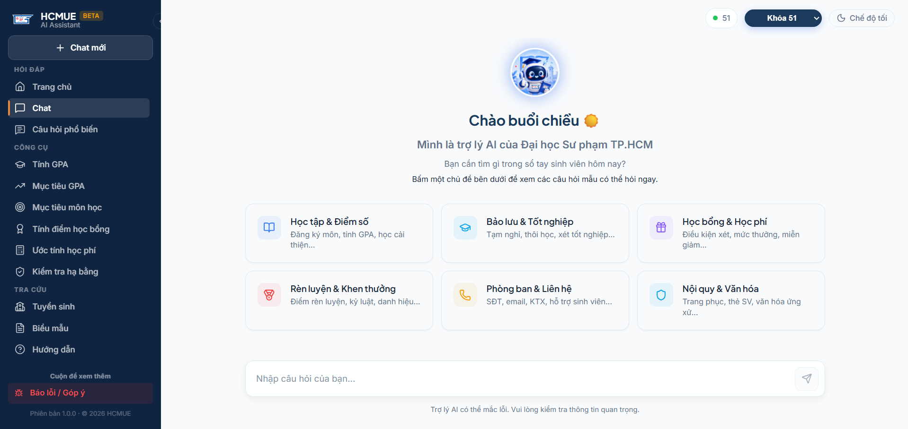
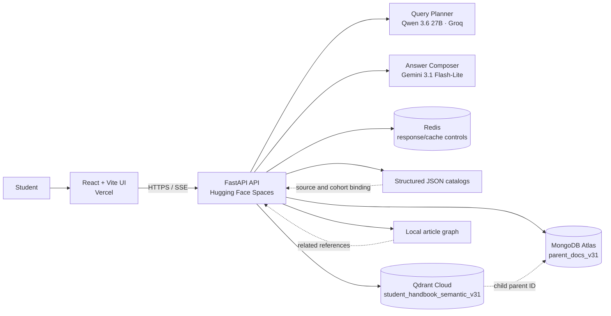
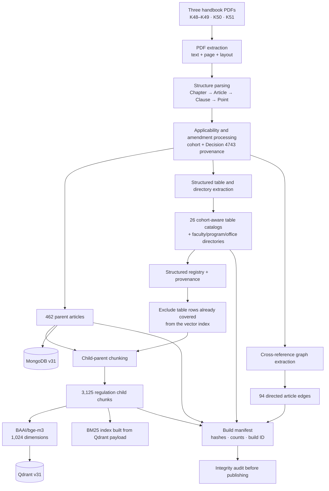
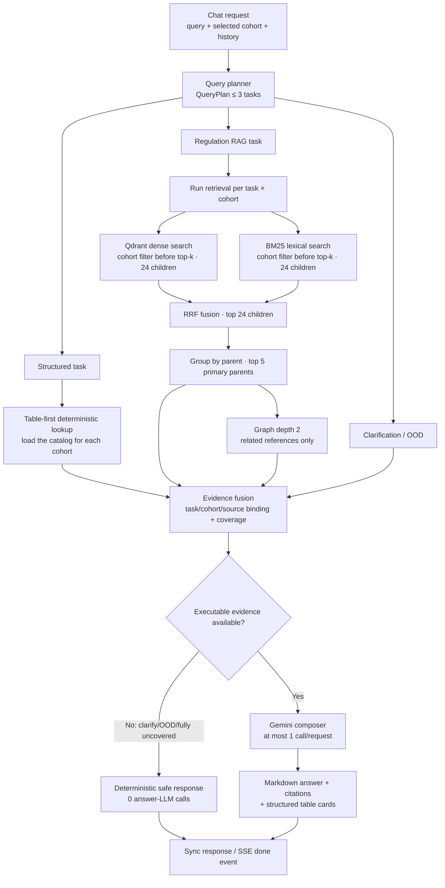

# HCMUE AI — Student Handbook RAG Assistant

<p align="center">
  <strong>A cohort-aware assistant for the HCMUE student handbooks: K48–K49, K50, and K51.</strong><br>
  Multi-request query planning, structured lookup, hybrid RAG, citations, and a React interface in one production-oriented project.
</p>

<p align="center">
  
  
  
  
  
</p>

<p align="center">
  <a href="https://www.hcmuebot.id.vn"><strong>Live demo</strong></a>
  ·
  <a href="https://huggingface.co/spaces/AnhFeee/hcmue-handbook-rag-api"><strong>Backend Space</strong></a>
  ·
  <a href="#evaluation-results"><strong>Evaluation</strong></a>
</p>



> HCMUE AI is an independent, non-commercial student project. It is not an official application of Ho Chi Minh City University of Education. Users should verify cited sources or contact the responsible university office before making important academic decisions.

## Overview

The system answers questions from three HCMUE student-handbook groups: **K48–K49, K50, and K51**. It separates structured data from regulation text because tables and policy articles require different retrieval strategies:

- **Structured lookup:** grade scales, scholarships, study duration, foreign-language equivalency, program–faculty mappings, offices, and formulas are stored as cohort-aware JSON. The backend selects the correct catalog and cohort, then provides the applicable table to the composer. Rows already covered by a catalog are not embedded again.
- **Regulation RAG:** policy conditions, procedures, exceptions, consequences, and cross-references use dense search plus BM25, fused with Reciprocal Rank Fusion (RRF), and linked to full parent articles in MongoDB.
- **Multi-request QueryPlan:** the planner creates at most three logical tasks in `structured`, `rag`, or `clarify` mode. Multiple cohorts are executed within the same logical task instead of multiplying tasks.
- **Grounded answers:** evidence is bound to task, cohort, and source. Each request uses at most one answer-LLM call. Missing evidence triggers a scoped abstention or clarification without discarding answerable parts.
- **Student-facing UI:** structured tables render as dedicated cards, regulation citations open their source, streaming is supported, and the interface is responsive on desktop and mobile.

## System Architecture


```mermaid
flowchart LR
    Student["Student"] --> UI["React + Vite UI<br/>Vercel"]
    UI -->|"HTTPS / SSE"| API["FastAPI API<br/>Hugging Face Spaces"]

    API --> Planner["Query Planner<br/>Qwen 3.6 27B · Groq"]
    API --> Composer["Answer Composer<br/>Gemini 3.1 Flash-Lite"]
    API --> Cache[("Redis<br/>response/cache controls")]

    API --> Structured["Structured JSON catalogs"]
    API --> Qdrant[("Qdrant Cloud<br/>student_handbook_semantic_v31")]
    API --> Mongo[("MongoDB Atlas<br/>parent_docs_v31")]
    API --> Graph["Local article graph"]

    Qdrant -. child parent ID .-> Mongo
    Structured -. source and cohort binding .-> API
    Graph -. related references .-> API
```

The production data stores share build ID `build-2254b92ccb60f7984bfa`. Readiness checks compare environment collection names against the packaged build manifest, preventing Qdrant and MongoDB from silently using artifacts from different builds.

## Data Processing Pipeline


```mermaid
flowchart TD
    PDFs["Three handbook PDFs<br/>K48–K49 · K50 · K51"] --> Extract["PDF extraction<br/>text + page + layout"]
    Extract --> Parse["Structure parsing<br/>Chapter → Article → Clause → Point"]
    Parse --> Policy["Applicability and amendment processing<br/>cohort + Decision 4743 provenance"]

    Policy --> Parents["462 parent articles"]
    Policy --> TableExtract["Structured table and directory extraction"]
    Policy --> GraphExtract["Cross-reference graph extraction"]

    TableExtract --> Catalogs["26 cohort-aware table catalogs<br/>+ faculty/program/office directories"]
    Catalogs --> Registry["Structured registry + provenance"]

    Parents --> Chunking["Child-parent chunking"]
    Registry --> Exclude["Exclude table rows already covered<br/>from the vector index"]
    Exclude --> Chunking
    Chunking --> Children["3,125 regulation child chunks"]
    Children --> Embedding["BAAI/bge-m3<br/>1,024 dimensions"]

    Parents --> Mongo[("MongoDB v31")]
    Embedding --> Qdrant[("Qdrant v31")]
    Children --> BM25["BM25 index built from Qdrant payload"]
    GraphExtract --> Graph["94 directed article edges"]

    Parents --> Manifest["Build manifest<br/>hashes · counts · build ID"]
    Catalogs --> Manifest
    Children --> Manifest
    Graph --> Manifest
    Manifest --> Audit["Integrity audit before publishing"]
```

### Current Data Snapshot

| Artifact | Count | Purpose |
|---|---:|---|
| Parent articles | 462 | Full context for answers and citations |
| Child chunks | 3,125 | Fine-grained dense and BM25 retrieval |
| Structured table catalogs | 26 | Deterministic cohort-aware table lookup |
| Article graph edges | 94 | Related references; never a substitute for primary evidence |
| Embedding | BAAI/bge-m3, 1,024 dimensions | Semantic dense retrieval |

Structured tables remain available in JSON and in MongoDB parent documents. Excluding registry-covered rows only removes duplicated, flattened table content from Qdrant; it does not remove tables from the system.

## Runtime Query Pipeline


```mermaid
flowchart TD
    Request["Chat request<br/>query + selected cohort + history"] --> Plan["Query planner<br/>QueryPlan ≤ 3 tasks"]
    Plan --> S["Structured task"]
    Plan --> R["Regulation RAG task"]
    Plan --> C["Clarification / OOD"]

    S --> Lookup["Table-first deterministic lookup<br/>load the catalog for each cohort"]

    R --> PerCohort["Run retrieval per task × cohort"]
    PerCohort --> Dense["Qdrant dense search<br/>cohort filter before top-k · 24 children"]
    PerCohort --> Sparse["BM25 lexical search<br/>cohort filter before top-k · 24 children"]
    Dense --> RRF["RRF fusion · top 24 children"]
    Sparse --> RRF
    RRF --> Group["Group by parent · top 5 primary parents"]
    Group --> Expand["Graph depth 2<br/>related references only"]

    Lookup --> Packet["Evidence fusion<br/>task/cohort/source binding + coverage"]
    Group --> Packet
    Expand --> Packet
    C --> Packet

    Packet --> Terminal{"Executable evidence available?"}
    Terminal -->|"No: clarify/OOD/fully uncovered"| Deterministic["Deterministic safe response<br/>0 answer-LLM calls"]
    Terminal -->|"Yes"| Answer["Gemini composer<br/>at most 1 call/request"]
    Answer --> Render["Markdown answer + citations<br/>+ structured table cards"]
    Deterministic --> Response["Sync response / SSE done event"]
    Render --> Response
```

### QueryPlan Contract

Each task contains its own question, mode, lookup type, cohorts, and clarification data when needed. The core constraints are:

- One to three tasks; no recursive planning and no agent tool loop.
- Multiple cohorts do not increase the logical task count.
- A structured task selects a catalog. The backend exposes the applicable table rather than applying brittle keyword-driven row filtering too early.
- Compound regulation questions are retrieved independently per task.
- Planner timeout or invalid JSON falls back to one regulation-RAG task using the original query; debug telemetry records the fallback.

## Retrieval and Grounding

Production retrieval is recall-oriented while keeping cohort and applicability constraints explicit:

1. Qdrant and BM25 filter by cohort **before** top-k selection.
2. Each branch returns at most 24 child candidates.
3. RRF fuses both branches and retains 24 child candidates.
4. Child chunks are grouped into at most five primary parents.
5. Graph traversal at depth two adds related references; graph results do not become primary citations by themselves.
6. The composer receives only task/cohort-bound evidence and cannot retrieve new evidence.

PhoRanker remains available for controlled evaluation modes but is **disabled in production**. Production ranking uses RRF.

## Main API Endpoints

| Method | Endpoint | Purpose |
|---|---|---|
| `GET` | `/health` | Liveness and container health check |
| `GET` | `/health/readiness` | Artifact, environment, and build/collection identity checks |
| `GET` | `/health/artifacts` | Admin-only artifact details |
| `POST` | `/chat` | Synchronous answer generation |
| `POST` | `/chat/stream` | SSE streaming through the shared preparation core |
| `POST` | `/chat/feedback` | Product feedback without intentionally collecting sensitive personal data |

Debug fields such as QueryPlan, task results, and evidence telemetry only appear when `include_debug=true`. The normal production response remains compact and stable.

## Evaluation Results

These results belong to the current release checkpoint. Raw LLM-judge scores are not treated as acceptance gates.

| Evaluation | Result | Interpretation |
|---|---:|---|
| Deterministic architecture | **143/144 (99.31%)** | Planner/schema/structured execution; one structural limitation does not remove final evidence |
| End-to-end RAG Hit@5 | **175/180 (97.22%)** | The expected source appears among the top five parent documents |
| Product acceptance | **50/50 human pass** | 50 realistic student questions; 0 critical, 0 major, 4 minor limitations |
| Automatic product shape checks | **47/50** | Runtime/output invariants; not a replacement for human review |
| Python tests | **326 passed** | Unit, integration, and regression tests |
| Ruff | **Passed** | Python static lint |
| Frontend lint/build | **Passed** | TypeScript, ESLint, and Vite production build |

### Fifty-Case Product Acceptance

- The set contains no exact duplicates from the 144 deterministic cases, 180 retrieval cases, or the earlier 30-case product regression set.
- It covers structured lookup, regulation RAG, structured + regulation, two requests in one message, multi-cohort queries, partial/unanswerable tasks, clarification, follow-up, and OOD behavior.
- Every automatic failure was reviewed by a human, and at least ten automatic passes were manually spot-checked against their sources and citations.
- Four minor limitations were accepted deliberately instead of adding task dependencies or a semantic parser solely to make the automatic score 50/50.

Artifacts: [`data/eval/product_acceptance`](./data/eval/product_acceptance) and [`data/eval/reports/product_acceptance`](./data/eval/reports/product_acceptance).

### Known Limitations

- The planner can occasionally merge two closely related requests into one task even when the final evidence remains complete. The project does not add a keyword parser merely to force a perfect structural score.
- Some accentless stress queries or overly generic headings can miss the expected source in the top five.
- Aggregate status can remain `answered` when the final text answers one part and abstains on another. Making this fully deterministic would require a more complex task-level answer protocol.
- A follow-up that depends on a prior task's output, such as “the email of that faculty,” can become a clarification instead of automatically forwarding the entity.
- Gemini 3.1 Flash-Lite is retained because its quota and latency fit the deployment target. Important claims should still be checked against their citations.

## Local Development

### Requirements

- Python 3.11
- Node.js 20+
- Compatible Qdrant and MongoDB collections from the same build manifest
- API keys for the Groq planner and Gemini composer
- Redis is optional locally and recommended for deployed traffic

### Backend

```bash
python -m venv .venv
# Windows: .venv\Scripts\activate
pip install -r requirements.txt
copy .env.example .env
python -m uvicorn src.api.main:app --host 0.0.0.0 --port 8000
```

Important environment variables:

```dotenv
VECTORDB_PROVIDER=qdrant_cloud
QDRANT_URL=https://your-cluster.qdrant.io
QDRANT_API_KEY=...
QDRANT_COLLECTION_NAME=student_handbook_semantic_v31
MONGODB_URL=mongodb+srv://...
MONGODB_PARENT_COLLECTION=parent_docs_v31
GROQ_API_KEYS=...
GEMINI_API_KEYS=...
```

### Frontend

```bash
cd frontend
npm ci
copy .env.example .env.local
npm run dev
```

### Quality Gates

```bash
python -m pytest
python -m ruff check src tests scripts
cd frontend
npm run lint
npm run build
```

## Data Build and Publishing

The build pipeline generates versioned artifacts and never overwrites a live production collection. The manifest stores the three PDF hashes, artifact counts, embedding configuration, storage targets, and build ID.

```bash
python -m scripts.build_multi_cohort
python -m scripts.check_deploy_artifacts
python -m scripts.verify_remote_build
```

Safe publishing sequence:

1. Build local artifacts and run integrity checks.
2. Create new versioned Qdrant and MongoDB collections.
3. Publish both with the same `build_id`.
4. Verify counts and parent linkage.
5. Switch both environment variables in the same release.
6. Keep the previous version for rollback until the canary passes.

## Deployment

### Backend — Hugging Face Spaces

The backend runs as a Docker Space. The deployment script packages source, configuration, and runtime artifacts through an explicit allow-list. It excludes `.env`, API keys, caches, evaluation reports, and raw PDFs.

```powershell
powershell -NoProfile -ExecutionPolicy Bypass -File .\scripts\deploy_hf_backend.ps1 -DryRun
powershell -NoProfile -ExecutionPolicy Bypass -File .\scripts\deploy_hf_backend.ps1
```

Before pushing, the script requires the packaged manifest to target:

- Qdrant: `student_handbook_semantic_v31`
- MongoDB: `parent_docs_v31`

After deployment, `/health`, `/health/readiness`, and short structured, regulation, compound, and clarification smoke tests must pass.

### Frontend — Vercel

The Vite frontend uses `VITE_API_BASE_URL` to reach the Hugging Face Space. Production is served at [https://www.hcmuebot.id.vn](https://www.hcmuebot.id.vn). GitHub integration can deploy automatically after `main` is pushed. A manual CLI deployment must first link the existing Vercel project to avoid creating an unintended duplicate project.

## Repository Layout

```text
student_handbook_rag/
├── configs/                    # Router, answer, retrieval, and structured contracts
├── data/
│   ├── raw/                    # Three source handbooks
│   ├── processed/              # Versioned tables, parents, chunks, graph, and manifest
│   └── eval/architecture_v3/   # Current deterministic and retrieval evaluation set
├── frontend/                   # React + TypeScript + Vite
├── scripts/                    # Build, audit, publishing, evaluation, and deployment
├── src/
│   ├── api/                    # FastAPI routes and health checks
│   ├── extraction/             # Structured tables and directories
│   ├── generation/             # Evidence packets, prompts, composer, and citations
│   ├── ingestion/              # PDF and graph ingestion
│   ├── preprocessing/          # Handbook structure and amendments
│   └── retrieval/              # Query planner, structured lookup, and hybrid RAG
└── tests/                      # Unit, integration, and regression tests
```

## Release Policy

`v1.0.0-beta` is intended for controlled beta use. After the beta, the project prioritizes failures observed from real users and only applies general invariants. It does not optimize for 100% performance on stress cases or add question-specific keyword patches.

## License

The source code is released under the [MIT License](./LICENSE). Student-handbook content and university regulations remain the property of their respective publishers.
