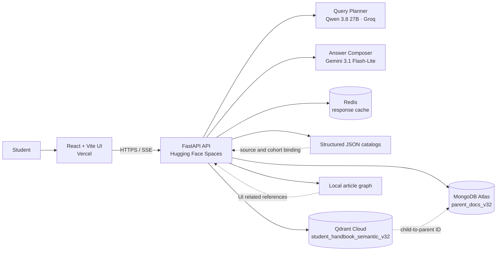
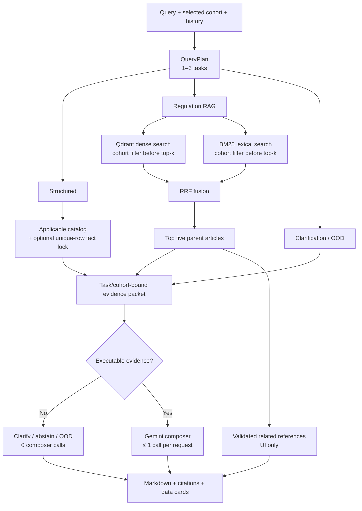
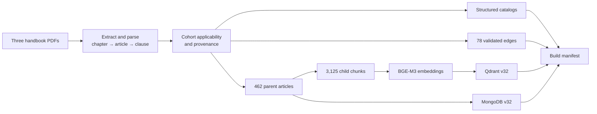

<div align="center">
  
  <h1>HCMUE AI</h1>
  <p><strong>Student Handbook RAG Assistant</strong></p>
  <p>
    A cohort-aware assistant for the HCMUE student handbooks: K48–K49, K50, and K51.<br>
    Multi-request planning, deterministic structured lookup, hybrid RAG, citations, and a production-oriented React interface.
  </p>

  <p>
    <a href="https://www.hcmuebot.id.vn"></a>
    <a href="https://huggingface.co/spaces/AnhFeee/hcmue-handbook-rag-api"></a>
    <a href="#evaluation-results"></a>
  </p>

  <p>
    
    
    
    
    
    <a href="./LICENSE"></a>
  </p>

  <p>
    <a href="#project-overview">Overview</a> ·
    <a href="#system-architecture">Architecture</a> ·
    <a href="#data-and-repository-structure">Data &amp; Repository</a> ·
    <a href="#runtime-design">Runtime</a> ·
    <a href="#evaluation-results">Evaluation</a> ·
    <a href="#local-development">Run Locally</a> ·
    <a href="#deployment">Deployment</a>
  </p>
</div>

<p align="center">
  
</p>
<p align="center"><sub>Grounded answers, cohort-aware citations, structured lookup cards, and source navigation.</sub></p>

> [!IMPORTANT]
> HCMUE AI is an independent, non-commercial student project—not an official HCMUE application. Verify cited sources or contact the responsible university office before making important academic decisions.

<a id="project-overview"></a>

## ✨ Project Overview

HCMUE AI answers questions from three student-handbook groups: **K48–K49, K50, and K51**. The backend separates deterministic table lookup from regulation retrieval because a grade conversion and a policy explanation require different evidence contracts.

The project demonstrates:

- **Multi-request planning:** Qwen 3.8 27B creates a typed `QueryPlan` with at most three independent tasks.
- **Deterministic structured lookup:** cohort-aware catalogs cover grade scales, scholarships, study duration, foreign-language equivalency, formulas, programs, faculties, offices, and student services.
- **Hybrid regulation RAG:** BGE-M3 dense search and BM25 are fused with Reciprocal Rank Fusion (RRF), then mapped from child chunks to complete parent articles.
- **Evidence-bound generation:** the Gemini composer receives only evidence authorized for the corresponding task and cohort. A unique, grounded table row may also be supplied as a fact lock through `resolved_result`.
- **Production delivery:** FastAPI supports synchronous and SSE streaming responses; React renders citations and structured data in dedicated source drawers.
- **Reproducible evaluation:** planning, retrieval, answer quality, human audit, and transport behavior are reported separately with explicit denominators and provenance.

### 📌 At a glance

| Grounded knowledge | Production retrieval | Answer quality | Cohort safety |
|:---:|:---:|:---:|:---:|
| **462** parent articles<br>**35** structured catalogs | **149/155** Hit@5<br>**0.9085** MRR | **90.37%** Judge correctness<br>**97.41%** audit score | **0/155** retrieval leaks<br>**0/135** deterministic leaks |

<p align="center"><sub>Final post-refactor V9.1 regression on release commit <code>13aef9e6</code>. Metrics retain their suite-specific denominators and are not combined into one score.</sub></p>

### 🧰 Technology stack

| Layer | Technology | Responsibility |
|---|---|---|
| Web client | React, TypeScript, Vite | Chat UX, SSE rendering, citations, and structured source drawers |
| API | FastAPI, Pydantic | Request contracts, orchestration, readiness, and streaming |
| Planner | Qwen 3.8 27B on Groq | Typed multi-request `QueryPlan` with native JSON Schema |
| Composer | Gemini 3.1 Flash-Lite | Evidence-bound Vietnamese answer generation |
| Retrieval | BGE-M3, BM25, RRF, Qdrant | Cohort-filtered regulation search |
| Knowledge stores | MongoDB, versioned JSON, local graph | Parent articles, structured catalogs, and UI references |
| Operations | Redis, LangSmith, Hugging Face, Vercel | Cache, tracing, backend hosting, and frontend delivery |

<a id="system-architecture"></a>

## 🏗️ System Architecture


```mermaid
flowchart LR
    Student["Student"] --> UI["React + Vite UI<br/>Vercel"]
    UI -->|"HTTPS / SSE"| API["FastAPI API<br/>Hugging Face Spaces"]

    API --> Planner["Query Planner<br/>Qwen 3.8 27B · Groq"]
    API --> Composer["Answer Composer<br/>Gemini 3.1 Flash-Lite"]
    API --> Cache[("Redis<br/>response cache")]

    API --> Structured["Structured JSON catalogs"]
    API --> Qdrant[("Qdrant Cloud<br/>student_handbook_semantic_v32")]
    API --> Mongo[("MongoDB Atlas<br/>parent_docs_v32")]
    API --> Graph["Local article graph"]

    Qdrant -. child-to-parent ID .-> Mongo
    Structured -. source and cohort binding .-> API
    Graph -. UI related references .-> API
```

The packaged data stores share build ID `build-02a2eed8dae5b4307427`. Readiness checks compare configured collection names with the build manifest so Qdrant, MongoDB, and local artifacts cannot silently come from different builds.

### 🔄 Runtime flow


```mermaid
flowchart TD
    Request["Query + selected cohort + history"] --> Plan["QueryPlan<br/>1–3 tasks"]
    Plan --> S["Structured"]
    Plan --> R["Regulation RAG"]
    Plan --> C["Clarification / OOD"]

    S --> Lookup["Applicable catalog<br/>+ optional unique-row fact lock"]
    R --> Dense["Qdrant dense search<br/>cohort filter before top-k"]
    R --> Sparse["BM25 lexical search<br/>cohort filter before top-k"]
    Dense --> RRF["RRF fusion"]
    Sparse --> RRF
    RRF --> Parents["Top five parent articles"]
    Parents --> Packet["Task/cohort-bound evidence packet"]
    Lookup --> Packet
    C --> Packet

    Parents --> Graph["Validated related references<br/>UI only"]
    Packet --> Ready{"Executable evidence?"}
    Ready -->|"No"| Safe["Clarify / abstain / OOD<br/>0 composer calls"]
    Ready -->|"Yes"| Answer["Gemini composer<br/>≤ 1 call per request"]
    Answer --> Response["Markdown + citations + data cards"]
    Safe --> Response
    Graph --> Response
```

### 🛡️ Core contracts

- Each planned task owns its question, mode, cohorts, and structured capability when applicable.
- Multiple cohorts are executed inside one logical task instead of multiplying task count.
- Structured lookup always exposes the applicable small catalog or matching records. `resolved_result` is added only when grounded input, applicability, table selection, and a unique row are all deterministic.
- Regulation evidence is filtered by cohort before top-k selection and remains bound to its task.
- Graph traversal supplies related-reference navigation to the UI; graph results are not Composer evidence.
- Planner failure safely falls back to one regulation-RAG task using the original query and is recorded in telemetry.

<a id="data-and-repository-structure"></a>

## 🗂️ Data and Repository Structure

### 📚 Current data snapshot

| Artifact | Count | Purpose |
|---|---:|---|
| Parent articles | 462 | Complete context for answers and citations |
| Child chunks | 3,125 | Fine-grained dense and BM25 retrieval |
| Structured table catalogs | 35 | Deterministic cohort-aware lookup |
| Article graph edges | 78 | Related-reference navigation in the UI |
| Embedding | BAAI/bge-m3, 1,024 dimensions | Semantic dense retrieval |

Structured tables remain available in versioned JSON and MongoDB parent documents. Rows represented by the structured registry are excluded from Qdrant to avoid indexing a duplicated, flattened representation; they are not removed from the system.

### 🧭 Repository layout

```text
student_handbook_rag/
├── configs/                         # Planner, generation, retrieval, and structured contracts
├── data/
│   ├── raw/                         # Source handbooks (not deployed)
│   ├── processed/                   # Tables, parents, chunks, graph, and build manifest
│   └── eval/
│       └── architecture_v9_1_corrected/  # Current corrected evaluation bundle
├── docs/                            # Architecture and historical evaluation reports
├── frontend/                        # React + TypeScript + Vite application
├── scripts/                         # Build, audit, evaluation, publishing, and deployment tools
├── src/
│   ├── api/                         # FastAPI routes and health checks
│   ├── extraction/                  # Structured tables and directories
│   ├── generation/                  # Evidence packets, prompts, composer, and citations
│   ├── ingestion/                   # PDF, vector, parent-document, and graph ingestion
│   ├── preprocessing/               # Handbook structure and applicability processing
│   ├── retrieval/                   # Planner, structured lookup, and hybrid RAG
│   └── services/                    # Application-facing orchestration services
└── tests/                           # Unit, integration, and regression tests
```

The current runtime/build boundary and intentionally deferred cleanup work are
documented in [Technical Debt and Maintenance Boundary](./docs/TECHNICAL_DEBT.md).

### 🔨 Data build pipeline


```mermaid
flowchart LR
    PDFs["Three handbook PDFs"] --> Parse["Extract and parse<br/>chapter → article → clause"]
    Parse --> Policy["Cohort applicability<br/>and provenance"]
    Policy --> Tables["Structured catalogs"]
    Policy --> Parents["462 parent articles"]
    Policy --> Graph["78 validated edges"]
    Parents --> Chunks["3,125 child chunks"]
    Chunks --> Embed["BGE-M3 embeddings"]
    Embed --> Qdrant["Qdrant v32"]
    Parents --> Mongo["MongoDB v32"]
    Tables --> Manifest["Build manifest"]
    Graph --> Manifest
    Qdrant --> Manifest
    Mongo --> Manifest
```

<a id="runtime-design"></a>

## ⚙️ Runtime Design

### 🧠 Planning and structured lookup

The Planner distinguishes a table value from the policy governing that value. Native JSON Schema constrains the plan structure; the normalizer validates grounded slots, repairs harmless optional metadata, and prevents invalid structured tasks from executing.

For structured tasks, runtime—not the Planner—selects the applicable catalog and resolves data:

1. validate cohort and applicability;
2. select the declared structured capability;
3. expose the applicable table or records to the UI and Composer;
4. create `resolved_result` only for a uniquely resolved, evidence-grounded row;
5. otherwise retain the available catalog or request clarification instead of guessing.

### 🔎 Retrieval and grounding

Production retrieval uses `vector_primary_graph_supplement`:

1. Qdrant and BM25 apply cohort filters before top-k selection.
2. Each branch returns at most 24 child candidates.
3. RRF retains up to 24 fused child candidates.
4. Children are grouped into at most five primary parent articles.
5. The evidence packet applies task/cohort/source guards, deduplication, and bounded context allocation.
6. The Composer cannot retrieve additional sources or promote UI-only graph references into answer evidence.

PhoRanker remains available for controlled experiments but is **disabled in production and in the reported V9.1 retrieval run**.

<a id="api"></a>

## 🔌 API

| Method | Endpoint | Purpose |
|---|---|---|
| `GET` | `/health` | Liveness and container status |
| `GET` | `/health/readiness` | Artifact, dependency, and collection-identity checks |
| `GET` | `/health/artifacts` | Admin-only artifact details |
| `POST` | `/chat` | Synchronous response |
| `POST` | `/chat/stream` | SSE response through the shared preparation core |
| `POST` | `/chat/feedback` | Product feedback without intentionally collecting sensitive data |

QueryPlan, task results, and evidence diagnostics are returned only when `include_debug=true`.

<a id="evaluation-results"></a>

## 📊 Evaluation Results

The release candidate was evaluated with the frozen **Architecture V9.1 corrected** dataset as a **final post-refactor regression**. This is not presented as a new holdout: the runtime evolved after the dataset manifest was frozen, and no metric threshold was changed after observing this run.

- Frozen dataset: [`data/eval/architecture_v9_1_corrected`](./data/eval/architecture_v9_1_corrected)
- Detailed release report: [`docs/FINAL_RELEASE_EVALUATION.md`](./docs/FINAL_RELEASE_EVALUATION.md)
- Original V9.1 results: [`RESULTS.md`](./data/eval/architecture_v9_1_corrected/RESULTS.md)
- Evaluator correction audit: [`CORRECTION_AUDIT.md`](./data/eval/architecture_v9_1_corrected/CORRECTION_AUDIT.md)

Planning, retrieval, generated-answer quality, human review, and production behavior are intentionally reported separately. There is no synthetic overall score.

### 🪪 Evaluation identity

| Item | Recorded value |
|---|---|
| Release runtime and evaluation checkout | `13aef9e63e4384e0ee1a52cf2cd9327db2e97944` |
| Deployed Hugging Face artifact | `d26c6f6` |
| Run kind | `post_fix_regression_not_original_holdout` |
| Frozen dataset | `9.1.0-corrected-evaluation`, revision `1` |
| Frozen manifest baseline | runtime `7f1fc82b`; harness `943d9b38` |
| Planner | `qwen/qwen3.8-27b`, reasoning `low`, native JSON Schema |
| Composer | `gemini-3.1-flash-lite` |
| Judge | `openai/gpt-oss-120b`, fixed project rubric; not RAGAS |
| QueryPlan / normalizer | schema `v1`; normalizer `v20-grounded-scoring-scope` |
| Prompt contracts | Planner `structured-regulation-v41-explicit-request-count`; Composer `student-handbook-answer-v3.22-answer-scope` |
| Answer pipeline | `v63-runtime-config-preparation` |
| Retrieval | `vector_primary_graph_supplement`; no PhoRanker |
| Storage | Qdrant `student_handbook_semantic_v32`; MongoDB `parent_docs_v32` |

The manifest identity mismatch reported by the evaluator is expected for this regression: it records that the release runtime differs from the original frozen V9.1 baseline. Dataset hashes and the document-store hash remained fixed.

### 1. 🧭 Deterministic architecture — 135 cases

This suite measures QueryPlan behavior, structured routing, executable evidence, row selection, and fact locks without using the Composer as the evaluator.

| Case type | Passed | Cases | Pass rate |
|---|---:|---:|---:|
| Single structured lookup | 53 | 60 | 88.33% |
| Capability boundary | 24 | 24 | 100.00% |
| Compound query | 24 | 28 | 85.71% |
| Missing or ambiguous | 11 | 12 | 91.67% |
| Unsupported but in-domain | 3 | 3 | 100.00% |
| Out of domain | 8 | 8 | 100.00% |
| **Total** | **123** | **135** | **91.11%** |

The realistic split scored **99/107 (92.52%)**; the stress split scored **24/28 (85.71%)**.

| Architecture metric | Result |
|---|---:|
| Structured-selection precision | **98.84%** |
| Structured-selection recall | **96.59%** |
| Structured false-positive rate | **2.13%** |
| Plan-structure accuracy | **95.56%** |
| Task-semantics accuracy | **95.56%** |
| Structured-execution accuracy | **95.56%** |
| Structured-evidence accuracy | **95.45%** |
| Structured-source accuracy | **89.47%** |
| Structured-row accuracy | **93.18%** |
| Resolved-result accuracy | **40/46 (86.96%)** |
| Outcome-contract accuracy | **123/135 (91.11%)** |
| Observed cross-cohort leakage | **0/135** |
| Planner fallback | **1/135 (0.74%)** |

Twelve cases fail at least one outcome assertion. The fixed legacy gate misses only its structured false-positive threshold: **2.13% observed vs 2.00% required**.

### 2. 🔎 Regulation retrieval — 155 cases

Retrieval was evaluated end to end through the Planner and the same production retrieval mode used by the deployed application.

| Retrieval metric | Result |
|---|---:|
| Hit@1 | **134/155 (86.45%)** |
| Hit@3 | **146/155 (94.19%)** |
| Hit@5 | **149/155 (96.13%)** |
| Primary-source Hit@5 | **96.13%** |
| MRR | **0.9085** |
| nDCG@5 | **0.8697** |
| Required-source Recall@5 | **91.29%** |
| Parent-section and citation binding | **96.13%** |
| Content-type match | **96.13%** |
| Cohort match | **100.00%** |
| Observed cohort leakage | **0/155** |
| Empty retrieval | **6/155 (3.87%)** |
| Realistic Hit@5 | **117/123 (95.12%)** |
| Stress Hit@5 | **32/32 (100.00%)** |
| Latency p50 / p95 | **2.303 s / 3.944 s** |

Six cases are genuine misses. The fixed retrieval gate fails only content-type match: **96.13% observed vs 98% required**.

### 3. ✍️ Answer generation — 141 cases

All 141 cases completed through the production retrieval mode without PhoRanker or lost API-error cases.

| Generation metric | Result |
|---|---:|
| Literal `answered` status | **126/141 (89.36%)** |
| `needs_clarification` status | **9/141 (6.38%)** |
| Out-of-domain status | **6/141 (4.26%)** |
| Mean latency | **5.414 s** |
| Latency p50 / p95 | **5.468 s / 8.087 s** |
| Maximum latency | **16.618 s** |

The literal `answered` rate is an operational status distribution, not a quality score: clarification and out-of-domain responses can be correct outcomes.

### 4. ⚖️ LLM Judge — 141 cases

The Judge uses `openai/gpt-oss-120b` with a fixed, source-grounded rubric. All 141 outputs parsed successfully.

| Judge metric | Result |
|---|---:|
| Faithfulness | **89.95%** |
| Answer relevancy | **94.38%** |
| Answer correctness | **90.37%** |
| Context precision | **58.55%** |
| Context recall | **82.00%** |
| Citation correctness | **92.37%** |
| Abstention correctness | **95.74%** |
| Question-handling correctness | **97.16%** |
| Raw unsupported-claim flags | **18/141 (12.77%)** |
| Human-adjudicated meaningful unsupported/scope overreach | **5/141 (3.55%)** |
| Critical runtime failures | **1** |

The fixed Judge gate passes correctness, citations, abstention, and critical-failure limits. Faithfulness misses its 90% target by **0.05 percentage points**; the raw unsupported-claim gate fails, which is why every flagged case was manually audited.

### 5. 👁️ Source-grounded human audit — 40 sampled answers plus all risks

The stratified 40-answer sample and all 27 automatically flagged answers were checked against the query, frozen gold, citations, and authorized evidence packet.

| Audit metric | Result |
|---|---:|
| Completed stratified sample | **40/40** |
| Mean audit score | **97.41%** |
| Human–Judge MAE | **0.0650** |
| Agreement within ±0.15 | **87.50%** |
| Critical false pass in sampled 40 | **0** |
| Automatically flagged cases reviewed | **27/27** |

Of the 27 flagged cases, **16** were Judge false positives or acceptable scope, **6** were runtime failures, and **5** were minor answer-quality issues. The audit used one reviewer, so inter-rater agreement and Cohen's kappa are not claimed.

### 6. 🌐 Production transport — 60 cases

The production suite was rerun against the deployed Hugging Face API after the final Redis and transport hardening changes.

| Production metric | Result |
|---|---:|
| HTTP transport success | **60/60 (100.00%)** |
| Successful payload | **58/60 (96.67%)** |
| Expected response status | **57/60 (95.00%)** |
| HTTP 429 / timeout rate | **0% / 0%** |
| Overall latency p50 / p95 | **7.844 s / 11.676 s** |
| Cold regulation-RAG latency p50 / p95 | **8.720 s / 12.927 s** |
| Streaming TTFT p50 / p95 | **6.286 s / 10.280 s** |
| Streaming TTFT coverage | **100.00%** |
| Warm-cache hit rate | **9/10 (90.00%)** |
| Warm-cache latency p50 / p95 | **1.885 s / 5.691 s** |
| Source utilization | **73.33%** |

Cold RAG, structured, warm-cache, and streaming scenarios each completed **10/10 or 20/20**. The two payload failures occurred only in the ten-request burst at concurrency five; both returned HTTP 200 with `retrieval_error`. Public responses expose no internal evaluation telemetry, so telemetry coverage is **N/A for product correctness**, although the legacy gate records it as 0%.

### 📝 Interpretation and limitations

- These results are a **post-refactor regression on a frozen dataset**, not a prospectively registered new holdout.
- Dataset and document-store hashes were unchanged, but the frozen manifest correctly reports that the release runtime differs from its original baseline.
- Deterministic and retrieval headline scores remain above 91% and 96%, with zero observed cross-cohort leakage; each retains one narrowly missed legacy gate.
- Six answer-level runtime failures remain: two over-splitting/clarification cases, one shared-regulation applicability case, one large scope expansion, one structured table-selection error, and one incomplete live-person abstention.
- Context precision is lower than answer and citation quality because multi-part regulation tasks retain supporting parent-article context.
- Production evidence is a bounded smoke/load suite, not a capacity, security, or real-user traffic benchmark. Burst admission and warm-cache tail latency remain deployment limitations.
- A publication should add a new prospective or external test set and independent multi-reviewer annotation. The current report is suitable for accurately scoped portfolio or CV claims when its denominators and regression status are stated.

<a id="local-development"></a>

## 💻 Local Development

### Requirements

- Python 3.11
- Node.js 20+
- Qdrant and MongoDB collections from the same build manifest
- Groq and Gemini API keys
- Redis is optional locally and recommended for deployed traffic

### Backend

```bash
python -m venv .venv
# Windows: .venv\Scripts\activate
pip install -c constraints-runtime.txt -r requirements.txt
copy .env.example .env
python -m uvicorn src.api.main:app --host 0.0.0.0 --port 8000
```

Required environment variables:

```dotenv
QDRANT_URL=https://your-cluster.qdrant.io
QDRANT_API_KEY=...
QDRANT_COLLECTION_NAME=student_handbook_semantic_v32
MONGODB_URL=mongodb+srv://...
MONGODB_DB_NAME=chatbotHCMUE
MONGODB_PARENT_COLLECTION=parent_docs_v32
STUDENT_RAG_RETRIEVAL_MODE=vector_primary_graph_supplement
GROQ_API_KEYS=...
GEMINI_API_KEYS=...
```

Current beta boundary:

- Run one replica with one Uvicorn worker. Each process owns one in-memory BM25 index and local admission queue.
- Set `REDIS_URL`; deployed multi-user environments should also set `STUDENT_RAG_REQUIRE_REDIS=true`. Redis mode never writes the local JSON response cache.
- Keep `configs/retrieval.yaml` as the retrieval runtime source of truth. `STUDENT_RAG_RETRIEVAL_CONFIG` may point to another explicit file for a deployment.
- Scale trigger: sustained p95 latency or memory growth, corpus above roughly 20k chunks, or need for multiple replicas. At that point move lexical retrieval and rate-limit state to shared services; do not add them before measured need.

### Frontend

```bash
cd frontend
npm ci
copy .env.example .env.local
npm run dev
```

### Quality checks

```bash
python -m pytest
python -m ruff check src tests scripts
cd frontend
npm run lint
npm run build
```

<a id="data-build-and-publishing"></a>

## 🧱 Data Build and Publishing

The build pipeline writes versioned artifacts and does not overwrite a live production collection in place.

```bash
python -m scripts.build_multi_cohort
python -m scripts.check_deploy_artifacts
python -m scripts.verify_remote_build
```

Safe publishing sequence:

1. Build and audit local artifacts.
2. Create versioned Qdrant and MongoDB collections.
3. Publish both with the same `build_id`.
4. Verify counts and child-to-parent links.
5. Switch both collection variables in one release.
6. Retain the previous build until canary checks pass.

<a id="observability"></a>

## 🔭 Observability

LangSmith tracing uses the current QueryPlan contract for both `/chat` and `/chat/stream`. Root traces record interface, status, latency, TTFT, cache behavior, task/coverage summaries, evidence identity, collection identity, and Planner/Composer usage when available.

Raw chat history, full source bodies, retrieval scores, API keys, and database URLs are excluded from trace metadata. The current query and final answer remain trace input/output for product debugging.

```dotenv
LANGSMITH_TRACING=true
LANGSMITH_API_KEY=lsv2_pt_...
LANGSMITH_PROJECT=hcmue-student-handbook-rag
```

Legacy `LANGCHAIN_API_KEY` and `LANGCHAIN_PROJECT` variables remain supported for existing deployments.

<a id="deployment"></a>

## 🚀 Deployment

### Backend — Hugging Face Spaces

The deployment script uses an explicit allow-list and excludes `.env`, secrets, caches, evaluation reports, and raw PDFs.

```powershell
powershell -NoProfile -ExecutionPolicy Bypass -File .\scripts\deploy_hf_backend.ps1 -DryRun
powershell -NoProfile -ExecutionPolicy Bypass -File .\scripts\deploy_hf_backend.ps1
```

Before publishing, the packaged manifest must target Qdrant `student_handbook_semantic_v32` and MongoDB `parent_docs_v32`. After deployment, verify `/health`, `/health/readiness`, and representative structured, regulation, compound, clarification, sync, and streaming requests.

### Frontend — Vercel

The Vite frontend reads `VITE_API_BASE_URL` and is published at [https://www.hcmuebot.id.vn](https://www.hcmuebot.id.vn). A manual CLI deployment should link the existing Vercel project before publishing to avoid creating a duplicate project.

<a id="evaluation-governance-and-release-policy"></a>

## 🧪 Evaluation Governance and Release Policy

- Dataset files, evaluator code, runtime identity, model configuration, storage collections, and output hashes are recorded separately.
- Non-applicable assertions are reported as `N/A`, never as automatic passes.
- A run may be repeated only when an infrastructure or evaluator defect is documented; low scores alone are not a reason to rerun a frozen holdout.
- Failures become regression evidence for a later version rather than question-specific runtime patches.
- The project favors general correctness invariants over benchmark keyword exceptions and does not optimize for 100% stress-case performance.

<a id="license"></a>

## 📄 License

The source code is released under the [MIT License](./LICENSE). Student-handbook content and university regulations remain the property of their respective publishers.
