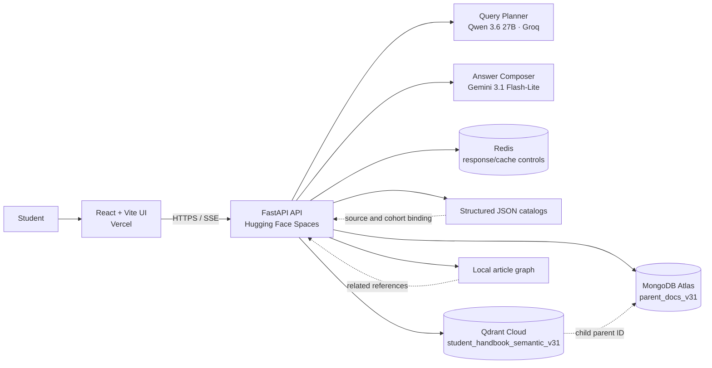
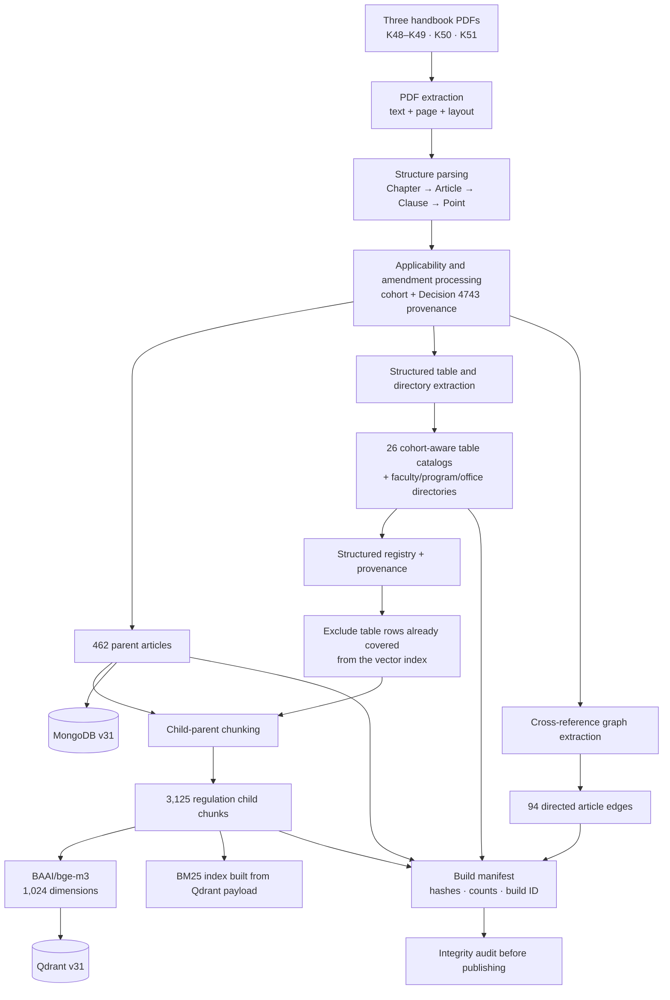
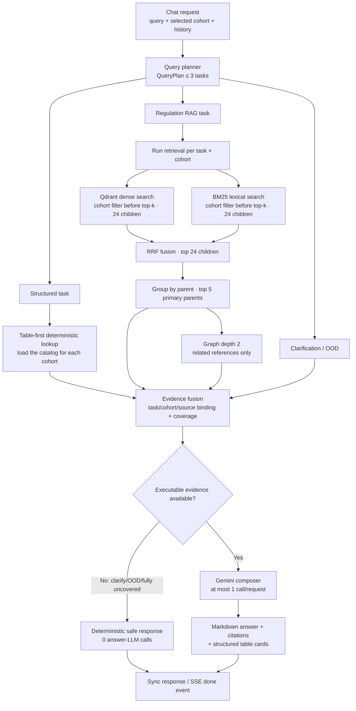
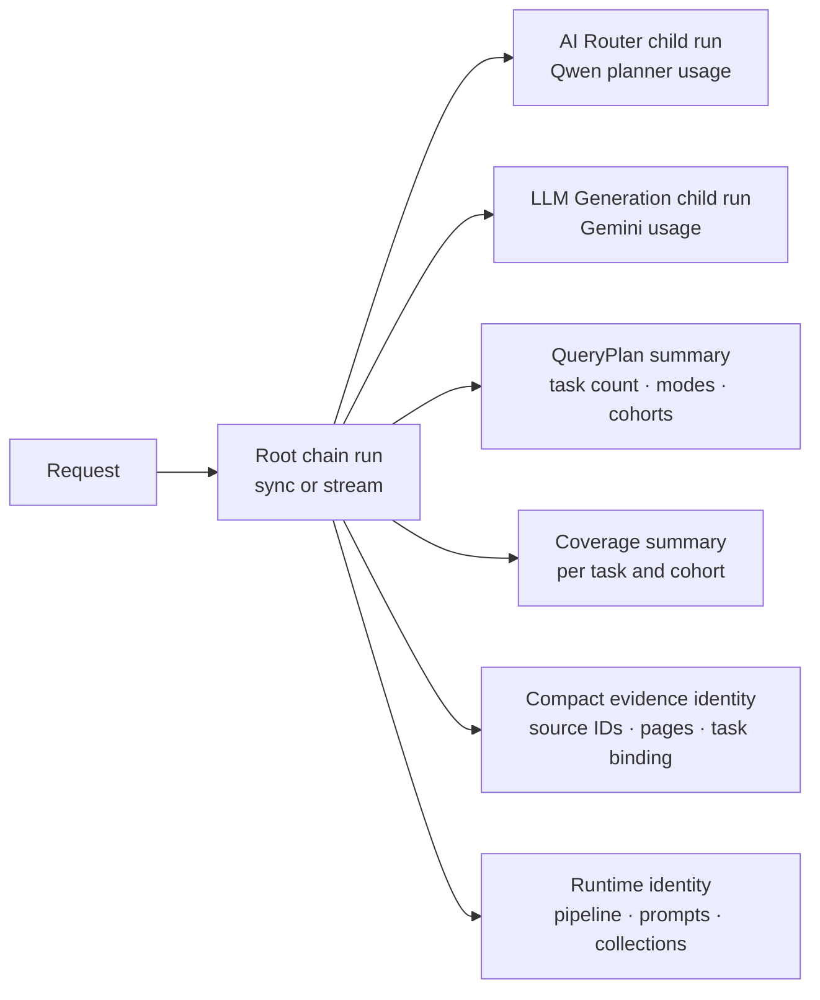

# HCMUE AI — Student Handbook RAG Assistant

<p align="center">
  <strong>A cohort-aware assistant for the HCMUE student handbooks: K48–K49, K50, and K51.</strong><br>
  Multi-request query planning, structured lookup, hybrid RAG, citations, and a React interface in one production-oriented project.
</p>

<p align="center">
  
  
  
  
  
</p>

<p align="center">
  <a href="https://www.hcmuebot.id.vn"><strong>Live demo</strong></a>
  ·
  <a href="https://huggingface.co/spaces/AnhFeee/hcmue-handbook-rag-api"><strong>Backend Space</strong></a>
  ·
  <a href="#evaluation-results"><strong>Evaluation</strong></a>
</p>


> HCMUE AI is an independent, non-commercial student project. It is not an official application of Ho Chi Minh City University of Education. Users should verify cited sources or contact the responsible university office before making important academic decisions.

## Overview

The system answers questions from three HCMUE student-handbook groups: **K48–K49, K50, and K51**. It separates structured data from regulation text because tables and policy articles require different retrieval strategies:

- **Structured lookup:** grade scales, scholarships, study duration, foreign-language equivalency, program–faculty mappings, offices, and formulas are stored as cohort-aware JSON. The backend selects the correct catalog and cohort, then provides the applicable table to the composer. Rows already covered by a catalog are not embedded again.
- **Regulation RAG:** policy conditions, procedures, exceptions, consequences, and cross-references use dense search plus BM25, fused with Reciprocal Rank Fusion (RRF), and linked to full parent articles in MongoDB.
- **Multi-request QueryPlan:** the planner creates at most three logical tasks in `structured`, `rag`, or `clarify` mode. Multiple cohorts are executed within the same logical task instead of multiplying tasks.
- **Grounded answers:** evidence is bound to task, cohort, and source. Each request uses at most one answer-LLM call. Missing evidence triggers a scoped abstention or clarification without discarding answerable parts.
- **Student-facing UI:** structured tables render as dedicated cards, regulation citations open their source, streaming is supported, and the interface is responsive on desktop and mobile.

## System Architecture


```mermaid
flowchart LR
    Student["Student"] --> UI["React + Vite UI<br/>Vercel"]
    UI -->|"HTTPS / SSE"| API["FastAPI API<br/>Hugging Face Spaces"]

    API --> Planner["Query Planner<br/>Qwen 3.6 27B · Groq"]
    API --> Composer["Answer Composer<br/>Gemini 3.1 Flash-Lite"]
    API --> Cache[("Redis<br/>response/cache controls")]

    API --> Structured["Structured JSON catalogs"]
    API --> Qdrant[("Qdrant Cloud<br/>student_handbook_semantic_v31")]
    API --> Mongo[("MongoDB Atlas<br/>parent_docs_v31")]
    API --> Graph["Local article graph"]

    Qdrant -. child parent ID .-> Mongo
    Structured -. source and cohort binding .-> API
    Graph -. related references .-> API
```

The production data stores share build ID `build-2254b92ccb60f7984bfa`. Readiness checks compare environment collection names against the packaged build manifest, preventing Qdrant and MongoDB from silently using artifacts from different builds.

## Data Processing Pipeline


```mermaid
flowchart TD
    PDFs["Three handbook PDFs<br/>K48–K49 · K50 · K51"] --> Extract["PDF extraction<br/>text + page + layout"]
    Extract --> Parse["Structure parsing<br/>Chapter → Article → Clause → Point"]
    Parse --> Policy["Applicability and amendment processing<br/>cohort + Decision 4743 provenance"]

    Policy --> Parents["462 parent articles"]
    Policy --> TableExtract["Structured table and directory extraction"]
    Policy --> GraphExtract["Cross-reference graph extraction"]

    TableExtract --> Catalogs["26 cohort-aware table catalogs<br/>+ faculty/program/office directories"]
    Catalogs --> Registry["Structured registry + provenance"]

    Parents --> Chunking["Child-parent chunking"]
    Registry --> Exclude["Exclude table rows already covered<br/>from the vector index"]
    Exclude --> Chunking
    Chunking --> Children["3,125 regulation child chunks"]
    Children --> Embedding["BAAI/bge-m3<br/>1,024 dimensions"]

    Parents --> Mongo[("MongoDB v31")]
    Embedding --> Qdrant[("Qdrant v31")]
    Children --> BM25["BM25 index built from Qdrant payload"]
    GraphExtract --> Graph["94 directed article edges"]

    Parents --> Manifest["Build manifest<br/>hashes · counts · build ID"]
    Catalogs --> Manifest
    Children --> Manifest
    Graph --> Manifest
    Manifest --> Audit["Integrity audit before publishing"]
```

### Current Data Snapshot

| Artifact | Count | Purpose |
|---|---:|---|
| Parent articles | 462 | Full context for answers and citations |
| Child chunks | 3,125 | Fine-grained dense and BM25 retrieval |
| Structured table catalogs | 26 | Deterministic cohort-aware table lookup |
| Article graph edges | 94 | Related references; never a substitute for primary evidence |
| Embedding | BAAI/bge-m3, 1,024 dimensions | Semantic dense retrieval |

Structured tables remain available in JSON and in MongoDB parent documents. Excluding registry-covered rows only removes duplicated, flattened table content from Qdrant; it does not remove tables from the system.

## Runtime Query Pipeline


```mermaid
flowchart TD
    Request["Chat request<br/>query + selected cohort + history"] --> Plan["Query planner<br/>QueryPlan ≤ 3 tasks"]
    Plan --> S["Structured task"]
    Plan --> R["Regulation RAG task"]
    Plan --> C["Clarification / OOD"]

    S --> Lookup["Table-first deterministic lookup<br/>load the catalog for each cohort"]

    R --> PerCohort["Run retrieval per task × cohort"]
    PerCohort --> Dense["Qdrant dense search<br/>cohort filter before top-k · 24 children"]
    PerCohort --> Sparse["BM25 lexical search<br/>cohort filter before top-k · 24 children"]
    Dense --> RRF["RRF fusion · top 24 children"]
    Sparse --> RRF
    RRF --> Group["Group by parent · top 5 primary parents"]
    Group --> Expand["Graph depth 2<br/>related references only"]

    Lookup --> Packet["Evidence fusion<br/>task/cohort/source binding + coverage"]
    Group --> Packet
    Expand --> Packet
    C --> Packet

    Packet --> Terminal{"Executable evidence available?"}
    Terminal -->|"No: clarify/OOD/fully uncovered"| Deterministic["Deterministic safe response<br/>0 answer-LLM calls"]
    Terminal -->|"Yes"| Answer["Gemini composer<br/>at most 1 call/request"]
    Answer --> Render["Markdown answer + citations<br/>+ structured table cards"]
    Deterministic --> Response["Sync response / SSE done event"]
    Render --> Response
```

### QueryPlan Contract

Each task contains its own question, mode, lookup type, cohorts, and clarification data when needed. The core constraints are:

- One to three tasks; no recursive planning and no agent tool loop.
- Multiple cohorts do not increase the logical task count.
- A structured task selects a catalog. The backend exposes the applicable table rather than applying brittle keyword-driven row filtering too early.
- Compound regulation questions are retrieved independently per task.
- Planner timeout or invalid JSON falls back to one regulation-RAG task using the original query; debug telemetry records the fallback.

## Retrieval and Grounding

Production retrieval is recall-oriented while keeping cohort and applicability constraints explicit:

1. Qdrant and BM25 filter by cohort **before** top-k selection.
2. Each branch returns at most 24 child candidates.
3. RRF fuses both branches and retains 24 child candidates.
4. Child chunks are grouped into at most five primary parents.
5. Graph traversal at depth two adds related references; graph results do not become primary citations by themselves.
6. The composer receives only task/cohort-bound evidence and cannot retrieve new evidence.

PhoRanker remains available for controlled evaluation modes but is **disabled in production**. Production ranking uses RRF.

## Main API Endpoints

| Method | Endpoint | Purpose |
|---|---|---|
| `GET` | `/health` | Liveness and container health check |
| `GET` | `/health/readiness` | Artifact, environment, and build/collection identity checks |
| `GET` | `/health/artifacts` | Admin-only artifact details |
| `POST` | `/chat` | Synchronous answer generation |
| `POST` | `/chat/stream` | SSE streaming through the shared preparation core |
| `POST` | `/chat/feedback` | Product feedback without intentionally collecting sensitive personal data |

Debug fields such as QueryPlan, task results, and evidence telemetry only appear when `include_debug=true`. The normal production response remains compact and stable.

## Observability with LangSmith

LangSmith tracing follows the current QueryPlan architecture instead of the legacy single-router decision. Both `/chat` and `/chat/stream` create the same compact trace contract (`hcmue-query-plan-v2`). Public SSE responses still hide debug fields unless `include_debug=true`; the server retains an internal copy for observability before applying that redaction.


```mermaid
flowchart LR
    Request["Request"] --> Root["Root chain run<br/>sync or stream"]
    Root --> Router["AI Router child run<br/>Qwen planner usage"]
    Root --> Composer["LLM Generation child run<br/>Gemini usage"]

    Root --> PlanMeta["QueryPlan summary<br/>task count · modes · cohorts"]
    Root --> Coverage["Coverage summary<br/>per task and cohort"]
    Root --> EvidenceMeta["Compact evidence identity<br/>source IDs · pages · task binding"]
    Root --> RuntimeMeta["Runtime identity<br/>pipeline · prompts · collections"]
```

Each root trace records:

- interface (`sync` or `stream`), status, total latency, streaming TTFT, cache hit, and whether the answer LLM was called;
- QueryPlan context mode, task count, task mode, lookup type, cohorts, per-task coverage, evidence count, citation count, and planner fallback;
- pipeline, router-prompt, answer-prompt, QueryPlan schema/normalizer, Qdrant collection, and MongoDB parent-collection identity;
- compact citation and structured-result summaries, including task/cohort binding and source pages;
- token usage and timed Router/Composer child runs when usage telemetry is available.

The trace deliberately excludes raw chat history, full source text, parent article bodies, retrieval scores, API keys, and database URLs. The student query and final answer remain the LangSmith root input/output because they are required for debugging product behavior.

Enable tracing with:

```dotenv
LANGSMITH_TRACING=true
LANGSMITH_API_KEY=lsv2_pt_...
LANGSMITH_PROJECT=hcmue-student-handbook-rag
```

Legacy `LANGCHAIN_API_KEY` and `LANGCHAIN_PROJECT` names remain supported for existing deployments.

## Evaluation

The repository uses separate evaluation suites because planning correctness, retrieval quality, answer quality, and production behavior are different questions. A score from one suite is never presented as a substitute for another. The current release evidence is summarized first, followed by the exact composition and metrics of every maintained suite.

### Release Evidence at a Glance

| Suite | Role | Cases | Latest recorded result | Release gate? |
|---|---|---:|---:|---|
| Deterministic architecture | QueryPlan, routing, table-first execution, cohort and citation contracts | 144 | **143/144 (99.31%)** | Architecture evidence |
| End-to-end regulation retrieval | Planner plus production hybrid retrieval | 180 | **Hit@5: 175/180 (97.22%)** | Retrieval evidence |
| Legacy product regression | Re-runnable development regression | 30 | **30/30 automatic shape checks**; human review pending for that run | No |
| Product acceptance | Realistic end-to-end product behavior | 50 | **47/50 automatic; 50/50 human pass** | **Yes** |
| Generated answers + LLM judge | Grounding and citation diagnostics | 100 | No release score claimed for the current checkpoint | No |
| Production scenarios | Cold/warm cache, streaming, and concurrency exercises | 60 | Dataset maintained; no release score claimed here | No |
| Automated tests | Unit, integration, API, build, and regression invariants | — | **349 passed** | Engineering gate |

Raw LLM-judge scores are diagnostic only. A suspected critical unsupported claim counts as a product failure only after source-based human review.

### 1. Deterministic Architecture Suite — 144 Cases

Dataset: [`data/eval/architecture_v3/deterministic_tool_cases.json`](./data/eval/architecture_v3/deterministic_tool_cases.json)

This suite calls the planning and retrieval-preparation path without asking the answer LLM to judge its own behavior. A case passes only when all applicable structural invariants pass: task count, task modes, lookup types, cohort extraction, OOD behavior, clarification behavior, expected LLM-call decision, planner fallback absence, structured evidence availability, table-first payload shape, and cohort-correct source binding.

#### Distribution by case type

| Case type | Count | What it tests |
|---|---:|---|
| Positive structured lookup | 60 | Ten lookup families, six cases each |
| Hard negative | 40 | Preventing unsupported structured routing or fabricated lookup evidence |
| Ambiguous | 12 | Scoped clarification instead of guessing required information |
| Out of domain | 8 | Terminal OOD behavior without an answer-LLM call |
| Architecture scenarios | 24 | Multi-task, mixed-mode, multi-cohort, and three-task boundary behavior |
| **Total** | **144** | 84 realistic and 60 stress cases |

The 60 positive cases contain six cases each for conduct, faculty, foreign language, formula, office, program, scholarship, scoring, student service, and study duration. The 24 architecture cases contain 3 multi-structured, 7 structured+regulation, 4 multi-regulation, 4 multi-cohort, 2 clarification, 2 multi-entity same-table, 1 three-task boundary, and 1 mixed-scope case.

**Metric:** strict case pass rate, computed as `passed cases / 144`. The current result is **143/144 = 99.31%**. The remaining case is a structural planner merge of closely related regulation requests; the final evidence is still complete, so the project reports it rather than adding a keyword parser to force 100%.

### 2. Regulation Retrieval Suite — 180 Cases

Dataset: [`data/eval/architecture_v3/retrieval_cases.json`](./data/eval/architecture_v3/retrieval_cases.json)

All 180 cases are source-anchored regulation questions. Structured-table questions are intentionally excluded because those use the deterministic catalog path rather than Qdrant. The evaluator supports two scopes:

- **pure retrieval:** force the regulation retrieval path to isolate Qdrant/BM25/RRF quality;
- **end to end:** include QueryPlan routing and then score the parent documents returned by the production path.

The release headline reported in this README is the stricter end-to-end result.

#### Distribution

| Dimension | Distribution |
|---|---|
| Evaluation split | 135 realistic, 45 stress |
| Cohort | 46 K48–K49, 45 K50, 45 K51, 44 general/multi-cohort |
| Query style | 26 keyword, 25 student style, 20 short natural, 18 paraphrase, 13 typo/no accent, 11 condition/procedure, 7 graph-reference, 6 numeric/fact, 5 cohort-sensitive, 4 typo/no diacritics, 45 stress |

#### Metrics

| Metric | Definition |
|---|---|
| Hit@1 / Hit@3 / Hit@5 | `1` when at least one source-anchored relevant parent appears in the first `k` parents, otherwise `0`; reported as the mean over cases |
| MRR | Mean reciprocal rank of the first relevant parent |
| nDCG@5 | Rank-sensitive graded relevance over the first five parents |
| Cohort leak rate | Fraction of cases containing a parent that violates cohort/applicability scope |
| Empty/error rate | Fraction with no usable retrieval result or a runtime failure |
| Latency | Mean and percentile retrieval time |

For general multi-cohort queries, Hit@k is computed within each cohort execution unit before request-level aggregation. This avoids incorrectly treating the first K50 result as rank six merely because five K48–K49 parents were emitted first.

**Current end-to-end result:** **Hit@5 = 175/180 = 97.22%**. The five documented misses are stress-style accentless queries or very broad heading-level questions. Production uses dense + BM25 + RRF; PhoRanker fields may exist in historical evaluator telemetry, but PhoRanker is disabled in the production path.

### 3. Generated Answer and Judge Suite — 100 Cases

Dataset: [`data/eval/architecture_v3/generated_answer_cases.json`](./data/eval/architecture_v3/generated_answer_cases.json)

| Case type | Count |
|---|---:|
| Regulation RAG answers | 60 |
| Structured answers | 20 |
| Mixed structured + regulation answers | 10 |
| Unanswerable / abstention | 10 |
| **Total** | **100** |

The split is 75 realistic and 25 stress cases; 90 are answerable and 10 are unanswerable. Each case contains source anchors, ground truth, required facts, forbidden claims, expected citations, and answerability metadata.

Deterministic checks cover required-fact presence, numeric fidelity, citation-anchor match, abstention correctness, answer status, and expected question-handling behavior. The optional judge reports faithfulness, answer relevancy, answer correctness, context precision, context recall, citation correctness, unsupported-claim flags, and critical-false-pass flags.

This suite is **diagnostic, not an acceptance gate**. Judge output can prioritize human review, but it cannot replace direct inspection of the answer and source anchors. No current release score is claimed because the beta decision uses the 50-case human-reviewed product set instead.

### 4. Production Scenario Suite — 60 Cases

Dataset: [`data/eval/architecture_v3/production_cases.json`](./data/eval/architecture_v3/production_cases.json)

| Scenario | Count | Purpose |
|---|---:|---|
| Cold regulation RAG | 20 | Uncached end-to-end latency and correctness |
| Deterministic | 10 | Structured/guardrail response behavior |
| Warm cache | 10 | Cache-hit behavior and latency |
| Streaming | 10 | SSE metadata, tokens, done event, and TTFT |
| Burst | 10 | Five cases at concurrency 3 and five at concurrency 5 |
| **Total** | **60** | 56 realistic and 4 stress cases |

The suite measures HTTP success, expected response status, completion rate, error rate, latency, TTFT, stream completion, token output, warm-cache behavior, and burst stability. It is a deployment/performance diagnostic and is not combined with retrieval or human answer-quality scores.

### 5. Legacy Product Regression — 30 Cases

Dataset: [`data/eval/product_regression/cases.json`](./data/eval/product_regression/cases.json)

This is an opened development set that may be rerun after general fixes. It contains 5 structured-single, 3 multi-entity same-table, 3 structured+structured, 4 regulation-single, 3 regulation+regulation, 4 structured+regulation, 3 multi-cohort, and one case each for clarification, follow-up, partial answer, OOD, and two questions in one message.

Automatic checks verify no runtime error, expected outcome shape, and citations for covered tasks. The latest report records **30/30 automatic checks passed**, but its human-review status is still `pending_human_review`; therefore it is not advertised as a 30/30 human quality result and is not the release gate.

### 6. Product Acceptance — 50 Cases

Dataset and review: [`data/eval/product_acceptance`](./data/eval/product_acceptance)
Raw runs: [`data/eval/reports/product_acceptance`](./data/eval/reports/product_acceptance)

This is the final product gate: 50 natural questions selected to resemble real student use, not an adversarial stress benchmark. The overlap audit found zero exact-query overlap with the 144 deterministic cases, 180 retrieval cases, and the earlier 30-case product set.

#### Distribution by scenario

| Scenario | Count |
|---|---:|
| Structured single-task | 8 |
| Multi-entity in one table | 5 |
| Structured + structured | 4 |
| Regulation single-task | 8 |
| Regulation + regulation | 5 |
| Structured + regulation | 6 |
| Multi-cohort | 6 |
| Clarification / follow-up | 4 |
| Partial / unanswerable | 3 |
| Out of domain | 1 |
| **Total** | **50** |

Expected outcomes are 44 answered, 3 partial, 2 clarification, and 1 OOD. Cohort selection contains 35 K51, 8 K50, 1 K48–K49, and 6 cases whose cohort is carried by the query or spans multiple cohorts.

#### Automatic and human metrics

| Layer | Metric | Result |
|---|---|---:|
| Automatic | No runtime error | Checked per case |
| Automatic | Expected outcome/status shape | Checked per case |
| Automatic | Every covered task has a citation | Checked per case |
| Automatic aggregate | All automatic checks pass | **47/50 (94.00%)** |
| Human | Task completeness | Reviewed against the question |
| Human | Grounding and source correctness | Reviewed against source anchors |
| Human | Citation and cohort correctness | Reviewed directly |
| Human | Abstention/clarification correctness | Reviewed for missing evidence |
| Human aggregate | Product pass | **50/50 (100%)** |
| Human severity | Critical / major | **0 / 0** |
| Human severity | Accepted minor limitations | **4** |

All automatic failures were human-reviewed, and at least ten automatic passes were manually spot-checked. Four cases passed with documented minor limitations: aggregate status telemetry for partial answers and a follow-up that asks for a dependent entity rather than automatically forwarding a previous task output. These limitations were retained instead of adding task dependencies or a semantic parser merely to turn the automatic score into 50/50.

### Evaluation Data Governance

- [`data/eval/architecture_v3/manifest.json`](./data/eval/architecture_v3/manifest.json) records dataset hashes, counts, source build ID, model identities, collection names, and evaluation contracts.
- The 144/180/100/60 architecture bundle is versioned evidence, while the 30-case set is explicitly an opened development regression.
- The 50-case product set was committed before its first run. Its [`overlap_audit.json`](./data/eval/product_acceptance/overlap_audit.json), [`acceptance_summary.json`](./data/eval/product_acceptance/acceptance_summary.json), and [`human_signoff.json`](./data/eval/product_acceptance/human_signoff.json) keep automatic and human conclusions separate.
- No metric is silently dropped after seeing an output, and raw judge scores are never presented as human sign-off.

### Known Limitations

- The planner can occasionally merge two closely related requests into one task even when the final evidence remains complete. The project does not add a keyword parser merely to force a perfect structural score.
- Some accentless stress queries or overly generic headings can miss the expected source in the top five.
- Aggregate status can remain `answered` when the final text answers one part and abstains on another. Making this fully deterministic would require a more complex task-level answer protocol.
- A follow-up that depends on a prior task's output, such as “the email of that faculty,” can become a clarification instead of automatically forwarding the entity.
- The source drawer can still show up to five cohort-valid retrieval candidates even when the answer cites fewer articles inline; inline `Điều` references and their source popovers identify the evidence actually used in the answer.
- Gemini 3.1 Flash-Lite is retained because its quota and latency fit the deployment target. Important claims should still be checked against their citations.

## Local Development

### Requirements

- Python 3.11
- Node.js 20+
- Compatible Qdrant and MongoDB collections from the same build manifest
- API keys for the Groq planner and Gemini composer
- Redis is optional locally and recommended for deployed traffic

### Backend

```bash
python -m venv .venv
# Windows: .venv\Scripts\activate
pip install -r requirements.txt
copy .env.example .env
python -m uvicorn src.api.main:app --host 0.0.0.0 --port 8000
```

Important environment variables:

```dotenv
VECTORDB_PROVIDER=qdrant_cloud
QDRANT_URL=https://your-cluster.qdrant.io
QDRANT_API_KEY=...
QDRANT_COLLECTION_NAME=student_handbook_semantic_v31
MONGODB_URL=mongodb+srv://...
MONGODB_PARENT_COLLECTION=parent_docs_v31
GROQ_API_KEYS=...
GEMINI_API_KEYS=...
```

### Frontend

```bash
cd frontend
npm ci
copy .env.example .env.local
npm run dev
```

### Quality Gates

```bash
python -m pytest
python -m ruff check src tests scripts
cd frontend
npm run lint
npm run build
```

## Data Build and Publishing

The build pipeline generates versioned artifacts and never overwrites a live production collection. The manifest stores the three PDF hashes, artifact counts, embedding configuration, storage targets, and build ID.

```bash
python -m scripts.build_multi_cohort
python -m scripts.check_deploy_artifacts
python -m scripts.verify_remote_build
```

Safe publishing sequence:

1. Build local artifacts and run integrity checks.
2. Create new versioned Qdrant and MongoDB collections.
3. Publish both with the same `build_id`.
4. Verify counts and parent linkage.
5. Switch both environment variables in the same release.
6. Keep the previous version for rollback until the canary passes.

## Deployment

### Backend — Hugging Face Spaces

The backend runs as a Docker Space. The deployment script packages source, configuration, and runtime artifacts through an explicit allow-list. It excludes `.env`, API keys, caches, evaluation reports, and raw PDFs.

```powershell
powershell -NoProfile -ExecutionPolicy Bypass -File .\scripts\deploy_hf_backend.ps1 -DryRun
powershell -NoProfile -ExecutionPolicy Bypass -File .\scripts\deploy_hf_backend.ps1
```

Before pushing, the script requires the packaged manifest to target:

- Qdrant: `student_handbook_semantic_v31`
- MongoDB: `parent_docs_v31`

After deployment, `/health`, `/health/readiness`, and short structured, regulation, compound, and clarification smoke tests must pass.

### Frontend — Vercel

The Vite frontend uses `VITE_API_BASE_URL` to reach the Hugging Face Space. Production is served at [https://www.hcmuebot.id.vn](https://www.hcmuebot.id.vn). GitHub integration can deploy automatically after `main` is pushed. A manual CLI deployment must first link the existing Vercel project to avoid creating an unintended duplicate project.

## Repository Layout

```text
student_handbook_rag/
├── configs/                    # Router, answer, retrieval, and structured contracts
├── data/
│   ├── raw/                    # Three source handbooks
│   ├── processed/              # Versioned tables, parents, chunks, graph, and manifest
│   └── eval/architecture_v3/   # Current deterministic and retrieval evaluation set
├── frontend/                   # React + TypeScript + Vite
├── scripts/                    # Build, audit, publishing, evaluation, and deployment
├── src/
│   ├── api/                    # FastAPI routes and health checks
│   ├── extraction/             # Structured tables and directories
│   ├── generation/             # Evidence packets, prompts, composer, and citations
│   ├── ingestion/              # PDF and graph ingestion
│   ├── preprocessing/          # Handbook structure and amendments
│   └── retrieval/              # Query planner, structured lookup, and hybrid RAG
└── tests/                      # Unit, integration, and regression tests
```

## Release Policy

`v1.0.0-beta` is intended for controlled beta use. After the beta, the project prioritizes failures observed from real users and only applies general invariants. It does not optimize for 100% performance on stress cases or add question-specific keyword patches.

## License

The source code is released under the [MIT License](./LICENSE). Student-handbook content and university regulations remain the property of their respective publishers.
