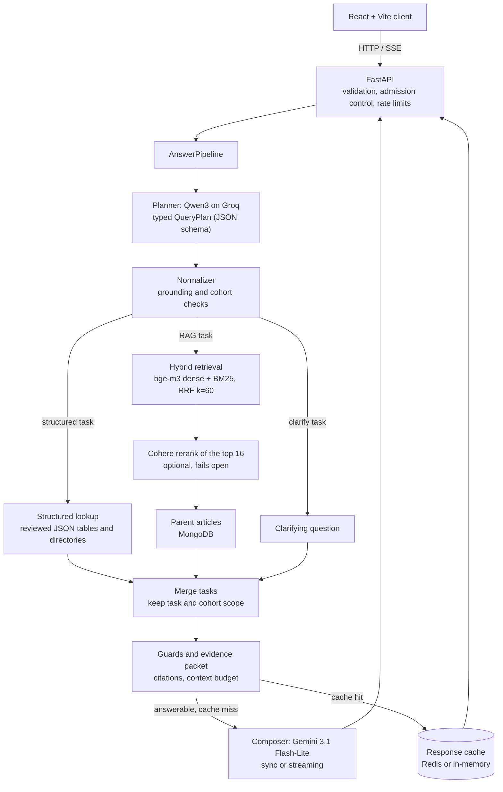
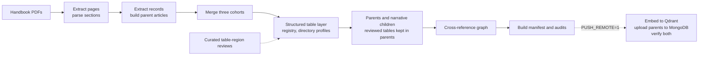

<div align="center">
  
  <h1>HCMUE AI — Student Handbook Assistant</h1>
  <p><strong>A cohort-aware RAG assistant for the student handbooks of Ho Chi Minh City University of Education (K48–K49, K50, K51).</strong></p>
  <p>LLM query planning · deterministic plan validation · structured table lookup · hybrid retrieval with citations · streaming React UI</p>
  <p>
    <a href="https://hcmuebot.id.vn"></a>
    <a href="https://anhfeee-hcmue-handbook-rag-api.hf.space/docs"></a>
  </p>
  <p>
    <a href="https://github.com/AnhPhiNe/student-handbook-rag-chatbot/actions/workflows/ci.yml"></a>
    
    
    
    
    
    <a href="./LICENSE"></a>
  </p>
</div>

<p align="center">
  
</p>

> [!IMPORTANT]
> HCMUE AI is an independent student project, not an official application of the university. Check the cited handbook article or the responsible office before making an important academic decision.

## Contents

1. [Overview](#overview)
2. [Highlights](#highlights)
3. [Architecture](#architecture)
4. [Knowledge base](#knowledge-base)
5. [Evaluation](#evaluation)
6. [Getting started](#getting-started)
7. [API](#api)
8. [Project structure](#project-structure)
9. [Deployment](#deployment)
10. [Limitations and roadmap](#limitations-and-roadmap)
11. [Documentation](#documentation)
12. [License](#license)

## Overview

Each cohort at HCMUE receives its own student handbook: a long PDF of regulations, procedures, grading and scholarship tables, tuition rules and office directories. The rules differ between cohorts, the tables are hard to search, and students ask in informal Vietnamese, often without diacritics, and often several things at once.

HCMUE AI answers those questions from the three handbooks, K48–K49, K50 and K51, and cites the article it used. An LLM **plans** each question as typed tasks; deterministic code **checks** that plan and **executes** it. Exact values come from reviewed tables. Explanations come from retrieved handbook articles. A second LLM writes the final answer only from that evidence.

| Question type | Example (Vietnamese) | How it is answered |
|---|---|---|
| Table fact | *K51: IELTS 6.0 tương đương bậc mấy?* | Structured lookup in the foreign-language equivalency table; the exact value is passed to the writer as a fact lock |
| Directory | *Phòng Đào tạo ở đâu, email là gì?* | Office directory lookup by name or alias |
| Regulation or procedure | *Muốn bảo lưu kết quả học tập cần điều kiện gì?* | Hybrid retrieval over handbook articles, answered with citations |
| Several requests | *Học phí K51 thế nào và học bổng loại giỏi cần bao nhiêu điểm?* | One task per request, merged into a single answer |
| Missing information | *Điểm của em được xếp loại gì?* (no score given) | A clarifying question for the missing value |
| Out of scope | *Hôm nay trời mưa không?* | A statement that the handbook does not cover it |

The web app also includes a GPA calculator, credit and tuition tools, scholarship rules, downloadable forms and a student survival guide.

## Highlights

- **The LLM plans and the code verifies.** Qwen3 on Groq returns a JSON-schema `QueryPlan`: tasks, lookup type, slots, cohorts and clarification needs. A deterministic normalizer checks each slot against the question text (`slot_spans`), registry aliases and cohort rules. An invalid task becomes a clarification or a RAG task; the plan is never trusted blindly.
- **Exact facts come from tables, not from generation.** Nine lookup capabilities run over reviewed JSON catalogs: grading scales, foreign-language equivalency, scholarship classification, study duration, formulas, and office, faculty, program and student-service directories. A unique match becomes a `resolved_result` that the writer is instructed to keep verbatim.
- **Hybrid retrieval.** `BAAI/bge-m3` dense search in Qdrant and in-process BM25 are fused with reciprocal rank fusion (k = 60). An optional Cohere `rerank-v4.0-fast` pass reorders the top 16 children. Children then expand to their full parent article from MongoDB. An offline cross-reference graph adds related-article links for the UI.
- **Cohort isolation end to end.** Every task runs per cohort, and retrieved sources and citations are filtered to the cohort that was asked for.
- **Graceful degradation.** Each provider has a quota-aware key pool with per-key RPM, TPM and daily limits that honors the provider's retry hints. Reranking fails open to the RRF order. A planner failure falls back to a safe RAG plan. Admission control allows 3 concurrent requests, a queue of 10 and a 15 s wait; each client is limited to 5 requests per minute.
- **Reproducible data.** One command rebuilds the corpus from the PDFs, and the rebuild is byte-for-byte deterministic. A build manifest of hashes, counts and target collections ties the Qdrant and MongoDB contents to one build ID.
- **Frozen evaluation harness.** Four suites run over a hand-authored, source-anchored dataset. Every run records the git commit, the dataset hash and the model and prompt versions it measured.

## Architecture


```mermaid
flowchart TD
    UI["React + Vite client"] -->|"HTTP / SSE"| API["FastAPI<br/>validation, admission control, rate limits"]
    API --> Pipeline["AnswerPipeline"]
    Pipeline --> Planner["Planner: Qwen3 on Groq<br/>typed QueryPlan (JSON schema)"]
    Planner --> Normalizer["Normalizer<br/>grounding and cohort checks"]
    Normalizer -->|structured task| Lookup["Structured lookup<br/>reviewed JSON tables and directories"]
    Normalizer -->|RAG task| Retrieve["Hybrid retrieval<br/>bge-m3 dense + BM25, RRF k=60"]
    Normalizer -->|clarify task| Clarify["Clarifying question"]
    Retrieve --> Rerank["Cohere rerank of the top 16<br/>optional, fails open"]
    Rerank --> Parents["Parent articles<br/>MongoDB"]
    Lookup --> Merge["Merge tasks<br/>keep task and cohort scope"]
    Parents --> Merge
    Clarify --> Merge
    Merge --> Packet["Guards and evidence packet<br/>citations, context budget"]
    Packet -->|answerable, cache miss| Composer["Composer: Gemini 3.1 Flash-Lite<br/>sync or streaming"]
    Packet -->|cache hit| Cache[("Response cache<br/>Redis or in-memory")]
    Composer --> API
    Cache --> API
```

### Request lifecycle

1. **Receive.** The API validates the question, the selected cohort and the recent conversation history, then admits the request.
2. **Plan.** Student slang and abbreviations are expanded, then the planner splits the question into typed tasks. The normalizer validates and canonicalizes that plan before anything runs.
3. **Execute.** Each task runs per cohort. Structured tasks read reviewed tables and directories. RAG tasks retrieve narrative chunks, rerank them and expand them to full articles. Clarify tasks carry the question to ask.
4. **Guard.** Task results are merged without mixing cohorts. If nothing can be answered, the request stops with an explicit status and no composer call.
5. **Compose.** The evidence packet goes through the response cache, then to Gemini. The model answers the covered tasks and asks for anything missing.
6. **Deliver.** The same prepared answer is returned as JSON (`/chat`) or streamed as server-sent events (`/chat/stream`), with citations, structured results and related-article links.

| Situation | Outcome |
|---|---|
| The whole request lacks a required value | `needs_clarification`, with no composer call |
| The question is outside the handbooks | `out_of_domain`, with no composer call |
| Only part of a compound question is answerable | The answered parts plus a question about the missing part |
| No key is available or the provider fails | An explicit error status; failures are never cached |
| The reranker is unavailable | The original RRF order is used and the request continues |

## Knowledge base

| Artifact | v33 snapshot | Used for |
|---|---:|---|
| Full parent articles | 462 | Composer context and citations (MongoDB) |
| Narrative child chunks | 3,121 | Dense and BM25 search (Qdrant) |
| Reviewed structured tables | 35 | Deterministic lookup (not embedded) |
| Cross-reference edges | 78 | Related-article navigation in the UI |
| Embedding | `BAAI/bge-m3`, 1,024 dimensions | Dense child retrieval |

Per cohort: K48–K49 has 123 parents and 877 children, K50 has 166 and 1,082, and K51 has 173 and 1,162. Counts, hashes and the target collections are recorded in [`build_manifest.json`](data/processed/metadata/build_manifest.json).

### Offline build


```mermaid
flowchart LR
    PDF["Handbook PDFs"] --> Parse["Extract pages<br/>parse sections"]
    Parse --> Records["Extract records<br/>build parent articles"]
    Records --> Merge["Merge three cohorts"]
    Merge --> Tables["Structured table layer<br/>registry, directory profiles"]
    Reviews["Curated table-region reviews"] -.-> Tables
    Tables --> Split["Parents and narrative children<br/>reviewed tables kept in parents"]
    Split --> Graph["Cross-reference graph"]
    Graph --> Manifest["Build manifest and audits"]
    Manifest -.->|PUSH_REMOTE=1| Upload["Embed to Qdrant<br/>upload parents to MongoDB<br/>verify both"]
```

Tables live in two places. Parent articles keep them as readable Markdown for the writer, and the structured registry keeps them as JSON for lookup. Narrative children exclude reviewed table regions so that table rows do not crowd out prose in search.

Rebuild locally without touching the remote stores:

```bash
PUSH_REMOTE=0 python -m scripts.build_multi_cohort \
  --qdrant-collection student_handbook_semantic_v33 --mongo-collection parent_docs_v33
```

The command overwrites `data/processed/`, so run it in a clean worktree. With `PUSH_REMOTE=1` it also preflights the target collections, embeds and uploads, then verifies the remote contents against the manifest. See the [parent/child build contract](docs/PARENT_CHILD_BUILD_CONTRACT.md).

## Evaluation

The benchmark is `official_v1`: a hand-authored dataset in which every expected answer is anchored to a handbook source and reviewed before it was frozen ([dataset notes](data/eval/official_v1/README.md)).

| Suite | Cases | What it measures |
|---|---:|---|
| Deterministic | 135 | Planning and structured execution against accepted outcomes: task split, lookup choice, cohort, grounded slots and the exact table value |
| Retrieval | 155 | Ranking of the retrieved evidence: Hit@k, MRR, nDCG@5 and required-source recall |
| Generate + judge | 150 | End-to-end answers scored by a pinned LLM judge (`openai/gpt-oss-120b`): correctness, faithfulness, citation correctness, context recall and precision, hallucination rate |
| Production | 60 | Requests against the deployed API: success rate, 429s, cache behavior, streaming time to first token and p95 latency, with pass/fail release gates |

### Results

> [!NOTE]
> Results will be published after the next frozen run on the current code (pipeline `v76`, planner prompt `v43`, normalizer `v28`). Earlier development runs are recorded in [`RESULTS_AND_LIMITATIONS.md`](data/eval/official_v1/RESULTS_AND_LIMITATIONS.md).

<!-- TODO: fill in from the next frozen official_v1 run (deterministic, retrieval, generate + judge, production). -->

| Suite | Headline metric | Result |
|---|---|---|
| Deterministic | Cases passing every applicable assertion | — |
| Retrieval | Hit@5 / MRR / nDCG@5 | — |
| Generate + judge | Answer correctness / faithfulness | — |
| Production | Release gates | — |

### Running the suites

```bash
python -m scripts.run_official_deterministic --current-worktree
python -m scripts.run_official_answers --suite retrieval
python -m scripts.run_official_answers --suite answers
python -m scripts.run_official_answers --suite production --base-url https://<your-space>.hf.space
```

Each run writes its report and a `run_snapshot.json` under `data/eval/reports/`. `--limit N` runs a smoke subset, and `--output DIR` resumes an interrupted run. `--retrieval-mode no_graph` or `--retrieval-mode vector_only` runs a retrieval ablation. [`regrade_official_deterministic.py`](scripts/regrade_official_deterministic.py) rescores a saved run without any model calls. The suites disable the router and response caches, and they call paid providers.

## Getting started

### Prerequisites

- Python 3.11 and Node.js 20
- A Qdrant collection and a MongoDB database loaded from the v33 build (see [Offline build](#offline-build))
- API keys for Groq (planner) and Gemini (composer). Cohere (reranker), Redis (shared cache) and LangSmith (tracing) are optional.

### Backend

```bash
python3.11 -m venv .venv
source .venv/bin/activate          # Windows: .\.venv\Scripts\Activate.ps1
python -m pip install -r requirements-dev.txt
cp .env.example .env               # then fill in the values below
python -m uvicorn src.api.main:app --reload
```

Interactive API docs are then served at `http://127.0.0.1:8000/docs`.

| Variable | Required | Purpose |
|---|:---:|---|
| `QDRANT_URL`, `QDRANT_API_KEY`, `QDRANT_COLLECTION_NAME` | yes | Vector store for narrative children |
| `MONGODB_URL`, `MONGODB_DB_NAME`, `MONGODB_PARENT_COLLECTION` | yes | Parent articles |
| `GROQ_API_KEYS` | yes | Planner key pool (comma-separated); `GROQ_ROUTER_API_KEYS` can give the planner its own keys |
| `GEMINI_API_KEYS` | yes | Composer key pool (comma-separated) |
| `COHERE_API_KEYS` | no | Reranker key pool; without it retrieval uses the RRF order |
| `REDIS_URL` | no | Shared response cache; without it an in-memory cache is used |
| `LANGSMITH_TRACING`, `LANGSMITH_API_KEY`, `LANGSMITH_PROJECT` | no | Request tracing and user feedback |
| `STUDENT_RAG_RATE_LIMIT_PER_MINUTE`, `STUDENT_RAG_MAX_CONCURRENT_CHAT`, ... | no | Admission and rate-limit overrides |

[`.env.example`](.env.example) lists every setting with its default. Keep `.env` out of version control.

### Frontend

```bash
cd frontend
npm ci
npm run dev        # set VITE_API_BASE_URL to your backend
```

### Docker

```bash
docker build -t hcmue-rag .
docker run -p 7860:7860 --env-file .env hcmue-rag
```

The image runs one Uvicorn worker on port 7860, the same setup as the Hugging Face Space.

### Tests and checks

```bash
python -m pytest tests                   # unit and contract tests (no network)
python -m ruff check src tests --select E,F --ignore E402,E501
python scripts/check_deploy_artifacts.py # required runtime files and build manifest
```

CI runs these checks, plus the frontend lint and build, on every push and pull request to `main`.

## API

| Method | Path | Description |
|---|---|---|
| `POST` | `/chat` | Answer a question and return JSON |
| `POST` | `/chat/stream` | The same answer as server-sent events: `queued`, `progress`, `metadata`, `token`, `done`, `error` |
| `POST` | `/chat/feedback` | Thumbs up or down on an answer (`run_id`, `score`, optional `comment`) |
| `GET` | `/health` | Liveness |
| `GET` | `/health/readiness` | Qdrant, MongoDB, BM25 and artifact readiness |
| `GET` | `/health/artifacts` | Required files and configuration (admin key required) |
| `GET` | `/api/metrics/visits` | Visitor counter backed by Redis |

```bash
curl -X POST http://127.0.0.1:8000/chat \
  -H "Content-Type: application/json" \
  -d '{"query": "IELTS 6.0 tương đương bậc mấy?", "cohort": "K51"}'
```

The response carries `answer`, `status` (`answered`, `needs_clarification`, `out_of_domain`, `low_confidence`, ...), `citations`, `structured_results` and `related_references`.

## Project structure

```text
├── configs/                  # Planner, retrieval, composer and lookup-registry settings
├── data/
│   ├── raw/                  # Source handbook PDFs
│   ├── curated/              # Reviewed table regions and corrections
│   ├── processed/            # Versioned build output: parents, children, tables, graph, manifest
│   └── eval/official_v1/     # Frozen benchmark, results notes and provenance
├── src/
│   ├── api/                  # FastAPI routes, schemas, admission control, health checks, tracing
│   ├── services/             # Shared AnswerPipeline lifecycle
│   ├── generation/           # Pipeline orchestration, evidence packet, prompts, Gemini client
│   ├── retrieval/core/       # Planner, normalizer, structured lookups, hybrid retrieval, reranker
│   ├── retrieval/vectorstore/# MongoDB parent store
│   ├── common/               # Cohorts, text folding, key pool, I/O and config helpers
│   ├── ingestion/            # PDF loading and cross-reference graph
│   ├── preprocessing/        # Handbook structure parsing
│   ├── extraction/           # Structured-record extraction
│   ├── chunking/             # Parent article construction
│   └── evaluation/           # Suites: deterministic, retrieval, answers, production
├── scripts/                  # Build, publish, evaluation and deploy entry points
├── frontend/                 # React 19 + TypeScript + Vite client
├── tests/                    # Unit, contract and regression tests
└── docs/                     # Build and execution contracts, experiment write-ups
```

A suggested reading order for the backend: [`schemas.py`](src/api/schemas.py), then [`answer_pipeline.py`](src/generation/answer_pipeline.py), [`ai_router.py`](src/retrieval/core/ai_router.py), [`query_plan.py`](src/retrieval/core/query_plan.py), [`structured_dispatcher.py`](src/retrieval/core/structured_dispatcher.py) and [`hybrid_pipeline.py`](src/retrieval/core/hybrid_pipeline.py), and finally [`prompt_builder.py`](src/generation/prompt_builder.py). Read the matching tests alongside each file.

| Configuration | Controls |
|---|---|
| [`ai_router.yaml`](configs/ai_router.yaml) | Planner model, output budget and key-pool limits |
| [`answer_generation.yaml`](configs/answer_generation.yaml) | Composer model, response cache and key-pool limits |
| [`retrieval.yaml`](configs/retrieval.yaml) | Embedding model, top-k and reranker settings |
| [`structured_lookup_registry.yaml`](configs/structured_lookup_registry.yaml) | Lookup capabilities, slots and aliases shown to the planner |
| [`hcmue_slang_dictionary.yaml`](configs/hcmue_slang_dictionary.yaml) | Student slang and abbreviation normalization |

## Deployment

| Part | Hosting | Notes |
|---|---|---|
| Frontend | Vercel ([hcmuebot.id.vn](https://hcmuebot.id.vn)) | Static React build; `/api/visits` is proxied to the backend |
| Backend | Hugging Face Spaces (Docker) | One worker; runtime files come from an explicit allowlist |
| Vector store | Qdrant | Collection `student_handbook_semantic_v33` |
| Documents | MongoDB | Collection `parent_docs_v33` |

[`deploy_hf_backend.ps1`](scripts/deploy_hf_backend.ps1) packages only the allowlisted runtime files and checks that the build manifest targets the intended collections. `-DryRun` validates the package without touching the Space. After a deploy, check `/health/readiness`, then run the production suite against the Space.

## Limitations and roadmap

- **Scope.** The system covers the three handbooks only. It does not calculate new values from a formula, perform OCR on image-only tables, or answer from outside knowledge.
- **Judge-based scores.** Answer quality is scored by an LLM judge; the judge has not yet been validated against human labels.
- **Load.** Throughput is bounded by free-tier provider quotas and a single worker.
- **Next.** A closed beta with students; a fresh generalization question set; human validation of the judge; ablations and baselines under a pre-registered protocol.

## Documentation

| Document | Content |
|---|---|
| [Parent/child build contract](docs/PARENT_CHILD_BUILD_CONTRACT.md) | How parents, children and reviewed tables are built and validated |
| [Structured execution contract](docs/STRUCTURED_EXECUTION_CONTRACT.md) | Lookup capabilities, fact locks and evidence rules |
| [Technical debt](docs/TECHNICAL_DEBT.md) | Known maintenance boundaries |
| [Onboarding guide](docs/UA_ONBOARDING.md) | A guided tour of the code base |
| [Cohere rerank experiment](docs/COHERE_FAST_RERANK_EXPERIMENT.md) | Why the reranker was added |

## License

The source code is released under the [MIT License](LICENSE). The handbook content and university regulations belong to their respective publishers.
