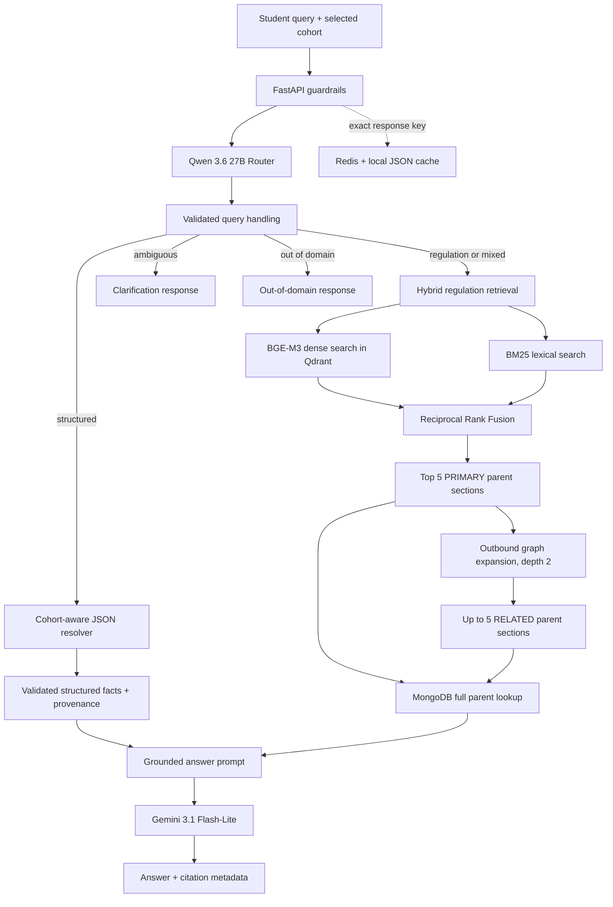

# HCMUE AI - Student Handbook RAG Assistant

> **Release candidate:** V9.1.1 dataset / V25 runtime (July 2026)  
> Independent, non-commercial student project. This is not an official application of Ho Chi Minh City University of Education. Important academic or financial decisions should be verified against the cited handbook section or an official university office.

<p align="center">
  
  
  
  
  
  
  <br>
  <a href="https://www.hcmuebot.id.vn">
    
  </a>
  <a href="https://huggingface.co/spaces/AnhFeee/hcmue-handbook-rag-api">
    
  </a>
</p>

## Overview


HCMUE AI is a cohort-aware retrieval and generation system for the **K48-K49, K50, and K51** HCMUE student handbooks. It is designed around two different information shapes:

- **Structured catalogs** for grade tables, study duration, scholarships, foreign-language equivalency, formulas, programs, faculties, offices, and student services.
- **Regulation RAG** for policies, conditions, consequences, exceptions, and cross-referenced handbook articles.

The runtime does not flatten every table row into the vector collection. Structured data remains queryable JSON, while Qdrant contains only regulation text. This keeps retrieval focused without losing exact table and directory data.

## Live Demo

- **Student-facing chat:** [https://www.hcmuebot.id.vn](https://www.hcmuebot.id.vn)
- **Backend Space:** [https://huggingface.co/spaces/AnhFeee/hcmue-handbook-rag-api](https://huggingface.co/spaces/AnhFeee/hcmue-handbook-rag-api)
- **Source repository:** [https://github.com/AnhPhiNe/student-handbook-rag-chatbot](https://github.com/AnhPhiNe/student-handbook-rag-chatbot)

Example questions:

- `K51 diem D+ co qua mon khong?`
- `K50 hoc toi da bao nhieu nam?`
- `PDT o dau va email la gi?`
- `Khoa CNTT K51 co nhung nganh nao?`
- `Dieu kien tam ngung hoc la gi?`
- `Neu vuot thoi gian hoc toi da thi xu ly the nao?`

## Current Architecture


```mermaid
flowchart TD
    User["Student query + selected cohort"] --> API["FastAPI guardrails"]
    API --> Router["Qwen 3.6 27B Router"]
    Router --> Query["Validated query handling"]

    Query -->|structured| Resolver["Cohort-aware JSON resolver"]
    Query -->|regulation or mixed| Retrieval["Hybrid regulation retrieval"]
    Query -->|ambiguous| Clarify["Clarification response"]
    Query -->|out of domain| Reject["Out-of-domain response"]

    Resolver --> Structured["Validated structured facts + provenance"]

    Retrieval --> Dense["BGE-M3 dense search in Qdrant"]
    Retrieval --> Sparse["BM25 lexical search"]
    Dense --> RRF["Reciprocal Rank Fusion"]
    Sparse --> RRF
    RRF --> Primary["Top 5 PRIMARY parent sections"]
    Primary --> Graph["Outbound graph expansion, depth 2"]
    Graph --> Related["Up to 5 RELATED parent sections"]
    Primary --> Mongo["MongoDB full parent lookup"]
    Related --> Mongo

    Structured --> Prompt["Grounded answer prompt"]
    Mongo --> Prompt
    Prompt --> Gemini["Gemini 3.1 Flash-Lite"]
    Gemini --> Output["Answer + citation metadata"]

    API -. exact response key .-> Cache["Redis + local JSON cache"]
```

### 1. Query handling and routing

The system uses `qwen/qwen3.6-27b` through Groq as a compact structured router. It returns a typed decision for:

- `structured`
- `rag` with `regulation` or `mixed` execution
- `clarify`
- `out_of_domain`

The router may normalize missing accents, common typos, abbreviations, and conversational follow-ups. A validator chooses the effective query and rejects unsafe normalization that changes the cohort, numbers, or conversational meaning. The HCMUE slang dictionary is applied to the retrieval query, not to the user-visible question.

There is no separate semantic QueryRewriter model in the current runtime.

### 2. Structured catalogs

The Router can select one of nine structured lookup groups:

| Group | Typical data |
|---|---|
| Foreign language | IELTS, TOEFL, JLPT, HSK, TOPIK equivalency |
| Study duration | Standard and maximum duration by training mode |
| Scholarship | Scholarship score classification |
| Scoring | Grade conversion, pass/fail, academic and conduct classification |
| Student service | Responsible unit for a requested student service |
| Office | Email, phone, website, and office location |
| Faculty | Faculty contact information |
| Program | Program existence, faculty ownership, and cohort-specific lists |
| Formula | Defined GPA or scholarship formulas, without performing calculations |

The resolver reads cohort-tagged JSON, validates required slots and provenance, and passes the grounded result to Gemini for consistent natural-language phrasing. A compatibility direct-answer formatter still exists for tests, but it is disabled in the production configuration.

The backend intentionally has **no structured form or procedure lookup**. Form and procedure requests are handled only when the regulation corpus contains enough relevant evidence. The frontend may still provide independent UI utilities.

### 3. Regulation retrieval

The production retrieval path is:

```text
Validated query
-> BGE-M3 dense search, top 24 child candidates
-> BM25 lexical search, top 24 child candidates
-> Reciprocal Rank Fusion
-> group candidates by parent section
-> top 5 PRIMARY parent sections
-> outbound graph expansion, depth 2
-> up to 5 deduplicated RELATED parent sections
-> MongoDB full parent lookup
-> Gemini context
```

Qdrant stores only `regulation_text`. Structured JSON rows are not inserted as synthetic vector chunks. PhoRanker remains available for controlled retrieval ablations but is not on the default production request path.

### 4. Context and citations

- Gemini receives up to five full **PRIMARY SOURCES**.
- The graph can add up to five **RELATED SOURCES** for directly referenced articles and conditions.
- The context safety cap is `160,000` characters, with a per-document cap of `50,000`.
- PRIMARY sources determine the main answer. RELATED sources explain directly referenced rules without replacing the primary conclusion.
- Citation metadata remains bound to the parent section, cohort, document, and source pages.

### 5. Reliability controls

- Gemini `gemini-3.1-flash-lite` generation with request-local clients.
- Quota-aware least-recently-used key selection.
- Per-key local safety limits: `12 RPM`, `450 RPD`, and a `65s` cooldown after rate limits.
- Retry and key failover for `429`, timeout, unavailable, and transport-disconnect errors.
- Concurrency-safe key state and request-local Gemini clients.
- Exact response caching with Redis and local JSON fallback; no semantic-cache verifier.
- FastAPI rate limiting, bounded concurrency, queue backpressure, streaming, and Langfuse tracing.

## Data Snapshot

The release-candidate storage was rebuilt from the three handbook cohorts:

| Artifact | Count / state |
|---|---:|
| MongoDB parent sections | 478 |
| Qdrant regulation chunks | 3,300 |
| Child chunks | 2,822 |
| Section-heading chunks | 478 |
| Regulation graph edges | 103 |
| Qdrant content types | `regulation_text` only |
| Qdrant collection | `student_handbook_semantic_v9_candidate` |
| MongoDB collection | `parent_docs_v9_candidate` |

Parent distribution:

| Cohort | Parent sections |
|---|---:|
| K48-K49 | 131 |
| K50 | 166 |
| K51 | 181 |

Structured data is stored separately in `data/processed/tables/` and `data/processed/directories/`.

## Evaluation

The final evaluation uses the frozen **V9.1.1 holdout** and records dataset hashes, document-store hash, configuration hashes, Git commit, model IDs, storage collections, Python version, and run timestamp.

| Suite | Cases | Purpose |
|---|---:|---|
| Structured routing and resolution | 120 | Positive lookups, hard negatives, ambiguity, and out-of-domain behavior |
| End-to-end regulation retrieval | 180 | Router, query handling, Qdrant/BM25, graph, and Mongo parent binding |
| Generated-answer Judge | 100 | 60 regulation, 20 structured, 10 mixed, and 10 unanswerable cases |
| Human audit | 25 | 15 stratified-random headline cases and 10 low-Judge-score diagnostic cases |
| Production performance | 60 | Cold RAG, structured, warm cache, streaming, and burst traffic |
| Fault injection | 13 | Provider, quota, retrieval, storage, and concurrency failures |

### Structured routing and resolution

| Metric | Result |
|---|---:|
| Cases passed | 117 / 120 |
| Exactness | 97.50% |
| Precision | 100.00% |
| Recall | 95.00% |
| F1 | 97.44% |
| Intent accuracy | 97.22% |
| Strategy accuracy | 97.22% |
| Structured value exactness | 100.00% |
| Citation metadata accuracy | 100.00% |
| Cross-cohort leaks | 0 |

The three misses were conservative router validation failures rather than false-positive structured answers.

### End-to-end regulation retrieval

This suite includes Qwen routing and validated query handling before retrieval.

| Metric | Result | 95% CI |
|---|---:|---:|
| Hit@1 | 68.33% | 61.67-75.00% |
| Hit@3 | 87.78% | 82.78-92.22% |
| Hit@5 | 92.22% | 87.78-96.11% |
| MRR | 78.49% | 73.37-83.33% |
| nDCG@5 | 80.61% | 75.98-84.76% |
| Cohort match | 99.44% | - |
| Content-type match | 97.22% | - |
| Cohort leak rate | 0.00% | - |
| Retrieval p95 | 3.20s | - |

### Generated-answer evaluation

`openai/gpt-oss-120b` is used as a strict RAGAS-style Judge. This is an automated diagnostic layer, not the sole quality claim.

| Metric | Result |
|---|---:|
| Faithfulness | 72.81% |
| Answer relevancy | 87.64% |
| Answer correctness | 77.81% |
| Context precision | 70.40% |
| Context recall | 81.51% |
| Citation correctness | 79.36% |
| Numeric accuracy | 95.00% |
| Abstention correctness | 85.00% |

The Judge flagged unsupported claims in 37% of cases. Manual review found that the Judge was frequently stricter than the handbook evidence warranted, so automated scores are reported together with the human audit rather than presented as ground truth.

### Human audit

The 15 stratified-random cases are the representative headline sample:

| Metric | Result |
|---|---:|
| Human score | 93.33% |
| Correctness | 96.67% |
| Faithfulness | 96.67% |
| Citation correctness | 93.33% |
| Actual unsupported claims | 1 / 15 |
| Critical false passes | 0 / 15 |

Ten additional cases were intentionally selected from the lowest Judge scores for failure analysis. They are not mixed into the representative headline average:

| Diagnostic metric | Result |
|---|---:|
| Correctness | 35.00% |
| Faithfulness | 50.00% |
| Citation correctness | 50.00% |
| Actual unsupported claims | 5 / 10 |

This risk subset exposed a small tail of generation, retrieval, and annotation failures while also identifying Judge false positives.

### Production performance and robustness

The V25 production run executed 60 requests against a local FastAPI server configured with the release-candidate Qdrant and MongoDB collections.

| Metric | Result |
|---|---:|
| Successful requests | 60 / 60 |
| Transport success | 100.00% |
| Payload success | 100.00% |
| HTTP 429 rate | 0.00% |
| Timeout rate | 0.00% |
| Overall latency p95 | 5.83s |
| Cold regulation RAG p95 | 13.17s |
| Deterministic/structured p95 | 2.47s |
| Streaming TTFT p95 | 1.84s |
| Burst success, concurrency 3 and 5 | 10 / 10 |
| Warm-cache hit rate | 90.00% |
| Telemetry coverage | 100.00% |

Fault injection passed **13 / 13** scenarios, including rate limits, key cooldown, exhausted quotas, streaming timeout, empty Gemini output, transport disconnect, concurrent Gemini calls, retrieval errors, Mongo parent misses, and API capacity saturation.

## How to Interpret the Results

- The project reports structured resolution, retrieval, generated answers, human audit, and production behavior separately. There is no blended score that hides a weak layer.
- Retrieval numbers are end-to-end and include the Router and query handling, which is closer to the deployed user path than isolated vector-search metrics.
- LLM-as-a-Judge scores are retained for reproducibility, but the stratified human audit is the primary answer-quality calibration.
- The 10-case risk subset is deliberately difficult and must not be treated as a random estimate of overall user quality.
- The system is presented as an evaluated, production-oriented release candidate, not as an official or error-free academic decision system.

## Technology Stack

| Layer | Technology |
|---|---|
| Frontend | React, Vite, TypeScript, lucide-react |
| API | FastAPI, Uvicorn, Pydantic |
| Router | Groq `qwen/qwen3.6-27b` |
| Answer model | Google `gemini-3.1-flash-lite` |
| Judge | Groq `openai/gpt-oss-120b` |
| Embeddings | `BAAI/bge-m3` |
| Retrieval | Qdrant dense search, BM25, RRF, NetworkX graph |
| Parent store | MongoDB Atlas |
| Structured store | Versioned local JSON catalogs |
| Cache | Redis with local JSON fallback |
| Observability | Langfuse and evaluation telemetry |
| Deployment | Vercel frontend, Hugging Face Spaces backend |

## Repository Layout

```text
student_handbook_rag/
|-- configs/                  # Runtime, router, retrieval, and ingestion configuration
|-- data/
|   |-- raw/                  # Source handbooks
|   |-- processed/            # Parent docs, regulation chunks, graph, tables, directories
|   `-- eval/                 # Frozen datasets and local evaluation reports
|-- frontend/                 # React + Vite application
|-- scripts/                  # Build, storage, deployment, and evaluation commands
|-- src/
|   |-- api/                  # FastAPI routes, schemas, controls, telemetry
|   |-- chunking/             # Regulation child-parent chunk construction
|   |-- extraction/           # Structured catalog extraction
|   |-- generation/           # Gemini client, prompt, cache, citations, answer pipeline
|   |-- ingestion/            # PDF and graph ingestion
|   |-- preprocessing/        # Section parsing and cleanup
|   `-- retrieval/            # Router, structured resolvers, dense/BM25/graph retrieval
`-- tests/                    # Unit and integration tests
```

## Local Setup

### Backend

```bash
python -m venv .venv

# Windows PowerShell
.\.venv\Scripts\Activate.ps1

# macOS / Linux
source .venv/bin/activate

pip install -r requirements.txt
python -m uvicorn src.api.main:app --host 0.0.0.0 --port 8000
```

### Frontend

```bash
cd frontend
npm install
npm run dev
```

## Environment Variables

Create `.env` in the repository root and never commit real secrets:

```env
# Gemini answer generation. Plural form enables load balancing.
GEMINI_API_KEYS=gemini_key_1,gemini_key_2
# GEMINI_API_KEY=single_key_fallback

# Groq Router and evaluation Judge.
GROQ_API_KEYS=groq_key_1,groq_key_2

# Release-candidate storage.
QDRANT_URL=https://your-cluster.qdrant.io
QDRANT_API_KEY=your_qdrant_key
QDRANT_COLLECTION_NAME=student_handbook_semantic_v9_candidate
MONGODB_URL=mongodb+srv://...
MONGODB_PARENT_COLLECTION=parent_docs_v9_candidate

# Optional two-tier cache and tracing.
REDIS_URL=rediss://...
LANGFUSE_SECRET_KEY=sk-lf-...
LANGFUSE_PUBLIC_KEY=pk-lf-...
LANGFUSE_HOST=https://cloud.langfuse.com

# API controls.
STUDENT_RAG_RATE_LIMIT_PER_MINUTE=20
STUDENT_RAG_MAX_CONCURRENT_CHAT=3
STUDENT_RAG_MAX_QUEUE_SIZE=10
STUDENT_RAG_QUEUE_TIMEOUT_SECONDS=15
```

Router overrides are optional:

```env
STUDENT_RAG_ROUTER_MODEL=qwen/qwen3.6-27b
STUDENT_RAG_ROUTER_MAX_OUTPUT_TOKENS=384
STUDENT_RAG_ROUTER_REASONING_EFFORT=auto
```

See `.env.example` for the complete template.

## Evaluation Commands

```bash
# Validate the frozen dataset and source bindings.
python scripts/evaluate_system_v8.py --suite validate --profile full \
  --dataset data/eval/v9_1_1_final_holdout \
  --output data/eval/reports/v9_1_1_release_candidate

# Structured routing and resolution.
python scripts/evaluate_system_v8.py --suite deterministic --profile full \
  --dataset data/eval/v9_1_1_final_holdout \
  --output data/eval/reports/v9_1_1_release_candidate

# End-to-end Router + query handling + retrieval.
python scripts/evaluate_system_v8.py --suite retrieval --profile full \
  --backend qdrant \
  --ablation vector_primary_graph_supplement \
  --retrieval-scope end_to_end \
  --dataset data/eval/v9_1_1_final_holdout \
  --output data/eval/reports/v9_1_1_release_candidate

# Generate answers once, then Judge the cached answers.
python scripts/evaluate_system_v8.py --suite generate --profile full \
  --backend qdrant \
  --dataset data/eval/v9_1_1_final_holdout \
  --output data/eval/reports/v9_1_1_release_candidate

python scripts/evaluate_system_v8.py --suite judge --profile full \
  --backend qdrant \
  --dataset data/eval/v9_1_1_final_holdout \
  --output data/eval/reports/v9_1_1_release_candidate

# Fault injection does not call the production LLM APIs.
python scripts/evaluate_system_v8.py --suite faults --profile full \
  --dataset data/eval/v9_1_1_final_holdout \
  --output data/eval/reports/v9_1_1_release_candidate_v25
```

For production performance, start the API first and then run:

```bash
python scripts/evaluate_system_v8.py --suite production --profile full \
  --base-url http://127.0.0.1:8000 \
  --dataset data/eval/v9_1_1_final_holdout \
  --output data/eval/reports/v9_1_1_release_candidate_v25
```

## Build and Test

```bash
# Rebuild regulation chunks and graph after source-boundary changes.
python -m scripts.build_v7_child_parent_index
python -m src.ingestion.graph_extractor

# Push the current regulation chunks to the configured Qdrant collection.
python scripts/push_to_qdrant_v7.py

# Backend checks.
python -m pytest -q tests
python -m ruff check src tests scripts/evaluate_system_v8.py

# Frontend checks.
cd frontend
npm run lint
npm run build
```

The current backend suite contains **153 passing tests**.

## Known Limitations

- The knowledge base covers the three processed handbook cohorts, not every university policy or later official update.
- Structured form and procedure catalogs are intentionally excluded from the backend.
- Formula lookup returns handbook formulas but does not act as a general calculator.
- A small low-confidence tail remains for ambiguous, unanswerable, and cross-referenced questions; citations should be checked for important decisions.
- The automated Judge has measurable false positives, especially when the evaluation packet omits supporting context.
- Gemini and Groq throughput remains bounded by provider quotas. The current key-state cache is appropriate for a single backend process; multi-replica deployment should move quota state to Redis or a database.
- BM25 is built from Qdrant payloads during startup, so large future collections will require a persisted sparse index.

## License and Attribution

This project is released under the MIT License. Handbook content belongs to its respective source documents and institution. The software is intended for learning, experimentation, and community support.
