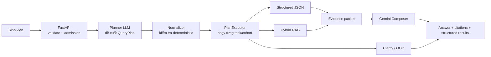
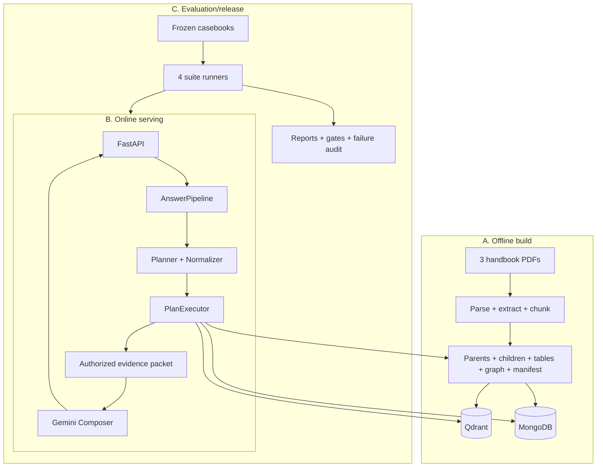
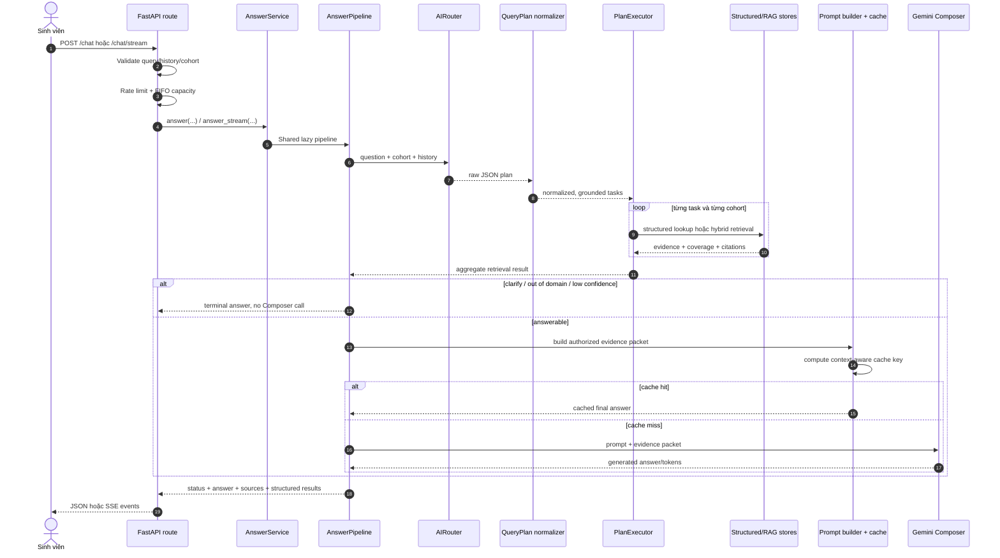
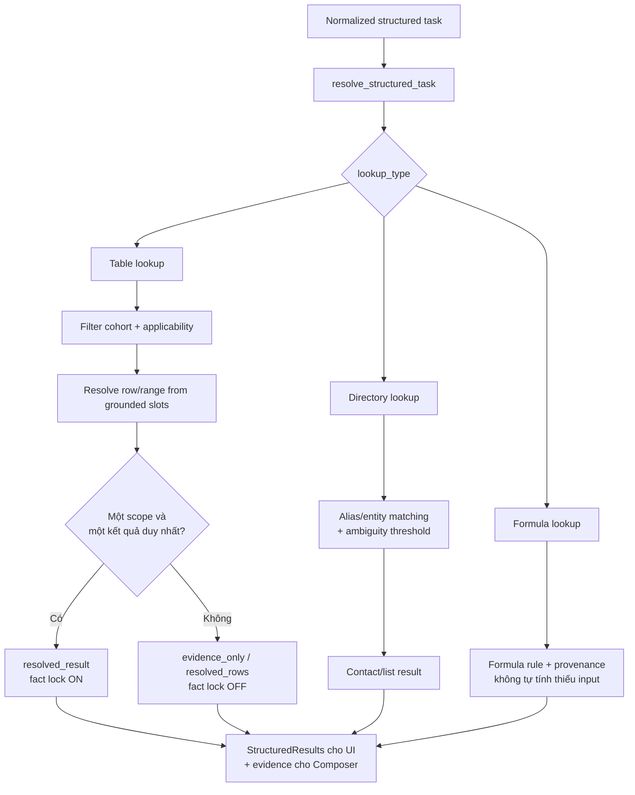
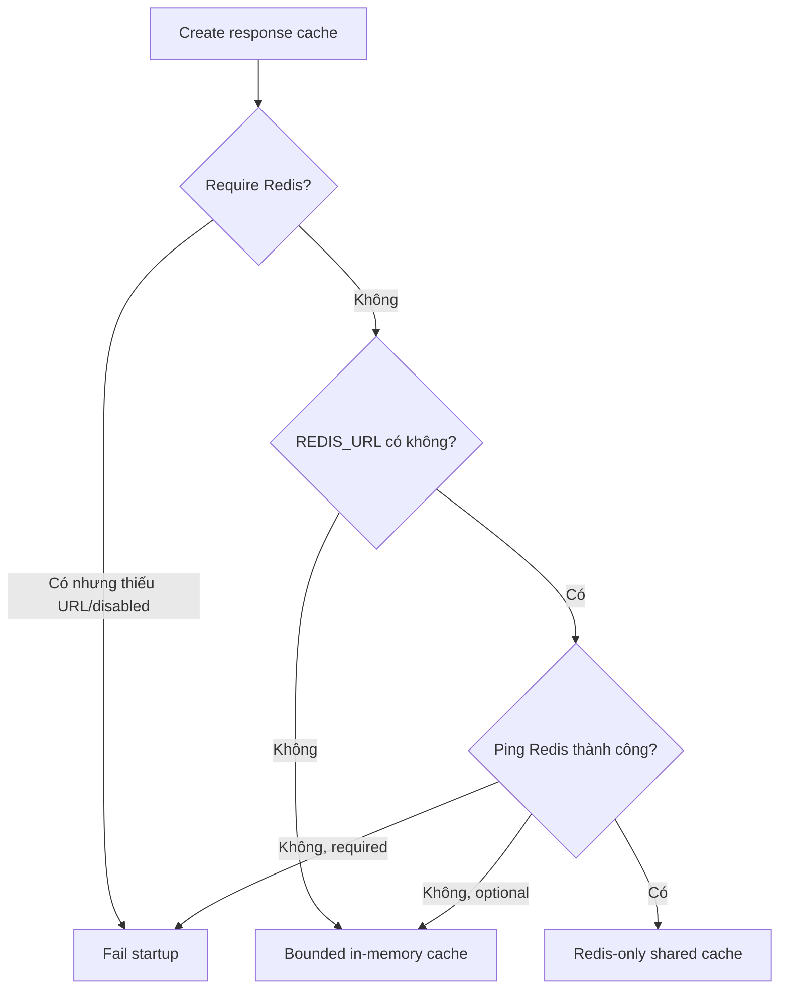
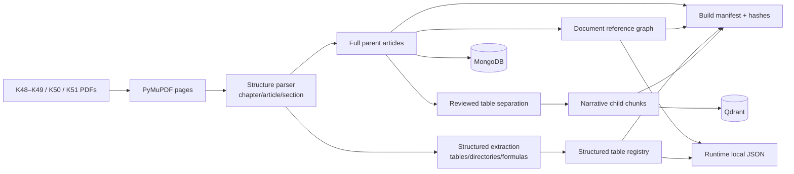
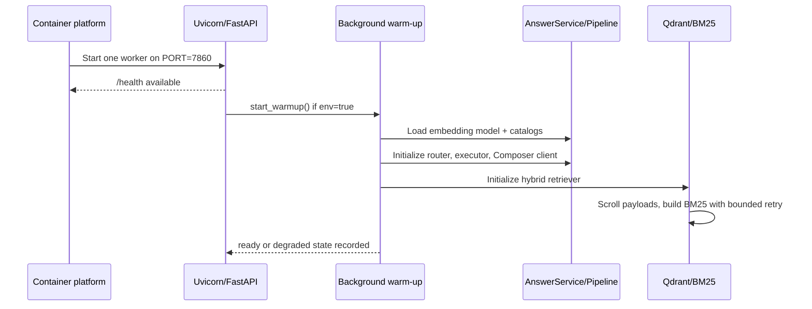
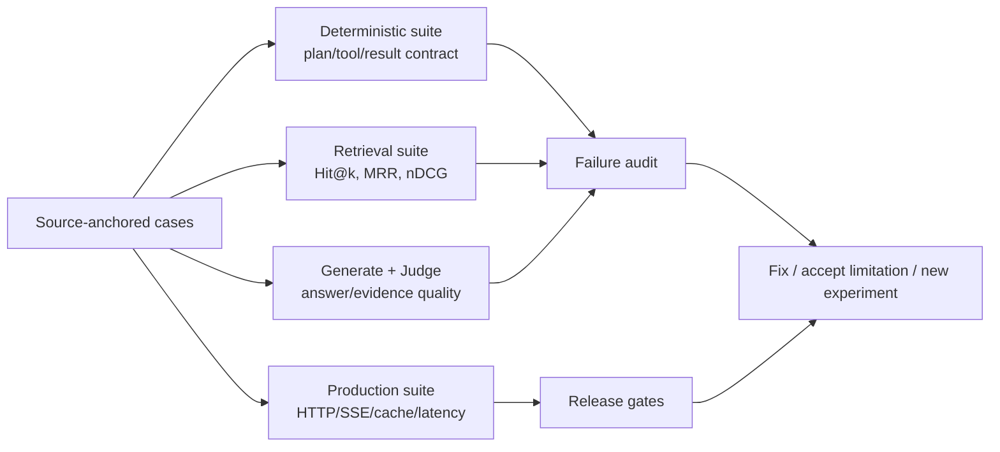

# Báo cáo kỹ thuật backend — HCMUE Student Handbook RAG

> Tài liệu onboarding dành cho người chưa biết dự án. Nội dung mô tả source tại
> commit `93415e5c914bf24524a79be043352b053bb4dd19` (2026-09-13). Phần backend,
> config và Docker không đổi so với runtime commit `6eba6d4a46a3ea415cb96338d00c679d431ff20c`
> đã dùng trong lần đo production ngày 2026-09-12. Đây là tài liệu giải thích hệ
> thống, không phải chứng nhận production hoặc cam kết SLA.

## Mục lục

1. [Dự án giải quyết bài toán gì?](#1-dự-án-giải-quyết-bài-toán-gì)
2. [Mô hình tư duy trong 90 giây](#2-mô-hình-tư-duy-trong-90-giây)
3. [Bộ diagram và cách đọc](#3-bộ-diagram-và-cách-đọc)
4. [Thuật ngữ quan trọng](#4-thuật-ngữ-quan-trọng)
5. [Kiến trúc tổng thể](#5-kiến-trúc-tổng-thể)
6. [Luồng một request từ đầu đến cuối](#6-luồng-một-request-từ-đầu-đến-cuối)
7. [Planner và deterministic normalizer](#7-planner-và-deterministic-normalizer)
8. [PlanExecutor và mô hình task](#8-planexecutor-và-mô-hình-task)
9. [Nhánh structured lookup](#9-nhánh-structured-lookup)
10. [Nhánh hybrid retrieval](#10-nhánh-hybrid-retrieval)
11. [Evidence packet, Composer và citation](#11-evidence-packet-composer-và-citation)
12. [Response cache](#12-response-cache)
13. [API đồng bộ và streaming](#13-api-đồng-bộ-và-streaming)
14. [Offline data pipeline](#14-offline-data-pipeline)
15. [Runtime startup và readiness](#15-runtime-startup-và-readiness)
16. [Độ ổn định và graceful degradation](#16-độ-ổn-định-và-graceful-degradation)
17. [Bảo mật, riêng tư và giới hạn vận hành](#17-bảo-mật-riêng-tư-và-giới-hạn-vận-hành)
18. [Evaluation và cách đọc các con số](#18-evaluation-và-cách-đọc-các-con-số)
19. [Bản đồ source code](#19-bản-đồ-source-code)
20. [Lộ trình đọc source cho người mới](#20-lộ-trình-đọc-source-cho-người-mới)
21. [Ba ví dụ chạy xuyên hệ thống](#21-ba-ví-dụ-chạy-xuyên-hệ-thống)
22. [Điểm phức tạp và technical debt](#22-điểm-phức-tạp-và-technical-debt)
23. [Cách thay đổi hệ thống an toàn](#23-cách-thay-đổi-hệ-thống-an-toàn)
24. [Giới hạn hiện tại và hướng phát triển](#24-giới-hạn-hiện-tại-và-hướng-phát-triển)
25. [Phụ lục cấu hình](#25-phụ-lục-cấu-hình)

---

## 1. Dự án giải quyết bài toán gì?

Mỗi khóa sinh viên HCMUE có một cuốn sổ tay riêng. Sổ tay là PDF dài, chứa nhiều
loại thông tin không đồng nhất:

- quy chế đào tạo và thủ tục hành chính;
- bảng quy đổi điểm, ngoại ngữ và thời gian học;
- điều kiện, mức tiền và cách xếp loại học bổng;
- danh bạ phòng ban, khoa, ngành và dịch vụ sinh viên;
- các điều khoản có thể dẫn chiếu tới điều khoản khác;
- quy định khác nhau giữa K48–K49, K50 và K51.

Một chatbot chỉ đưa toàn bộ PDF cho LLM sẽ gặp bốn vấn đề:

1. Bảng số liệu khó được truy xuất và đọc chính xác.
2. Một câu có thể hỏi nhiều việc, thuộc nhiều cơ chế trả lời khác nhau.
3. Quy định của khóa này có thể bị trộn với khóa khác.
4. LLM có thể trả lời trôi chảy dù không có bằng chứng phù hợp.

Backend này giải quyết bằng mô hình **plan → validate → execute → authorize
evidence → compose**:

- LLM thứ nhất chỉ lập kế hoạch dưới dạng JSON có schema.
- Code deterministic kiểm tra kế hoạch trước khi chạy.
- Số liệu chính xác được đọc bằng structured lookup trên JSON đã review.
- Quy định dạng văn bản được tìm bằng dense retrieval + BM25 + reranker.
- Mọi kết quả giữ identity của task và cohort.
- Chỉ evidence đã được cho phép mới đi vào prompt của LLM viết câu trả lời.
- Hệ thống dừng sớm khi cần hỏi lại, ngoài phạm vi hoặc không đủ bằng chứng.

### Phạm vi trả lời

| Nhóm câu hỏi | Ví dụ | Cơ chế chính |
|---|---|---|
| Giá trị trong bảng | “IELTS 6.0 tương đương bậc mấy?” | Structured lookup |
| Tra điểm/xếp loại | “5.2 có qua môn không?” | Structured lookup, có thể cần `course_scope` |
| Danh bạ | “Email Phòng Đào tạo?” | Directory lookup |
| Quy định/thủ tục | “Điều kiện bảo lưu là gì?” | Hybrid RAG |
| Câu hỏi ghép | “Học phí và học bổng thì sao?” | Nhiều task, sau đó aggregate |
| Thiếu đầu vào | “Em xếp loại gì?” | Clarification, không gọi Composer |
| Ngoài sổ tay | “Hôm nay thời tiết thế nào?” | Out-of-domain, không gọi Composer |

Hệ thống không tự truy cập hồ sơ cá nhân của sinh viên, không tính toán mọi loại
công thức, không dùng kiến thức ngoài sổ tay để lấp chỗ trống, và không thay thế
quyết định chính thức của nhà trường.

---

## 2. Mô hình tư duy trong 90 giây

Hãy hình dung backend như một nhóm năm người:

1. **Lễ tân API** kiểm tra request, rate limit và chỗ trống xử lý.
2. **Người chia việc Planner** đọc câu hỏi và tạo tối đa ba task.
3. **Kiểm toán viên Normalizer** không tin Planner hoàn toàn; kiểm tra cohort,
   lookup type, slot và phần text làm bằng chứng cho slot.
4. **Nhân viên tra cứu PlanExecutor** đưa mỗi task tới đúng quầy: bảng JSON,
   danh bạ, hoặc hệ thống tìm văn bản.
5. **Biên tập viên Composer** chỉ viết từ packet bằng chứng đã được duyệt.



Điểm quan trọng nhất: **LLM không tự quyết định dữ liệu nào là đúng**. Planner
được phép đề xuất; code quyết định cái gì được thực thi và bằng chứng nào được
đưa sang Composer.

---

## 3. Bộ diagram và cách đọc

Portal [Toàn bộ kiến trúc backend](https://anhphine.github.io/student-handbook-rag-chatbot/architecture/index.html) nhúng chín diagram
tương tác trong một trang. Mỗi diagram có thể zoom, search, focus node, trace
relationship và đổi light/dark mode. Viewer UI của Archify dùng tiếng Anh; nội
dung do dự án viết bằng tiếng Việt.

### 3.1 Kiến trúc tổng thể

[Mở diagram](https://anhphine.github.io/student-handbook-rag-chatbot/architecture/system-overview.html)

**Diagram trả lời:** hệ thống có những boundary nào và dữ liệu đi qua chúng ra
sao?

**Cách đọc:** bắt đầu từ React client, đi qua FastAPI, AnswerPipeline, Planner và
Normalizer. Từ đây luồng tách thành structured lookup, RAG hoặc clarification.
Hai nhánh có evidence quay lại Evidence Packet; chỉ sau đó Composer mới được gọi.
Nhìn các storage node để phân biệt Qdrant giữ child vector, MongoDB giữ full
parent, Redis giữ state/cache, còn JSON artifacts là dữ liệu structured local.

**Điểm cần nhớ:** đây là sơ đồ boundary, không phải thứ tự từng dòng code. Mỗi
node đại diện cho một trách nhiệm, không nhất thiết tương ứng đúng một class.

### 3.2 Bản đồ module backend

[Mở diagram](https://anhphine.github.io/student-handbook-rag-chatbot/architecture/backend-module-map.html)

**Diagram trả lời:** khi gặp một hành vi, nên mở file nào trước?

**Cách đọc:** đi theo package `src/api` → `src/services` → `src/generation` →
`src/retrieval`. Các package `common`, `chunking`, `extraction`, `ingestion` và
`evaluation` là các năng lực hỗ trợ hoặc offline. Click node để mở source GitHub
đã pin theo runtime commit.

**Điểm cần nhớ:** `AnswerPipeline` là orchestration seam; `PlanExecutor` là seam
thực thi task; `ChildParentHybridRetriever` là seam retrieval. Không nên bắt đầu
đọc dự án bằng từng lookup helper nhỏ.

### 3.3 Request lifecycle

[Mở diagram](https://anhphine.github.io/student-handbook-rag-chatbot/architecture/request-lifecycle.html)

**Diagram trả lời:** một request streaming trải qua các bước nào theo thời gian?

**Cách đọc:** từ trái sang phải theo participant. Frontend gửi `/chat/stream`, API
tạo `request_id`, kiểm rate limit và queue, sau đó service gọi pipeline. Pipeline
phát `progress`, `metadata`, nhiều `token`, rồi `done`. Nhánh lỗi cũng phải kết
thúc bằng terminal event để frontend không chờ vô hạn.

**Điểm cần nhớ:** streaming không phải một endpoint “mỏng” bao quanh sync. Nó có
queue position, TTFT, token guardrail và terminal-event contract riêng, nhưng
dùng cùng logic chuẩn bị evidence.

### 3.4 Structured execution

[Mở diagram](https://anhphine.github.io/student-handbook-rag-chatbot/architecture/structured-execution.html)

**Diagram trả lời:** làm sao một task structured trở thành fact lock hoặc chỉ là
bảng tham khảo?

**Cách đọc:** Planner cung cấp `lookup_type` và `slots`; Normalizer xác minh slot;
Dispatcher chọn handler và bảng áp dụng cho cohort; Resolver tìm row. Một bảng +
một row duy nhất có thể tạo `resolved_result`. Nhiều bảng áp dụng thì giữ
`resolved_rows` theo từng scope nhưng không bật một fact lock toàn cục.

**Điểm cần nhớ:** “tìm đúng row” và “chọn scope nào đúng với ý người dùng” là hai
quyết định khác nhau. Resolver chỉ khóa fact khi điều kiện đủ rõ.

### 3.5 Hybrid retrieval

[Mở diagram](https://anhphine.github.io/student-handbook-rag-chatbot/architecture/hybrid-retrieval.html)

**Diagram trả lời:** một RAG task tìm được full article bằng cách nào?

**Cách đọc:** query chạy song song qua dense search và BM25; hai ranking được
trộn bằng RRF; Cohere có thể rerank một prefix; child chunks được group theo
parent; MongoDB trả full article. Reference graph chỉ tạo related links cho UI.

**Điểm cần nhớ:** `related_references` không phải evidence để Composer trả lời.
Nếu Cohere lỗi, hệ thống giữ thứ tự RRF thay vì làm hỏng request.

### 3.6 Answer composition

[Mở diagram](https://anhphine.github.io/student-handbook-rag-chatbot/architecture/answer-composition.html)

**Diagram trả lời:** bằng chứng nào được phép đi vào Composer và cache nằm ở đâu?

**Cách đọc:** kết quả các task được aggregate; guardrail có thể dừng sớm; citation
được chọn và gắn task/cohort; prompt builder tạo authorized evidence packet dưới
context budget. Cache key chỉ được tính sau bước này. Cache miss mới gọi Gemini.

**Điểm cần nhớ:** cache nằm “muộn” có chủ đích. Nó tiết kiệm Composer call nhưng
không bỏ qua Planner/retrieval, vì cache key phải phản ánh evidence thực tế.

### 3.7 Ingestion và retrieval artifacts

[Mở diagram](https://anhphine.github.io/student-handbook-rag-chatbot/architecture/ingestion-retrieval.html)

**Diagram trả lời:** PDF biến thành dữ liệu runtime như thế nào?

**Cách đọc:** PDF → pages → structured sections → extraction/chunking. Từ full
parent, builder tạo narrative child cho Qdrant, table registry cho deterministic
lookup, graph edges cho related references và manifest để khóa identity build.

**Điểm cần nhớ:** full parent vẫn có bảng để người dùng đọc; child dùng cho
embedding đã loại các physical table region được review. Điều này tránh cùng một
bảng vừa bị LLM đọc tự do vừa được xử lý deterministic.

### 3.8 Startup và readiness

[Mở diagram](https://anhphine.github.io/student-handbook-rag-chatbot/architecture/runtime-startup.html)

**Diagram trả lời:** container mở port, warm model và báo sẵn sàng theo thứ tự nào?

**Cách đọc:** Uvicorn mở FastAPI trước; lifespan khởi động background warm-up khi
env bật. Service dựng pipeline, model, clients và retriever. BM25 scroll payload
từ Qdrant trong background. `/health` chỉ liveness; `/health/readiness` kiểm tra
artifact, storage identity, Qdrant, MongoDB và retrieval mode.

**Điểm cần nhớ:** BM25 degraded không làm `ready=false` nếu các dependency bắt
buộc khác vẫn sẵn sàng; dense retrieval tiếp tục phục vụ.

### 3.9 Evaluation lifecycle

[Mở diagram](https://anhphine.github.io/student-handbook-rag-chatbot/architecture/evaluation-lifecycle.html)

**Diagram trả lời:** dataset, runtime, report và release gate liên hệ thế nào?

**Cách đọc:** authoring data được freeze; runner ghi runtime identity; các suite
đo deterministic contract, retrieval, generated answer và production transport;
review phân tích failure; code có thể được sửa nhưng khi dùng kết quả hold-out để
sửa thì hold-out đó đã “spent” và chỉ còn là regression set.

**Điểm cần nhớ:** một con số không có commit, dataset hash và suite definition
không đủ để mô tả hệ thống.

---

## 4. Thuật ngữ quan trọng

| Thuật ngữ | Nghĩa trong dự án này |
|---|---|
| RAG | Tìm bằng chứng trước rồi mới sinh câu trả lời |
| Cohort | Khóa sinh viên: `K48-K49`, `K50`, `K51` |
| QueryPlan | JSON typed plan gồm context mode, OOD flag và tối đa ba task |
| Task | Một mục tiêu trả lời độc lập trong câu hỏi |
| Slot | Giá trị có cấu trúc Planner trích ra, ví dụ `score_or_level=6.0` |
| Slot span | Đoạn text trong câu hỏi chứng minh slot không bị Planner bịa |
| Structured lookup | Code tra JSON/bảng/danh bạ theo rule deterministic |
| Resolver | Logic tìm row/record phù hợp từ slots đã được xác minh |
| Fact lock | Một kết quả duy nhất Composer phải giữ nguyên |
| Evidence-only | Có dữ liệu tham khảo nhưng chưa đủ điều kiện khóa một fact |
| Child chunk | Đoạn ngắn dùng để search/rank chính xác |
| Parent article | Điều/mục đầy đủ đưa cho Composer và hiển thị nguồn |
| RRF | Reciprocal Rank Fusion; trộn thứ hạng dense và BM25 |
| Primary evidence | Nguồn được phép dùng để trả lời |
| Related reference | Điều khoản liên quan để người dùng khám phá; không phải evidence |
| Evidence packet | JSON cuối cùng chứa task/cohort/coverage/source được Composer thấy |
| SSE | Server-Sent Events; giao thức streaming một chiều từ backend tới frontend |
| Liveness | Process/port còn sống; `/health` |
| Readiness | Runtime có đủ artifact và dependency để phục vụ đúng; `/health/readiness` |
| Build ID | Identity gắn hashes của corpus artifacts với storage targets |

---

## 5. Kiến trúc tổng thể

Hệ thống có ba đường chạy độc lập nhưng dùng chung contract dữ liệu:



### 5.1 Offline build

Chạy khi source PDF hoặc rule extraction thay đổi. Kết quả là artifact đã version,
không phải request-time computation. Production không parse PDF mỗi lần người dùng
hỏi.

### 5.2 Online serving

Chạy cho mỗi request. Nó đọc artifact local, Qdrant và MongoDB; gọi Groq để lập kế
hoạch và Gemini để viết answer khi cần; Cohere reranker là optional.

### 5.3 Evaluation/release

Chạy riêng, có dataset và report identity. Nó có thể gọi library trực tiếp hoặc
gọi deployed API tùy suite. Evaluation không nằm trên đường trả lời production.

### 5.4 External dependencies

| Dependency | Vai trò | Bắt buộc? | Khi lỗi |
|---|---|---:|---|
| Groq / Qwen3 | Lập `QueryPlan` | Có cho planning chất lượng cao | Safe RAG fallback sau retry |
| Gemini 3.1 Flash-Lite | Viết final answer | Có khi cần sinh answer | Trả explicit generation error; không cache failure |
| Cohere rerank-v4.0-fast | Rerank top RRF prefix | Không | Fail open về RRF order |
| Qdrant | Dense child retrieval và nguồn BM25 startup | Có cho RAG | Readiness degraded/not ready |
| MongoDB | Full parent articles | Có cho RAG đầy đủ | Readiness degraded/not ready; local artifact hỗ trợ một số mapping |
| Redis | Shared answer cache, rate-limit state/metrics tùy phần | Không theo mặc định | Fallback in-process cho answer cache; metrics có thể unavailable |
| LangSmith | Trace và feedback | Không | Queue/drop telemetry, request chính vẫn tiếp tục |

---

## 6. Luồng một request từ đầu đến cuối



### Bước 1 — API nhận request

`ChatRequest` chấp nhận:

- `query`: câu hỏi;
- `cohort`: khóa do UI chọn, có thể bị cohort viết trực tiếp trong query ghi đè;
- `chat_history`: tối đa 8 message, chỉ role `user`/`assistant`, mỗi message tối đa
  16.000 ký tự;
- `include_debug`: chỉ có tác dụng khi deployment cũng bật
  `STUDENT_RAG_SHOW_DEBUG`.

`validate_chat_query` strip khoảng trắng, từ chối query rỗng và áp giới hạn ký tự
từ env. Default trong code là 1.000; `.env.example` đề xuất 500 cho production.

### Bước 2 — Admission control

API áp hai lớp bảo vệ:

- sliding-window rate limit theo anonymous `X-Client-ID` nếu header là UUID hợp lệ;
- abuse guard theo IP; proxy header chỉ được tin khi bật rõ
  `STUDENT_RAG_TRUST_PROXY_HEADERS`.

Sau đó request lấy ticket FIFO. Default là 3 request active, queue 10 và timeout
15 giây. Sync chờ trong context manager; stream phát event `queued` để UI thấy vị
trí.

### Bước 3 — Lấy shared service/pipeline

`get_answer_service()` dùng `lru_cache(maxsize=1)`. `AnswerService` lại bảo vệ việc
khởi tạo `AnswerPipeline` bằng lock. Mục tiêu là mỗi process có một pipeline dùng
chung thay vì load model/catalog cho từng request.

### Bước 4 — Chuẩn hóa cohort và chạy retrieval plan

`AnswerPipeline.prepare_answer` xác định cohort hiệu lực rồi gọi
`PlanExecutor.run`. Từ đây Planner, Normalizer và các task executor chạy.

### Bước 5 — Dừng sớm nếu không nên sinh answer

Pipeline không gọi Gemini trong các trường hợp:

| Điều kiện | Status/ý nghĩa |
|---|---|
| Planner yêu cầu thêm thông tin | `needs_clarification` |
| Query nằm ngoài sổ tay | `out_of_domain` |
| Không có evidence đủ tin cậy | `low_confidence` |
| Retrieval ném exception | `retrieval_error` |

Điều này quan trọng hơn việc “prompt bảo model đừng hallucinate”: model không được
gọi thì không có cơ hội tạo câu trả lời không có căn cứ.

### Bước 6 — Authorize evidence và cache lookup

Nếu answerable, pipeline chọn primary citations, tạo packet theo task/cohort,
giới hạn context, rồi tính cache key. Cache hit trả answer đã tạo; cache miss gọi
Gemini.

### Bước 7 — Chuẩn hóa output

Output nội bộ được chiếu sang public schema. Structured source không bị giả thành
regulation citation card. Error detail nội bộ bị thay bằng thông báo chung nếu
debug không được cho phép. Sync trả JSON; stream trả event protocol.

---

## 7. Planner và deterministic normalizer

### 7.1 Planner làm gì?

`AIRouter` dùng Qwen3 trên Groq để chuyển ngôn ngữ tự nhiên thành `QueryPlan` JSON
schema v1. Cấu hình hiện tại:

| Thuộc tính | Giá trị |
|---|---|
| Model | `qwen/qwen3.8-27b` |
| Reasoning effort | `low` |
| Response format | `json_schema` |
| Temperature | `0.0` |
| Base output budget | 768 token |
| Budget thêm theo task | 640 token/task |
| Hard maximum | 2.048 token |
| Timeout | 5 giây |
| Retry | 1 |
| Router prompt version | `structured-regulation-v43-no-catalog-hint` |

Planner quyết định:

- câu độc lập, follow-up hay ambiguous;
- query đã chuẩn hóa hoặc standalone rewrite;
- có ngoài domain không;
- câu gồm những task nào;
- mỗi task dùng `structured`, `rag` hay `clarify`;
- intent, lookup type, slots, slot spans và cohorts.

Planner không trực tiếp đọc Qdrant, MongoDB hoặc bảng. Nó chỉ tạo kế hoạch.

### 7.2 QueryPlan mẫu

Với câu:

> K51: IELTS 6.0 tương đương bậc mấy? Và muốn bảo lưu kết quả học tập cần điều
> kiện gì?

Plan hợp lệ có dạng rút gọn:

```json
{
  "schema_version": "v1",
  "context_mode": "standalone",
  "out_of_domain": false,
  "tasks": [
    {
      "id": "t1",
      "mode": "structured",
      "intent": "direct_value",
      "lookup_type": "foreign_language",
      "question": "IELTS 6.0 tương đương bậc mấy?",
      "slots": {
        "certificate_or_language": "IELTS",
        "score_or_level": "6.0"
      },
      "slot_spans": {
        "certificate_or_language": "IELTS",
        "score_or_level": "6.0"
      },
      "cohorts": ["K51"]
    },
    {
      "id": "t2",
      "mode": "rag",
      "intent": "open_question",
      "lookup_type": null,
      "question": "Muốn bảo lưu kết quả học tập cần điều kiện gì?",
      "slots": {},
      "slot_spans": {},
      "cohorts": ["K51"]
    }
  ]
}
```

### 7.3 Vì sao cần Normalizer?

Planner là probabilistic. Một JSON đúng schema vẫn có thể sai nghĩa hoặc thêm giá
trị không có trong câu hỏi. `normalize_query_plan` vì vậy kiểm tra trước khi chạy:

1. Xác định cohort từ query và cohort UI.
2. Phát hiện mâu thuẫn giữa mã khóa và năm tuyển sinh.
3. Với câu chỉ nói “Điều 15”, yêu cầu tên văn bản/chủ đề thay vì đoán.
4. Nếu Planner gắn OOD nhưng query có tín hiệu domain rõ, chuyển sang safe RAG.
5. Kiểm danh sách task và giới hạn số lượng.
6. Chuẩn hóa từng task bằng registry.
7. Kiểm slot type, enum, required slots và grounding span.
8. Merge những structured task/cohort variant tương thích.
9. Đánh lại ID `t1..tN` và giới hạn tối đa ba task cuối cùng.

### 7.4 Grounding span bảo vệ điều gì?

Giả sử Planner trả `score_or_level=7.0` trong khi người dùng chỉ viết `6.0`.
Normalizer không coi giá trị 7.0 là input hợp lệ vì không có span cùng giá trị.
Slot bị loại; resolver không được phép tự suy ra lại 7.0.

Grounding span chỉ chứng minh “giá trị này xuất hiện trong input”, không chứng minh
Planner đã hiểu đúng mọi nuance. Ví dụ một selector semantic như `course_scope`
vẫn cần evaluation vì cùng một cụm từ có thể được phân loại sai dù span có thật.

### 7.5 Repair và fallback

- Planner có thể repair một lần khi số request được đánh số không khớp số task.
- Task lỗi cục bộ có thể được chuyển thành RAG hoặc clarify mà vẫn giữ sibling
  task hợp lệ.
- Plan hoàn toàn không đọc được hoặc còn structured contract lỗi nghiêm trọng sẽ
  chuyển thành safe RAG plan.
- OOD hợp lệ trả không có task.

`MAX_RAW_QUERY_TASKS=12` là trần bảo vệ input thô; sau normalize chỉ còn tối đa
`MAX_QUERY_TASKS=3`. Hệ thống không hỗ trợ task graph đệ quy.

---

## 8. PlanExecutor và mô hình task

`PlanExecutor` là nơi QueryPlan trở thành kết quả retrieval ổn định.

### 8.1 `run`

1. Slang normalizer tạo query dành cho router.
2. AIRouter tạo và normalize plan.
3. Executor chọn `effective_query`: standalone rewrite cho follow-up hoặc
   normalized query cho câu độc lập.
4. Nếu OOD, trả terminal result ngay.
5. Mỗi task được chạy độc lập.
6. Kết quả được aggregate về một contract chung.

### 8.2 `execute_task`

Một task có thể áp dụng cho nhiều cohort. Executor lặp qua từng cohort, gọi nhánh
structured hoặc RAG, rồi giữ:

- `coverage_by_cohort`;
- `resolution_by_cohort` cho structured task;
- evidence và citations;
- structured result;
- clarification theo cohort;
- related references.

Task ID không bị mất khi merge. Đây là điều kiện để evidence packet không đưa
nguồn của `t1` sang trả lời `t2`.

### 8.3 Coverage

| Coverage | Ý nghĩa |
|---|---|
| `covered` | Task/cohort có evidence trả lời được |
| `needs_clarification` | Thiếu input hoặc entity ambiguous |
| `uncovered`/tương đương | Không có kết quả đáng tin |

Aggregate có thể trả lời phần covered và hỏi lại phần thiếu trong cùng một answer.
Status tổng hợp vì vậy không phải lúc nào cũng phản ánh đầy đủ outcome từng task;
task-level coverage mới là dữ liệu chính xác hơn để debug.

### 8.4 Tại sao task độc lập thay vì một intent duy nhất?

Câu “IELTS 6.0 là bậc mấy và điều kiện bảo lưu là gì?” cần hai kiểu evidence:

- task 1: row deterministic trong bảng ngoại ngữ;
- task 2: full regulation article.

Nếu ép thành một intent, retrieval dễ trả dư nguồn hoặc Composer phải tự phân biệt
table/prose. Typed task làm boundary rõ hơn và hỗ trợ partial answer.

---

## 9. Nhánh structured lookup

### 9.1 Các capability hiện có

Registry version 7 khai báo chín lookup type:

| Lookup type | Dữ liệu trả lời | Handler/chiến lược |
|---|---|---|
| `foreign_language` | Quy đổi chứng chỉ/điểm ngoại ngữ | `foreign_language_lookup` |
| `study_duration` | Thời gian chuẩn/tối đa | `study_duration_lookup` |
| `scholarship_classification` | Mức tiền, hệ số, xếp loại học bổng | `scholarship_classification_lookup` |
| `scoring` | Thang điểm, qua/rớt, học lực, rèn luyện | `structured_lookup` |
| `student_service` | Đơn vị xử lý một dịch vụ | `student_service_lookup` |
| `office` | Liên hệ phòng/ban | `office_lookup` |
| `faculty` | Liên hệ khoa | `faculty_lookup` |
| `program` | Ngành, khoa phụ trách, danh sách ngành | `program_lookup` |
| `formula` | Công thức GPA/học bổng được công bố | `formula_lookup` |

Registry không chỉ là danh sách tool. Nó là contract đưa cho Planner và
Normalizer: intents, required slots, type, enum, span aliases, table selector,
matching threshold và presentation type.

### 9.2 Pipeline structured



### 9.3 Planner, Normalizer, Dispatcher, Resolver, Composer sở hữu gì?

| Thành phần | Quyền quyết định |
|---|---|
| Planner | Chia task, chọn lookup intent/selectors, trích input và spans |
| Normalizer | Kiểm schema, span, cohort và literal grounding |
| Dispatcher | Chọn nguồn/bảng áp dụng và handler |
| Resolver | Match row/range/record từ input đã được phép |
| Composer | Diễn đạt evidence; không tự phát minh input hoặc tính lại fact lock |

### 9.4 `resolved_result`, `resolved_rows` và `evidence_only`

**Một bảng, một row duy nhất:** tạo `resolved_result`. Ví dụ IELTS 6.0 match đúng
một band. Composer nhận fact lock và phải giữ nguyên giá trị.

**Nhiều bảng loại trừ nhau:** giữ row match bên trong từng bảng bằng
`resolved_rows`, nhưng không bật một fact lock tổng. Ví dụ K51 có thang qua/rớt
khác giữa học phần nền tảng và học phần còn lại. Nếu query không nói scope, 5.2
có thể “Đạt” ở bảng này và “Không đạt” ở bảng kia; hệ thống không được tự chọn.

**Bảng mang nhiều facet bổ sung:** trả `evidence_only`. Các bảng mức tiền, điều
kiện và công thức học bổng có thể cùng cần thiết chứ không loại trừ nhau.

### 9.5 Directory matching

Office/faculty/student-service lookup dùng catalog entity và alias đã khai báo,
không search chung mọi loại record. Điều này tránh “Khoa X” bị match vào tên phòng
hoặc một dịch vụ gần nghĩa. Registry định nghĩa minimum confidence và ambiguity
margin; kết quả ambiguous phải hỏi lại.

### 9.6 Structured source hiển thị như thế nào?

Backend tách hai ý:

- `structured_results`: projection thân thiện để frontend render table/contact card;
- `citations_used`: regulation citations dùng như nguồn văn bản.

Structured table có provenance về article/page nhưng không bị giả thành citation
văn bản. `structured_result_presenter.py` loại internal fields trước khi trả public.

---

## 10. Nhánh hybrid retrieval

### 10.1 Child-parent design

Search trên đoạn nhỏ thường chính xác hơn; trả lời từ cả điều thường đầy đủ hơn.
Vì vậy dự án dùng:

- **child chunk**: narrative nhỏ, tối đa khoảng 1.600 ký tự ở build step, index
  trong Qdrant;
- **parent article**: toàn bộ điều/mục, giữ prose và bảng đọc được, lưu MongoDB.

Child có `parent_section_id`. Sau khi rank child, retriever group theo parent và
fetch parent content.

### 10.2 Dense retrieval

- Model embedding: `BAAI/bge-m3`.
- Vector dimension: 1.024.
- Embedding được normalize.
- Qdrant filter theo cohort trước khi lấy top-k.
- Mỗi query lấy ít nhất 24 dense child candidate.

Embedding model được bake vào Docker image, nên container mới không phải tải vài
GB model ở request đầu.

### 10.3 BM25

BM25 bổ sung lexical signal cho tên điều, từ khóa chính xác, viết tắt và cụm từ
hiếm. Corpus BM25 được dựng in-process từ payload Qdrant lúc startup. Acronym
registry kết hợp config và directory data để tokenization không làm mất tên viết
tắt quan trọng.

Nếu BM25 chưa sẵn sàng hoặc build thất bại, `sparse_search` trả rỗng; dense branch
vẫn hoạt động.

### 10.4 Reciprocal Rank Fusion

Dense score và BM25 score không cùng thang đo, nên hệ thống không cộng raw score.
Nó dùng rank:

```text
RRF(document) = Σ 1 / (60 + rank_in_each_list)
```

`RRF_K=60`. Document xuất hiện cao ở cả hai danh sách có tổng tốt hơn; document
chỉ xuất hiện ở một nhánh vẫn có thể được giữ.

### 10.5 Cohere reranker

Reranker nhận tối đa 16 candidate đầu từ RRF và dùng
`rerank-v4.0-fast`. Nó kiểm response shape và relevance score. Các trường hợp
không key, 429, timeout, JSON lỗi hoặc score không hợp lệ đều **fail open** về
danh sách RRF đầy đủ.

### 10.6 Group parent

Sau rerank:

1. Child được group theo `parent_section_id`.
2. Giữ top 5 parent theo mặc định.
3. `_get_parent` lấy full article từ MongoDB và dùng cache in-process tối đa
   2.048 entry.
4. Kết quả giữ cả focused child excerpt và full parent document.

### 10.7 Reference graph

Offline graph chứa 78 directed edges được trích từ các câu dẫn chiếu “Điều N”.
Runtime traverse sâu tối đa 2 để tạo related source. Edge được validate:

- node phải tồn tại trong parent docstore;
- không được cross-cohort;
- reference article phải khớp target article;
- same-document/cross-document mode phải nhất quán.

Graph bổ sung navigation cho UI, không thay đổi primary ranking và không cấp quyền
cho Composer dùng related article làm bằng chứng.

### 10.8 Ablation modes

| Mode | Dense | BM25 | Graph |
|---|---:|---:|---:|
| `vector_primary_graph_supplement` | Có | Có | Có |
| `no_graph` | Có | Có | Không |
| `vector_only` | Có | Không | Không |

Hai mode ablation cần thêm `STUDENT_RAG_ALLOW_RETRIEVAL_ABLATION=1`; production
không thể vô tình bật chúng chỉ bằng một env sai.

---

## 11. Evidence packet, Composer và citation

### 11.1 Tại sao cần evidence packet?

Một list citation phẳng không thể trả lời:

- nguồn nào hỗ trợ task nào;
- nguồn thuộc cohort nào;
- task nào đã covered, task nào cần clarification;
- structured result nào được phép fact-lock;
- khi context bị cắt, phần nào phải được ưu tiên.

`build_authorized_evidence_packet` tạo các composition unit theo task + cohort,
chỉ gắn source có `supports_task_ids` và applicability phù hợp.

### 11.2 Source roles

Nếu user hỏi đích danh một điều, packet đánh dấu source target bằng article match,
không coi retrieval rank tự thân là “quyền lực pháp lý”. Amendment registry được
áp dụng riêng để quy tắc mới hơn có thể thay thế phần cũ với provenance rõ.

### 11.3 Context budgeting

Composer cho phép tối đa 160.000 ký tự context theo config. Budget allocator:

1. bảo vệ exact target evidence trước;
2. chia phần còn lại công bằng theo composition unit;
3. chia tiếp theo source;
4. phân phối lại phần unit/source không dùng hết.

Điều này ngăn task đầu tiên trong câu ghép nuốt toàn bộ context khiến task sau mất
bằng chứng.

### 11.4 Composer

| Thuộc tính | Giá trị |
|---|---|
| Provider | Gemini |
| Model | `gemini-3.1-flash-lite` |
| Temperature | `0.0` |
| Max output | 4.096 token |
| Timeout | 20 giây |
| Retry | 3, exponential/backoff bounded |
| Prompt version | `student-handbook-answer-v3.25-resolved-rows` |
| Pipeline version | `v76-structured-resolution-contract` |

Composer phải:

- chỉ dùng source trong packet;
- tách câu trả lời theo task/cohort khi cần;
- giữ nguyên fact lock;
- nói rõ phần nào không có bằng chứng;
- không biến related reference thành primary evidence;
- không phát minh phí, thời hạn, điều kiện hoặc contact field bị thiếu.

### 11.5 Citation lifecycle

Citation được:

1. dựng từ vector/structured result với canonical source identity;
2. merge nhưng giữ task/cohort support;
3. deduplicate theo document/article/page/cohort identity;
4. chọn dưới source limit cho prompt;
5. sau generation, ưu tiên citation có article anchor xuất hiện trong answer;
6. chiếu sang public schema, loại internal debug fields.

Config cho phép chọn tối đa 5 source vào composition selection và trả tối đa 10
source public.

### 11.6 Final text guardrail

Generated text còn đi qua formatter/guardrail để loại label packet nội bộ, wrapper
không dành cho user và markdown dở dang. Streaming path phải kiểm text theo từng
chunk/đoạn tích lũy, nên code của nó dài hơn sync path.

---

## 12. Response cache

### 12.1 Cache lưu gì?

Cache lưu **final generated answer**, không lưu toàn bộ quyết định trước Planner.
TTL mặc định 86.400 giây; local fallback giữ tối đa 1.000 entry theo LRU-like
insertion order.

### 12.2 Vì sao cache lookup nằm sau retrieval?

Cache key là SHA-256 của payload gồm:

- effective query;
- cohort;
- cache namespace;
- pipeline version và answer prompt version;
- authorized context fingerprint;
- retrieval query;
- citation identity, type và pages;
- structured/tool result.

Phần lớn dữ liệu chỉ tồn tại sau planning/retrieval. Đặt cache sớm hơn sẽ cho nguy
cơ trả answer cũ khi corpus, source được chọn hoặc prompt đổi.

### 12.3 Redis và in-memory



Redis error lúc `get` được coi là miss; error lúc `set` không làm hỏng answer.
Nếu chạy nhiều replica mà không require Redis, mỗi replica có cache/rate-limit
state riêng; đó là giới hạn scale cần hiểu rõ.

### 12.4 Cache không lưu failure

Chỉ answer hoàn tất phù hợp mới được ghi. Provider/retrieval error không được cache,
tránh biến một lỗi tạm thời thành response ổn định suốt TTL.

---

## 13. API đồng bộ và streaming

### 13.1 Endpoint map

| Method | Path | Mục đích |
|---|---|---|
| `GET` | `/` | Service metadata và link docs |
| `GET/HEAD` | `/health` | Liveness nhẹ, không probe dependency |
| `GET` | `/health/readiness` | Readiness public, không lộ secret value |
| `GET` | `/health/artifacts` | Chi tiết artifact/env, cần `X-Admin-API-Key` |
| `POST` | `/chat` | Trả answer JSON hoàn chỉnh |
| `POST` | `/chat/stream` | Trả SSE incremental |
| `POST` | `/chat/feedback` | Gửi rating 0..1 tới LangSmith run |
| `GET` | `/api/metrics/visits` | Visit count từ Redis; `increment=true` để tăng |

### 13.2 Sync response

Các field public quan trọng:

| Field | Ý nghĩa |
|---|---|
| `answer` | Text cuối cùng |
| `status` | `success`, clarification/OOD/error tương ứng |
| `effective_query` | Query thực sự được dùng sau normalize/follow-up rewrite |
| `request_id`, `run_id` | Identity cho log/trace/feedback |
| `latency_ms` | End-to-end API latency |
| `citations_used` | Regulation sources public |
| `structured_results` | Table/contact-card projection |
| `related_references` | Link điều khoản liên quan, không phải evidence |
| `llm_called` | Có gọi Composer không |
| `used_cache` | Có dùng cached answer không |
| `clarification_needed` | UI có nên chờ user bổ sung không |
| `error_type`, `error_message` | Error contract đã redacted khi public |

Debug payload chỉ xuất hiện khi request **và** deployment cùng bật. Nó có plan,
task results, coverage, fallback và telemetry; không nên bật công khai mặc định.

### 13.3 SSE protocol

| Event | Payload chính | Khi nào phát |
|---|---|---|
| `queued` | `position` | Request đang đợi capacity |
| `progress` | `message` | Planning/retrieval/generation progress |
| `metadata` | status, sources, structured results, IDs | Trước/đầu generation |
| `token` | `text` | Mỗi phần answer |
| `done` | status, latency, cache flag, final citation order | Terminal success/failure |
| `error` | request ID, public error type/message | Exception trên stream |

`StreamEventBuilder` tích lũy full text để trace, đo TTFT từ token đầu, giữ final
citation order và luôn tạo terminal `done` sau error. Public stream loại
`query_plan`, `task_results`, `supports_task_ids` nếu debug không được phép.

### 13.4 Sync và stream giống/khác gì?

Giống nhau ở planning, retrieval, evidence authorization, cache semantics,
Composer prompt và citation logic. Khác nhau ở transport:

- sync trả một dict sau khi xong;
- stream giữ capacity ticket lâu hơn, phát queue/progress/token;
- stream có text guardrail incremental và TTFT;
- exception stream phải chuyển thành event thay vì HTTP response sau khi header đã gửi.

---

## 14. Offline data pipeline

### 14.1 Build flow



### 14.2 Build order chính thức

`scripts.build_multi_cohort` chạy cho từng PDF:

1. `extract_pdf_pages` — lấy text/page metadata.
2. `parse_structure` — nhận dạng heading, article, formula/table flags.
3. `extract_structured_data` — dựng bảng, formula và directory records.
4. `build_chunks` — dựng parent docstore theo cohort.
5. Merge ba cohort với ID prefix và document identity.
6. Dựng structured table/catalog layer.
7. `build_parent_child_artifacts --publish-artifacts` — tên flag chỉ có nghĩa
   publish local output pair, không upload remote.
8. Dựng reference graph.
9. Dựng manifest, table audit và deploy-artifact checks.
10. Chỉ upload Qdrant/MongoDB nếu `PUSH_REMOTE=1`.

### 14.3 Table separation

Reviewed table regions được bind với:

- source hash;
- exact non-overlapping spans;
- cohort, document và pages;
- table projection trong registry.

Full parent giữ bảng để đọc. Narrative child loại đúng vùng bảng đã review trước
khi embedding. Nếu source text, registry, cohort, page hoặc review identity lệch,
build fail closed thay vì đoán boundary mới.

### 14.4 Artifact hiện tại

Build ID: `build-934f1caf384f99ad96e9`.

| Artifact | Tổng | K48–K49 | K50 | K51 |
|---|---:|---:|---:|---:|
| Parent articles | 462 | 123 | 166 | 173 |
| Child chunks | 3.121 | 877 | 1.082 | 1.162 |
| Structured tables | 35 | 11 | 12 | 12 |
| Reference graph edges | 78 | 26 | 30 | 22 |

Storage targets được manifest khóa:

- Qdrant: `student_handbook_semantic_v33`;
- MongoDB: `parent_docs_v33`.

### 14.5 Build identity để làm gì?

Manifest ghi SHA-256 của source PDFs và artifacts, embedding contract, table
separation policy và storage target. Upload validator kiểm cả Qdrant và MongoDB
cùng build ID trước khi promote. Vì hai database không có cross-database
transaction, quy trình an toàn là:

1. upload vào collection mới có version;
2. verify cả hai;
3. đổi runtime config của cả cặp cùng lúc;
4. giữ collection cũ để rollback;
5. không promote nếu một phía upload thất bại.

---

## 15. Runtime startup và readiness

### 15.1 Startup sequence



Docker dùng Python 3.11 slim, non-root user UID 1000, một Uvicorn worker. Model
embedding được tải lúc image build vào `HF_HOME`; runtime startup không phụ thuộc
download model.

### 15.2 Vì sao warm-up chạy background?

Platform cần thấy port và `/health` sớm. Nếu startup block trong lúc load model và
scroll Qdrant, health checker có thể restart container liên tục. Background warm-up
cho phép liveness sớm trong khi readiness phản ánh dependency thật.

### 15.3 Liveness, readiness, artifacts

| Endpoint | Probe gì | Có gọi external dependency? |
|---|---|---:|
| `/health` | Process/API sống | Không |
| `/health/readiness` | Local artifacts, build/store identity, Qdrant, MongoDB, retrieval mode, BM25 state | Có, bounded + cached |
| `/health/artifacts` | Từng required file/env | Không cần probe store; cần admin key |

`ready` yêu cầu artifacts đúng, Qdrant/MongoDB ready và retrieval mode hợp lệ.
Field `status` có thể là `degraded` khi BM25 degraded dù `ready=true`, vì dense
retrieval vẫn phục vụ.

### 15.4 Required runtime files

Runtime allowlist gồm:

- router/generation/retrieval/lookup/slang/office configs;
- formula rules, structured table registry;
- service/office/faculty/program directories;
- graph edges và amendments;
- full parents và child chunks;
- build manifest.

`src/common/runtime_artifacts.py`, health route và deploy-artifact checker dùng
cùng một danh sách để tránh “deploy đã copy nhưng readiness không biết” hoặc ngược lại.

---

## 16. Độ ổn định và graceful degradation

### 16.1 Failure matrix

| Failure | Hành vi |
|---|---|
| Planner timeout/5xx/JSON invalid sau retry | Safe RAG plan |
| Planner task cục bộ sai | Repair task thành clarify/RAG, giữ sibling nếu an toàn |
| Tất cả provider key đang limited | Không block vô hạn; trả explicit error/fallback theo component |
| Cohere unavailable/invalid | Giữ RRF order |
| BM25 chưa build/degraded | Dense-only behavior tạm thời |
| Mongo/Qdrant readiness probe fail | `ready=false` |
| Redis optional unavailable | In-memory response cache; metrics unavailable |
| Redis required unavailable | Fail initialization thay vì âm thầm scale sai |
| LangSmith queue đầy/lỗi | Drop telemetry, không làm hỏng answer |
| Không có evidence | Low-confidence fallback, không gọi Composer |
| Queue đầy/quá timeout | HTTP 503 hoặc terminal SSE error |
| Composer failure | Explicit error; không cache |

### 16.2 Quota-aware key pool

Groq, Gemini và Cohere dùng key pool theo giới hạn provider. Pool theo dõi request,
token, daily count và cooldown; retry hint được tôn trọng. Log/state chỉ cần key
fingerprint, không ghi raw secret.

Mục tiêu không phải “lách quota”, mà là:

- không gửi tiếp vào key đang cooldown;
- rotate sang key hợp lệ;
- không giữ request chờ vô hạn khi tất cả key cạn;
- phân loại rate limit khác transient/provider failure.

### 16.3 Concurrency boundary

Capacity limiter và local BM25/cache sống trong process. Docker hiện chạy một
worker nên behavior nhất quán. Nếu scale nhiều worker/replica:

- FIFO queue là riêng từng process;
- local rate-limit bucket là riêng từng process;
- in-memory answer cache không shared;
- BM25 bị build lặp.

Redis/shared admission hoặc gateway-level controls cần được thiết kế trước khi
coi horizontal scaling là production-safe.

---

## 17. Bảo mật, riêng tư và giới hạn vận hành

### 17.1 Input và public output

- Query rỗng/quá dài bị từ chối.
- History bị giới hạn số message, role và độ dài.
- Feedback score/comment có Pydantic bounds.
- Internal error message bị ẩn khỏi public response nếu debug không được phép.
- Public citation loại task-level internal fields.

### 17.2 CORS

CORS middleware chỉ được cài khi `STUDENT_RAG_CORS_ORIGINS` có giá trị. Không có
origin không đồng nghĩa “cho tất cả”; browser frontend khác origin sẽ bị chặn.
`allow_credentials=false`.

### 17.3 Proxy/IP trust

Backend mặc định không tin `CF-Connecting-IP`, `X-Real-IP` hoặc
`X-Forwarded-For`. Chỉ bật trust khi chạy sau proxy tin cậy; nếu bật trên network
không tin cậy, client có thể spoof header và né IP guard.

### 17.4 Admin health endpoint

`/health/artifacts` yêu cầu `X-Admin-API-Key`. So sánh dùng
`secrets.compare_digest`. Khi env key chưa đặt, mọi request đều bị từ chối thay vì
mở endpoint.

### 17.5 Secrets

API keys chỉ đến từ environment; `.env.example` chứa placeholder. Không commit
`.env` thật. Key-pool state phải lưu fingerprint/trạng thái quota, không lưu key.

### 17.6 Privacy và observability

Application không thiết kế local chat-history database. Tuy nhiên nếu LangSmith
tracing bật, query, answer, metadata và usage được gửi tới LangSmith. Đây là một
data boundary cần được nói rõ trong privacy notice và môi trường demo/pilot.

### 17.7 Nội dung học vụ

Answer cần citation và disclaimer: đây là dự án sinh viên, không phải ứng dụng
chính thức. Quyết định học vụ quan trọng phải kiểm lại điều khoản hoặc phòng ban
phụ trách.

---

## 18. Evaluation và cách đọc các con số

### 18.1 Bốn suite đo bốn thứ khác nhau



| Suite | Câu hỏi nó trả lời | Không chứng minh |
|---|---|---|
| Deterministic | Planner/normalizer/lookup contract có đúng gold? | Answer văn phong hay không |
| Retrieval | Source cần thiết có vào top-k và rank cao không? | Composer dùng source đúng không |
| Generate + Judge | Answer có đúng, faithful, relevant, citation tốt? | Human agreement nếu judge chưa calibrate |
| Production | HTTP, SSE, cache protocol và latency thật | Chất lượng answer |

### 18.2 official_v2 — hold-out đã tiêu

Chỉ một hold-out run ngày 2026-09-12 trên commit `d09e970`:

| Metric | Kết quả |
|---|---:|
| Deterministic pass | 142/154 = 92,2% |
| Hit@1 / Hit@5 | 77,4 / 94,6 |
| MRR / nDCG@5 | 84,8 / 85,3 |
| Required-source recall@5 | 91,9 |
| Answer correctness / faithfulness / relevancy | 96,3 / 96,0 / 98,8 |
| Citation correctness | 96,6 |
| Context recall / precision | 84,5 / 60,8 |
| Hallucination rate | 6,5 |
| Critical false passes | 3 |

Case 003 lộ ra defect thật và đã dẫn tới code fix. Vì code đã học từ kết quả, v2
không còn là unseen hold-out; mọi lần chạy sau phải gọi là regression measurement.
Gold không được sửa chỉ để làm điểm đẹp.

### 18.3 Production suite trên live Space

Run ngày 2026-09-12, runtime commit `6eba6d4a`, 60 request:

| Metric | Kết quả |
|---|---:|
| Transport success | 100% |
| Payload success | 96,7% (58/60) |
| HTTP 429 | 0% |
| Warm-cache hit | 90% |
| Cold-cache hit | 0% — đúng contract |
| Streaming TTFT coverage | 100% |
| Source utilization | 80% |

Latency median: warm cache 2.396 ms, deterministic 5.147 ms, cold RAG 6.852 ms,
streaming 3.411 ms. Release gates tổng thể **failed 5/12 checks**; ba failure là
threshold latency được calibrate từ localhost, một là telemetry flag không bật,
và hai payload failure gồm một provider rate-limit cùng một streaming RuntimeError
chưa giải thích. Không được viết lại thành “production passed”.

### 18.4 Product acceptance lịch sử

Artifact `product_acceptance` ghi human owner review 50/50 pass, bốn minor
limitations và trạng thái “eligible for small pilot”. Đây là evidence tại commit
được ghi trong artifact, không thay thế beta với sinh viên thật và không phải public
production certification.

### 18.5 Test suite hiện tại

`pytest --collect-only -q` ngày 2026-09-13 thu được **873 tests**. Đây là số test
được collect, không phải tuyên bố 873 test đã chạy pass trong lần viết tài liệu này.
Coverage tập trung vào:

- API, SSE, rate limit, queue, health và warm-up;
- planner prompt, normalization, task isolation;
- structured lookup và fact-lock contract;
- retrieval/RRF/reranker/BM25;
- parent-child build, table separation và manifest;
- prompt/evidence/citation/cache;
- evaluation runners và release gates;
- deployment allowlist và runtime identity.

### 18.6 Cách trình bày metric trung thực

Mọi metric nên đi cùng:

1. dataset/suite;
2. commit runtime;
3. model/prompt version;
4. cache mode;
5. local hay deployed target;
6. số sample và số run;
7. limitation có thể làm sai cách diễn giải.

---

## 19. Bản đồ source code

### 19.1 API và service

| File | Trách nhiệm |
|---|---|
| [`src/api/main.py`](../src/api/main.py) | Tạo FastAPI, CORS, lifespan và gắn router |
| [`src/api/schemas.py`](../src/api/schemas.py) | Public request/response models |
| [`src/api/routes/chat.py`](../src/api/routes/chat.py) | Sync chat, response projection, feedback |
| [`src/api/routes/chat_stream.py`](../src/api/routes/chat_stream.py) | SSE endpoint, queue và tracing |
| [`src/api/sse_events.py`](../src/api/sse_events.py) | Stateful SSE protocol builder |
| [`src/api/chat_controls.py`](../src/api/chat_controls.py) | Validation, rate limit, capacity FIFO |
| [`src/api/routes/health.py`](../src/api/routes/health.py) | Liveness/readiness/artifact health |
| [`src/api/dependency_health.py`](../src/api/dependency_health.py) | Bounded Qdrant/Mongo probes |
| [`src/api/warmup.py`](../src/api/warmup.py) | Background warm-up state |
| [`src/api/langsmith_helper.py`](../src/api/langsmith_helper.py) | Async/bounded trace và feedback |
| [`src/services/answer_service.py`](../src/services/answer_service.py) | Process-wide lazy `AnswerPipeline` facade |

### 19.2 Generation/orchestration

| File | Trách nhiệm |
|---|---|
| [`src/generation/answer_pipeline.py`](../src/generation/answer_pipeline.py) | Shared prepare, guard, cache, sync/stream generation |
| [`src/generation/plan_executor.py`](../src/generation/plan_executor.py) | Chạy task/cohort và aggregate result |
| [`src/generation/prompt_builder.py`](../src/generation/prompt_builder.py) | Authorized evidence packet và context budget |
| [`src/generation/gemini_client.py`](../src/generation/gemini_client.py) | Gemini boundary, retries, stream, usage |
| [`src/generation/response_cache.py`](../src/generation/response_cache.py) | Context-aware key, Redis/in-memory cache |
| [`src/generation/citation_formatter.py`](../src/generation/citation_formatter.py) | Chọn, dedupe, ưu tiên citation |
| [`src/generation/answer_guardrails.py`](../src/generation/answer_guardrails.py) | Clarify/OOD/low-confidence/fallback |
| [`src/generation/structured_result_presenter.py`](../src/generation/structured_result_presenter.py) | Public table/contact projection |
| [`src/generation/amendment_precedence.py`](../src/generation/amendment_precedence.py) | Áp dụng amendment có provenance |

### 19.3 Planner, structured lookup và retrieval

| File | Trách nhiệm |
|---|---|
| [`src/retrieval/core/ai_router.py`](../src/retrieval/core/ai_router.py) | Groq Planner, prompt/schema, cache, retry, diagnostics |
| [`src/retrieval/core/query_plan.py`](../src/retrieval/core/query_plan.py) | QueryPlan schema và deterministic normalization |
| [`src/retrieval/core/structured_dispatcher.py`](../src/retrieval/core/structured_dispatcher.py) | Dispatch lookup type, resolution contract |
| [`src/retrieval/core/structured_lookup.py`](../src/retrieval/core/structured_lookup.py) | Generic table/range matching |
| [`src/retrieval/core/*_lookup.py`](../src/retrieval/core) | Domain-specific lookup handlers |
| [`src/retrieval/core/hybrid_pipeline.py`](../src/retrieval/core/hybrid_pipeline.py) | Dense + BM25 + RRF + rerank + parent + graph |
| [`src/retrieval/core/bm25_retriever.py`](../src/retrieval/core/bm25_retriever.py) | Local lexical index/search |
| [`src/retrieval/core/cohere_reranker.py`](../src/retrieval/core/cohere_reranker.py) | Optional fail-open reranker |
| [`src/retrieval/core/embedding_model.py`](../src/retrieval/core/embedding_model.py) | Cached BGE-M3 loader |
| [`src/retrieval/core/citation_builder.py`](../src/retrieval/core/citation_builder.py) | Canonical source/citation construction |
| [`src/retrieval/vectorstore/mongo_store.py`](../src/retrieval/vectorstore/mongo_store.py) | Parent document access |

### 19.4 Offline build

| File | Trách nhiệm |
|---|---|
| [`scripts/build_multi_cohort.py`](../scripts/build_multi_cohort.py) | Orchestrate full three-cohort build |
| [`src/preprocessing/structure_parser.py`](../src/preprocessing/structure_parser.py) | Parse chapter/article/section |
| [`src/extraction/runner.py`](../src/extraction/runner.py) | Structured extraction orchestration |
| [`src/extraction/scoring_tables.py`](../src/extraction/scoring_tables.py) | Scoring/scholarship table builders |
| [`src/chunking/regulation_parents.py`](../src/chunking/regulation_parents.py) | Full parent content |
| [`scripts/build_parent_child_artifacts.py`](../scripts/build_parent_child_artifacts.py) | Audited parent/child separation |
| [`src/ingestion/graph_extractor.py`](../src/ingestion/graph_extractor.py) | Rule-based legal reference graph |
| [`scripts/build_artifact_manifest.py`](../scripts/build_artifact_manifest.py) | Hash/build/storage identity |
| [`scripts/push_to_qdrant.py`](../scripts/push_to_qdrant.py) | Validate và upload children |
| [`scripts/push_to_mongo.py`](../scripts/push_to_mongo.py) | Validate và upload parents |

### 19.5 Evaluation và deployment

| File | Trách nhiệm |
|---|---|
| [`src/evaluation/deterministic.py`](../src/evaluation/deterministic.py) | Plan/tool/result grading |
| [`src/evaluation/retrieval.py`](../src/evaluation/retrieval.py) | Retrieval metrics |
| [`src/evaluation/answers.py`](../src/evaluation/answers.py) | Generate + judge workflow |
| [`src/evaluation/production.py`](../src/evaluation/production.py) | HTTP/SSE/cache/latency suite |
| [`src/evaluation/gates.py`](../src/evaluation/gates.py) | Release thresholds |
| [`scripts/deploy_hf_backend.ps1`](../scripts/deploy_hf_backend.ps1) | Allowlisted HF package/deploy |
| [`.github/workflows/ci.yml`](../.github/workflows/ci.yml) | Automated lint/test/build checks |

---

## 20. Lộ trình đọc source cho người mới

### Vòng 1 — Hiểu contract bên ngoài

1. Đọc `src/api/schemas.py` để biết input/output.
2. Đọc `src/api/routes/chat.py` và `chat_stream.py` để thấy adapter.
3. Đọc diagram request lifecycle.

Mục tiêu: trả lời được “frontend gọi gì và nhận gì?”. Chưa cần hiểu RAG.

### Vòng 2 — Theo happy path

1. `src/services/answer_service.py`.
2. `AnswerPipeline.prepare_answer`.
3. `PlanExecutor.run` → `execute_task` → `aggregate_results`.
4. `build_answer_prompt_bundle`.

Mục tiêu: vẽ lại đường request mà không nhìn tài liệu.

### Vòng 3 — Hiểu trust boundary

1. `AIRouter.plan`.
2. `normalize_query_plan` và `_normalize_task`.
3. `structured_lookup_registry.yaml`.
4. `STRUCTURED_EXECUTION_CONTRACT.md`.

Mục tiêu: phân biệt cái Planner “đề xuất” và cái code “cho phép”.

### Vòng 4 — Hiểu hai execution branch

1. `structured_dispatcher.py`, rồi một lookup cụ thể.
2. `hybrid_pipeline.py`.
3. `bm25_retriever.py`, `cohere_reranker.py`, `mongo_store.py`.

Mục tiêu: giải thích được khi nào có fact lock và cách child trở thành parent.

### Vòng 5 — Hiểu data provenance

1. `PARENT_CHILD_BUILD_CONTRACT.md`.
2. `build_multi_cohort.py`.
3. `build_parent_child_artifacts.py`.
4. `build_artifact_manifest.py`.

Mục tiêu: truy ngược một citation từ answer về PDF/build artifact.

### Vòng 6 — Đọc test song song

Không đọc một hotspot 500–1.000 dòng liên tục. Chọn một behavior, đọc test trước,
rồi đi vào code:

- planner grounding → `test_task_local_normalization.py`;
- structured fact lock → `test_structured_layer_integration.py`;
- retrieval → `test_bm25_retriever.py`, `test_cohere_reranker.py`;
- evidence packet → `test_prompt_builder.py`;
- API/SSE → `tests/api/`;
- build identity → `test_build_artifact_manifest.py`.

---

## 21. Ba ví dụ chạy xuyên hệ thống

### 21.1 Câu structured rõ ràng

**Query:** “K51 IELTS 6.0 tương đương bậc mấy?”

1. API validate query/cohort.
2. Planner tạo một structured task `foreign_language`.
3. Normalizer xác nhận “IELTS” và “6.0” có trong query.
4. Dispatcher chọn bảng ngoại ngữ K51.
5. Resolver match một band duy nhất.
6. `resolved_result` bật fact lock.
7. Evidence packet chứa table source + exact result.
8. Cache key phản ánh result/source/prompt version.
9. Gemini diễn đạt nhưng không được đổi giá trị.
10. UI nhận answer và structured table projection.

**Nếu Planner bịa 7.0:** slot không grounded, bị drop; không được khóa kết quả 7.0.

### 21.2 Câu RAG quy định

**Query:** “K51 muốn bảo lưu kết quả học tập cần điều kiện gì?”

1. Planner tạo một RAG task, cohort K51.
2. Query được normalize cho retrieval.
3. BGE-M3 tìm dense children K51; BM25 tìm lexical children K51.
4. RRF trộn rank; Cohere rerank top 16 nếu khả dụng.
5. Child group thành top 5 parents.
6. MongoDB trả full articles.
7. Primary article vào evidence packet; graph neighbors chỉ vào
   `related_references`.
8. Composer tóm tắt điều kiện từ source.
9. Citation builder trả article/page identity.

**Nếu Cohere timeout:** bước 4 dùng RRF order, request vẫn chạy.

### 21.3 Câu ghép và thiếu dữ liệu

**Query:** “GPA của em xếp loại gì và điều kiện xin bảo lưu là gì?”

1. Planner tạo task scoring và task policy.
2. Scoring thiếu số GPA → `needs_clarification`.
3. Policy RAG có thể vẫn `covered`.
4. Aggregate giữ coverage riêng cho hai task.
5. Composer trả phần điều kiện bảo lưu từ evidence và hỏi user cung cấp GPA cho
   phần còn lại.

Hệ thống không cần bỏ toàn bộ request chỉ vì một task thiếu input.

---

## 22. Điểm phức tạp và technical debt

### 22.1 Hotspots

| Hotspot | Vì sao khó | Cách đọc an toàn |
|---|---|---|
| `answer_pipeline.py` (~1.000 dòng) | Sync/stream, cache, guardrail, telemetry cùng module | Bắt đầu từ `prepare_answer`, sau đó đọc `answer` và `answer_stream` riêng |
| `plan_executor.py` (~660 dòng) | Merge task/cohort/evidence/citation | Theo `run` → `execute_task` → `aggregate_results` |
| `ai_router.py` | Provider retry, prompt, schema, diagnostics | Tách request path khỏi evaluation diagnostics |
| `query_plan.py` | Nhiều validation/repair rule | Đọc theo invariant: cohort, slots, task isolation |
| `structured_dispatcher.py` | Nhiều domain lookup trong một dispatcher | Chọn một lookup type và trace end-to-end |
| `hybrid_pipeline.py` | Async BM25 init + dense/RRF/rerank/parent/graph | Tách startup path và request path |
| `prompt_builder.py` | Evidence authorization và budget | Theo composition unit thay vì helper order |

### 22.2 Debt đã ghi nhận

1. Khoảng 230 dòng planner diagnostics phục vụ evaluation nằm trong
   `AIRouter.plan`; nên tách qua hook nhưng phải giữ prompt/request identical.
2. Structured schema có `resolved_result` và `resolved_rows` cho cùng khái niệm
   resolution ở hai cardinality; đổi cần migration đồng bộ evaluator/frontend.
3. `AnswerPipeline.answer` và `answer_stream` có khoảng 85 dòng thật sự trùng;
   không nên gộp bằng boolean flag, chỉ nên extract post-generation/cache-hit/text
   guardrail có test equivalence.
4. Một số route/dependency/callback có static in-degree thấp nhưng được FastAPI,
   LangSmith hoặc script gọi động; không được xóa chỉ vì call graph nói “dead”.

Chi tiết và quy tắc xóa code nằm trong
[`TECHNICAL_DEBT.md`](TECHNICAL_DEBT.md).

### 22.3 Điều không nên “refactor cho đẹp” trước khi hiểu contract

- Không gom mọi lookup vào một generic semantic matcher.
- Không để resolver tự trích slot bị thiếu từ query.
- Không merge sync/stream thành một hàm có nhiều flag.
- Không chuyển related graph source thành evidence để tăng recall giả.
- Không đưa response cache lên trước retrieval.
- Không bỏ cohort/task identity khi dedupe citation.

---

## 23. Cách thay đổi hệ thống an toàn

### 23.1 Thêm lookup type

1. Khai báo tool, intents, slots, selectors và presentation trong
   `structured_lookup_registry.yaml`.
2. Thêm handler/resolver; không parse slot bị thiếu ngoài contract.
3. Bổ sung structured data với cohort/source provenance.
4. Wire dispatcher.
5. Test normalizer grounding, ambiguity, wrong cohort, multi-entity và no-match.
6. Test public structured projection.
7. Thêm deterministic/e2e cases; không sửa gold theo output.

### 23.2 Đổi retrieval

1. Xác định thay đổi dense, BM25, fusion, reranker, parent grouping hay graph.
2. Giữ cohort filter và primary/related boundary.
3. Chạy unit/contract tests.
4. Chạy retrieval suite và ablation trên cùng dataset/runtime identity.
5. Chạy generated-answer suite để xem recall tăng có làm context precision giảm.
6. Chỉ đổi production config sau khi manifest/storage identity vẫn hợp lệ.

### 23.3 Đổi prompt/model

1. Bump prompt version hoặc pipeline version phù hợp.
2. Cache key phải thay đổi theo version.
3. So sánh bằng paired plans/prompts khi A/B model.
4. Đánh giá correctness, faithfulness, citation và latency/cost.
5. Không dùng một bộ đã nhìn để gọi là hold-out mới.

### 23.4 Đổi corpus

1. Rebuild từ source, không sửa processed artifact bằng tay.
2. Review table boundaries/corrections.
3. Generate parent, child, registry, graph và manifest cùng build.
4. Kiểm deterministic hashes và orphan links.
5. Upload collection mới, verify cả Qdrant/MongoDB.
6. Switch cặp storage target cùng lúc.

### 23.5 Checklist trước commit

```powershell
.\.venv\Scripts\python.exe -m ruff check src tests scripts
.\.venv\Scripts\python.exe -m pytest
git diff --check
```

Nếu thay frontend contract, chạy thêm lint/build trong `frontend`. Nếu thay deploy
artifact, chạy checker và `deploy_hf_backend.ps1 -DryRun` trước khi upload.

---

## 24. Giới hạn hiện tại và hướng phát triển

### 24.1 Giới hạn đã biết

- Chỉ ba handbook cohort; không phải knowledge base toàn trường.
- official_v2 hold-out đã tiêu sau khi một failure dẫn tới fix.
- Câu hỏi/gold chủ yếu do một author viết; chưa có independent second reviewer.
- LLM judge chưa được đo agreement với human rater.
- Evaluation dataset không phải real user traffic.
- Production latency gates lịch sử chưa calibrate theo HF free-tier target.
- Một streaming RuntimeError trong production run vẫn chưa có root cause.
- Task-level coverage tốt hơn aggregate status; một số partial answer telemetry còn
  limitation.
- Dependent reference như “khoa đó” có thể hỏi lại thay vì tự dùng output task trước.
- Horizontal scale chưa có distributed queue/admission semantics hoàn chỉnh.
- Formula capability cung cấp công thức/provenance, không phải calculator tổng quát.
- Không OCR mọi image-only table và không dùng outside knowledge.

### 24.2 Việc có giá trị cao tiếp theo

1. Closed beta nhỏ với câu hỏi thật, có consent và privacy boundary rõ.
2. Tạo evaluation bundle mới từ traffic đã ẩn danh, freeze trước khi sửa code.
3. Human double-score một sample để calibrate LLM judge.
4. Chạy retrieval ablation `no_graph` và `vector_only` để chứng minh giá trị từng
   thành phần thay vì chỉ có absolute metric.
5. Recalibrate production thresholds theo deployment target thật.
6. Thu thập Space log/trace để xử lý streaming failure chưa giải thích.
7. Chỉ tối ưu/refactor hotspot khi có behavior-equivalence tests.

### 24.3 Khi nào dự án “đủ production” hơn?

Không phải khi có thêm nhiều class hoặc framework. Tín hiệu mạnh hơn là:

- error budget và latency gate gắn target thật;
- beta traffic đại diện cho người dùng;
- fresh hold-out do người khác review;
- judge-human agreement;
- incident/debug path cho provider và streaming;
- distributed state nếu scale nhiều replica;
- documented rollback và verified storage promotion.

---

## 25. Phụ lục cấu hình

### 25.1 File cấu hình chính

| File | Điều khiển |
|---|---|
| [`configs/ai_router.yaml`](../configs/ai_router.yaml) | Planner model, schema mode, token budget, retries, key pool |
| [`configs/answer_generation.yaml`](../configs/answer_generation.yaml) | Composer, context, cache, citations, guardrail |
| [`configs/retrieval.yaml`](../configs/retrieval.yaml) | Embedding, top-k, Qdrant timeout, parent cache, Cohere |
| [`configs/structured_lookup_registry.yaml`](../configs/structured_lookup_registry.yaml) | Tool/slot/selector/matching/presentation contract |
| [`configs/hcmue_slang_dictionary.yaml`](../configs/hcmue_slang_dictionary.yaml) | Slang và abbreviation normalization |
| [`configs/office_aliases.yaml`](../configs/office_aliases.yaml) | Alias danh bạ |

### 25.2 Environment groups

| Nhóm | Biến tiêu biểu |
|---|---|
| Provider keys | `GEMINI_API_KEYS`, `GROQ_API_KEYS`, `COHERE_API_KEYS` |
| Storage | `QDRANT_URL`, `QDRANT_API_KEY`, `QDRANT_COLLECTION_NAME`, `MONGODB_URL`, `MONGODB_PARENT_COLLECTION` |
| Redis | `REDIS_URL`, `STUDENT_RAG_REQUIRE_REDIS`, `STUDENT_RAG_DISABLE_REDIS` |
| API safety | `STUDENT_RAG_CORS_ORIGINS`, `STUDENT_RAG_ADMIN_API_KEY`, rate/concurrency/queue vars |
| Retrieval | `STUDENT_RAG_RETRIEVAL_CONFIG`, `STUDENT_RAG_RETRIEVAL_MODE`, ablation guard |
| Startup | `STUDENT_RAG_WARMUP_ON_STARTUP` |
| Debug/eval | `STUDENT_RAG_SHOW_DEBUG`, `STUDENT_RAG_EVAL_TELEMETRY` |
| Observability | `LANGSMITH_TRACING`, `LANGSMITH_API_KEY`, `LANGSMITH_PROJECT` |

Không copy placeholder trong `.env.example` thành secret thật trong Git.

### 25.3 Những invariant nên nhớ

1. Planner output là untrusted proposal.
2. Missing slot không được resolver tự suy ra.
3. Exact table fact chỉ được lock khi unique và applicable.
4. Evidence luôn giữ task + cohort identity.
5. Related graph result không phải answer evidence.
6. Cache key phản ánh evidence và runtime version.
7. Parent/child/table/graph phải cùng build identity.
8. Qdrant và MongoDB target phải được switch như một cặp.
9. Liveness không đồng nghĩa readiness.
10. Metric không có provenance không phải release claim.

---

## Điểm bắt đầu đề xuất

Nếu chỉ có 30 phút, hãy làm theo thứ tự:

1. Mở [portal kiến trúc](https://anhphine.github.io/student-handbook-rag-chatbot/architecture/index.html).
2. Đọc [API schemas](../src/api/schemas.py).
3. Đọc `AnswerPipeline.prepare_answer` trong
   [answer pipeline](../src/generation/answer_pipeline.py).
4. Đọc `PlanExecutor.run` trong
   [plan executor](../src/generation/plan_executor.py).
5. Chọn một trong hai nhánh:
   [structured dispatcher](../src/retrieval/core/structured_dispatcher.py) hoặc
   [hybrid retriever](../src/retrieval/core/hybrid_pipeline.py).
6. Đọc test tương ứng để xác nhận cách hiểu.

Sau sáu bước này, người đọc sẽ biết request đi đâu, quyết định nào do LLM đề xuất,
quyết định nào do code bảo vệ, dữ liệu đến từ đâu và vì sao final answer có thể
được tin ở mức nào.
