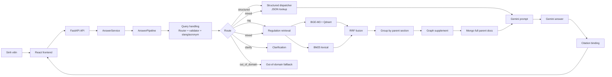
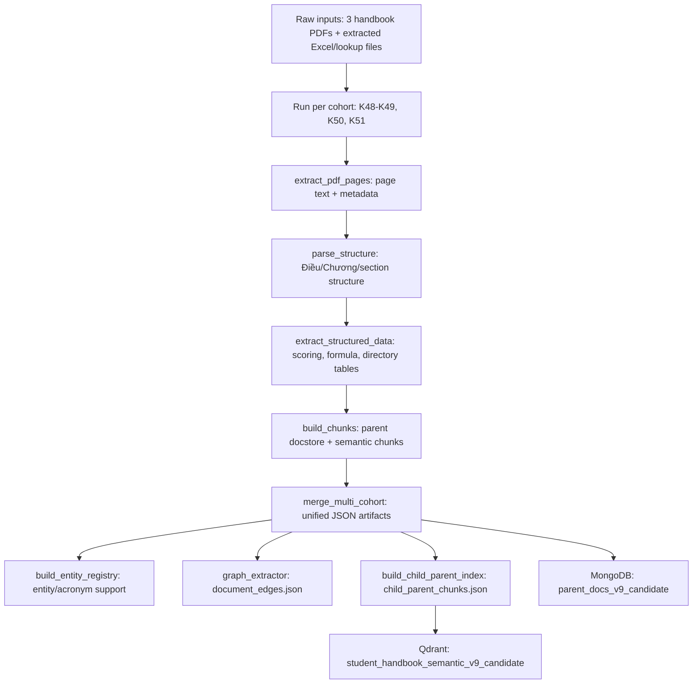
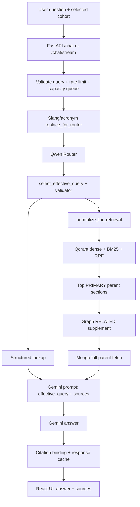
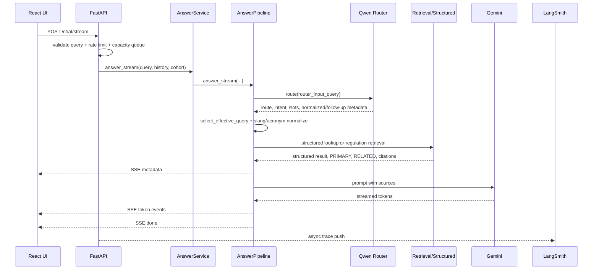

# HCMUE AI Project Deep Dive

Tài liệu này mô tả dự án `student_handbook_rag` từ góc nhìn kỹ thuật: mục tiêu, kiến trúc, pipeline xử lý câu hỏi, dữ liệu, đánh giá, frontend, deployment và các module/hàm quan trọng. Mục tiêu là để một người chưa biết dự án vẫn có thể đọc từ đầu đến cuối và nắm được hệ thống hiện tại đang hoạt động như thế nào.

## 1. Tổng Quan

**HCMUE AI - Student Handbook RAG Assistant** là hệ thống trợ lý AI cho Sổ tay sinh viên Trường Đại học Sư phạm TP.HCM. Hệ thống hỗ trợ ba nhóm khóa:

- `K48-K49`
- `K50`
- `K51`

Hệ thống phục vụ hai nhóm nhu cầu chính:

1. **Tra cứu quy định trong Sổ tay sinh viên** bằng RAG có citation.
2. **Tính toán/tra cứu có cấu trúc** như GPA, học bổng, học phí, hạ bằng, bảng quy đổi điểm, danh mục khoa/ngành/phòng ban.

Dự án hiện tại là một release candidate đã được human-audit, không phải ứng dụng chính thức của HCMUE. Các quyết định học vụ/tài chính quan trọng vẫn cần kiểm tra lại với nguồn được trích dẫn hoặc đơn vị chính thức của trường.

## 2. Trạng Thái Hệ Thống Hiện Tại

Runtime hiện tại là **V26 acronym-aware runtime**, dùng:

- Router: `qwen/qwen3.6-27b` qua Groq.
- Answer generation: `gemini-3.1-flash-lite`.
- Judge offline/eval: `openai/gpt-oss-120b`.
- Embedding: `BAAI/bge-m3`.
- Vector DB: Qdrant Cloud collection `student_handbook_semantic_v9_candidate`.
- Parent store: MongoDB collection `parent_docs_v9_candidate`.
- Cache: Redis + local exact response cache.
- Observability: LangSmith.
- Frontend: React + Vite + TypeScript.
- Backend: FastAPI + Uvicorn.

Backend hiện tại **không còn route runtime riêng cho biểu mẫu/procedure**. Phần biểu mẫu nếu xuất hiện trong frontend là UI tiện ích độc lập, không phải structured lookup/RAG path của backend.

## 3. Kiến Trúc Tổng Thể



Thiết kế quan trọng nhất là chia runtime thành các lớp rõ ràng:

- **Router** chỉ phân luồng, chuẩn hóa nhẹ, nối follow-up nếu đủ căn cứ.
- **Structured lookup** trả dữ liệu deterministic khi có bảng/danh mục phù hợp.
- **Regulation RAG** xử lý các câu hỏi cần đọc Điều/Khoản trong Sổ tay.
- **Graph supplement** chỉ bổ sung nguồn liên quan sau khi đã chọn nguồn chính.
- **Gemini** chỉ trả lời dựa trên `STRUCTURED_RESULT` và `CONTEXT`.

### 3.1 Thuật Ngữ Nhanh

| Thuật ngữ | Nghĩa trong dự án |
|---|---|
| Cohort | Khóa sinh viên: `K48-K49`, `K50`, `K51`. Nhiều quy định khác nhau theo cohort nên đây là metadata bắt buộc. |
| Parent section | Một Điều/mục đầy đủ trong sổ tay, lưu ở MongoDB và dùng làm đơn vị citation chính. |
| Child chunk | Đoạn nhỏ cắt ra từ parent section để embedding/BM25 tìm kiếm tốt hơn. |
| PRIMARY source | Nguồn chính được vector/BM25/RRF chọn để trả lời câu hỏi. Gemini phải lấy đây làm căn cứ chính. |
| RELATED source | Nguồn bổ sung do graph kéo từ các điều được PRIMARY nhắc tới. RELATED giúp giải thích thêm, nhưng không được thay thế PRIMARY. |
| Structured result | Kết quả deterministic từ bảng/directory/formula, ví dụ quy đổi điểm, khoa/ngành, công thức học bổng. |
| RAG | Retrieval-Augmented Generation: lấy nguồn liên quan trước, sau đó Gemini trả lời dựa trên nguồn đó. |
| BM25 | Lexical search dựa trên từ khóa. Hữu ích khi câu hỏi có tên Điều, tên khoa/ngành, từ viết tắt hoặc cụm rất cụ thể. |
| RRF | Reciprocal Rank Fusion, cách gộp thứ hạng dense vector và BM25 thành một ranking ổn định hơn. |
| Hit@k | Tỷ lệ câu hỏi mà nguồn đúng xuất hiện trong top k kết quả retrieval. |
| MRR | Mean Reciprocal Rank, đo nguồn đúng đứng cao đến đâu trong ranking. |
| nDCG@5 | Metric ranking tính cả vị trí và độ hữu ích của top 5 nguồn. |
| Cohort leak | Lỗi lấy/trích nguồn sai khóa sinh viên. Release candidate yêu cầu rate này bằng 0. |
| TTFT | Time To First Token, thời gian từ lúc gửi câu hỏi đến token streaming đầu tiên. |
| p95 | Percentile 95, nghĩa là 95% request nhanh hơn hoặc bằng giá trị này. |

### 3.2 Lưu Ý Khi Đọc Báo Cáo Và Metric

Một số tên trong report dễ gây hiểu nhầm nếu đọc nhanh:

| Điểm dễ nhầm | Cách hiểu đúng |
|---|---|
| `effective_query` và `retrieval_query` không phải một thứ | `effective_query` là câu hỏi chính thức sau Router + validator và là câu đưa cho Gemini. `retrieval_query` là phiên bản đã normalize/expand từ `effective_query` để BM25/vector search dễ tìm nguồn hơn. Không dùng retrieval-expanded query làm câu hỏi hiển thị cho Gemini. |
| `retrieval` metric không đo chất lượng câu trả lời cuối | Retrieval chỉ đo hệ thống có lấy đúng nguồn không. Answer vẫn có thể sai nếu Gemini diễn giải sai, hoặc vẫn đúng dù Judge chấm gắt. |
| Graph eval đạt 100% không có nghĩa toàn bộ RAG đạt 100% | Graph suite chỉ kiểm tra graph edges đã extract: nếu PRIMARY có cạnh thì hệ thống có kéo đúng RELATED trong limit không. Nó không đo semantic search từ câu hỏi tự nhiên. |
| Human audit có 25 case nhưng headline dùng 15 case | 25 case gồm 15 stratified-random để ước lượng headline và 10 low-Judge-score để tìm lỗi. Vì 10 case risk được cố tình chọn từ nhóm xấu nhất, không trộn trung bình chung 25 case làm accuracy đại diện. |
| Judge score không phải ground truth cuối cùng | Judge dùng GPT-OSS-120B để phát hiện rủi ro nhanh, nhưng có false positives. Human audit mới là calibration đáng tin hơn cho faithfulness/correctness. |
| `router_validation_failure_rate=2.5%` không đồng nghĩa 2.5% câu trả lời sai | Đây là tỷ lệ Router output bị validator chặn. Với các case này runtime fallback an toàn, nên metric này phản ánh cơ chế bảo vệ đang hoạt động. |
| `cohort_match=100%` khác với answer correctness | Cohort match chỉ nói nguồn lấy đúng khóa, không đảm bảo answer đã bao phủ đủ mọi required fact. |
| Production eval local khác production HF thật | Production suite gọi API local để đo transport/payload/streaming/burst ổn định. HF deployment còn phụ thuộc Space build state, quota, proxy headers và secrets. |
| Exact cache không phải semantic cache | Cache chỉ hit khi effective query, cohort, citations, retrieval fingerprint, context allocation và pipeline version đủ giống. Câu hỏi gần nghĩa chưa chắc hit cache. |

## 4. Dữ Liệu Và Artifact Đang Dùng

Release candidate storage được rebuild từ ba Sổ tay sinh viên.

| Artifact | Giá trị hiện tại |
|---|---:|
| MongoDB parent sections | 478 |
| Qdrant regulation chunks | 3,300 |
| Child chunks | 2,822 |
| Section-heading chunks | 478 |
| Active graph nodes | 130 |
| Directed graph edges | 103 |
| Qdrant content type | `regulation_text` only |
| Qdrant collection | `student_handbook_semantic_v9_candidate` |
| MongoDB collection | `parent_docs_v9_candidate` |

Parent section phân bổ theo cohort:

| Cohort | Parent sections |
|---|---:|
| K48-K49 | 131 |
| K50 | 166 |
| K51 | 181 |

Các artifact quan trọng:

- `data/processed/chunks/all_docstore_items.json`: parent docstore snapshot.
- `data/processed/chunks/child_parent_chunks.json`: chunk con dùng cho Qdrant/BM25.
- `data/processed/graphs/document_edges.json`: graph cạnh Điều/Khoản được nguồn chính dẫn chiếu.
- `data/processed/tables/*.json`: bảng scoring, formula, ngoại ngữ, registry structured.
- `data/processed/directories/*.json`: directory phòng ban, khoa, ngành, dịch vụ sinh viên.
- `configs/*.yaml`: cấu hình router, retrieval, generation, slang/acronym.

### 4.1 Pipeline Xử Lý Ba Sổ Tay Sinh Viên

Đây là pipeline **offline ingestion**, không chạy mỗi khi người dùng hỏi. Mục tiêu của pipeline này là biến ba bộ sổ tay `K48-K49`, `K50`, `K51` thành các artifact sạch để runtime dùng nhanh.



Các bước chính:

| Bước | Script/module | Input | Output chính | Ghi chú |
|---|---|---|---|---|
| Orchestrate multi-cohort | `scripts/build_multi_cohort.py` | PDF/raw extracted files của 3 cohort | Artifact hợp nhất trong `data/processed` | Script chính để rebuild dữ liệu. |
| Extract pages | `scripts/extract_pdf_pages.py` | PDF từng cohort | Page text/metadata tạm trong `data/processed/metadata` | Dùng để parse cấu trúc và audit nguồn. |
| Parse structure | `scripts/parse_structure.py` | Page text + lookup/extracted data | Điều/Chương/section records | Tạo cấu trúc parent section. |
| Extract structured data | `scripts/extract_structured_data.py` | Section records | `scoring_tables`, `formula_rules`, `office/faculty/program/reference_directory` | Dùng cho deterministic lookup. |
| Build chunks/docstore | `scripts/build_chunks.py` | Structured sections | Parent docstore và chunk trung gian | Parent section là đơn vị citation chính. |
| Merge cohort artifacts | `scripts/build_multi_cohort.py` | Output từng cohort | `all_docstore_items.json`, merged tables/directories | Tất cả record phải có cohort tag đúng. |
| Build entity registry | `src.retrieval.core.build_entity_registry` | Directories/tables | `data/processed/entities/entity_registry.json` | Hỗ trợ nhận diện entity/acronym. |
| Extract graph edges | `src/ingestion/graph_extractor.py` | `all_docstore_items.json` | `document_edges.json` | Trích các quan hệ Điều/Khoản được dẫn chiếu. |
| Build child-parent chunks | `scripts/build_child_parent_index.py` | `all_docstore_items.json` | `child_parent_chunks.json` | Tạo child chunks + section-heading chunks cho Qdrant/BM25. |
| Push Mongo | `scripts/push_to_mongo.py` | `all_docstore_items.json` | `parent_docs_v9_candidate` | Mongo giữ full parent text. |
| Push Qdrant | `scripts/push_to_qdrant.py` | `child_parent_chunks.json` | `student_handbook_semantic_v9_candidate` | Qdrant chỉ chứa `regulation_text`. |

Điểm cần nhớ:

- `scripts/build_multi_cohort.py` **không tự push remote** nếu không bật `PUSH_REMOTE=1`.
- Mongo và Qdrant được tách vai trò: Mongo giữ full parent, Qdrant giữ child chunks để tìm kiếm.
- Graph nodes không lưu thành file nodes riêng; node set được suy ra từ `source` và `target` trong `document_edges.json`.
- UI biểu mẫu nếu còn xuất hiện là tiện ích frontend; backend runtime hiện không có route RAG/structured riêng cho form/procedure.
- Các file trung gian cũ như `semantic_chunks.json`, `regulation_chunks.json`, `structured_lookup_chunks.json` có thể được sinh trong quá trình build nhưng không phải artifact chính của runtime release candidate.

### 4.2 Pipeline Runtime Khi Người Dùng Hỏi

Đây là pipeline **online serving**, chạy khi người dùng gửi câu hỏi ở frontend.



Luồng query cụ thể:

| Stage | Câu nào được dùng | Mục đích |
|---|---|---|
| Raw query | Câu người dùng gõ. | Lưu lại để debug/fallback và giữ ý định gốc. |
| Router input query | Raw query sau `replace_for_router`. | Giúp Qwen hiểu viết tắt/typo an toàn trước khi route. |
| Effective query | Câu được `select_effective_query(...)` chọn sau Router + validator. | Dùng cho structured lookup, làm câu hỏi chính trong prompt Gemini và làm thành phần cache key. |
| Retrieval query | Effective query sau `normalize_for_retrieval`. | Chỉ dùng cho BM25/vector search để tăng recall, không dùng làm câu hỏi hiển thị cho Gemini. |

Runtime có năm nhánh chính:

| Nhánh | Khi nào xảy ra | Output |
|---|---|---|
| `structured` | Câu hỏi có thể trả bằng bảng/directory/formula. | Kết quả deterministic có source binding. |
| `rag` | Câu hỏi cần đọc quy định trong sổ tay. | PRIMARY/RELATED context + Gemini answer. |
| `mixed` | Cần cả structured result và quy định bổ sung. | Structured result + RAG context + Gemini answer. |
| `clarify` | Thiếu cohort/slot/ngữ cảnh hoặc câu hỏi mơ hồ. | Câu hỏi lại người dùng, không gọi Gemini answer. |
| `out_of_domain` | Ngoài phạm vi sổ tay sinh viên. | Fallback an toàn, không truy vấn RAG lan man. |

## 5. Backend API

Backend entrypoint là `src/api/main.py`.

### 5.1 FastAPI app

`src/api/main.py` làm các việc chính:

- Load `.env` qua `load_project_env()`.
- Tạo `FastAPI(title="Student Handbook RAG API")`.
- Cấu hình CORS từ `STUDENT_RAG_CORS_ORIGINS`.
- Include router:
  - `health.router`
  - `metrics.router`
  - `chat.router`
  - `chat_stream.router`
- Preload singleton nặng trong lifespan:
  - `get_answer_service()`
  - `get_bm25_retriever()`

Preload giúp giảm cold start của request đầu tiên, nhất là khi chạy trên Hugging Face Space.

### 5.2 Health endpoints

File: `src/api/routes/health.py`

Endpoints:

- `GET/HEAD /health`: trả status cơ bản `{status, service, version}`.
- `GET /health/readiness`: public readiness cho frontend status badge.
- `GET /health/artifacts`: kiểm tra artifact/env, yêu cầu admin API key.

`/health/readiness` kiểm tra:

- Config bắt buộc.
- Structured JSON bắt buộc.
- `all_docstore_items.json`, `child_parent_chunks.json`.
- Graph edges.
- Qdrant env nếu `VECTORDB_PROVIDER` là `qdrant` hoặc `qdrant_cloud`.
- Mongo, Groq, Gemini env.

Frontend dùng readiness để phân biệt:

- `Hệ thống sẵn sàng`
- `Đang cập nhật`
- `Tạm thời gián đoạn`

### 5.3 Chat endpoint

File: `src/api/routes/chat.py`

`POST /chat` là non-streaming endpoint. Flow:

1. Tạo `request_id`.
2. Validate query bằng `validate_chat_query`.
3. Rate limit bằng `enforce_chat_rate_limit`.
4. Lấy capacity slot bằng `chat_capacity_slot`.
5. Gọi `answer_service.answer(...)`.
6. Push trace LangSmith trong thread nền.
7. Convert kết quả nội bộ sang `ChatResponse`.

Debug payload chỉ trả khi:

- Request có `include_debug=true`.
- Env `STUDENT_RAG_SHOW_DEBUG` bật.

### 5.4 Streaming endpoint

File: `src/api/routes/chat_stream.py`

`POST /chat/stream` dùng Server-Sent Events. Event chính:

| Event | Nghĩa | Frontend dùng để làm gì |
|---|---|---|
| `metadata` | Gửi trước nội dung answer, gồm trạng thái xử lý, intent/strategy, cohort, citations và debug nhẹ nếu được bật. | Khởi tạo bong bóng trả lời, chuẩn bị citation/source panel và hiển thị trạng thái. |
| `queued` | Request chưa được xử lý ngay vì capacity limiter đang đầy. Payload có thể có vị trí hàng đợi. | Báo người dùng đang chờ, không gửi lại request trùng. |
| `progress` | Các mốc xử lý như routing, retrieval, generating. | Hiển thị trạng thái "đang tìm nguồn", "đang trả lời". |
| `token` | Một phần text được Gemini stream về. | Append dần vào answer để giảm cảm giác chờ. |
| `done` | Stream hoàn tất, kèm metadata cuối nếu có. | Đóng trạng thái loading, lưu message cuối. |
| `error` | Lỗi runtime hoặc lỗi upstream không recover được. | Hiển thị lỗi thân thiện và cho phép thử lại. |

Streaming path dùng cùng `AnswerService.answer_stream(...)`, cùng rate limit và cùng capacity limiter với non-streaming.

### 5.5 Rate limit và capacity

File: `src/api/chat_controls.py`

Các biến quan trọng:

| Biến | Nghĩa | Ghi chú production |
|---|---|---|
| `STUDENT_RAG_MAX_QUERY_CHARS` | Độ dài tối đa của câu hỏi người dùng. | Chặn prompt quá dài, spam hoặc paste tài liệu lớn. |
| `STUDENT_RAG_RATE_LIMIT_PER_MINUTE` | Giới hạn theo anonymous browser client id. | Công bằng theo từng trình duyệt/thiết bị, phù hợp sinh viên dùng chung Wi-Fi. |
| `STUDENT_RAG_IP_RATE_LIMIT_PER_MINUTE` | Giới hạn rộng theo public IP. | Abuse guard cấp mạng, không nên đặt quá thấp vì nhiều sinh viên có thể cùng IP trường. |
| `STUDENT_RAG_TRUST_PROXY_HEADERS` | Cho phép đọc IP thật từ proxy headers. | Cần bật khi deploy sau proxy tin cậy như Hugging Face/Cloudflare; không nên bật bừa trên môi trường không kiểm soát. |
| `STUDENT_RAG_MAX_CONCURRENT_CHAT` | Số request chat được xử lý đồng thời. | Bảo vệ Gemini/Groq quota và RAM. |
| `STUDENT_RAG_MAX_QUEUE_SIZE` | Số request tối đa được xếp hàng. | Nếu vượt quá thì trả lỗi quá tải thay vì treo. |
| `STUDENT_RAG_QUEUE_TIMEOUT_SECONDS` | Thời gian một request được chờ trong hàng đợi. | Tránh user chờ vô hạn khi upstream chậm. |

Thiết kế hiện tại tách **client limit** và **IP abuse guard** để phù hợp môi trường trường học: nhiều sinh viên có thể chung Wi-Fi/public IP, nên không nên khóa quá chặt theo IP duy nhất.

## 6. Service Layer

File: `src/services/answer_service.py`

`AnswerService` là wrapper mỏng quanh singleton `AnswerPipeline`.

Vai trò:

- Giữ API layer không phụ thuộc trực tiếp vào pipeline implementation.
- Lazy-load pipeline khi request đầu tiên hoặc startup preload.
- Cung cấp hai method:
  - `answer(...)`
  - `answer_stream(...)`

Nói ngắn gọn: API gọi `AnswerService`, còn toàn bộ logic AI/RAG nằm trong `AnswerPipeline`.

## 7. AnswerPipeline

File chính: `src/generation/answer_pipeline.py`

Đây là lõi runtime của hệ thống.

### 7.1 Non-streaming flow

Method: `AnswerPipeline.answer(...)`

Các bước chính:

1. Khởi tạo telemetry nếu đang chạy eval.
2. Resolve cohort từ query và cohort người dùng chọn.
3. Gọi `_run_retrieval(...)`.
4. Build context allocation.
5. Nếu cần clarification thì trả câu hỏi lại, không gọi Gemini.
6. Nếu out-of-domain thì trả fallback, không gọi Gemini.
7. Nếu context quá yếu hoặc không đủ nguồn thì trả fallback.
8. Chọn citation phù hợp.
9. Kiểm tra exact response cache.
10. Build Gemini prompt bằng `build_answer_prompt(...)`.
11. Gọi Gemini.
12. Format final response + citation.
13. Ghi cache và trả kết quả.

### 7.2 Streaming flow

Method: `AnswerPipeline.answer_stream(...)`

Streaming dùng cùng retrieval/router/context với non-streaming, nhưng:

- Gửi `metadata` trước.
- Stream token Gemini dần về frontend.
- Gửi `done` cuối cùng.
- Nếu cache hit có thể phát lại answer từ cache.

### 7.3 Vì sao pipeline không dùng QueryRewriter cũ

Thiết kế hiện tại không còn một model riêng viết lại toàn bộ query để tối ưu search. Lý do:

- Query rewriting semantic dễ làm trôi chủ đề.
- Một lỗi thật từng gặp là câu hỏi về "hình thức đào tạo" bị kéo sang "Phòng Đào tạo".
- Runtime mới chỉ cho Router làm normalization/follow-up có kiểm soát, còn retrieval query được tạo bằng code từ effective query + slang/acronym normalization.

## 8. Query Handling

Các file chính:

- `src/retrieval/core/ai_router.py`
- `src/retrieval/core/query_context.py`
- `src/retrieval/core/slang_normalizer.py`
- `src/retrieval/core/acronym_registry.py`

### 8.1 Router

`AIRouter.route(...)` gọi Qwen qua Groq.

Router trả về một quyết định có cấu trúc. Các field quan trọng:

| Field | Nghĩa | Giá trị / ví dụ thường gặp | Dùng ở đâu |
|---|---|---|---|
| `route` | Nhánh xử lý cấp cao của câu hỏi. Đây là quyết định quan trọng nhất của Router. | `structured`: tra bảng/directory/công thức; `rag`: truy vấn quy định; `clarify`: hỏi lại; `out_of_domain`: ngoài phạm vi sổ tay. | `AnswerPipeline` quyết định gọi structured resolver, retriever, Gemini hay guardrail. |
| `execution_mode` | Cách thực thi cụ thể tương ứng với `route`. Field này giúp evaluator và pipeline biết request có cần LLM answer hay chỉ cần lookup/clarify. | `structured`: chạy lookup trực tiếp; `regulation`: chạy RAG; `mixed`: dùng cả structured và RAG. | Routing telemetry, deterministic eval và runtime branching. |
| `intent` | Ý định nghiệp vụ hẹp hơn `route`. | Ví dụ: hỏi quy định học vụ, tra khoa/ngành/phòng ban, tính điểm, hỏi học bổng, hỏi hạ bằng, hỏi ngoài phạm vi. | Báo cáo eval, observability và chọn structured catalog. |
| `lookup_type` | Nhóm structured data cần tra nếu route là `structured` hoặc `mixed`. | Ví dụ: `scoring`, `foreign_language`, `study_duration`, `scholarship_classification`, `office`, `faculty`, `program`, `formula`. Với pure RAG thường để trống. | Structured dispatcher chọn đúng resolver/catalog. |
| `cohort` | Khóa sinh viên được Router nhận ra từ câu hỏi. | `K48-K49`, `K50`, `K51`; nếu người dùng không ghi thì thường dùng cohort đang chọn ở UI. | Cohort filter cho structured lookup, retrieval, citation binding và guardrail chống leak. |
| `slots` | Các tham số đã trích xuất để tra cứu. | Ví dụ: `score=7.9`, `certificate=IELTS`, `faculty_name=Công nghệ thông tin`, `requested_field=office_location`. | Structured resolver dùng để tính/lookup chính xác. |
| `normalized_query` | Câu hỏi đã sửa nhẹ nhưng không đổi nghĩa. | Sửa thiếu dấu, typo, viết tắt đơn giản; không được tự thêm chủ đề mới. | Chỉ được dùng làm effective query khi validator chấp nhận. |
| `context_mode` | Router đánh giá câu hỏi có tự đủ nghĩa không. | `standalone`: câu mới tự đủ nghĩa; `follow_up`: phụ thuộc lịch sử chat; `ambiguous`: thiếu thông tin để hiểu chắc. | `select_effective_query(...)` quyết định dùng câu nào hoặc hỏi lại. |
| `standalone_query` | Câu follow-up được nối lại thành câu đầy đủ. | Ví dụ sau câu trước hỏi K50, người dùng hỏi "còn K51 thì sao?" thì field này thành câu hỏi đầy đủ về K51. | Chỉ dùng khi `context_mode=follow_up`, có `context_confidence` đủ cao và `referenced_turns` hợp lệ. |
| `referenced_turns` | Những lượt chat trước mà Router nói rằng nó đã dùng để hiểu follow-up. | Ví dụ: `[3]` hoặc id của lượt ngay trước. | Validator kiểm tra follow-up không tự lấy thông tin ngoài lịch sử được tham chiếu. |
| `normalization_confidence` | Mức tin cậy của việc sửa câu hỏi. | `high`, `medium`, `low`; chỉ mức đủ tin cậy và qua validator mới được thay raw query. | Query validator và telemetry. |
| `context_confidence` | Mức tin cậy khi biến follow-up thành câu độc lập. | `high`, `medium`, `low`; thấp thì hỏi lại hoặc fallback. | Follow-up handling. |
| `clarification_question` | Câu hỏi lại người dùng khi thiếu dữ kiện. | Ví dụ: "Bạn đang hỏi khóa K50 hay K51?" | API trả về response dạng clarify thay vì tự suy đoán. |

Router không còn được dùng để tự sáng tác một retrieval query semantic quá xa câu gốc.

### 8.2 Effective query

`select_effective_query(...)` trong `query_context.py` quyết định câu nào được dùng làm query chính cho structured lookup, retrieval và prompt.

Các tên dễ nhầm:

| Tên | Nghĩa | Ví dụ |
|---|---|---|
| Raw query | Câu người dùng gõ ban đầu, chưa sửa gì. | `ngành cntt ở khoa nào` |
| Router input query | Raw query sau bước thay thế an toàn trước Router. | `ngành Công nghệ thông tin ở khoa nào` |
| Effective query | Câu hỏi chính thức được runtime tin dùng sau Router + validator. | `ngành Công nghệ thông tin ở khoa nào` |
| Retrieval query | Effective query sau bước normalize/expand cho BM25 + vector search. | Có thể giữ acronym và thêm tên đầy đủ để tăng recall. |

Ba mode xử lý:

| Mode | Ý nghĩa | Trạng thái hiện tại |
|---|---|---|
| `raw` | Luôn dùng câu gốc của người dùng, bỏ qua normalization/follow-up. | Chỉ hữu ích để debug/ablation. |
| `router_generated` | Legacy mode từng dùng `retrieval_query` do Router viết lại. | Không dùng trong production vì có nguy cơ drift chủ đề. |
| `context_only` | Production mode hiện tại: Router chỉ sửa nhẹ hoặc nối follow-up, code validator quyết định có được dùng không. | Đang dùng. |

Trong `context_only`:

| Tình huống | Hành động |
|---|---|
| Câu hỏi mơ hồ hoặc thiếu slot quan trọng | Trả `clarify`, hỏi lại người dùng. |
| Follow-up có grounding rõ trong lịch sử | Dùng `standalone_query`. |
| Follow-up không chắc đang tham chiếu điều gì | Hỏi lại hoặc fallback an toàn. |
| Standalone có `normalized_query` an toàn | Dùng `normalized_query`. |
| Standalone nhưng normalization có rủi ro đổi nghĩa | Dùng raw query. |

Validator kiểm tra:

| Rule | Vì sao cần | Nếu vi phạm |
|---|---|---|
| Không đổi cohort | Tránh câu K50 bị chuyển sang K51 hoặc ngược lại. | Reject normalized/follow-up query. |
| Không đổi số, phần trăm, điểm | Các câu điểm 7.9, 65%, 130 tín chỉ rất nhạy với sai số. | Reject. |
| Correction phải liên hệ với text gốc | Chỉ cho phép sửa typo/thiếu dấu/viết tắt, không tự thêm chủ đề mới. | Fallback raw query. |
| Follow-up chỉ dùng lượt chat được tham chiếu | Tránh tự kéo ngữ cảnh không có thật. | Clarify hoặc fallback. |
| Không chắc thì clarify | Tốt hơn là hỏi lại thay vì trả sai nguồn. | Trả `clarification_question`. |

### 8.3 Slang và acronym

`SlangNormalizer` có hai entrypoint:

| Hàm | Khi nào chạy | Làm gì |
|---|---|---|
| `replace_for_router(query)` | Trước khi gọi Qwen Router. | Thay thế các viết tắt/chính tả đã xác nhận là không đổi nghĩa, giúp Router hiểu câu hỏi hơn. |
| `normalize_for_retrieval(query)` | Sau khi đã có effective query. | Expand + replace để BM25/vector search có thêm token đầy đủ, tăng khả năng tìm đúng nguồn. |

Nguồn mapping:

| Nguồn | Vai trò |
|---|---|
| `configs/hcmue_slang_dictionary.yaml` | Mapping explicit do mình khai báo, ví dụ viết tắt phổ biến như `CNTT`, `KTX`, `GPA`. Mapping này ưu tiên cao nhất. |
| `data/processed/directories/program_directory.json` | Sinh acronym từ danh mục ngành/khoa hiện hành để nhận ra các tên rút gọn không khai báo tay. |

`AcronymRegistry`:

| Bước | Ý nghĩa |
|---|---|
| Đọc explicit replacements từ YAML | Những mapping đã xác nhận được dùng trước và không phân biệt hoa/thường. |
| Sinh acronym từ tên ngành/khoa | Ví dụ lấy chữ cái đầu của các âm tiết trong tên ngành/khoa để tạo alias tìm kiếm. |
| Kiểm tra độ dài từ 3 ký tự trở lên | Tránh tự hiểu nhầm các từ rất ngắn trong tiếng Việt. |
| Kiểm tra mapping không mơ hồ | Nếu một acronym có thể trỏ tới nhiều ngành/khoa thì không tự thay thế. |
| Tôn trọng explicit override | Nếu YAML đã định nghĩa acronym đó, dùng YAML thay vì mapping tự sinh. |

Ví dụ logic:

| Input | Cách xử lý |
|---|---|
| `CNTT`, `cntt` | Nếu có explicit mapping thì đều thay được thành `Công nghệ thông tin`. |
| Acronym ngành/khoa tự sinh duy nhất | Có thể thay/expand thành tên đầy đủ để retrieval dễ match hơn. |
| Acronym 2 ký tự hoặc acronym mơ hồ | Không tự thay thế, vì rủi ro hiểu sai cao hơn lợi ích recall. |

### 8.4 BM25 acronym handling

`BM25Retriever` dùng cùng `AcronymRegistry`.

Tokenizer:

| Bước tokenizer | Nghĩa |
|---|---|
| Giữ token acronym | Nếu người dùng gõ `cntt`, BM25 vẫn có token `cntt` để match literal. |
| Thêm token tên đầy đủ | Nếu `cntt` map an toàn, BM25 cũng nhận token từ `Công nghệ thông tin`. |
| Dùng `underthesea.word_tokenize` | Tách từ tiếng Việt tốt hơn khi thư viện sẵn có. |
| Bigram syllable fallback | Sinh thêm cặp âm tiết liên tiếp để tăng match trong trường hợp tách từ không hoàn hảo. |

Mục tiêu là giúp truy vấn như `cntt`, `KTX`, `GPA` không mất tín hiệu lexical, đồng thời vẫn match được tên đầy đủ trong tài liệu.

## 9. Structured Lookup

File điều phối: `src/retrieval/core/structured_dispatcher.py`

`resolve_structured_decision(...)` nhận decision từ Router và dispatch theo `lookup_type`.

Lookup đang hỗ trợ:

| `lookup_type` | Dùng để trả lời |
|---|---|
| `foreign_language` | Chuẩn ngoại ngữ, chứng chỉ, mức quy đổi/điều kiện nếu có trong structured JSON. |
| `study_duration` | Thời gian đào tạo, thời gian tối đa/tối thiểu theo chương trình/quy định. |
| `scholarship_classification` | Xếp loại hoặc điều kiện liên quan học bổng khuyến khích học tập. |
| `scoring` | Quy đổi điểm số sang điểm chữ/hệ 4/trạng thái đạt. |
| `student_service` | Một số dịch vụ/thông tin sinh viên đã được trích structured. |
| `office` | Phòng ban, địa chỉ, email, số điện thoại nếu có trong directory. |
| `faculty` | Khoa, thông tin khoa và quan hệ với ngành. |
| `program` | Ngành/chương trình đào tạo và khoa phụ trách. |
| `formula` | Công thức tính GPA, học bổng, học phí hoặc các phép tính deterministic khác. |

Các function lookup chuyên biệt:

| Function | Vai trò |
|---|---|
| `foreign_language_lookup(...)` | Tra nhóm chuẩn/chứng chỉ ngoại ngữ. |
| `study_duration_lookup(...)` | Tra thời lượng học tập/đào tạo. |
| `scholarship_classification_lookup(...)` | Tra bảng/nhóm điều kiện học bổng. |
| `structured_lookup_from_slots(...)` | Resolver chung cho các slots đơn giản. |
| `office_lookup(...)` | Tra phòng ban/liên hệ. |
| `program_lookup(...)` | Tra ngành, khoa phụ trách và thông tin chương trình. |
| `formula_lookup(...)` | Trả công thức hoặc kết quả tính khi đủ input. |

Structured dispatcher có bước `_bind_regulation_source(...)` để gắn source parent id từ `structured_tables_registry`. Nhờ đó answer deterministic vẫn có citation/source binding về Điều/Bảng trong Sổ tay.

Ví dụ:

- Câu hỏi đổi điểm 7.9 sang điểm chữ có thể đi scoring lookup.
- Câu hỏi ngành thuộc khoa nào có thể đi program/faculty lookup.
- Câu hỏi email/số điện thoại phòng ban đi office lookup.

Nếu lookup mơ hồ, dispatcher trả `result_kind="clarification"` để hỏi lại thay vì đoán.

## 10. Regulation Retrieval

File chính: `src/retrieval/core/hybrid_pipeline.py`

Class: `ChildParentHybridRetriever`

Pipeline production:

```text
effective_query
-> slang/acronym normalize_for_retrieval
-> BGE-M3 dense search in Qdrant
-> BM25 search
-> Reciprocal Rank Fusion
-> group child chunks by parent section
-> top 5 PRIMARY parent sections
-> graph outbound expansion depth=2
-> up to 5 RELATED parent sections
-> MongoDB full parent text
-> Gemini prompt
```

### 10.1 Dense retrieval

Dense retrieval dùng:

- Embedding model: `BAAI/bge-m3`.
- Qdrant collection: `student_handbook_semantic_v9_candidate`.
- Filter:
  - `content_type = regulation_text`.
  - `cohort` nếu query/cohort người dùng xác định.

Qdrant lưu child chunks và section-heading chunks, không lưu full parent text.

### 10.2 BM25 retrieval

BM25 được build từ chunks trong Qdrant qua scroll API.

BM25 giúp các truy vấn có keyword, mã ngành, tên chứng chỉ, số quyết định, từ viết tắt có tín hiệu tốt hơn so với chỉ dense vector.

### 10.3 Reciprocal Rank Fusion

Dense và BM25 được hợp nhất bằng RRF:

```text
score = 1 / (dense_rank + 60) + 1 / (bm25_rank + 60)
```

Sau đó sort giảm dần theo RRF score. Tie-break dùng chunk id để deterministic.

### 10.4 Group parent

`_group_parent_results(...)` gom các child chunk theo `parent_section_id`.

Mỗi parent lấy score tốt nhất từ các child chunk match. Kết quả cuối là full parent section từ MongoDB, còn matched child chunks chỉ dùng làm metadata/debug.

Điểm quan trọng:

- Gemini nhận full parent content.
- Citation binding theo parent section.
- Child chunks chỉ giúp tìm đúng Điều/Khoản.

### 10.5 Graph supplement

Graph dùng `NetworkXGraphTraverser` trong `src/retrieval/core/graph_traverser.py`.

Graph là `nx.MultiDiGraph`, đọc từ `data/processed/graphs/document_edges.json`.

`expand_context(seed_ids, max_depth=2)`:

- BFS đa nguồn từ các PRIMARY parent ids.
- Chỉ đi outbound edges.
- Gắn `depth`, `seed_source`, `reason`.

`select_graph_related_parent_candidates(...)` chọn RELATED:

- Loại PRIMARY khỏi RELATED.
- Ưu tiên depth thấp.
- Ưu tiên related từ primary rank cao hơn.
- Giới hạn 5 parent.
- Không để RELATED thay thế PRIMARY.
- Không rerank graph neighbors.

Graph supplement dùng để giải thích các Điều được nguồn chính dẫn chiếu, ví dụ nguồn chính nói "theo Điều 3" thì hệ thống kéo Điều 3 để Gemini không chỉ nhắc tên mà còn giải thích nội dung.

### 10.6 PhoRanker

PhoRanker hiện **không nằm trên production request path**.

Trong code vẫn còn hỗ trợ eval/ablation mode:

- `full`
- `no_graph`

Production mặc định dùng dense + BM25 + RRF + parent grouping + graph supplement.

## 11. Prompt Và Answer Generation

File chính: `src/generation/prompt_builder.py`

`build_answer_prompt(...)` nhận:

| Tham số | Nghĩa |
|---|---|
| `query` | Effective query, tức câu hỏi cuối cùng sau query handling. Đây là câu Gemini được yêu cầu trả lời, không nhất thiết giống raw query nếu câu gốc là follow-up hoặc có viết tắt đã chuẩn hóa. |
| `retrieval_result` | Gói kết quả retrieval gồm structured result, danh sách PRIMARY/RELATED sources, route/intent/strategy, telemetry và metadata ràng buộc nguồn. |
| `selected_citations` | Danh sách citation đã được generation layer chọn để UI hiển thị. Answer phải nhất quán với danh sách này. |
| `max_context_chars` | Giới hạn ký tự tối đa cho context đưa vào prompt để tránh prompt quá dài. |
| `cohort` | Khóa áp dụng cuối cùng sau khi resolve từ query và lựa chọn UI. |
| `context_allocation` | Cấu hình chia ngân sách context: bao nhiêu PRIMARY, bao nhiêu RELATED, giới hạn ký tự mỗi nguồn và tổng context. |

Prompt có các phần:

| Phần prompt | Nội dung |
|---|---|
| Vai trò chatbot Sổ tay sinh viên | Nhắc model đây là trợ lý trả lời dựa trên sổ tay, không phải cố vấn chính thức. |
| Cohort instruction | Ràng buộc câu trả lời theo đúng khóa sinh viên đang áp dụng. |
| Source usage rules | Chỉ dùng structured result và context được cung cấp; không tự suy diễn từ kiến thức nền. |
| Answer scope rules | Trả lời đúng phạm vi câu hỏi, không kéo thêm quy định gần nghĩa nếu không cần. |
| Nhiệm vụ trả lời | Yêu cầu trả lời trực tiếp, giữ điều kiện/số liệu/ngoại lệ quan trọng, nói chưa xác định khi thiếu nguồn. |
| Câu hỏi sinh viên | Effective query được đưa vào prompt. |
| `STRUCTURED_RESULT` | Kết quả từ bảng/directory/formula nếu có, ví dụ bảng điểm, khoa/ngành, công thức học bổng. |
| `APPLICABLE AMENDMENTS` | Văn bản/chú thích sửa đổi có hiệu lực cao hơn trong đúng phạm vi. |
| `CONTEXT` | PRIMARY và RELATED sources từ retrieval/graph. |
| `RETRIEVAL_METADATA` | Metadata giúp model hiểu nguồn nào là chính, nguồn nào chỉ bổ sung. |

Quy tắc quan trọng:

- Chỉ dùng structured result và context.
- PRIMARY là căn cứ chính.
- RELATED chỉ bổ sung khi trực tiếp liên quan hoặc được PRIMARY dẫn chiếu.
- Nếu nguồn không đủ thì nói chưa tìm thấy/chưa xác định.
- Không tự suy diễn quyền lợi, ngoại lệ, cấm đoán từ thông tin chỉ nói về lịch/quy trình.
- Không thêm citation marker `[1]`, `[2]` trong câu trả lời vì UI hiển thị nguồn riêng.
- Nếu có amendment áp dụng, amendment có thứ tự hiệu lực cao hơn trong đúng phạm vi.

## 12. Citation Binding

Citation được chọn và format ở generation layer.

Mục tiêu:

- Citation phải trỏ đúng parent section hoặc structured source id.
- Không leak cohort.
- Structured lookup cũng phải có source binding, không chỉ trả số/bảng trần.
- UI hiển thị citation/source bên dưới câu trả lời.

Các trường hay gặp trong citation:

| Field | Nghĩa | Ví dụ / ghi chú |
|---|---|---|
| `chunk_id` | Id của chunk/source được UI dùng làm citation item. | Với RAG parent-bound, field này thường trỏ về parent section id để citation ổn định. |
| `parent_section_id` | Id của Điều/mục cha trong Mongo parent docs. | Dùng để lấy full parent text và kiểm tra parent-section match. |
| `source_record_id` | Id của bản ghi structured catalog. | Quan trọng với kết quả từ bảng/directory, nơi không nhất thiết có chunk Qdrant. |
| `title` | Tiêu đề hiển thị cho nguồn. | Ví dụ: `Điều 5. Hình thức đào tạo`. |
| `source_pages` | Trang trong sổ tay/PDF nguồn. | Giúp người dùng kiểm chứng thủ công. |
| `cohort` | Khóa của nguồn. | `K48-K49`, `K50`, `K51`; dùng để phát hiện cohort leak. |
| `content_type` | Loại nội dung của nguồn. | Production Qdrant hiện là `regulation_text`; structured result có loại riêng theo catalog. |
| `metadata` | Payload thô bổ sung. | Dùng cho debug, eval và source binding; UI không cần hiển thị toàn bộ. |

## 13. Cache Và Key Rotation

### 13.1 Response cache

AnswerPipeline dùng **exact response cache**. Nghĩa là hệ thống chỉ dùng lại câu trả lời cũ khi các thành phần quan trọng của request giống nhau đủ chặt, thay vì chỉ thấy hai câu "có vẻ gần nghĩa".

Cache key là một định danh được tạo từ nhiều phần:

| Thành phần | Nghĩa là gì | Vì sao phải có trong key |
|---|---|---|
| `effective_query` | Câu hỏi cuối cùng mà backend quyết định dùng sau bước query handling. Nó có thể là câu gốc, câu đã sửa typo/thiếu dấu an toàn, hoặc câu follow-up đã được nối với lịch sử chat. | Hai câu người dùng nhập khác nhau có thể dẫn tới hai `effective_query` khác nhau. Nếu cache chỉ dùng raw query hoặc chỉ dùng text gần nghĩa, hệ thống có thể trả nhầm câu trả lời. |
| `retrieval_result_fingerprint` | Dấu vân tay/hash rút gọn của kết quả retrieval: danh sách nguồn được lấy về, thứ tự nguồn, metadata quan trọng và structured result nếu có. | Cùng một câu hỏi nhưng nếu retrieval lấy nguồn khác sau khi rebuild Qdrant/Mongo hoặc đổi config, answer cũ không còn đáng tin. |
| `citations` | Danh sách citation/source được chọn để hiển thị và ràng buộc câu trả lời. | Câu trả lời phải khớp với nguồn hiển thị cho sinh viên. Nếu citation thay đổi thì không nên dùng lại answer cũ. |
| `cohort` | Khóa áp dụng, ví dụ `K48-K49`, `K50`, `K51`. | Cùng câu hỏi nhưng khác khóa có thể áp dụng quy định khác nhau. Đây là hàng rào chống cohort leak. |
| `context_allocation_fingerprint` | Dấu vân tay của cách đóng gói context vào prompt: số PRIMARY/RELATED, giới hạn ký tự, thứ tự và cấu hình allocation. | Nếu cách đưa nguồn vào prompt thay đổi, Gemini có thể cần trả lời khác. Cache phải bị vô hiệu để tránh dùng câu cũ theo context cũ. |
| `pipeline_version` | Version nội bộ của AnswerPipeline/prompt/runtime. | Khi sửa prompt, citation binding, query handling hoặc logic trả lời, tăng version giúp cache cũ không làm nhiễu hành vi mới. |

Ví dụ dễ hiểu:

- Người dùng hỏi `K50 xét học bổng KKHT cần điều kiện gì?`.
- Router/query handling giữ hoặc chuẩn hóa thành `effective_query`.
- Retrieval lấy đúng Điều/Bảng học bổng K50.
- Pipeline tạo fingerprint từ nguồn và cấu hình context.
- Nếu lần sau cùng câu hỏi, cùng cohort, cùng nguồn, cùng version pipeline thì cache có thể trả nhanh.
- Nếu đổi sang `K51`, hoặc Qdrant rebuild làm nguồn khác đi, hoặc prompt version mới, cache sẽ miss và Gemini được gọi lại.

Đây không phải semantic cache. Câu gần nghĩa sẽ không nhất thiết hit cache, trừ khi sau query handling và retrieval fingerprint giống nhau.

### 13.2 Redis và local cache

Runtime có two-tier caching:

- Redis nếu có `REDIS_URL`.
- Local JSON cache trong `data/cache`.

### 13.3 Gemini key rotation

Gemini dùng key pool:

- Nhiều API key trong `GEMINI_API_KEYS`.
- Theo dõi RPM/RPD/cooldown.
- Request-local client để tránh race condition khi nhiều request đồng thời.
- Lỗi disconnect/rate limit có thể retry và chuyển key.

### 13.4 Groq/Qwen key rotation

Router dùng `GROQ_API_KEYS`.

Các config quan trọng:

| Config | Nghĩa |
|---|---|
| `STUDENT_RAG_ROUTER_MODEL=qwen/qwen3.6-27b` | Model dùng cho Router. Runtime release candidate chốt Qwen compact vì pass deterministic tốt hơn GPT-OSS-20B trong ablation. |
| `STUDENT_RAG_ROUTER_REASONING_EFFORT=none` | Không yêu cầu reasoning dài cho Router; mục tiêu là JSON routing ngắn, ổn định. |
| `STUDENT_RAG_ROUTER_MAX_OUTPUT_TOKENS=384` | Giới hạn số token cho JSON Router, không giới hạn answer Gemini. |
| `STUDENT_RAG_ROUTER_RESPONSE_FORMAT=auto` | Cho phép client dùng response format phù hợp với model/provider. |
| `STUDENT_RAG_ROUTER_WAIT_WHEN_LIMITED=false` | Khi key bị limit, không chờ quá lâu; key rotation/fallback xử lý phần còn lại. |

`max_output_tokens=384` chỉ giới hạn JSON Router, không giới hạn câu trả lời Gemini.

## 14. Observability

LangSmith được dùng để push realtime trace sau request.

Trace gồm:

| Field | Nghĩa |
|---|---|
| request id | Id duy nhất của request để nối log API, LangSmith và eval row. |
| cohort | Khóa áp dụng cuối cùng của request. |
| query | Effective query hoặc query đã xử lý, tùy trace stage. |
| answer | Câu trả lời cuối cùng hoặc preview, dùng để debug chất lượng. |
| status | `answered`, `clarify`, `out_of_domain`, `fallback`, `error`... |
| intent | Ý định nghiệp vụ Router nhận dạng. |
| strategy | Chiến lược thực thi/eval tương ứng với route. |
| model | Model được gọi ở stage đó, ví dụ Qwen Router hoặc Gemini answer generation. |
| latency | Thời gian xử lý request/stage. |
| tracker steps | Các bước telemetry nội bộ như routing, retrieval, prompt, generation, cache hit/miss. |

LangSmith lỗi hoặc thiếu credential không làm chat fail; nó chỉ ảnh hưởng observability.

## 15. Frontend Architecture

Frontend nằm trong `frontend/`.

Stack:

- React.
- Vite.
- TypeScript.
- CSS custom properties.
- `lucide-react` icons.

### 15.1 App shell

File: `frontend/src/App.tsx`

State chính:

| State | Nghĩa |
|---|---|
| `theme` | Theme hiện tại: `light` hoặc `dark`, lưu trong `localStorage`. |
| `storedCohort` | Khóa sinh viên người dùng chọn toàn cục, lưu trong `localStorage`. |
| `activeTab` | Page/chức năng đang mở, ví dụ `home`, `chat`, `gpa`, `forms`. |
| `isMobileMenuOpen` | Sidebar mobile đang mở hay đóng. |
| `sidebarCollapsed` | Sidebar desktop đang thu gọn hay mở rộng. |
| `isBugModalOpen` | Modal báo lỗi/góp ý đang mở hay không. |
| `isCohortModalDismissed` | Người dùng đã đóng modal chọn khóa ban đầu hay chưa. |

`COHORT_SELECTOR_TABS` quy định page nào cần cohort selector:

- Home.
- Chat.
- GPA.
- Mục tiêu GPA.
- Mục tiêu môn học.
- Học bổng.
- Học phí.
- Hạ bằng.

### 15.2 Sidebar

File: `frontend/src/components/Sidebar.tsx`

Nhóm navigation:

- Hỏi đáp:
  - Trang chủ
  - Chat
- Công cụ:
  - Tính GPA
  - Mục tiêu GPA
  - Mục tiêu môn học
  - Tính điểm học bổng
  - Ước tính học phí
  - Kiểm tra hạ bằng
- Tài nguyên:
  - Phương pháp học tập
  - Biểu mẫu
  - Hướng dẫn

Sidebar có:

- Logo HCMUE.
- Badge beta.
- Collapse button desktop.
- Mobile backdrop.
- Feedback button.
- Version footer.

### 15.3 Header/status

File: `frontend/src/components/SystemStatusBadge.tsx`

Status badge:

1. Kiểm tra Hugging Face runtime stage qua `https://huggingface.co/api/spaces/{space}/runtime`.
2. Nếu HF đang building/app starting/sleeping thì hiển thị degraded.
3. Nếu HF running hoặc không xác định, gọi `/health/readiness`.
4. Fallback gọi `/health`.

Điều này tránh hiển thị "hệ thống hoạt động" khi Space đang build hoặc chưa ready.

### 15.4 Chat UI

Files:

- `frontend/src/components/ChatArea.tsx`
- `frontend/src/components/ChatInput.tsx`
- `frontend/src/components/ChatMessage.tsx`
- `frontend/src/hooks/useChat.ts`

`useChat`:

| Trách nhiệm | Chi tiết |
|---|---|
| Gọi backend | Dùng `/chat/stream` để nhận SSE thay vì chờ toàn bộ answer. |
| Client id | Gửi `X-Client-ID` qua `getApiClientHeaders()` để rate limit theo browser client. |
| Session state | Lưu messages trong `sessionStorage`, nên refresh tab vẫn giữ cuộc trò chuyện hiện tại. |
| SSE parsing | Xử lý các event `metadata`, `queued`, `progress`, `token`, `done`, `error` như mô tả ở phần Backend API. |
| Message metadata | Gắn citation, response time, TTFT, cache flag và trạng thái lỗi/loading vào message. |

`ChatArea`:

- Empty state với action cards.
- Modal tips lần đầu vào chat.
- Quick access cards có local hardcoded suggestions, không gọi backend.
- Nút quay lại topics khi đang trong cuộc trò chuyện.
- Nút scroll xuống cuối khi người dùng cuộn lên.

### 15.5 Công cụ sinh viên

File: `frontend/src/components/pages/ToolsPage.tsx`

Trang này gom các công cụ thành:

- `Tính toán`
- `Tài nguyên`

Mỗi card điều hướng đến page tương ứng. Đây là hub để Home không phải liệt kê quá nhiều card công cụ riêng lẻ.

### 15.6 Context badges

File: `frontend/src/components/PageContextBadges.tsx`

Dùng để hiển thị phạm vi dữ liệu:

- GPA/mục tiêu môn học: cohort đang chọn.
- Học phí/học bổng: năm học nếu người dùng đã chọn, nguồn bảng/công thức, nhãn tham khảo.
- Hạ bằng: công cụ tham khảo/nguồn quy định.

Nguyên tắc: không gắn cohort cho dữ liệu không thực sự phân biệt theo cohort.

### 15.7 Mobile UX

Frontend có:

- `MobileHeader`.
- `BottomTabBar`.
- `MobileScrollAffordance`.
- Sidebar mobile dạng drawer với backdrop.

`MobileScrollAffordance` giúp người dùng biết bên dưới còn nội dung, tránh cảm giác page đã hết khi card đầu tiên lấp viewport.

## 16. Evaluation System

Entry script: `scripts/evaluate_system.py`

Dataset mặc định hiện tại:

- `data/eval/final_holdout`

Release report hiện tại:

- `data/eval/reports/final_v26_acronym`

Các suite:

| Suite | Đo cái gì | Vì sao tách riêng |
|---|---|---|
| `validate` | Readiness của dataset/artifact trước khi chạy metric. | Tránh so sánh trên dữ liệu lệch hash hoặc annotation lỗi. |
| `deterministic` | Router, structured lookup, guardrail, clarify/out-of-domain. | Những path này phải ổn định và không phụ thuộc Gemini answer quality. |
| `retrieval` | End-to-end Router + query handling + retriever. | Đo khả năng lấy đúng nguồn trước khi sinh câu trả lời. |
| `graph` | Khả năng mở rộng PRIMARY sang RELATED theo graph edges. | Graph có mục tiêu riêng, không nên gộp với true RAG semantic benchmark. |
| `generate` | Tạo câu trả lời Gemini cho answer holdout. | Tạo artifact đầu vào cho Judge và Human Audit. |
| `judge` | Automated answer evaluation bằng GPT-OSS-120B judge. | Nhanh để phát hiện rủi ro, nhưng cần human audit hiệu chỉnh. |
| `production` | Gọi API thật: cold/warm/streaming/burst. | Đo transport, payload, queue, latency và cache ở runtime giống deploy. |
| `faults` | Fault injection và degraded behavior. | Kiểm tra lỗi upstream/cache/retrieval không làm hệ thống crash xấu. |

### 16.1 Validate

Validate kiểm tra:

- Dataset có đủ manifest.
- Số case đúng.
- Hash dataset/docstore/config.
- Không lỗi annotation nghiêm trọng.
- Docstore parent count đúng.

Mục tiêu: đảm bảo không chạy metric trên dataset hoặc artifact lệch.

### 16.2 Deterministic

Mục tiêu: đo các path không cần Gemini hoặc chỉ cần structured/mixed routing.

Coverage:

- 120 cases.
- Positive.
- Hard negative.
- Ambiguous.
- Out of domain.

Metric final:

| Metric | Result |
|---|---:|
| Passed | 117/120 |
| Exactness | 97.50% |
| Precision | 100.00% |
| Recall | 95.00% |
| F1 | 97.44% |
| Intent accuracy | 97.22% |
| Strategy accuracy | 97.22% |
| Structured value exactness | 100.00% |
| Cross-cohort leak | 0 |
| Router validation failure rate | 2.50% |

Ba validation failures là trường hợp Router bị validator chặn và fallback an toàn, không phải trả sai production.

### 16.3 End-to-end retrieval

Mục tiêu: đo Router + query handling + retrieval cùng nhau.

Không dùng pure retrieval làm headline vì production request luôn đi qua Router/query handling.

Final metric:

| Metric | Result |
|---|---:|
| n | 180 |
| Hit@1 | 67.78% |
| Hit@3 | 87.22% |
| Hit@5 | 92.22% |
| MRR | 77.86% |
| nDCG@5 | 80.22% |
| Parent section match | 92.22% |
| Citation binding | 92.22% |
| Cohort match | 100.00% |
| Content-type match | 97.78% |
| Cohort leak rate | 0.00% |
| Empty retrieval rate | 2.22% |
| Retrieval p95 | 2.19s |

### 16.4 Graph supplement eval

Graph có suite riêng vì metric graph trong true RAG không phản ánh đúng mục tiêu graph. Graph chỉ cần chứng minh: khi một PRIMARY parent có edge, hệ thống có thể expand và chọn đúng RELATED parent trong limit.

Final metric:

| Metric | Result |
|---|---:|
| n | 103 graph edges |
| Graph nodes | 130 |
| Source coverage | 100.00% |
| Target coverage | 100.00% |
| Direct expansion recall | 100.00% |
| Related selection recall@5 | 100.00% |
| Related cohort leak rate | 0.00% |
| Selected related parents mean | 1.71 |
| Latency p95 | 0.06ms |

Kết quả tuyệt đối ở suite này là hợp lý vì đây là unit/integration test trên graph edges đã biết, không phải retrieval semantic benchmark.

### 16.5 Generate

Mục tiêu: tạo câu trả lời Gemini cho 100 answer holdout cases.

Đo:

- Success rate.
- Latency mean/p50/p90/p95/max.
- Tạo artifact cho Judge và Human Audit.

### 16.6 Judge

Judge dùng `openai/gpt-oss-120b` để đánh giá tự động.

Final metric:

| Metric | Result |
|---|---:|
| Faithfulness | 74.97% |
| Answer relevancy | 86.89% |
| Answer correctness | 79.55% |
| Context precision | 69.24% |
| Context recall | 79.99% |
| Citation correctness | 78.95% |
| Required fact hit | 62.00% |
| Numeric accuracy | 95.00% |
| Abstention correct | 86.00% |
| Critical false passes | 0 |

Judge có xu hướng gắt và có false positives, vì vậy không dùng Judge score đơn lẻ làm headline chất lượng cuối.

### 16.7 Human audit

Human audit gồm 25 case:

- 15 stratified-random cases: headline calibration sample.
- 10 low-Judge-score cases: targeted risk audit, không trộn vào headline vì cố tình chọn case khó.

Headline sample 15 case:

| Metric | Result |
|---|---:|
| Human score | 93.33% |
| Correctness | 96.67% |
| Faithfulness | 96.67% |
| Citation correctness | 93.33% |
| Actual unsupported claims | 1/15 |
| Critical false passes | 0/15 |

Risk subset 10 case:

- Dùng để tìm lỗi generation/retrieval/annotation còn lại.
- Không dùng để ước lượng production accuracy.

### 16.8 Production

Production eval gọi API thật ở local.

Coverage:

- Cold RAG.
- Deterministic.
- Warm cache.
- Streaming.
- Burst.

Final metric:

| Metric | Result |
|---|---:|
| Total requests | 60 |
| Transport/payload success | 100.00% |
| Expected response status | 100.00% |
| 429 rate | 0.00% |
| Timeout rate | 0.00% |
| Overall p95 | 6.75s |
| Cold RAG p95 | 12.96s |
| Deterministic p95 | 2.43s |
| Structured p95 | 4.55s |
| Streaming TTFT p95 | 2.38s |
| Burst success | 10/10 |
| Warm-cache hit | 90.00% |

### 16.9 Fault injection

Fault suite kiểm tra các tình huống lỗi và degrade an toàn.

Final:

- 13/13 passed.

## 17. Lệnh Đánh Giá Chính

Chạy từ root repo:

```powershell
$env:QDRANT_COLLECTION_NAME="student_handbook_semantic_v9_candidate"
$env:MONGODB_PARENT_COLLECTION="parent_docs_v9_candidate"
$env:STUDENT_RAG_ROUTER_MODEL="qwen/qwen3.6-27b"
$env:STUDENT_RAG_ROUTER_REASONING_EFFORT="none"
$env:STUDENT_RAG_ROUTER_MAX_OUTPUT_TOKENS="384"

$dataset="data\eval\final_holdout"
$output="data\eval\reports\final_v26_acronym"
```

Validate:

```powershell
.\.venv\Scripts\python.exe scripts\evaluate_system.py `
  --suite validate `
  --profile full `
  --dataset $dataset `
  --output $output
```

Deterministic:

```powershell
.\.venv\Scripts\python.exe scripts\evaluate_system.py `
  --suite deterministic `
  --profile full `
  --dataset $dataset `
  --output $output
```

End-to-end retrieval:

```powershell
.\.venv\Scripts\python.exe scripts\evaluate_system.py `
  --suite retrieval `
  --profile full `
  --backend qdrant `
  --ablation vector_primary_graph_supplement `
  --retrieval-scope end_to_end `
  --dataset $dataset `
  --output $output
```

Graph supplement:

```powershell
.\.venv\Scripts\python.exe scripts\evaluate_system.py `
  --suite graph `
  --profile full `
  --dataset $dataset `
  --output $output
```

Generate:

```powershell
.\.venv\Scripts\python.exe scripts\evaluate_system.py `
  --suite generate `
  --profile full `
  --backend qdrant `
  --dataset $dataset `
  --output $output
```

Judge:

```powershell
.\.venv\Scripts\python.exe scripts\evaluate_system.py `
  --suite judge `
  --profile full `
  --backend qdrant `
  --dataset $dataset `
  --output $output
```

Production:

```powershell
.\.venv\Scripts\python.exe -m uvicorn src.api.main:app `
  --host 127.0.0.1 `
  --port 8000
```

```powershell
.\.venv\Scripts\python.exe scripts\evaluate_system.py `
  --suite production `
  --profile full `
  --base-url http://127.0.0.1:8000 `
  --dataset $dataset `
  --output $output
```

Faults:

```powershell
.\.venv\Scripts\python.exe scripts\evaluate_system.py `
  --suite faults `
  --profile full `
  --dataset $dataset `
  --output $output
```

## 18. Deployment

### 18.1 Frontend

Frontend deploy lên Vercel.

Public URL:

- `https://hcmuebot.id.vn`
- `https://www.hcmuebot.id.vn`

Frontend cần env:

| Env | Nghĩa |
|---|---|
| `VITE_API_BASE_URL` | Base URL của FastAPI backend, ví dụ Hugging Face Space URL. |
| `VITE_HF_SPACE_ID` | Id Space dùng để status badge kiểm tra runtime/build state của HF. |

### 18.2 Backend

Backend deploy lên Hugging Face Spaces.

Public variables thường cần:

| Variable | Nghĩa | Gợi ý release candidate |
|---|---|---|
| `STUDENT_RAG_CORS_ORIGINS` | Danh sách domain frontend được phép gọi API. | `https://hcmuebot.id.vn,https://www.hcmuebot.id.vn` |
| `STUDENT_RAG_MAX_QUERY_CHARS` | Giới hạn độ dài câu hỏi. | `500` |
| `STUDENT_RAG_RATE_LIMIT_PER_MINUTE` | Rate limit theo browser client id. | Khoảng `20` request/phút/client. |
| `STUDENT_RAG_IP_RATE_LIMIT_PER_MINUTE` | Abuse guard theo public IP thật. | Cao hơn client limit, ví dụ `120`, để không chặn nhầm nhiều sinh viên chung Wi-Fi. |
| `STUDENT_RAG_MAX_CONCURRENT_CHAT` | Số request chat chạy song song. | `3` hoặc theo quota Gemini/Groq thực tế. |
| `STUDENT_RAG_MAX_QUEUE_SIZE` | Số request được chờ trong queue. | `10`. |
| `STUDENT_RAG_QUEUE_TIMEOUT_SECONDS` | Thời gian chờ queue tối đa. | `15`. |
| `STUDENT_RAG_TRUST_PROXY_HEADERS` | Tin proxy headers để lấy IP thật. | Bật khi deploy sau proxy tin cậy. |
| `ANONYMIZED_TELEMETRY` | Bật/tắt telemetry ẩn danh của một số SDK. | `false` nếu muốn giảm log phụ. |
| `VECTORDB_PROVIDER` | Chọn backend vector store. | `qdrant`; code cũng hiểu `qdrant_cloud` ở readiness. |
| `QDRANT_COLLECTION_NAME` | Tên collection Qdrant đang phục vụ production. | `student_handbook_semantic_v9_candidate`. |
| `MONGODB_PARENT_COLLECTION` | Tên collection Mongo chứa parent docs. | `parent_docs_v9_candidate`. |
| `MONGODB_TIMEOUT_MS` | Timeout khi đọc Mongo parent docs. | `3000`. |
| `LANGCHAIN_TRACING_V2` | Bật LangSmith Tracing V2. | `true`. |
| `LANGCHAIN_PROJECT` | Tên project LangSmith. | `hcmue-student-handbook-rag`. |
| `STUDENT_RAG_ROUTER_MODEL` | Model Router cố định ở deploy. | `qwen/qwen3.6-27b`. |
| `STUDENT_RAG_ROUTER_REASONING_EFFORT` | Reasoning effort cho Router. | `none`. |
| `STUDENT_RAG_ROUTER_MAX_OUTPUT_TOKENS` | Output budget cho JSON Router. | `384`. |

Secrets:

| Secret | Nghĩa |
|---|---|
| `QDRANT_URL` | URL Qdrant Cloud. |
| `QDRANT_API_KEY` | API key Qdrant Cloud. |
| `MONGODB_URL` | MongoDB Atlas connection string. |
| `REDIS_URL` | Redis URL cho cache nếu có. |
| `GROQ_API_KEYS` | Danh sách key Groq dùng cho Qwen Router rotation. |
| `GEMINI_API_KEYS` | Danh sách key Gemini dùng cho answer generation rotation. |
| `LANGCHAIN_API_KEY` | API Key của LangSmith (Personal Access Token). |

## 19. Module Map

| File/module | Vai trò |
|---|---|
| `src/api/main.py` | FastAPI app, CORS, lifespan preload, router registration |
| `src/api/routes/health.py` | Basic health, readiness, artifact health |
| `src/api/routes/chat.py` | Non-streaming `/chat` endpoint |
| `src/api/routes/chat_stream.py` | SSE `/chat/stream` endpoint |
| `src/api/chat_controls.py` | Query validation, rate limit, queue/concurrency |
| `src/api/schemas.py` | Pydantic request/response schemas |
| `src/services/answer_service.py` | Thin service wrapper around AnswerPipeline |
| `src/generation/answer_pipeline.py` | Main runtime orchestration |
| `src/generation/prompt_builder.py` | Gemini prompt construction |
| `src/generation/context_allocation.py` | PRIMARY/RELATED context formatting and limits |
| `src/generation/gemini_client.py` | Gemini generate/stream and key rotation |
| `src/generation/citation_formatter.py` | Citation selection/formatting helpers |
| `src/generation/citation_builder.py` | Build citations from retrieved vector results |
| `src/retrieval/core/ai_router.py` | Qwen Router, validation, fallback decision |
| `src/retrieval/core/query_context.py` | Effective query selection and follow-up validation |
| `src/retrieval/core/slang_normalizer.py` | Slang/acronym replacement and expansion |
| `src/retrieval/core/acronym_registry.py` | Explicit and generated acronym registry |
| `src/retrieval/core/structured_dispatcher.py` | Structured lookup dispatcher |
| `src/retrieval/core/hybrid_pipeline.py` | Dense + BM25 + RRF + parent + graph retrieval |
| `src/retrieval/core/bm25_retriever.py` | BM25 index, tokenizer, acronym-aware lexical search |
| `src/retrieval/core/graph_traverser.py` | NetworkX graph expansion |
| `src/retrieval/vectorstore/mongo_store.py` | MongoDB parent document access |
| `src/evaluation/dataset.py` | Dataset loading and validation |
| `src/evaluation/suites.py` | Evaluation suite implementations |
| `src/evaluation/judge.py` | LLM judge client and judge packet compaction |
| `src/evaluation/human_audit.py` | Human audit summary |
| `src/evaluation/gates.py` | Acceptance gates |
| `scripts/evaluate_system.py` | CLI entrypoint for evaluation |
| `scripts/build_multi_cohort.py` | Rebuild processed multi-cohort data and push storage |
| `scripts/build_child_parent_index.py` | Build child-parent chunk index |
| `src/ingestion/graph_extractor.py` | Extract document graph edges |
| `frontend/src/App.tsx` | Frontend shell and global state |
| `frontend/src/hooks/useChat.ts` | Streaming chat client hook |
| `frontend/src/components/ChatArea.tsx` | Chat empty state, tips modal, conversation UI |
| `frontend/src/components/ChatMessage.tsx` | Message rendering and citations |
| `frontend/src/components/Sidebar.tsx` | Desktop/mobile navigation |
| `frontend/src/components/SystemStatusBadge.tsx` | HF/runtime/readiness status badge |
| `frontend/src/components/PageContextBadges.tsx` | Cohort/year/source context badges |
| `frontend/src/components/pages/HomePage.tsx` | Main student-facing landing/actions page |
| `frontend/src/components/pages/ToolsPage.tsx` | Tool directory |
| `frontend/src/components/pages/*Page.tsx` | GPA, tuition, scholarship, forms, guide, study methods |

## 20. Main Runtime Sequence



## 21. Design Trade-offs

Các lựa chọn quan trọng:

- **Không dùng semantic QueryRewriter riêng**: giảm khả năng query drift, đổi lại retrieval không được rewrite mạnh theo ý model.
- **Không dùng PhoRanker production mặc định**: latency thấp và pipeline dễ giải thích hơn, đổi lại không tận dụng cross-encoder ranking trong request thật.
- **Graph chỉ supplement**: bảo toàn thứ hạng PRIMARY từ retriever, đổi lại graph không cứu được nếu PRIMARY sai hoàn toàn.
- **Exact cache thay vì semantic cache**: tránh trả nhầm câu gần nghĩa, đổi lại cache hit thấp hơn.
- **Structured lookup tách khỏi RAG**: deterministic hơn với bảng/danh mục, đổi lại cần schema/registry được bảo trì.
- **Human audit tách random và risk subset**: headline trung thực hơn, đổi lại phải giải thích rõ vì tổng 25 case không được lấy trung bình chung.

## 22. Known Limitations

- Hệ thống chưa phải app chính thức của trường.
- Judge tự động có false positives, nhất là khi answer đúng nhưng context packet/rubric chưa đủ linh hoạt.
- Một số câu hỏi rất chung chung vẫn có thể cần clarify hoặc trả lời chưa xác định.
- Nếu người dùng hỏi thiếu dấu/viết tắt quá mơ hồ, acronym validator có thể không tự thay thế để tránh sai.
- Graph supplement chỉ hoạt động tốt cho các edge đã được extract vào `document_edges.json`.
- Production quota phụ thuộc Gemini/Groq keys và Hugging Face Space runtime.

## 23. Cách Đọc Code Nhanh

Nếu cần hiểu backend trước:

1. Đọc `src/api/main.py`.
2. Đọc `src/api/routes/chat_stream.py`.
3. Đọc `src/services/answer_service.py`.
4. Đọc `src/generation/answer_pipeline.py`.
5. Đọc `src/retrieval/core/query_context.py`.
6. Đọc `src/retrieval/core/hybrid_pipeline.py`.
7. Đọc `src/generation/prompt_builder.py`.

Nếu cần hiểu frontend trước:

1. Đọc `frontend/src/App.tsx`.
2. Đọc `frontend/src/components/Sidebar.tsx`.
3. Đọc `frontend/src/hooks/useChat.ts`.
4. Đọc `frontend/src/components/ChatArea.tsx`.
5. Đọc các page trong `frontend/src/components/pages`.

Nếu cần hiểu evaluation:

1. Đọc `scripts/evaluate_system.py`.
2. Đọc `src/evaluation/suites.py`.
3. Đọc `src/evaluation/dataset.py`.
4. Đọc report trong `data/eval/reports/final_v26_acronym`.

## 24. Checklist Khi Thay Đổi Hệ Thống

Khi sửa backend runtime:

- Chạy unit tests liên quan.
- Chạy deterministic smoke/full nếu đụng Router/structured.
- Chạy retrieval end-to-end nếu đụng query handling/retrieval.
- Chạy generate + judge nếu đụng prompt/generation/context.
- Human audit nếu thay đổi có thể ảnh hưởng answer faithfulness.

Khi sửa dữ liệu:

- Rebuild processed artifacts.
- Rebuild/push Qdrant và Mongo collection mới hoặc có version rõ.
- Rebuild graph nếu parent ids hoặc reference extraction thay đổi.
- Chạy validate trước khi chạy metric.

Khi sửa frontend:

- Chạy `npm.cmd run build` trong `frontend`.
- Kiểm tra desktop/tablet/mobile.
- Kiểm tra light/dark mode.
- Kiểm tra keyboard/focus/modal.
- Smoke `/health/readiness` và `/chat/stream`.

## 25. Kết Luận

Dự án hiện tại là một RAG assistant đã đi qua nhiều vòng đơn giản hóa, kiểm thử và human audit. Kiến trúc cuối ưu tiên:

- Rõ nguồn.
- Cohort-safe.
- Query handling ít drift.
- Retrieval dễ giải thích.
- Structured lookup deterministic.
- Frontend thân thiện với sinh viên.
- Evaluation tách rõ retrieval, graph, generation, human audit và production robustness.

Đây là một prototype mạnh để trình bày trong CV/portfolio với số liệu minh bạch, đồng thời đủ sạch để tiếp tục phát triển nếu cần đưa gần hơn tới production thật.
